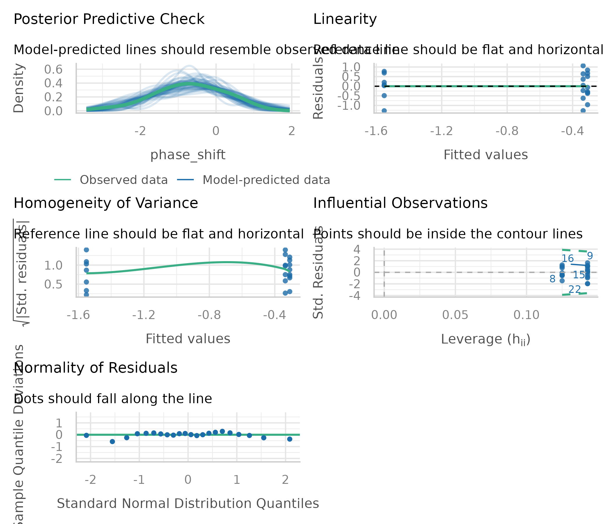

---
metadata-files:
  - ../../_templates/_lectures.yml
title: "Lecture: Analysis of Variance (ANOVA)"
subtitle: "Single-factor ANOVA"
description: "One-way ANOVA and its connection to regression: partitioning sums of squares, the F-ratio, assumptions and diagnostics, post-hoc testing, reporting, and non-parametric alternatives (Kruskal-Wallis, Dunn's test) — on a circadian-rhythm light-treatment dataset."
categories: [ANOVA]
order: 12
week: 8
author: "Bill Perry"

format:
  html:
    downloads: [docx, pptx]  # This creates download links for all three
  revealjs:
    output-ext: "slides.html"
  docx:
    reference-doc: ../../ms_templates/custom-reference-compact.docx
    fig-width: 3
    fig-height: 3
    fig-dpi: 300
    dpi: 300            # tell Pandoc the real render dpi so it sizes figures correctly
  pptx: default
execute:
  echo: true
---

```{r}
#| include: false
#| message: false
#| warning: false
library(performance)
library(FSA)
library(ggfortify)
library(car)         # functions for regression diagnostics, ANOVA, and VIF
library(emmeans)     # calculates and compares adjusted means from statistical models
library(patchwork)   # Combines multiple ggplot2 plots into a single composite figure
library(broom)       # Converts statistical model outputs into tidy data frames
library(tidyverse)   # includes ggplot2, dplyr, tidyr, etc.

# ============================================================================
# CORE DATA CREATION - Used throughout the lecture
# ============================================================================

# Create nitrate standard curve data for regression example
nitrate_data <- tibble(
  nitrate_n_mg_L = seq(0, 20, by = 2.5),
  absorbance = c(0.02, 0.15, 0.28, 0.41, 0.54, 0.67, 0.80, 0.93, 0.98)
)

# Create circadian rhythm ANOVA data - PRIMARY DATASET
circ_data <- tibble(
  treatment = rep(c("Control", "Knees", "Eyes"), times = c(8, 7, 7)),
  phase_shift = c(0.53, 0.36, 0.20, -0.37, -0.60, -0.64, -0.68, -1.27,  # Control
                 0.73, 0.31, 0.03, -0.29, -0.56, -0.96, -1.61,          # Knees
                 -0.78, -0.86, -1.35, -1.48, -1.52, -2.04, -2.83)       # Eyes
)
circ_data <- circ_data %>% mutate(treatment = as.factor(treatment))

# Create subset with only 2 groups for t-test vs F-test comparison
circ_data_two_groups <- circ_data %>%
  filter(treatment %in% c("Control", "Knees"))

# ============================================================================
# CORE MODELS - Fit once and reuse throughout
# ============================================================================

circ_model <- lm(phase_shift ~ treatment, data = circ_data)
anova_result <- anova(circ_model)

circ_model_two_groups <- lm(phase_shift ~ treatment, data = circ_data_two_groups)
anova_result_two_groups <- anova(circ_model_two_groups)

t_result_circ <- t.test(phase_shift ~ treatment, data = circ_data_two_groups, var.equal = TRUE)

nonparam_circ_df <- circ_data
```

## Where We Left Off

::::::: columns
:::: {.column width="60%"}
Covered last time — Multiple Regression:

- The MLR model, regression parameters
- Analysis of variance for regression
- Null hypotheses, explained variance
- Assumptions and diagnostics
- Collinearity, interactions, dummy variables
- Model selection, importance of predictors

::: callout-note
**✅ Key idea from last lecture**

You already built an ANOVA table for a regression — you just called it "analysis of variance for regression." Today we apply the exact same machinery to categorical predictors.
:::
::::

:::: {.column width="40%"}
{width="3.12in"}
::::
:::::::

## Part 1 · ANOVA Overview {.divider}

## Today's Objectives

::::::: columns
:::: {.column width="60%"}
**ANOVA:** analysis of variance, single-factor today, multi-factor to come.

- Predictor variables: fixed
- The ANOVA model
- Analysis and partitioning of variance
- Null hypothesis
- Assumptions and diagnostics
- Post-hoc tests — Tukey and others
- Reporting the results
- Mixed-model ANOVA — random effects

::: callout-note
**📖 Reference**

Gotelli & Ellison, *A Primer of Ecological Statistics*, Ch. 10 — The Analysis of Variance, is the core reference for this lecture.
:::
::::

:::: {.column width="40%"}
What if the response is continuous and the predictor(s) categorical?

|  | Continuous X | Categorical X |
|:---|:---|:---|
| **Continuous Y** | Regression | ANOVA |
| **Categorical Y** | Logistic regression |  |
::::
:::::::

## Part 2 · ANOVA and Regression Connection {.divider}

## ANOVA and Regression Connection

::::::: columns
:::: {.column width="60%"}
**Both regression and ANOVA:**

- Partition the total variation in Y
- Use F-tests for significance, where one MS is divided by another

**Regression:**

- Form: $Y = \beta_0 + \beta_1X + \varepsilon$ — Y is the response, β₀ the intercept, β₁ the slope, X the predictor, ε the error
- Test: $H_0: \beta_1 = 0$ — rejecting means X significantly predicts Y
::::

:::: {.column width="40%"}
**ANOVA:**

- Form: $Y_{ij} = \mu + A_i + \varepsilon_{ij}$ — $Y_{ij}$ is observation j in group i, μ the grand mean, $A_i$ the effect of group i, ε the error
- Test: $H_0: \mu_1 = \mu_2 = ... = \mu_k$ — rejecting means at least one group differs
::::
:::::::

## The Same Partitioning, Two Kinds of Predictor

::::::: columns
:::: {.column width="60%"}
General method for partitioning variation in a continuous dependent variable:

- One or more continuous (and categorical) predictors → **regression**
- One or more categorical predictors → **ANOVA**
- Categorical predictor variables represent groups or experimental treatments
::::

:::: {.column width="40%"}
```{r}
#| echo: false
#| message: false
#| warning: false
#| paged-print: false
#| fig-width: 3.6
#| fig-height: 3.4
#| fig-alt: "Two stacked plots: a scatterplot of absorbance versus nitrate concentration with a fitted regression line and equation, above a jittered scatterplot of phase shift by light treatment group with mean points and confidence-interval error bars, illustrating that regression and ANOVA both partition variation but with a continuous versus categorical predictor."
nitrate_regression_plot <- ggplot(nitrate_data, aes(x = nitrate_n_mg_L, y = absorbance)) +
  geom_point(size = 3, color = "#2E86AB") +
  geom_smooth(method = "lm", se = TRUE, color = "#A23B72", fill = "#A23B72", alpha = 0.2) +
  theme_minimal(base_size = 8) +
  labs(x = "Nitrate-N (mg/L)", y = "Absorbance")

lm_model <- lm(absorbance ~ nitrate_n_mg_L, data = nitrate_data)
r_squared <- summary(lm_model)$r.squared
equation <- paste0("y = ", round(coef(lm_model)[1], 3), " + ",
                   round(coef(lm_model)[2], 3), "x\n",
                   "R2 = ", round(r_squared, 3))

nitrate_regression_plot <- nitrate_regression_plot +
  annotate("text", x = 5, y = 0.85, label = equation, size = 2.6, hjust = 0)

circadian_anova_plot <- ggplot(circ_data, aes(x = treatment, y = phase_shift, color = treatment)) +
  geom_jitter(width = 0.2, alpha = 0.7, size = 2) +
  stat_summary(fun = mean, geom = "point", size = 5, shape = 18) +
  stat_summary(fun.data = "mean_cl_normal", geom = "errorbar", width = 0.2, linewidth = 1) +
  theme_minimal(base_size = 8) +
  labs(x = "Light Treatment", y = "Phase Shift (hours)") +
  theme(legend.position = "none")

nitrate_regression_plot / circadian_anova_plot
```
::::
:::::::

## ANOVA as Regression

::: callout-tip
**ANOVA as regression**

With one categorical variable, ANOVA is equivalent to regression with dummy variables. In fact, when we run ANOVAs we use the same code as for regression!

`regression: model <- lm(response ~ predictor, data = df)`
`anova: model <- lm(response ~ factor, data = df)`

```{r}
#| echo: false
#| fig-height: 3.4
#| fig-width: 3.4
#| fig-alt: "Jittered scatterplot of a simulated response variable by three nutrient treatment groups (No, Low, High), with diamond points marking each group's mean and confidence-interval error bars, illustrating a one-way ANOVA setup."
set.seed(123)
anova_data <- tibble(
  group = rep(c("No Nut.", "Low Nut.", "High Nut."), each = 10),
  value = c(rnorm(10, 10, 2), rnorm(10, 13, 2), rnorm(10, 16, 2))
) %>%
  mutate(group = factor(group, levels = c("No Nut.", "Low Nut.", "High Nut.")))

ggplot(anova_data, aes(x = group, y = value, color = group)) +
  geom_jitter(width = 0.2, alpha = 0.7) +
  stat_summary(fun = mean, geom = "point", size = 4, shape = 18) +
  stat_summary(fun.data = "mean_cl_normal", geom = "errorbar", width = 0.2) +
  theme_minimal(base_size = 8) +
  labs(x = "Treatment Group", y = "Response Variable") +
  theme(legend.position = "none")
```
:::

## Part 3 · ANOVA Goals and Logic {.divider}

## ANOVA Goals

::::::: columns
:::: {.column width="60%"}
ANOVA aims to compare means of groups:

- Attributes contribution of predictors + "error" to variability
- Tests H₀ that population (random effects) or group (fixed effects) means are equal
- Single factor (1-way) and multifactor (2-, 3-way designs)
  - Single factor: one factor with more than two levels
- Multifactor: two or three factors with two or more levels each — examines variation due to factors **AND** their interaction
::::

:::: {.column width="40%"}
```{r}
#| echo: false
#| fig-width: 3
#| fig-height: 2.6
#| fig-alt: "Jittered scatterplot of circadian phase shift by light treatment (Control, Knees, Eyes), with diamond points marking each group's mean and confidence-interval error bars."
circadian_anova_plot
```
::::
:::::::

## Analysis of Variance

::::::: columns
:::: {.column width="60%"}
*Analysis of variance* is the most powerful approach known for simultaneously testing if the means of k groups are equal — it works by assessing whether individuals chosen from different groups are, on average, more different than individuals chosen from the same group.

The null hypothesis of ANOVA is that the population means μᵢ are the same for all treatments.

- **H₀:** μ₁ = μ₂ = ... = μₖ
- **H₁:** at least one μᵢ is different from the others

Rejecting H₀ in ANOVA is evidence that the mean of at least one group is different from the others — it does **not** indicate *which* means differ.
::::

:::: {.column width="40%"}
```{r}
#| echo: false
#| fig-width: 3
#| fig-height: 2.6
#| fig-alt: "The circadian phase shift by light treatment plot repeated, shown alongside the ANOVA null and alternative hypothesis statements."
circadian_anova_plot
```
::::
:::::::

## ANOVA Logic

::::::: columns
:::: {.column width="60%"}
Even if all groups had the same true mean, the data would likely show different sample means for each group due to sampling error.

The key insight of ANOVA: we can estimate how much variation among group means ought to be present from sampling error alone if H₀ is true. ANOVA lets us determine whether there is more variance among the sample means than expected by chance alone. If so, we infer real differences among the population means.

Two key measures of variation are calculated and compared:

1. **Group mean square ($MS_{groups}$)** — variation among subjects from different groups
2. **Error mean square ($MS_{error}$)** — variation among subjects within the same group

$$F = \frac{MS_{groups}}{MS_{error}}$$
::::

:::: {.column width="40%"}
```{r}
#| echo: false
#| message: false
#| warning: false
#| paged-print: false
#| fig-width: 3.4
#| fig-height: 3.8
#| fig-alt: "Three stacked plots illustrating ANOVA's variance partitioning: total variation as each point's deviation from the grand mean, among-groups variation as each group mean's deviation from the grand mean, and within-groups variation as each point's deviation from its own group mean."
grand_mean <- mean(circ_data$phase_shift)

group_means_df <- circ_data %>%
  group_by(treatment) %>%
  summarize(mean = mean(phase_shift))

df_within <- circ_data %>%
  left_join(group_means_df, by = "treatment")

set.seed(123)
jitter_amount <- 0.15
df_within <- df_within %>%
  mutate(x_jitter = as.numeric(factor(treatment)) +
           runif(n(), -jitter_amount, jitter_amount))

p1_anova_plot <- ggplot(circ_data, aes(x = treatment, y = phase_shift, color = treatment)) +
  geom_errorbar(data = group_means_df,
                aes(x = treatment, y = mean, ymin = mean, ymax = mean),
                width = 0.8, linewidth = 1) +
  geom_point(aes(x = circ_data$treatment, y = circ_data$phase_shift, color = treatment),
             size = 2, position = position_jitter(width = 0.15, seed = 123)) +
  geom_hline(yintercept = grand_mean, linetype = "dashed", color = "black") +
  geom_segment(aes(x = treatment, xend = treatment, y = phase_shift, yend = grand_mean),
               linetype = "solid",
               position = position_jitter(width = 0.15, seed = 123)) +
  labs(title = "Total Variation - Deviation from grand mean", y = "", x = "Treatment") +
  theme_minimal(base_size = 7) +
  theme(legend.position = "none")

p2_anova_plot <- ggplot(df_within, aes(color = treatment)) +
  geom_point(aes(x = as.numeric(factor(circ_data$treatment)), y = circ_data$phase_shift, color = treatment), alpha = 0.3,
             size = 2, position = position_jitter(width = 0.15, seed = 123)) +
  geom_segment(data = group_means_df,
               aes(x = as.numeric(factor(treatment)) - 0.4,
                   xend = as.numeric(factor(treatment)) + 0.4,
                   y = mean, yend = mean, color = treatment),
               linewidth = 1) +
  geom_hline(yintercept = grand_mean, linetype = "dashed", color = "black") +
  geom_segment(aes(x = x_jitter, xend = x_jitter, y = mean, yend = grand_mean),
               linetype = "solid") +
  labs(title = "Among Groups - Group means vs. grand mean",
       y = "Phase Shift (hours)", x = "Treatment") +
  ylim(range(circ_data$phase_shift)) +
  scale_x_continuous(breaks = 1:3, labels = c("Control", "Knees", "Eyes")) +
  theme_minimal(base_size = 7) +
  theme(legend.position = "none")

p3_anova_plot <- ggplot(df_within, aes(color = treatment)) +
  geom_hline(yintercept = grand_mean, linetype = "dashed", color = "black") +
  geom_segment(data = group_means_df,
               aes(x = as.numeric(factor(treatment)) - 0.4,
                   xend = as.numeric(factor(treatment)) + 0.4,
                   y = mean, yend = mean, color = treatment),
               linewidth = 1) +
  geom_point(aes(x = x_jitter, y = phase_shift), size = 2) +
  geom_segment(aes(x = x_jitter, xend = x_jitter, y = phase_shift, yend = mean),
               linetype = "solid") +
  labs(title = "Within Groups - Points vs. group mean", y = "", x = "Treatment") +
  scale_x_continuous(breaks = 1:3, labels = c("Control", "Knees", "Eyes")) +
  theme_minimal(base_size = 7) +
  theme(legend.position = "none")

anova_visualization_plot <- p1_anova_plot +
  theme(axis.title.x = element_blank(), axis.text.x = element_blank()) +
  p2_anova_plot +
  theme(axis.title.x = element_blank(), axis.text.x = element_blank()) +
  p3_anova_plot +
  plot_layout(ncol = 1)

anova_visualization_plot
```
::::
:::::::

## Part 4 · Partitioning the Sum of Squares {.divider}

## Partitioning the Sum of Squares

::::::: columns
:::: {.column width="60%"}
The total variation in Y can be expressed as a sum of squares:

$$SS_{total} = \sum_{i=1}^{a}\sum_{j=1}^{n}(Y_{ij} - \bar{Y})^2$$

This can be partitioned into two components:

1. **Among Groups (Treatment):** $SS_{among} = n\sum_{i=1}^{a}(\bar{Y}_i - \bar{Y})^2$
2. **Within Groups (Error):** $SS_{within} = \sum_{i=1}^{a}\sum_{j=1}^{n}(Y_{ij} - \bar{Y}_i)^2$

These components are additive: $SS_{total} = SS_{among} + SS_{within}$
::::

:::: {.column width="40%"}
```{r}
#| echo: false
#| message: false
#| warning: false
#| paged-print: false
#| fig-width: 3.4
#| fig-height: 3.8
#| fig-alt: "The three-panel total/among/within variance partitioning figure repeated, shown alongside the sum-of-squares formulas it illustrates."
anova_visualization_plot
```
::::
:::::::

## A Worked Sum-of-Squares Example

::::::: columns
:::: {.column width="60%"}
```{r}
#| echo: false
#| paged-print: false
summary_lm_anova_model <- summary(circ_model)
summary_lm_anova_model
anova_result
```
::::

:::: {.column width="40%"}
::: callout-important
**Key connection to regression**

This is the same partitioning we saw in regression analysis:

$$SS_{total} = SS_{regression} + SS_{residual}$$

- $SS_{among}$ in ANOVA = $SS_{regression}$ in regression
- $SS_{within}$ in ANOVA = $SS_{residual}$ in regression

Both measure how much variation is explained by our model vs. unexplained (error).
:::
::::
:::::::

## The ANOVA Table

::::::: columns
:::: {.column width="60%"}
The ANOVA table organizes all computations leading to a test of the null hypothesis of no differences among population means.

- **Source of variation** — what is being tested
- **Sum of squares** — total variation for each source
- **df** — degrees of freedom for each source
- **Mean squares** — sum of squares divided by df
- **F-ratio** — ratio of mean squares, used to test significance
- **P-value** — probability of observing our results if H₀ is true

**Example:** for a one-way ANOVA with 3 groups and 4 replicates per group: df(treatments) = a − 1 = 2, df(error) = a(n − 1) = 3(4 − 1) = 9, df(total) = an − 1 = 11
::::

:::: {.column width="40%"}
```{r}
#| echo: false
#| message: false
#| warning: false
#| paged-print: false
summary_lm_anova_model
anova_result

group_means <- circ_data %>%
  group_by(treatment) %>%
  summarize(
    Mean = mean(phase_shift),
    SD = sd(phase_shift),
    N = n()
  )
group_means
```
::::
:::::::

## Comparing ANOVA and Regression Tables

::: callout-important
**ANOVA table:**

| Source | df | SS | MS | F | p |
|---|---|---|---|---|---|
| Treatment | a-1 | SS_treatment | MS_treatment | F | p |
| Error | a(n-1) | SS_error | MS_error |  |  |
| Total | a*n-1 | SS_total |  |  |  |

**Is equivalent to an ANOVA table from a regression model:**

| Source | df | SS | MS | F | p |
|---|---|---|---|---|---|
| Regression | k | SS_regression | MS_regression | F | p |
| Error | n-k-1 | SS_residual | MS_residual |  |  |
| Total | n-1 | SS_total |  |  |  |

Where k = number of predictor/dummy variables = a − 1, and a = treatment groups/levels of factors.
:::

## Part 5 · The F-Ratio {.divider}

## The F-Ratio

::::::: columns
:::: {.column width="60%"}
$$F = \frac{MS_{among}}{MS_{error}}$$

- Under H₀ (all means equal): the F-ratio should be approximately 1
- Larger F-ratios suggest among-group variance exceeds what's expected by chance
- With the circadian rhythm data: F = 7.29, p = 0.004 — we reject H₀
- The F-ratio follows an F-distribution with (a − 1) and a(n − 1) df

```{r}
#| echo: false
f_observed <- anova_result$`F value`[1]
f_critical <- qf(0.95, df1 = 2, df2 = 19)

results_df <- tibble(
  Metric = c("F-observed", "F-critical (alpha = 0.05)"),
  Value = c(f_observed, f_critical)
)
results_df
```
::::

:::: {.column width="40%"}
```{r}
#| echo: false
#| message: false
#| warning: false
#| paged-print: false
#| fig-width: 3.4
#| fig-height: 3
#| fig-alt: "F-distribution curve with 2 and 19 degrees of freedom, with the rejection region beyond the critical F-value shaded red and a dashed blue line marking the critical F-value."
x <- seq(0, 10, by = 0.1)
y <- df(x, df1 = 2, df2 = 19)
f_data <- tibble(x = x, y = y)
f_crit <- qf(0.95, df1 = 2, df2 = 19)

ggplot(f_data, aes(x = x, y = y)) +
  geom_line() +
  geom_area(data = subset(f_data, x >= f_crit), aes(x = x, y = y), fill = "red", alpha = 0.3) +
  geom_vline(xintercept = f_crit, linetype = "dashed", color = "blue") +
  geom_text(aes(x = f_crit + 0.7, y = 0.15, label = paste("F-crit =", round(f_crit, 2))), color = "blue", size = 3) +
  geom_text(aes(x = 7.5, y = 0.05, label = "alpha = 0.05"), color = "red", size = 3) +
  labs(title = "F-Distribution (2, 19 df)", x = "F Value", y = "Density") +
  theme_minimal(base_size = 8)
```
::::
:::::::

## Connection of an F-Test to a T-Test

::::::: columns
:::: {.column width="60%"}
An ANOVA with two groups (a = 2) is equivalent to a t-test — why F = t²? Both test the same hypothesis: are the means of two groups different?

- **The t-statistic:** $t = \frac{\bar{X}_1 - \bar{X}_2}{SE_{difference}}$ — measures how many standard errors apart the two means are, and can be + or −
- **The F-statistic:** $F = \frac{MS_B}{MS_W}$ — the ratio of variance *between* groups to variance *within* groups
- Unlike t, F is always non-negative (it's a ratio of squared quantities)
::::

:::: {.column width="40%"}
**The mathematical connection:**

- Both measure the same signal-to-noise ratio — numerators capture the difference between groups (signal), denominators capture variability within groups (noise)
- With two groups: $MS_B$ relates directly to $(\bar{X}_1 - \bar{X}_2)^2$, and $MS_W$ relates to the pooled variance
- **Degrees of freedom match up too:** t-test df = n₁ + n₂ − 2; F-test df₁ = 1 (numerator), df₂ = n₁ + n₂ − 2 (denominator)
- An F-distribution with df₁ = 1 is the square of a t-distribution with df₂
::::
:::::::

## Why This Matters — ANOVA Generalizes the T-Test

::::::: columns
:::: {.column width="60%"}
- Shows ANOVA is actually a *generalization* of the t-test
- When a = 2, you get the same result either way
- But ANOVA extends naturally to comparing three or more groups — you can't do that directly with a t-test without running into multiple-comparison problems
::::

:::: {.column width="40%"}
```{r}
#| echo: false
#| message: false
#| warning: false
#| paged-print: false
t_statistic <- t_result_circ$statistic
f_statistic <- anova_result_two_groups$`F value`[1]

cat("Using circ_data (Control vs Knees groups):\n",
    "t-statistic:", round(t_statistic, 4), "\n",
    "t^2:", round(t_statistic^2, 4), "\n",
    "F-statistic:", round(f_statistic, 4), "\n",
    "Difference (should be ~0):", round(abs(t_statistic^2 - f_statistic), 6), "\n")
```
::::
:::::::

## F-Ratio, Confirmed on the Full Model

::::::: columns
:::: {.column width="60%"}
$$F = \frac{MS_{among}}{MS_{error}}$$

- Under H₀ (all means equal), the F-ratio should be ≈ 1
- Larger F-ratios suggest among-group variance exceeds chance
- With the circadian rhythm data: F₂,₁₉ = 7.29, p = 0.004 — we reject H₀
- The F-ratio follows an F-distribution with (a − 1) and a(n − 1) df

```{r}
#| echo: false
#| message: false
#| warning: false
#| paged-print: false
summary(circ_model)
Anova(circ_model)
```
::::

:::: {.column width="40%"}
```{r}
#| echo: false
#| message: false
#| warning: false
#| paged-print: false
#| fig-width: 3
#| fig-height: 2.6
#| fig-alt: "The circadian phase shift by light treatment plot repeated once more, shown alongside the F-ratio result confirmed on the full three-group model."
circadian_anova_plot
```
::::
:::::::

## Part 6 · Variance Explained — R² {.divider}

## Variance Explained: R²

::::::: columns
:::: {.column width="60%"}
R² summarizes the contribution of group differences to total variation:

$$R^2 = \frac{SS_{among}}{SS_{total}}$$

This is interpreted as the "fraction of the variation in Y that is explained by groups." For the circadian rhythm data:

$$R^2 = \frac{7.224}{16.639} = 0.43$$

43% of the total variation in phase shift is explained by differences in light treatment, with the remaining 57% unexplained.

**Connection to regression:** this is exactly the same calculation as R² in regression, $R^2 = SS_{regression}/SS_{total}$.
::::

:::: {.column width="40%"}
```{r}
#| echo: false
#| message: false
#| warning: false
#| paged-print: false
#| fig-width: 3.4
#| fig-height: 3.8
#| fig-alt: "Two stacked plots: a filled-rectangle diagram showing the percentage of variance explained (blue) versus unexplained (grey) by treatment, and a scatterplot of phase shift against treatment group coded as a number with a fitted regression line and R-squared label, showing ANOVA as a regression view."
total_ss <- sum((circ_data$phase_shift - mean(circ_data$phase_shift))^2)
among_ss <- anova_result$`Sum Sq`[1]
r_squared <- among_ss / total_ss

variance_explained_plot <- ggplot() +
  geom_rect(aes(xmin = 0, xmax = 10, ymin = 0, ymax = 10), fill = "lightgrey") +
  geom_rect(aes(xmin = 0, xmax = 10, ymin = 0, ymax = 10 * r_squared), fill = "darkblue") +
  annotate("text", x = 5, y = 10 * r_squared / 2,
           label = paste0("Explained\n", round(r_squared * 100, 1), "%"),
           color = "white", size = 3) +
  annotate("text", x = 5, y = 10 * r_squared + (10 * (1 - r_squared) / 2),
           label = paste0("Unexplained\n", round((1 - r_squared) * 100, 1), "%"),
           size = 3) +
  coord_fixed(ratio = 1) +
  labs(title = "Variance Explained by Treatment", subtitle = "R2 Visualization") +
  theme_void(base_size = 8) +
  theme(plot.title = element_text(hjust = 0.5),
        plot.subtitle = element_text(hjust = 0.5))

anova_regression_output_plot <- ggplot(circ_data, aes(x = as.numeric(as.factor(treatment)), y = phase_shift)) +
  geom_point() +
  geom_smooth(method = "lm", se = FALSE, formula = y ~ x) +
  annotate("text", x = 2, y = min(circ_data$phase_shift),
           label = paste("R2 =", round(r_squared, 3)),
           hjust = 0.5, vjust = 0, size = 3) +
  labs(title = "Regression View of ANOVA",
       x = "Treatment Group (as numeric)", y = "Phase Shift (hours)") +
  theme_minimal(base_size = 8)

variance_explained_plot + anova_regression_output_plot + plot_layout(ncol = 1)
```
::::
:::::::

## Part 7 · Assumptions and Diagnostics {.divider}

## ANOVA Assumptions

::::::: columns
:::: {.column width="60%"}
ANOVA has the same assumptions as the two-sample t-test, but applied to all k groups:

- **Random samples** from corresponding populations
- **Normality** — Y values are normally distributed in each population
- **Homogeneity of variance** — variance is the same in all populations
- **Independence** — observations are independent
::::

:::: {.column width="40%"}
**Checking assumptions:**

- Normality: QQ plots, histogram of residuals, Shapiro-Wilk test
- Homogeneity: plot residuals vs. predicted values or x-values
- Independence: examine the experimental design

**If assumptions are violated:** transform Y (e.g., log, square root), use robust or non-parametric alternatives, or use generalized linear models (GLMs).
::::
:::::::

## The Four Standard Diagnostic Plots

::::::: columns
:::: {.column width="60%"}
```{r}
#| echo: false
#| message: false
#| warning: false
#| paged-print: false
#| fig-width: 3.6
#| fig-height: 3.6
#| fig-alt: "Four standard regression diagnostic plots for the ANOVA model, hand-built with ggplot2: residuals vs. fitted, normal Q-Q, scale-location, and residuals vs. leverage."
model_data <- fortify(circ_model)

p1 <- ggplot(model_data, aes(x = .fitted, y = .resid)) +
  geom_point(alpha = 0.6) +
  geom_hline(yintercept = 0, linetype = "dashed", color = "red") +
  geom_smooth(se = FALSE, color = "blue", linewidth = 0.5) +
  labs(title = "Residuals vs Fitted", x = "Fitted values", y = "Residuals") +
  theme_minimal(base_size = 7)

p2 <- ggplot(model_data, aes(sample = .stdresid)) +
  stat_qq() +
  stat_qq_line(color = "red", linetype = "dashed") +
  labs(title = "Normal Q-Q", x = "Theoretical Quantiles", y = "Standardized Residuals") +
  theme_minimal(base_size = 7)

p3 <- ggplot(model_data, aes(x = .fitted, y = sqrt(abs(.stdresid)))) +
  geom_point(alpha = 0.6) +
  geom_smooth(se = FALSE, color = "red", linewidth = 0.5) +
  labs(title = "Scale-Location", x = "Fitted values", y = "sqrt(|Std. resid.|)") +
  theme_minimal(base_size = 7)

p4 <- ggplot(model_data, aes(x = .hat, y = .stdresid)) +
  geom_point(alpha = 0.6) +
  geom_hline(yintercept = 0, linetype = "dashed", color = "red") +
  labs(title = "Residuals vs Leverage", x = "Leverage", y = "Standardized Residuals") +
  theme_minimal(base_size = 7)

print((p1 | p2) / (p3 | p4))
```
::::

:::: {.column width="40%"}
::: callout-tip
**🖐 Notice**

These are the same four diagnostic views R gives you automatically from `plot(model)` — here built by hand with `ggplot2` + `broom::fortify()` so we can style them consistently.
:::
::::
:::::::

## A Newer Way to Check — the `performance` Package

::::::: columns
:::: {.column width="60%"}
```{r}
#| echo: false
#| message: false
#| warning: false
#| output: false
diag_plots_2 <- check_model(circ_model)
p <- plot(diag_plots_2)
# Saved at a larger canvas so check_model()'s several sub-panels stay
# readable, but displayed below at a fixed 4in width regardless of format.
ggsave("diagnostics_2.png", p, width = 7, height = 6, dpi = 300)
```

{width="4in"}
::::

:::: {.column width="40%"}
::: callout-note
**✅ Key idea**

`check_model()` from the `performance` package builds all the standard diagnostic panels — plus a few extra (e.g., collinearity) — in one call, with built-in guidance on what "good" looks like for each panel.
:::
::::
:::::::

## Levene's Test

::::::: columns
:::: {.column width="60%"}
Levene's test of homogeneity of variance.

- Null hypothesis: variances are homogeneous
- So you *want* a non-significant result here
::::

:::: {.column width="40%"}
```{r}
#| echo: false
#| message: false
#| warning: false
#| paged-print: false
levene_test <- leveneTest(phase_shift ~ treatment, data = circ_data)
levene_test
```
::::
:::::::

## Shapiro-Wilk Test

::::::: columns
:::: {.column width="60%"}
Shapiro-Wilk normality test.

- Null hypothesis: the data are normally distributed
- So you *want* a non-significant result here
::::

:::: {.column width="40%"}
```{r}
#| echo: false
#| message: false
#| warning: false
#| paged-print: false
shapiro_test <- shapiro.test(residuals(circ_model))
shapiro_test
```
::::
:::::::

## Shared Assumptions with Regression

::: callout-note
**ANOVA and regression share virtually identical assumptions, because they are both linear models:**

| Assumption | ANOVA | Regression |
|---|---|---|
| Linearity | Each group has its own mean; effects are additive (no interaction in one-way ANOVA) | Relationship between X and Y is linear |
| Normality | Residuals are normal | Residuals are normal |
| Equal variance | Variance is the same across all groups | Variance is the same across all X values |
| Independence | Observations are independent | Observations are independent |
:::

## Part 8 · Post-Hoc Testing {.divider}

## ANOVA Post-Hoc Testing — Overview

::::::: columns
:::: {.column width="50%"}
When ANOVA rejects H₀, we need to determine which groups differ.

- **Unplanned (post hoc) comparisons:** used when no specific comparisons were planned; must adjust for multiple testing. Common methods: Tukey-Kramer, Bonferroni, Scheffé, Sidak
- **Planned comparisons:** have strong prior justification, use pooled variance from all groups, have higher precision than separate t-tests
- **Example:** Tukey's HSD to compare all pairs of treatments in the circadian rhythm data
::::

:::: {.column width="50%"}
```{r}
#| echo: false
#| message: false
#| warning: false
#| paged-print: false
tukey_result <- emmeans(circ_model, "treatment") |>
  pairs(adjust = "tukey")
tukey_result

tukey_cld <- emmeans(circ_model, "treatment") |>
  multcomp::cld(Letters = letters, adjust = "tukey")
tukey_cld
```
::::
:::::::

## Post-Hoc Testing — Planned Comparisons

::::::: columns
:::: {.column width="50%"}
When ANOVA rejects H₀, we need to determine which groups differ.

- **Unplanned (post hoc) comparisons:** used when no specific comparisons were planned; must adjust for multiple testing. Common methods: Tukey-Kramer, Bonferroni, Scheffé
- **Planned comparisons:** have strong prior justification, use pooled variance from all groups, have higher precision than separate t-tests
- **Example:** using Tukey's HSD to compare all pairs of treatments
::::

:::: {.column width="50%"}
```{r}
#| echo: false
#| message: false
#| warning: false
#| paged-print: false
levels(circ_data$treatment)

emm <- emmeans(circ_model, "treatment")

planned_contrasts <- contrast(emm,
                              method = list(
                                "control vs eyes" = c(1, -1,  0),
                                "control vs knees" = c(1, 0, -1)
                              ))
planned_contrasts
```
::::
:::::::

## Comparison of Post-Hoc Tests

::::::: columns
:::: {.column width="60%"}
**The main post-hoc tests:**

- **Tukey-Kramer (HSD):** compares all possible pairs of group means, controls family-wise error rate, most powerful when comparing ALL pairwise combinations
- **Bonferroni:** adjusts α by dividing by the number of comparisons (α/k); very conservative; best for a small number of *planned* comparisons
- **Sidak:** similar to Bonferroni but slightly less conservative: 1−(1−α)^(1/k); gives slightly more power
- **Dunnett's Test:** specifically for comparing treatment groups to a control; more powerful than the others for that specific job

The key tradeoff is between power (detecting real differences) and Type I error control (avoiding false positives). More conservative tests give better error control but less power.
::::

:::: {.column width="40%"}
```{r}
#| fig-width: 3
#| fig-height: 2.6
tukey_result <- emmeans(circ_model, "treatment") |>
  pairs(adjust = "tukey")

bonferroni_result <- emmeans(circ_model, "treatment") |>
  pairs(adjust = "bonferroni")

sidak_result <- emmeans(circ_model, "treatment") |>
  pairs(adjust = "sidak")

dunnett_result <- emmeans(circ_model, "treatment") |>
  contrast(method = "trt.vs.ctrl", ref = 1, adjust = "dunnett")

all_methods <- bind_rows(
  summary(tukey_result) |>
    as_tibble() |>
    select(contrast, estimate, SE, p.value) |>
    mutate(Method = "Tukey"),

  summary(bonferroni_result) |>
    as_tibble() |>
    select(contrast, estimate, SE, p.value) |>
    mutate(Method = "Bonferroni"),

  summary(sidak_result) |>
    as_tibble() |>
    select(contrast, estimate, SE, p.value) |>
    mutate(Method = "Sidak")
)

all_methods |>
  select(contrast, Method, p.value) |>
  pivot_wider(names_from = Method, values_from = p.value) |>
  arrange(Tukey)
```
::::
:::::::

## Post-Hoc Visualization

::::::: columns
:::: {.column width="50%"}
When ANOVA rejects H₀, we need to determine which groups differ.

- **Unplanned comparisons:** used when no specific comparisons were planned; must adjust for multiple testing. Common methods: Tukey-Kramer, Bonferroni, Scheffé
- **Planned comparisons:** have strong prior justification, use pooled variance, higher precision than separate t-tests
- **Example:** Tukey's HSD to compare all pairs of treatments
::::

:::: {.column width="50%"}
```{r}
#| echo: false
#| message: false
#| warning: false
#| paged-print: false
#| fig-width: 3.4
#| fig-height: 2.8
#| fig-alt: "Estimated marginal mean phase shift by treatment with 95% confidence interval error bars, connected by a line."
emmip(circ_model, ~ treatment, CIs = TRUE) +
  theme_minimal(base_size = 8) +
  labs(title = "Estimated Marginal Means with 95% CIs",
       x = "Treatment", y = "Estimated Phase Shift")
```
::::
:::::::

## Significance Groups Plot

::::::: columns
:::: {.column width="60%"}
When ANOVA rejects H₀, we need to determine which groups differ.

- **Unplanned comparisons:** used when no specific comparisons were planned; must adjust for multiple testing. Common methods: Tukey-Kramer, Bonferroni, Scheffé
- **Planned comparisons:** have strong prior justification, use pooled variance, higher precision than separate t-tests
- **Example:** Tukey's HSD to compare all pairs of treatments
::::

:::: {.column width="40%"}
```{r}
#| echo: false
#| fig-width: 3.4
#| fig-height: 3
#| fig-alt: "Jittered scatterplot of phase shift by treatment with mean points and confidence-interval error bars, and Tukey compact-letter-display labels below each group showing which groups share a letter (not significantly different)."
ggplot(circ_data, aes(x = treatment, y = phase_shift, color = treatment)) +
  geom_jitter(width = 0.2, alpha = 0.7) +
  stat_summary(fun = mean, geom = "point", size = 4, shape = 18) +
  stat_summary(fun.data = "mean_cl_normal", geom = "errorbar", width = 0.2) +
  geom_text(data = as.data.frame(tukey_cld),
            aes(x = treatment, y = -2.5, label = .group),
            vjust = 0.5, size = 4) +
  theme_minimal(base_size = 8) +
  labs(title = "Treatment Means with Significance Groups",
       subtitle = "Groups sharing the same letter are not significantly different",
       x = "Light Treatment", y = "Phase Shift (hours)") +
  theme(legend.position = "none")
```
::::
:::::::

## Part 9 · Reporting Results {.divider}

## Reporting ANOVA Results

::::::: columns
:::: {.column width="60%"}
**Formal scientific writing example:**

"The effect of light treatment on circadian rhythm phase shift was analyzed using a one-way ANOVA. There was a significant effect of treatment on phase shift (F(2, 19) = 7.29, p = 0.004, η² = 0.43). Post-hoc comparisons using Tukey's HSD test indicated that the mean phase shift for the Eyes treatment (M = −1.55 h, SD = 0.71) was significantly different from both the Control treatment (M = −0.31 h, SD = 0.62) and the Knees treatment (M = −0.34 h, SD = 0.79). However, the Control and Knees treatments did not significantly differ from each other. These results suggest that light exposure to the eyes, but not to the knees, impacts circadian rhythm phase shifts."
::::

:::: {.column width="40%"}
::: callout-note
**Key ANOVA principles**

1. Compares means across multiple groups simultaneously
2. Both ANOVA and regression are special cases of the General Linear Model — ANOVA with categorical predictors = regression with dummy variables
3. Both partition variance into explained and unexplained components: $SS_{Total} = SS_{Between} + SS_{Within}$
4. Fixed effects target specific groups of interest (most common); random effects sample from a larger population
:::
::::
:::::::

## Part 10 · Non-Parametric Alternatives {.divider}

## Overview of Non-Parametric Tests

::::::: columns
:::: {.column width="60%"}
**Common non-parametric alternatives to ANOVA** — these make fewer assumptions about the data distribution.

1. **Kruskal-Wallis test** — non-parametric alternative to one-way ANOVA; tests for differences in median ranks; works with ordinal or continuous data. Assumptions: independent observations, similar distribution shapes
2. **Mood's median test** (not covered here) — tests whether medians differ across groups; more robust but less powerful than Kruskal-Wallis; good for highly skewed data
::::

:::: {.column width="40%"}
**When to use non-parametric tests:**

- Small sample sizes
- Heavily skewed data
- Legitimate outliers present
- Very unequal variances
- Ordinal (ranked) data
- Assumption checks clearly fail

**Trade-offs:** fewer assumptions and more robust to outliers, but less statistical power and testing medians/ranks rather than means.
::::
:::::::

## The Kruskal-Wallis H Test

::::::: columns
:::: {.column width="60%"}
The most common non-parametric alternative to one-way ANOVA.

**What it does:** ranks all observations from smallest to largest, compares the sum of ranks between groups, tests if groups come from the same distribution.

**Hypotheses:** H₀ — all groups have the same distribution (same median); H₁ — at least one group differs.

**Test statistic:**

$$H = \frac{12}{N(N+1)} \sum_{i=1}^{k} n_i (\bar{R}_i - \bar{R})^2 - 3(N+1)$$

Where N = total sample size, k = number of groups, $\bar{R}_i$ = mean rank for group i, $\bar{R}$ = overall mean rank = (N+1)/2, nᵢ = sample size for group i. Distribution approximated by χ² with (k−1) df.
::::

:::: {.column width="40%"}
**Assumptions of Kruskal-Wallis — much more relaxed than parametric ANOVA:**

- **Independence** — same as parametric ANOVA, still critical
- **Similar distribution shapes** — groups should have similar spread/variance; if violated, interpret as differences in distributions generally, not just medians
- **Ordinal or continuous data**

**What's NOT assumed:** normal distribution, equal variances (though it helps interpretation), a specific distribution shape.
::::
:::::::

## Demonstrating Assumption Violations

::::::: columns
:::: {.column width="60%"}
**Creating a modified dataset with clear violations:**

```{r}
#| echo: true
set.seed(42)
violated_circ_df <- circ_data %>%
  mutate(
    phase_shift_violated = case_when(
      treatment == "Control" ~ phase_shift,
      treatment == "Knees" ~ phase_shift * 3.25,
      treatment == "Eyes" ~ {
        n <- length(phase_shift)
        c(phase_shift[1:(n-2)], phase_shift[(n-1):n] - 7)
      }
    )
  )

violated_model <- lm(phase_shift_violated ~ treatment,
                     data = violated_circ_df)
```

**What we changed:** increased variance in the Knees group, added extreme outliers to the Eyes group, creating unequal variances and non-normality.
::::

:::: {.column width="40%"}
```{r}
#| echo: false
#| fig-width: 3.4
#| fig-height: 3
#| fig-alt: "Jittered scatterplot with boxplots of a modified phase-shift dataset with deliberately introduced unequal variance and outliers, by light treatment group."
ggplot(violated_circ_df,
       aes(x = treatment, y = phase_shift_violated,
           color = treatment)) +
  geom_jitter(width = 0.2, alpha = 0.7, size = 3) +
  geom_boxplot(alpha = 0.3, outlier.shape = NA) +
  geom_jitter(width = 0.2, alpha = 0.7, size = 3) +
  theme_minimal(base_size = 8) +
  labs(title = "Modified Data with Violations",
       subtitle = "Median with IQR",
       x = "Light Treatment", y = "Phase Shift (hours)")
```
::::
:::::::

## Checking Violated-Data Assumptions — Normality

::::::: columns
:::: {.column width="50%"}
**Clear violation:** p < 0.05, points deviate from the line.

```{r}
#| echo: false
shapiro.test(resid(violated_model))
```
::::

:::: {.column width="50%"}
```{r}
#| echo: false
#| fig-width: 3.4
#| fig-height: 3
#| fig-alt: "Normal Q-Q plot of residuals from the deliberately violated ANOVA model, with points visibly curving away from the reference line, showing a clear departure from normality."
qqnorm(resid(violated_model), main = "Q-Q Plot: Violated Data")
qqline(resid(violated_model), col = "red", lwd = 2)
```
::::
:::::::

## Checking Violated-Data Assumptions — Variance

::::::: columns
:::: {.column width="50%"}
**Clear violation:** p < 0.05, unequal variances evident.

```{r}
#| echo: false
leveneTest(phase_shift_violated ~ treatment,
           data = violated_circ_df)
```
::::

:::: {.column width="50%"}
```{r}
#| echo: false
#| fig-width: 3.4
#| fig-height: 3
#| fig-alt: "Scale-location plot for the deliberately violated ANOVA model, showing an uneven spread of standardized residuals across fitted values consistent with unequal variance."
plot(violated_model, which = 3,
     main = "Scale-Location: Violated Data")
```
::::
:::::::

## Performing the Kruskal-Wallis Test — Original Data

::::::: columns
:::: {.column width="60%"}
**Even though assumptions are met, let's compare results:**

```{r}
#| echo: true
kruskal_original_result <- kruskal.test(
  phase_shift ~ treatment,
  data = circ_data)
kruskal_original_result
```

**Interpretation:** H = test statistic (χ² approximation); df = k − 1 = 2; p = 0.0135 (significant at α = 0.05); conclusion: at least one group differs.

**Compare to parametric ANOVA:**

```{r}
#| echo: false
anova(circ_model)
```
::::

:::: {.column width="40%"}
**How Kruskal-Wallis works:**

```{r}
#| echo: false
#| fig-width: 3.2
#| fig-height: 2.6
#| fig-alt: "Jittered scatterplot of rank-transformed phase shift by treatment, with diamond points marking each group's mean rank, illustrating the ranks the Kruskal-Wallis test compares."
kruskal_ranks_df <- nonparam_circ_df %>%
  mutate(rank = rank(phase_shift))

rank_summary_df <- kruskal_ranks_df %>%
  group_by(treatment) %>%
  summarise(
    mean_rank = mean(rank),
    sum_rank = sum(rank),
    n = n(),
    .groups = "drop"
  )

ggplot(kruskal_ranks_df,
       aes(x = treatment, y = rank, color = treatment)) +
  geom_jitter(width = 0.2, alpha = 0.7, size = 3) +
  stat_summary(fun = mean, geom = "point",
               size = 5, shape = 18) +
  theme_minimal(base_size = 8) +
  labs(title = "Ranks by Treatment Group", x = "Light Treatment", y = "Rank") +
  theme(legend.position = "none")
```

```{r}
#| echo: false
rank_summary_df
```
::::
:::::::

## Kruskal-Wallis on Violated Data

::::::: columns
:::: {.column width="60%"}
**Non-parametric test handles violations:**

```{r}
#| echo: true
kruskal_violated_result <- kruskal.test(
  phase_shift_violated ~ treatment,
  data = violated_circ_df)
kruskal_violated_result
```

```{r}
#| echo: false
anova(violated_model)
```

**Key observations:** both tests still detect differences; Kruskal-Wallis is more robust to violations; the parametric test may give misleading results when assumptions are violated; the non-parametric test maintains validity.
::::

:::: {.column width="40%"}
```{r}
#| echo: false
#| fig-width: 3.2
#| fig-height: 2.6
#| fig-alt: "Jittered scatterplot of rank-transformed phase shift by treatment for the deliberately violated dataset, with diamond points marking each group's mean rank, illustrating why Kruskal-Wallis stays valid when raw values are heavily skewed or contain outliers."
violated_ranks_df <- violated_circ_df %>%
  mutate(rank = rank(phase_shift_violated))

ggplot(violated_ranks_df,
       aes(x = treatment, y = rank, color = treatment)) +
  geom_jitter(width = 0.2, alpha = 0.7, size = 3) +
  stat_summary(fun = mean, geom = "point",
               size = 5, shape = 18) +
  theme_minimal(base_size = 8) +
  labs(title = "Ranks for Violated Data",
       subtitle = "Kruskal-Wallis uses ranks, not raw values",
       x = "Light Treatment", y = "Rank") +
  theme(legend.position = "none")
```

**Why Kruskal-Wallis is robust:** uses ranks instead of raw values, outliers affect ranks minimally, unequal variances are less problematic, no distribution assumptions are needed.
::::
:::::::

## Post-Hoc Tests for Kruskal-Wallis — Pairwise Wilcoxon

::::::: columns
:::: {.column width="60%"}
**Just like ANOVA, we need post-hoc tests to identify which groups differ:**

```{r}
#| echo: false
pairwise_original_result <- pairwise.wilcox.test(
  x = nonparam_circ_df$phase_shift,
  g = nonparam_circ_df$treatment,
  p.adjust.method = "bonferroni"
)
pairwise_original_result
```

**Interpretation of p-values:** Control vs Eyes: p = 0.024 (significant); Control vs Knees: p = 1.000 (not significant); Eyes vs Knees: p = 0.078 (not significant).

**Common adjustment methods:** `"bonferroni"` (most conservative), `"holm"` (less conservative), `"BH"` (Benjamini-Hochberg, controls false discovery rate), `"none"` (not recommended).
::::

:::: {.column width="40%"}
```{r}
#| echo: true
pairwise_violated_result <- pairwise.wilcox.test(
  x = violated_circ_df$phase_shift_violated,
  g = violated_circ_df$treatment,
  p.adjust.method = "bonferroni"
)
pairwise_violated_result
```

```{r}
#| echo: false
cat("Original Data Pairwise p-values:\n",
"  Control vs Eyes:  0.024 *\n",
"  Control vs Knees: 1.000\n",
"  Eyes vs Knees:    0.078\n\n")

cat("Violated Data Pairwise p-values:\n",
"  Control vs Eyes:  0.015 *\n",
"  Control vs Knees: 1.000\n",
"  Eyes vs Knees:    0.015 *\n")
```
::::
:::::::

## Dunn's Test — an Alternative Post-Hoc

::::::: columns
:::: {.column width="60%"}
**Dunn's test is specifically designed for Kruskal-Wallis post-hoc comparisons:**

```{r}
#| echo: true
#| message: false
#| warning: false
dunn_original_result <- dunnTest(
  phase_shift ~ treatment,
  data = circ_data,
  method = "bonferroni")
dunn_original_result
```

**Advantages:** designed specifically for Kruskal-Wallis, provides Z-statistics in addition to p-values, multiple adjustment methods available, more appropriate than multiple Wilcoxon tests. A Z-statistic tells you how many standard deviations a difference is from the expected value (usually zero, "no difference").
::::

:::: {.column width="40%"}
```{r}
#| echo: true
#| paged-print: false
dunn_violated_result <- dunnTest(
  phase_shift_violated ~ treatment,
  data = violated_circ_df,
  method = "bonferroni"
)
dunn_violated_result
```

**Interpreting Z-statistics:** large |Z| values indicate bigger differences; Z > 1.96 is approximately equivalent to p < 0.05; the sign indicates the direction of the difference.
::::
:::::::

## Which Post-Hoc Test Should You Use?

::::::: columns
:::: {.column width="60%"}
- **Use Dunn's test** because it's the proper follow-up to Kruskal-Wallis, maintains consistency with the overall K-W ranking, is more statistically appropriate for the omnibus test you ran, and is standard in published research
- Wilcoxon is fine for simple two-group comparisons, but once you've run Kruskal-Wallis (a 3+ group test), Dunn's is the standard choice
::::

:::: {.column width="40%"}
::: callout-tip
**🖐 Notice**

Kruskal-Wallis ranks ALL your data once. Dunn's test uses those same ranks. Pairwise Wilcoxon throws away that information and re-ranks separately for each pair.
:::
::::
:::::::

## Reporting Non-Parametric Results

::::::: columns
:::: {.column width="60%"}
**Essential elements to include:** test name and purpose, sample sizes per group, medians and IQRs (not means and SDs!), test statistic (H) and degrees of freedom, p-value, effect size, post-hoc test results, conclusion.

**Example write-up:** "A Kruskal-Wallis test was conducted to compare the effect of light treatment on circadian rhythm phase shift across three groups: Control (n = 8), Knees (n = 7), and Eyes (n = 7). Median phase shifts were −0.48 hours (IQR = 0.84) for Control, −0.29 hours (IQR = 1.04) for Knees, and −1.48 hours (IQR = 0.66) for Eyes. The test revealed a statistically significant difference in phase shift between the groups, H(2) = 8.66, p = 0.013, ε² = 0.37. Post-hoc pairwise comparisons using Dunn's test with Bonferroni correction indicated that the Eyes treatment differed significantly from Control (p = 0.024), but no other pairwise differences were significant."
::::

:::: {.column width="40%"}
**In-text citation format:**

> The Kruskal-Wallis test revealed significant differences between treatment groups, H(2) = 8.66, p = .013.

::: callout-warning
**⚠️ Common mistakes to avoid**

- Reporting means instead of medians, using SD instead of IQR
- Not mentioning it's a non-parametric test
- Not justifying why a non-parametric test was used
:::
::::
:::::::

## Reporting — the Table Format

```{r}
#| echo: false
#| message: false
#| warning: false
#| paged-print: false
reporting_summary_df <- nonparam_circ_df %>%
  group_by(treatment) %>%
  summarise(
    n = n(),
    Median = median(phase_shift),
    IQR = IQR(phase_shift),
    Min = min(phase_shift),
    Max = max(phase_shift),
    .groups = "drop"
  )

cat("Table 1. Descriptive Statistics for Phase Shift by Treatment\n\n",
"\n\nNote. IQR = interquartile range.\n",
"Kruskal-Wallis H(2) = 8.66, p = .013\n")
reporting_summary_df
```
