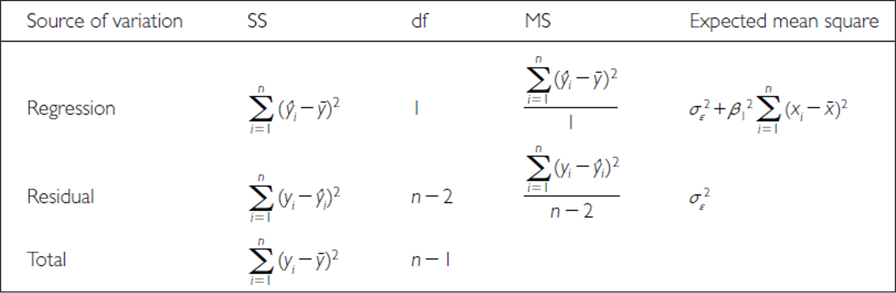

```{r}
#| include: false
#| message: false
#| warning: false
library(knitr)
library(patchwork)
library(grid)
library(gridExtra)
library(car)
library(boot)
library(tidyverse)

# Create sample data for demonstration, following the fish data example style
# This simulates allometric scaling relationship seen in Chapter 17
set.seed(123)
fish_data <- tibble(
  length_mm = runif(40, 180, 320),
  mass_g = 0.00001 * length_mm^3 * runif(40, 0.9, 1.1)
)
fish_data$lake <- factor(rep(c("Lake A", "Lake B"), each = 20))

# To simulate the lion data in example 17.1
lion_data <- tibble(
  proportion_black = c(0.21, 0.14, 0.11, 0.13, 0.12, 0.13, 0.12, 0.18, 0.23, 0.22,
                      0.20, 0.17, 0.15, 0.27, 0.26, 0.21, 0.30, 0.42, 0.43, 0.59,
                      0.60, 0.72, 0.29, 0.10, 0.48, 0.44, 0.34, 0.37, 0.34, 0.74, 0.79, 0.51),
  age_years = c(1.1, 1.5, 1.9, 2.2, 2.6, 3.2, 3.2, 2.9, 2.4, 2.1,
               1.9, 1.9, 1.9, 1.9, 2.8, 3.6, 4.3, 3.8, 4.2, 5.4,
               5.8, 6.0, 3.4, 4.0, 7.3, 7.3, 7.8, 7.1, 7.1, 13.1, 8.8, 5.4)
)

# For example 17.3 (prairie stability)
set.seed(456)
prairie_data <- tibble(
  species_number = rep(c(1, 2, 4, 8, 16), times = c(32, 32, 32, 32, 33)),
  log_stability = 1.20 + 0.033 * species_number + rnorm(161, 0, 0.35)
)
```

## Where We Left Off

::::::: columns
:::: {.column width="60%"}
Covered last time:

- Study design
- Causality in ecology
- Experimental design: replication, controls, randomization, independence
- Sampling in field studies
- Power analysis: *a priori* and *post hoc*
- Study design and analysis
::::

:::: {.column width="40%"}
```{r}
#| echo: false
#| message: false
#| warning: false
#| fig-width: 3.2
#| fig-height: 2.8
#| fig-alt: "Boxplot of grayling mass in grams by lake, colored by lake."
grayling_df <- read_csv("data/gray_I3_I8.csv") %>%
  filter(!is.na(mass_g)) %>%
  filter(!is.na(length_mm))

grayling_df %>% ggplot(aes(lake, mass_g, color = lake)) +
  geom_boxplot()
```
::::
:::::::

## Part 1 · Overview {.divider}

## Today's Objectives

::::::: columns
:::: {.column width="60%"}
This lecture covers two fundamental statistical techniques in biology: correlation and regression analysis. Based on Chapters 16–17 from Whitlock & Schluter's *The Analysis of Biological Data* (3rd edition), we'll explore:

- Correlation analysis: measuring relationships between variables
- The distinction between correlation and regression
- Simple linear regression: predicting one variable from another
- Estimating and interpreting regression parameters
- Testing assumptions and handling violations
- Analysis of variance in regression
- Model selection and comparison
::::

:::: {.column width="40%"}
::: callout-note
**📖 Reference**

Whitlock & Schluter, Ch. 16 (Correlation) and Ch. 17 (Regression) are the core references for this entire lecture.
:::
::::
:::::::

## Part 2 · Correlation vs. Regression {.divider}

## Correlation vs. Regression — What's the Difference?

::::::: columns
:::: {.column width="60%"}
**Correlation Analysis:**

- Measures the strength and direction of a relationship between two numerical variables
- Both X and Y are random variables (both measured, neither manipulated)
- Variables are typically on equal footing (either could be X or Y)
- No cause-effect relationship implied
- Quantifies the degree to which variables are related
- Expressed as a correlation coefficient (r) from −1 to +1

**Regression Analysis:**

- Predicts one variable (Y) from another (X)
- X is often fixed or controlled (manipulated)
- Y is the response variable of interest
- Often implies a cause-effect relationship
- Produces an equation for prediction, with slope and intercept parameters
::::

:::: {.column width="40%"}
```{r}
#| echo: false
#| message: false
#| warning: false
#| fig-height: 4
#| fig-width: 3.2
#| fig-alt: "Two stacked scatterplots of simulated fish length versus mass: the top panel shows a correlation view with a confidence ellipse and no predictor/response distinction, the bottom panel shows a regression view with a fitted line predicting mass from length."
p1_fish <- ggplot(fish_data, aes(x = length_mm, y = mass_g)) +
  geom_point() +
  stat_ellipse() +
  labs(title = "Correlation View - no dependent/independent distinction",
       x = "Length (mm)", y = "Mass (g)") +
  theme_minimal(base_size = 9)

p2_fish <- ggplot(fish_data, aes(x = length_mm, y = mass_g)) +
  geom_point() +
  geom_smooth(method = "lm", se = TRUE, color = "red") +
  labs(title = "Regression View - predict mass from length, clear X -> Y relationship",
       x = "Length (mm) [predictor]", y = "Mass (g) [response]") +
  theme_minimal(base_size = 9)

p1_fish / p2_fish
```
::::
:::::::

## Part 3 · Correlation Analysis {.divider}

## What Is Correlation?

::::::: columns
:::: {.column width="60%"}
**Correlation analysis** measures the strength and direction of a relationship between two numerical variables:

- Ranges from −1 to +1
- +1 indicates perfect positive correlation
- 0 indicates no correlation
- −1 indicates perfect negative correlation

The **Pearson correlation coefficient (r)** is defined as:

$$r = \frac{\sum_{i}(X_i - \bar{X})(Y_i - \bar{Y})}{\sqrt{\sum_{i}(X_i - \bar{X})^2 \sum_{i}(Y_i - \bar{Y})^2}}$$

This can be simplified as:

$$r = \frac{\text{Covariance}(X, Y)}{s_X \cdot s_Y}$$

Where $s_X$ and $s_Y$ are the standard deviations of X and Y.
::::

:::: {.column width="40%"}
```{r}
#| echo: false
#| fig-height: 4
#| fig-width: 3
#| message: false
#| warning: false
#| fig-alt: "Five stacked scatterplots illustrating correlation strength from r = 1 (perfect positive) down through strong positive, no correlation (r = 0), strong negative, to r = -1 (perfect negative), each titled with its correlation coefficient."
set.seed(123)
n <- 50
perfect_pos <- tibble(x = 1:n, y = 1:n)
strong_pos  <- tibble(x = 1:n, y = 1:n + rnorm(n, 0, 5))
no_corr     <- tibble(x = 1:n, y = rnorm(n, 50, 10))
strong_neg  <- tibble(x = 1:n, y = n:1 + rnorm(n, 0, 5))
perfect_neg <- tibble(x = 1:n, y = n:1)

corr_plot <- function(data, title, r_value) {
  ggplot(data, aes(x = x, y = y)) +
    geom_point(alpha = 0.5, size = 0.2) +
    labs(title = paste(title, "r =", round(cor(data$x, data$y), 2)),
         x = "X Variable", y = "Y Variable") + theme_classic(base_size = 7)
}
p1_corr <- corr_plot(perfect_pos, "Perfect Positive", 1)
p2_corr <- corr_plot(strong_pos, "Strong Positive", 0.8)
p3_corr <- corr_plot(no_corr, "No Correlation", 0)
p4_corr <- corr_plot(strong_neg, "Strong Negative", -0.8)
p5_corr <- corr_plot(perfect_neg, "Perfect Negative", -1)

(p1_corr + theme(axis.title.x = element_blank(), axis.text.x = element_blank()) +
p2_corr  + theme(axis.title.x = element_blank(), axis.text.x = element_blank()) +
p3_corr  + theme(axis.title.x = element_blank(), axis.text.x = element_blank()) +
p4_corr  + theme(axis.title.x = element_blank(), axis.text.x = element_blank()) +
p5_corr + plot_layout(ncol = 1))
```
::::
:::::::

## Example 16.1: Flipping the Bird

::::::: columns
:::: {.column width="60%"}
Nazca boobies (*Sula granti*) — do aggressive behaviors as a chick predict future aggressive behavior as an adult?

- Correlation is r = 0.534 — a moderate positive relationship
- p-value = 0.007 — correlation is statistically significant

For a Pearson correlation coefficient (r) of 0.53372:

- This is r (not ρ, as Spearman's below), as indicated by "cor" in your output
- To determine the amount of variation explained, square this value: r² = 0.53372² = 0.2849 (≈ 28.49%)
- Means about 28.49% of the variance in one variable can be explained by the other

Tested by a t-test: $\text{t}=\frac{r}{SE_r}$
::::

:::: {.column width="40%"}
```{r}
#| echo: false
#| message: false
#| warning: false
#| fig-height: 3.4
#| fig-width: 3.4
booby_data <- tibble(
  visits_as_nestling = c(1, 7, 15, 4, 11, 14, 23, 14, 9, 5, 4, 10,
                         13, 13, 14, 12, 13, 9, 8, 18, 22, 22, 23, 31),
  future_aggression = c(-0.80, -0.92, -0.80, -0.46, -0.47, -0.46, -0.23, -0.16,
                        -0.23, -0.23, -0.16, -0.10, -0.10, 0.04, 0.13, 0.19,
                        0.25, 0.23, 0.15, 0.23, 0.31, 0.18, 0.17, 0.39)
)
booby_test <- cor.test(booby_data$visits_as_nestling, booby_data$future_aggression)
booby_test
```
::::
:::::::

## Example 16.1: Interpretation

::::::: columns
:::: {.column width="60%"}
**Interpretation:** the correlation coefficient of r = 0.534 suggests that Nazca boobies who experienced more visits from non-parent adults as nestlings tend to display more aggressive behavior as adults. This supports the hypothesis that early experiences influence adult behavior patterns in this species.

**Standard error:**

$$\text{SE}_r = \sqrt{\frac{1-r^2}{n-2}}$$

SE = 0.180

Need to be sure the relationship is not curved — see below.
::::

:::: {.column width="40%"}
```{r}
#| echo: false
#| fig-height: 3.4
#| fig-width: 3.4
#| message: false
#| warning: false
#| fig-alt: "Scatterplot of Nazca booby future aggression score against number of nestling visits from non-parent adults, showing a positive trend."
booby_data %>% ggplot(aes(visits_as_nestling, future_aggression)) + geom_point()
```
::::
:::::::

## Testing Assumptions for Correlation

::: callout-note
**🔮 Predict first:** We're about to run Shapiro-Wilk on both booby variables, then look at their histograms and QQ plots. If the formal test and the visual check disagree, which would you trust more for n = 24?
:::

::::::: columns
:::: {.column width="60%"}
As described in Section 16.3, correlation analysis has key assumptions:

1. **Random sampling** — observations should be a random sample from the population
2. **Bivariate normality** — both variables follow a normal distribution, and their joint distribution is bivariate normal
3. **Linear relationship** — the relationship between variables is linear, not curved

Let's check these assumptions with the booby data.
::::

:::: {.column width="40%"}
```{r}
#| echo: false
#| fig-height: 3.4
#| fig-width: 3.4
#| message: false
#| warning: false
shapiro.test(booby_data$visits_as_nestling)
shapiro.test(booby_data$future_aggression)
```
::::
:::::::

## Testing Assumptions for Correlation — Visually

::::::: columns
:::: {.column width="60%"}
As described in Section 16.3, correlation analysis has key assumptions:

1. **Random sampling** — observations should be a random sample from the population
2. **Bivariate normality** — both variables follow a normal distribution, and their joint distribution is bivariate normal
3. **Linear relationship** — the relationship between variables is linear, not curved

Let's check these assumptions using the booby data.
::::

:::: {.column width="40%"}
```{r}
#| echo: false
#| fig-height: 3.4
#| fig-width: 3.4
#| message: false
#| warning: false
#| fig-alt: "Four-panel figure checking normality of the booby data: histograms of nestling visits and future aggression on the left, and QQ-plots of the same two variables on the right."
p1_booby <- ggplot(booby_data, aes(x = visits_as_nestling)) +
  geom_histogram(bins = 10, fill = "lightblue", color = "black") +
  labs(title = "Visits", x = "Visits", y = "Frequency") +
  theme_minimal(base_size = 7)

p2_booby <- ggplot(booby_data, aes(x = future_aggression)) +
  geom_histogram(bins = 10, fill = "lightgreen", color = "black") +
  labs(title = "Aggression", x = "Aggression", y = "Frequency") +
  theme_minimal(base_size = 7)

p3_booby <- ggplot(booby_data, aes(sample = visits_as_nestling)) +
  geom_qq() + geom_qq_line() +
  labs(title = "Q-Q Plot Visits", x = "Theoretical Quantiles", y = "Sample Quantiles") +
  theme_minimal(base_size = 7) + theme(axis.title.x = element_blank(), axis.text.x = element_blank())

p4_booby <- ggplot(booby_data, aes(sample = future_aggression)) +
  geom_qq() + geom_qq_line() +
  labs(title = "Q-Q Plot for Aggression", x = "Theoretical Quantiles", y = "Sample Quantiles") +
  theme_minimal(base_size = 7)

(p1_booby / p2_booby) | (p3_booby / p4_booby)
```
::::
:::::::

## What to Do If Assumptions Are Violated

::::::: columns
:::: {.column width="60%"}
- Transform one or both variables (log, square root, etc.)
- Use a non-parametric correlation (**Spearman's rank correlation**) or Kendall's tau (τ)
- Examine the data for outliers or influential points

::: callout-tip
**🖐 Notice**

The lion nose-pigmentation data (used here just as an example of non-normal data) shows a right-skewed `proportion_black` and clearly non-normal QQ plots — this is exactly when Spearman's is the better tool.
:::
::::

:::: {.column width="40%"}
```{r}
#| echo: false
#| fig-height: 3.6
#| fig-width: 3.6
#| message: false
#| warning: false
#| fig-alt: "Four-panel figure checking normality of the lion data: histograms of proportion black and age on the left, and QQ-plots of the same two variables on the right, showing the right-skewed, non-normal shape of proportion black."
p1_lion <- ggplot(lion_data, aes(x = proportion_black)) +
  geom_histogram(bins = 10, fill = "lightblue", color = "black") +
  labs(title = "Prop black", x = "Visits", y = "Frequency") +
  theme_minimal(base_size = 7)

p2_lion <- ggplot(lion_data, aes(x = age_years)) +
  geom_histogram(bins = 10, fill = "lightgreen", color = "black") +
  labs(title = "Age", x = "Age", y = "Frequency") +
  theme_minimal(base_size = 7)

p3_lion <- ggplot(lion_data, aes(sample = proportion_black)) +
  geom_qq() + geom_qq_line() +
  labs(title = "Q-Q Plot Prop Black", x = "Theoretical Quantiles", y = "Sample Quantiles") +
  theme_minimal(base_size = 7) + theme(axis.title.x = element_blank(), axis.text.x = element_blank())

p4_lion <- ggplot(lion_data, aes(sample = age_years)) +
  geom_qq() + geom_qq_line() +
  labs(title = "Q-Q Plot for age", x = "Theoretical Quantiles", y = "Sample Quantiles") +
  theme_minimal(base_size = 7)

(p1_lion / p2_lion) | (p3_lion / p4_lion)
```
::::
:::::::

## Spearman's Rho — Interpretation

::::::: columns
:::: {.column width="60%"}
To understand the amount of variation explained, you can square the non-parametric Spearman's rho value.

For your value of 0.74485:

$$\rho^2 = 0.74485^2 = 0.5548$$

This means approximately 55.48% of the variance in the *ranks* of one variable can be explained by the ranks of the other. This is similar to how R² works in linear regression, but specifically for ranked data.
::::

:::: {.column width="40%"}
```{r}
#| echo: false
#| fig-height: 3.4
#| fig-width: 3.4
#| message: false
#| warning: false
spearman_corr <- cor.test(
  lion_data$proportion_black, lion_data$age_years, method = "spearman")
spearman_corr
```
::::
:::::::

## Correlation — Important Considerations

::::::: columns
:::: {.column width="60%"}
- **The correlation coefficient depends on the range**
  - Restricting the range of values can reduce the correlation coefficient
  - Comparing correlations between studies requires similar ranges of values
- **Measurement error affects correlation**
  - Measurement error in X or Y tends to weaken observed correlation
  - This bias is called **attenuation**
  - True correlation is typically stronger than the observed correlation
- **Correlation vs. Causation**
  - Correlation does not imply causation
  - Three possible explanations: (1) X causes Y, (2) Y causes X, (3) Z (a third variable) causes both X and Y
- **Correlation significance test**
  - H₀: ρ = 0 (no correlation in population); H₁: ρ ≠ 0
  - Test statistic: t = r / SE(r), with df = n − 2
::::

:::: {.column width="40%"}
```{r}
#| echo: false
#| message: false
#| warning: false
#| fig-height: 4
#| fig-width: 3
#| fig-alt: "Four stacked scatterplots illustrating factors that affect correlation strength: full range of data versus a restricted range (showing a weaker correlation), and true values versus measurement-error-added values (showing attenuation), each labeled with its correlation coefficient."
set.seed(456)
n <- 100
x_full <- runif(n, 0, 10)
y_full <- 2 + 0.5*x_full + rnorm(n, 0, 1)
full_data <- tibble(x = x_full, y = y_full)
restricted_data <- full_data %>% filter(x >= 4 & x <= 6)

full_cor <- cor(full_data$x, full_data$y)
restricted_cor <- cor(restricted_data$x, restricted_data$y)

p1_full <- ggplot(full_data, aes(x = x, y = y)) +
  geom_point() +
  geom_smooth(method = "lm", se = FALSE, color = "blue") +
  labs(title = "Full Range of Data", subtitle = paste("r =", round(full_cor, 2)),
       x = "X Variable", y = "Y Variable") +
  theme_minimal(base_size = 9) + theme(axis.title.x = element_blank(), axis.text.x = element_blank())

p2_full <- ggplot(restricted_data, aes(x = x, y = y)) +
  geom_point() +
  geom_smooth(method = "lm", se = FALSE, color = "red") +
  labs(title = "Restricted Range", subtitle = paste("r =", round(restricted_cor, 2)),
       x = "X Variable", y = "Y Variable") +
  theme_minimal(base_size = 9) +
  xlim(0, 10) + ylim(min(full_data$y), max(full_data$y))

set.seed(789)
x_true <- runif(50, 0, 10)
y_true <- 1 + 0.8*x_true
x_meas <- x_true + rnorm(50, 0, 1)
y_meas <- y_true + rnorm(50, 0, 1)
error_data <- tibble(x_true = x_true, y_true = y_true, x_meas = x_meas, y_meas = y_meas)

p3_full <- ggplot(error_data, aes(x = x_true, y = y_true)) +
  geom_point() +
  geom_smooth(method = "lm", se = FALSE, color = "blue") +
  labs(title = "No Measurement Error", subtitle = paste("r =", round(cor(x_true, y_true), 2)),
       x = "X (True Values)", y = "Y (True Values)") +
  theme_minimal(base_size = 9) + theme(axis.title.x = element_blank(), axis.text.x = element_blank())

p4_full <- ggplot(error_data, aes(x = x_meas, y = y_meas)) +
  geom_point() +
  geom_smooth(method = "lm", se = FALSE, color = "red") +
  labs(title = "With Measurement Error", subtitle = paste("r =", round(cor(x_meas, y_meas), 2)),
       x = "X (Measured Values)", y = "Y (Measured Values)") +
  theme_minimal(base_size = 9)

p1_full + p2_full + p3_full + p4_full + plot_layout(ncol = 1)
```
::::
:::::::

## Part 4 · Linear Regression — the Model {.divider}

## The Simple Linear Regression Model

::::::: columns
:::: {.column width="60%"}
**Simple linear regression** models the relationship between a response variable (Y) and a predictor variable (X).

The **population** regression model: $Y = \alpha + \beta X + \varepsilon$

- Y is the response variable
- X is the predictor variable
- α (alpha) is the intercept (value of Y when X = 0)
- β (beta) is the slope (change in Y per unit change in X)
- ε (epsilon) is the error term (random deviation from the line)

The **sample** regression equation: $\hat{Y} = a + bX$

- $\hat{Y}$ is the predicted value of Y; a estimates α; b estimates β

**Method of least squares:** the line is chosen to minimize the sum of squared vertical distances (residuals) between observed and predicted Y values.

::: callout-note
**📖 Reference**

Whitlock & Schluter, Ch. 17 — Regression, is the primary reference for the rest of this lecture.
:::
::::

:::: {.column width="40%"}
{width="220"}
::::
:::::::

## The Simple Linear Regression Model — the Lion Data

::::::: columns
:::: {.column width="60%"}
**Simple linear regression** models the relationship between a response variable (Y) and a predictor variable (X).

The **population** regression model: $Y = \alpha + \beta X + \varepsilon$

The **sample** regression equation: $\hat{Y} = a + bX$

**Method of least squares:** the line is chosen to minimize the sum of squared vertical distances (residuals) between observed and predicted Y values.
::::

:::: {.column width="40%"}
```{r}
#| echo: false
#| message: false
#| warning: false
#| fig-height: 3.6
#| fig-width: 3.6
#| fig-alt: "Scatterplot of lion age versus proportion of black on the nose with a fitted regression line, annotated with the intercept and slope values, the fitted equation, and a red segment illustrating one point's residual."
lion_model <- lm(age_years ~ proportion_black, data = lion_data)
intercept <- coef(lion_model)[1]
slope <- coef(lion_model)[2]
predictions <- predict(lion_model)

liona_plot <- ggplot(lion_data, aes(x = proportion_black, y = age_years)) +
  geom_point(size = 3) +
  stat_smooth(geom = "smooth", position = "identity",
              method = "lm", se = FALSE, color = "blue", fullrange = TRUE,
              xseq = c(-0.1, 1)) +
  geom_segment(aes(x = proportion_black[10], y = age_years[10],
                   xend = proportion_black[10],
                   yend = predict(lion_model)[10]),
               color = "red", linetype = "solid", linewidth = 1) +
  annotate("text", x = lion_data$proportion_black[10],
           y = (lion_data$age_years[10] + predict(lion_model)[10]),
           label = "Residual (e)", color = "red") +
  annotate("text", x = 0.5, y = intercept + slope * 0.3 - 2,
           label = paste("Intercept (a) =", round(intercept, 2)), color = "blue") +
  annotate("text", x = 0.6, y = intercept + slope * 0.6 + 2,
           label = paste("Slope (b) =", round(slope, 2)), color = "blue") +
  annotate("text", x = 0.4, y = 12,
           label = paste("age=", round(intercept, 2), "+",
                        round(slope, 2), "*prop"),
           color = "darkblue", size = 3) +
  coord_cartesian(ylim = c(0, 16), xlim = c(0, .9)) +
  scale_y_continuous(breaks = seq(0, 16, 2)) +
  labs(title = "Lion Age vs. Nose Blackness",
       x = "Proportion of black on nose", y = "Age (years)") +
  theme_minimal(base_size = 9)
liona_plot
```
::::
:::::::

## Example 17.1 — the Lion Regression Equation

::::::: columns
:::: {.column width="40%"}
From Example 17.1 in the textbook, the regression line for the lion data is:

$$\text{age} = 0.88 + 10.65 \times \text{proportion}_{black}$$

This means:

- When a lion has no black on its nose (proportion = 0), its predicted age is 0.88 years
- For each 0.1 increase in the proportion of black, age increases by 1.065 years
- The slope (10.65) indicates that lions with more black on their noses tend to be older
::::

:::: {.column width="60%"}
```{r}
#| echo: false
#| message: false
#| warning: false
#| fig-width: 4
#| fig-height: 3.6
#| fig-alt: "The lion age versus nose-blackness regression plot repeated to illustrate Example 17.1's fitted equation, age = 0.88 + 10.65 x proportion black."
liona_plot
```
::::
:::::::

## Male Lions and Nose Pigmentation

::::::: columns
:::: {.column width="60%"}
- Male lions develop more black pigmentation on their noses as they age
- This relationship can be used to estimate the age of lions in the field
::::

:::: {.column width="40%"}
```{r}
#| echo: false
#| fig-height: 3.6
#| fig-width: 3.6
#| message: false
#| warning: false
lion_model <- lm(age_years ~ proportion_black, data = lion_data)
summary(lion_model)
```
::::
:::::::

## Calculating the Slope and Intercept by Hand

::::::: columns
:::: {.column width="60%"}
The calculation for slope (m) is:

$$m = \frac{\sum_i(X_i - \bar{X})(Y_i - \bar{Y})}{\sum_i(X_i - \bar{X})^2}$$

Given:

- $\bar{X} = 0.3222$
- $\bar{Y} = 4.3094$
- $\sum_i(X_i - \bar{X})^2 = 1.2221$
- $\sum_i(X_i - \bar{X})(Y_i - \bar{Y}) = 13.0123$

b = 13.0123 / 1.2221 = 10.647

Intercept: $b = \bar{Y} - m\bar{X} = 4.3094 - 10.647(0.3222) = 0.879$
::::

:::: {.column width="40%"}
```{r}
#| echo: false
#| fig-height: 3.4
#| fig-width: 3.6
#| message: false
#| warning: false
#| fig-alt: "Scatterplot of lion age versus proportion of black on the nose with a fitted regression line and confidence band, annotated with the fitted equation age = 0.88 + 10.65 x proportion_black, illustrating the by-hand slope and intercept calculation."
ggplot(lion_data, aes(x = proportion_black, y = age_years)) +
  geom_point(size = 3) +
  geom_smooth(method = "lm", color = "blue") +
  annotate("text", x = 0.4, y = 12,
           label = paste("age =", round(coef(lion_model)[1], 2), "+",
                        round(coef(lion_model)[2], 2), "x proportion_black"),
           color = "darkblue", size = 3.2) +
  labs(title = "Lion Age vs. Nose Blackness",
       subtitle = "Using nose pigmentation to estimate age",
       x = "Proportion of black on nose", y = "Age (years)") +
  theme_minimal(base_size = 9)
```
::::
:::::::

## Making Predictions

::::::: columns
:::: {.column width="60%"}
To predict the age of a lion with 0.50 proportion of black on its nose:

$$\hat{Y} = 0.88 + 10.65(0.50) = 6.2 \text{ years}$$

**Confidence intervals vs. prediction intervals:**

- **Confidence interval** — range for the mean age of *all* lions with 0.50 black
- **Prediction interval** — range for an *individual* lion with 0.50 black

Both intervals are narrowest near $\bar{X}$ and widen as X moves away from the mean.
::::

:::: {.column width="40%"}
```{r}
#| echo: false
#| fig-height: 3.4
#| fig-width: 3.6
#| message: false
#| warning: false
#| fig-alt: "Scatterplot of lion age versus proportion of black on the nose with a fitted regression line and confidence band, annotated with the fitted equation, shown as context for predicting age from a given proportion black."
ggplot(lion_data, aes(x = proportion_black, y = age_years)) +
  geom_point(size = 3) +
  geom_smooth(method = "lm", color = "blue") +
  annotate("text", x = 0.4, y = 12,
           label = paste("age =", round(coef(lion_model)[1], 2), "+",
                        round(coef(lion_model)[2], 2), "x proportion_black"),
           color = "darkblue", size = 3.2) +
  labs(title = "Lion Age vs. Nose Blackness",
       subtitle = "Using nose pigmentation to estimate age",
       x = "Proportion of black on nose", y = "Age (years)") +
  theme_minimal(base_size = 9)
```
::::
:::::::

## Example: the Prairie Home Companion

::::::: columns
:::: {.column width="60%"}
- Does biodiversity affect ecosystem stability?
- Tilman et al. (2006) investigated this using experimental plots varying in plant species number
::::

:::: {.column width="40%"}
```{r}
#| echo: false
#| message: false
#| warning: false
#| fig-height: 3.4
#| fig-width: 3.6
#| paged-print: false
prairie_model <- lm(log_stability ~ species_number, data = prairie_data)
summ_model <- summary(prairie_model)
summ_model
rsquared <- summ_model$r.squared
anova(prairie_model)
```
::::
:::::::

## The Prairie Model — Interpretation

::::::: columns
:::: {.column width="60%"}
The hypothesis test asks whether the slope equals zero:

- H₀: β = 0 (species number does not affect stability)
- H₁: β ≠ 0 (species number does affect stability)

t = estimate / SE

**Interpretation:**

The slope estimate is 0.033, indicating that log stability increases by 0.033 units for each additional plant species in the plot.

The p-value is very small (2.73e-10), providing strong evidence to reject the null hypothesis that species number has no effect on ecosystem stability.

R² = 0.222, meaning approximately 22.2% of the variation in log stability is explained by the number of plant species.

This supports the biodiversity-stability hypothesis: more diverse plant communities have more stable biomass production over time.
::::

:::: {.column width="40%"}
```{r}
#| echo: false
#| message: false
#| warning: false
#| fig-height: 3.4
#| fig-width: 3.6
#| fig-alt: "Scatterplot of log ecosystem stability versus number of plant species, with a fitted regression line and confidence band, showing stability increasing with species number."
ggplot(prairie_data, aes(x = species_number, y = log_stability)) +
  geom_point() +
  geom_smooth(method = "lm", se = TRUE, color = "blue") +
  labs(title = "Biodiversity and Ecosystem Stability",
       subtitle = paste("R2 =", round(rsquared, 3)),
       x = "Number of plant species", y = "Log stability") +
  theme_minimal(base_size = 9)
```
::::
:::::::

## Part 5 · Testing Regression Assumptions {.divider}

## Testing Regression Assumptions — Overview

::::::: columns
:::: {.column width="60%"}
Linear regression has four key assumptions:

1. **Linearity** — the relationship between X and Y is linear
2. **Independence** — observations are independent
3. **Homoscedasticity** — equal variance across all values of X
4. **Normality** — residuals are normally distributed

Let's check these assumptions for the lion regression model.

Assume that error $\varepsilon_i$ is normally distributed for each x_i, has the same variance, and has a mean of 0 at each x_i.
::::

:::: {.column width="40%"}
{width="300" height="309"}
::::
:::::::

## Testing Regression Assumptions — Residuals

::::::: columns
:::: {.column width="60%"}
Linear regression has four key assumptions: linearity, independence, homoscedasticity, and normality.

Let's check these assumptions for the lion regression model.

The error $\varepsilon_i$ is estimated as the residual: $e_i = y_i - \hat{y}_i$

Ordinary least squares estimates a and b (intercept and slope) to minimize the sum of the residuals squared:

$$\sum_{i=1}^{n} (y_i - \hat{y}_i)^2$$
::::

:::: {.column width="40%"}
{width="300"}
::::
:::::::

## Checking Linearity — Residuals vs. Fitted

::::::: columns
:::: {.column width="60%"}
Linear regression has four key assumptions: linearity, independence, homoscedasticity, and normality.

Let's check these assumptions for the lion regression model. **Linearity** — how does this plot work?
::::

:::: {.column width="40%"}
```{r}
#| echo: false
#| message: false
#| warning: false
#| paged-print: false
#| fig-height: 3.4
#| fig-width: 3.6
#| fig-alt: "Residuals-versus-fitted-values plot for the lion age regression model, used to check the linearity assumption."
plot(lion_model, which = 1)
```
::::
:::::::

## Checking Normality — QQ Plot of Residuals

::::::: columns
:::: {.column width="60%"}
Linear regression has four key assumptions: linearity, independence, homoscedasticity, and normality.

Let's check these assumptions for the lion regression model.
::::

:::: {.column width="40%"}
```{r}
#| echo: false
#| message: false
#| warning: false
#| paged-print: false
#| fig-height: 3.4
#| fig-width: 3.6
#| fig-alt: "Normal Q-Q plot of residuals from the lion age regression model, used to check the normality assumption."
plot(lion_model, which = 2)
```
::::
:::::::

## Checking Normality — Shapiro-Wilk on Residuals

::::::: columns
:::: {.column width="60%"}
Linear regression has four key assumptions: linearity, independence, homoscedasticity, and normality.

Let's check these assumptions for the lion regression model.
::::

:::: {.column width="40%"}
```{r}
#| echo: false
#| message: false
#| warning: false
#| fig-height: 3.4
#| fig-width: 3.6
#| paged-print: false
shapiro.test(residuals(lion_model))
```
::::
:::::::

## When Assumptions Are Violated

::::::: columns
:::: {.column width="40%"}
Linear regression has four key assumptions: linearity, independence, homoscedasticity, and normality.

If assumptions are violated:

1. Transform the data (Section 17.6)
2. Use weighted least squares for heteroscedasticity
3. Consider non-linear models (Section 17.8)
::::

:::: {.column width="60%"}
```{r}
#| echo: false
#| fig-height: 4
#| fig-width: 4
#| message: false
#| warning: false
#| fig-alt: "Three stacked scatterplots each showing one regression-assumption violation: non-linearity (linear fit versus the true curved trend), heteroscedasticity (variance increasing with x), and non-normal, right-skewed residuals."
set.seed(123)
n <- 50
x <- seq(1, 10, length.out = n)

nonlinear_data <- tibble(x = x, y = 5 + 2*x + 0.3*x^2 + rnorm(n, 0, 3))
hetero_data <- tibble(x = x, y = 5 + 2*x + rnorm(n, 0, 0.5*x))
nonnormal_data <- tibble(x = x, y = 5 + 2*x + rexp(n, 1))

p1_rel <- ggplot(nonlinear_data, aes(x = x, y = y)) +
  geom_point() +
  geom_smooth(method = "lm", se = FALSE, color = "red") +
  geom_smooth(se = FALSE, color = "blue") +
  labs(title = "Violation: Non-linearity, Red = linear model / Blue = true") +
  theme_minimal(base_size = 7)

p2_rel <- ggplot(hetero_data, aes(x = x, y = y)) +
  geom_point() +
  geom_smooth(method = "lm", se = FALSE) +
  labs(title = "Violation: Heteroscedasticity - variance increases with x") +
  theme_minimal(base_size = 7)

p3_rel <- ggplot(nonnormal_data, aes(x = x, y = y)) +
  geom_point() +
  geom_smooth(method = "lm", se = FALSE) +
  labs(title = "Violation: Non-normal residuals - skewed distribution") +
  theme_minimal(base_size = 7)

p1_rel +
  theme(axis.title.x = element_blank(), axis.text.x = element_blank()) +
  p2_rel +
  theme(axis.title.x = element_blank(), axis.text.x = element_blank()) +
  p3_rel +
  plot_layout(ncol = 1)
```
::::
:::::::

## Part 6 · Regression Inference & ANOVA {.divider}

## Estimates of Error and Significance

::::::: columns
:::: {.column width="60%"}
- Estimates of standard error and confidence intervals for slope and intercept determine confidence bands
- The 95% confidence band will contain the true population line 95/100 times under repeated sampling
- This is usually done in R
::::

:::: {.column width="40%"}
{width="300"}
::::
:::::::

## From Estimates to Hypothesis Tests

::::::: columns
:::: {.column width="60%"}
In addition to getting estimates of population parameters (β₀, β₁), we want to test hypotheses about them.

- This is accomplished by analysis of variance
- Partition variance in Y: due to variation in X, and due to other things (error)

::: callout-note
**📖 Reference**

Gotelli & Ellison, *A Primer of Ecological Statistics*, Ch. 9 — Regression, covers this variance-partitioning approach to testing a regression slope.
:::
::::

:::: {.column width="40%"}
{width="300"}
::::
:::::::

## Partitioning the Variance

::::::: columns
:::: {.column width="60%"}
Total variation in Y is "partitioned" into 3 components:

- $SS_{regression}$: variation explained by regression — difference between predicted values ($\hat{y}_i$) and mean y ($\bar{y}$); df = 1 for simple linear (parameters − 1)
- $SS_{residual}$: variation not explained by regression — difference between observed ($y_i$) and predicted ($\hat{y}_i$) values; df = n − 2
- $SS_{total}$: total variation — sum of squared deviations of each observation ($y_i$) from the mean ($\bar{y}$); df = n − 1
::::

:::: {.column width="40%"}
{width="300"}
::::
:::::::

## Partitioning the Variance — Visually

::::::: columns
:::: {.column width="60%"}
Total variation in Y is "partitioned" into 3 components:

- $SS_{regression}$: variation explained by regression — df = 1 for simple linear
- $SS_{residual}$: variation not explained by regression — df = n − 2
- $SS_{total}$: total variation — df = n − 1
::::

:::: {.column width="40%"}
{width="300"}
::::
:::::::

## Comparing Regression Fits

::::::: columns
:::: {.column width="60%"}
Total variation in Y is "partitioned" into 3 components:

- $SS_{regression}$: **greater in C than D**
- $SS_{residual}$: **greater in B than A**
- $SS_{total}$: total variation
::::

:::: {.column width="40%"}
{width="300"}
::::
:::::::

## Sums of Squares and Degrees of Freedom

::::::: columns
:::: {.column width="60%"}
$$SS_{regression} + SS_{residual} = SS_{total}$$
$$df_{regression} + df_{residual} = df_{total}$$

- Sums of squares depend on n
- We need a different estimate of variance
::::

:::: {.column width="40%"}
{width="300"}
::::
:::::::

## From Sums of Squares to Mean Squares

::::::: columns
:::: {.column width="60%"}
Sums of squares converted to mean squares:

- Sums of squares divided by degrees of freedom — does not depend on n
- $MS_{residual}$: estimates population variation
- $MS_{regression}$: estimates population variation *and* variation due to the X-Y relationship
- Mean squares are **not** additive

::: callout-note
**✅ Key idea**

The F-ratio in a regression ANOVA table is exactly $MS_{regression} / MS_{residual}$ — the same logic you'll see again when we get to ANOVA for group comparisons.
:::
::::

:::: {.column width="40%"}
{width="300"}
::::
:::::::
