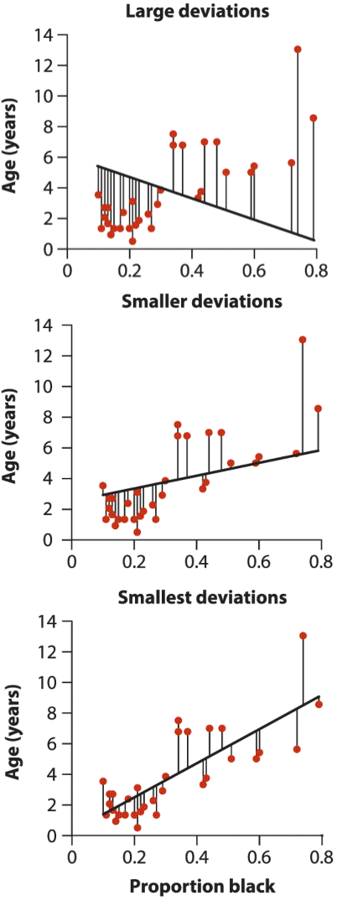
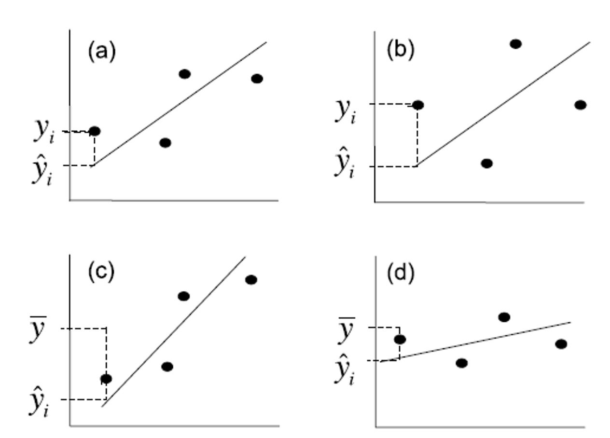
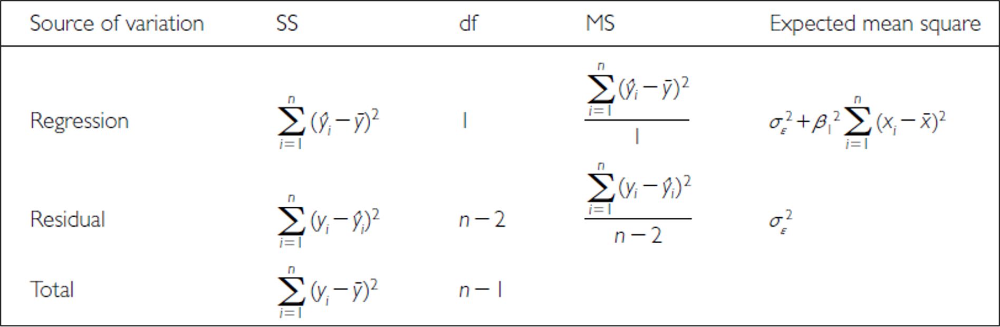
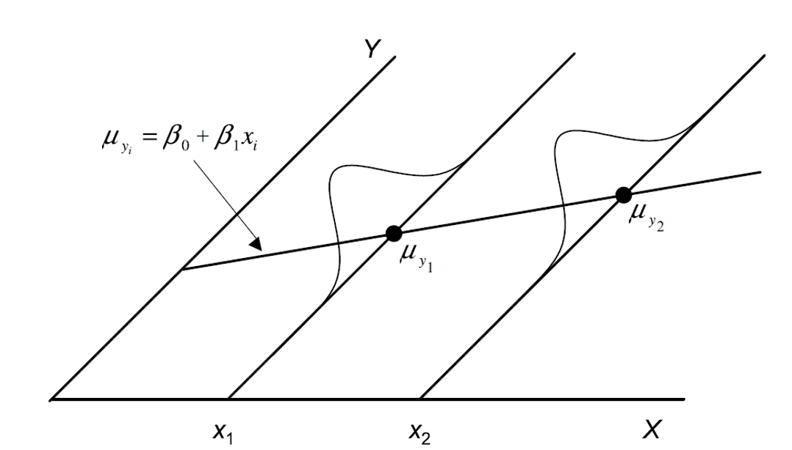
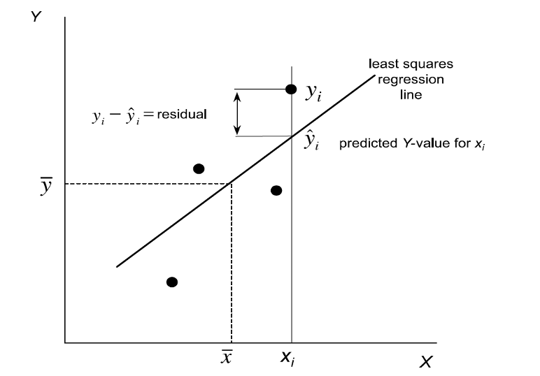

---
metadata-files:
  - ../../_templates/_lectures.yml
title: "Lecture: Correlation vs Linear Models"
subtitle: "Relationships"
description: "Correlation and simple linear regression as two halves of one idea: Pearson's r and Spearman's rho, the least-squares line, the sums-of-squares partition that turns a fitted line into an ANOVA table, and the residual diagnostics that decide whether any of it can be believed. Uses the Nazca booby, Indian rope trick, lion nose-pigmentation, prairie-biodiversity and Galapagos species-area datasets."
categories: [Regression, Correlation]
order: 10
week: 6
author: "Bill Perry"

format:
  html:
    downloads: [docx, pptx]  # This creates download links for all three
  revealjs:
    output-ext: "slides.html"
  docx:
    reference-doc: ../../ms_templates/custom-reference-compact.docx
    fig-width: 2.5
    fig-height: 2.5
    fig-dpi: 300
    dpi: 300            # tell Pandoc the real render dpi so it sizes figures correctly
  pptx: default
execute:
  echo: true
---

```{r correlation-linear-models-01}
#| include: false
#| message: false
#| warning: false
library(knitr)
library(patchwork)
library(car)
library(tidyverse)

# ---- the real textbook datasets, read once and reused all lecture ----
booby_df   <- read_csv("data/booby_aggression.csv",       show_col_types = FALSE)
rope_df    <- read_csv("data/rope_trick.csv",             show_col_types = FALSE)
lion_df    <- read_csv("data/lion_noses.csv",             show_col_types = FALSE)
prairie_df <- read_csv("data/prairie_stability.csv",      show_col_types = FALSE)
galap_df   <- read_csv("data/galapagos_species_area.csv", show_col_types = FALSE)

# ---- numbers quoted in the text below, computed once so the prose cannot drift ----
booby_test <- cor.test(booby_df$visits_as_nestling, booby_df$future_aggression)
r_booby    <- unname(booby_test$estimate)

rope_pearson  <- cor(rope_df$years_since_seen, rope_df$impressiveness)
rope_spearman <- suppressWarnings(
  cor(rope_df$years_since_seen, rope_df$impressiveness, method = "spearman"))

lion_model <- lm(age_years ~ proportion_black, data = lion_df)
lion_sum   <- summary(lion_model)
lion_b0    <- unname(coef(lion_model)[1])
lion_b1    <- unname(coef(lion_model)[2])
lion_r2    <- lion_sum$r.squared
lion_t     <- lion_sum$coefficients[2, 3]

lion_anova <- anova(lion_model)
ss_reg   <- lion_anova[1, "Sum Sq"]
ss_resid <- lion_anova[2, "Sum Sq"]
ss_total <- ss_reg + ss_resid
ms_reg   <- lion_anova[1, "Mean Sq"]
ms_resid <- lion_anova[2, "Mean Sq"]
f_lion   <- lion_anova[1, "F value"]

# small p-values must print as plain text inline, not knitr's LaTeX sci-notation
fmt_p <- function(p, digits = 3) {
  if (p < 0.001) formatC(p, format = "e", digits = 2) else formatC(p, format = "g", digits = digits)
}

prairie_model <- lm(log(biomass_stability) ~ species_number, data = prairie_df)
prairie_sum   <- summary(prairie_model)
prairie_b1    <- unname(coef(prairie_model)[2])
prairie_r2    <- prairie_sum$r.squared

# ---- Galapagos, clean and with one influential point added ----
galap_plot <- galap_df %>%
  mutate(log_area = log10(area_km2), log_species = log10(n_species))
galap_bad <- galap_plot %>%
  add_row(island = "suspect", area_km2 = 1000, n_species = 4,
          log_area = 3, log_species = 0.65)

gal_clean_m <- lm(log_species ~ log_area, data = galap_plot)
gal_bad_m   <- lm(log_species ~ log_area, data = galap_bad)
gal_clean_r2 <- summary(gal_clean_m)$r.squared
gal_bad_r2   <- summary(gal_bad_m)$r.squared
gal_clean_p  <- summary(gal_clean_m)$coefficients[2, 4]
gal_bad_p    <- summary(gal_bad_m)$coefficients[2, 4]
```

## Where We Left Off

::::: columns
:::: {.column width="60%"}
Covered last time:

- A design has two jobs: kill **bias**, shrink **sampling error**
- Controls, randomization and blinding; replication, balance and blocking
- Natural versus manipulative experiments, and what each one licenses you to say
- **Your design has already chosen your analysis**
::::

:::: {.column width="40%"}
::: callout-note
**✅ Where today sits on that map**

Last week ended with a table mapping designs onto analyses. Today is its **first row** — one continuous predictor, one continuous response.

Everything after today adds predictors or changes their type. The machinery stays the same.
:::
::::
:::::

## Part 1 · Overview {.divider}

## Today's Objectives

::::: columns
:::: {.column width="60%"}
Two techniques, one idea — a straight line through a cloud of points:

- **Correlation** — how tightly do two variables move together?
- **Regression** — what equation predicts Y from X?
- Assumptions for each, and what to do when they fail
- **Sums of squares** — how a fitted line becomes an ANOVA table

This lecture runs over **two class days**: correlation first, regression second.

[📥 Booby data](data/booby_aggression.csv){.btn .btn-primary download="booby_aggression.csv"} [📥 Rope trick data](data/rope_trick.csv){.btn .btn-primary download="rope_trick.csv"} [📥 Lion data](data/lion_noses.csv){.btn .btn-primary download="lion_noses.csv"} [📥 Script skeleton (.R)](data/10_correlation_linear_models.R){.btn .btn-primary download="10_correlation_linear_models.R"}
::::

:::: {.column width="40%"}
::: callout-note
**📖 Reading**

Whitlock & Schluter, Ch. 16 (Correlation) and Ch. 17 (Regression).

Gotelli & Ellison, Ch. 9 (Regression).
:::
::::
:::::

## 🗳️ How Today Works

::: callout-warning
**🗳️ Six times over the two days, you make the call**

Six slides are marked **🗳️ DECIDE**. Each asks a multiple-choice question, and I will *not* tell you the answer on that slide.

**How it works:** write your letter down — actually write it — then hold up fingers 1–4. If the room splits, turn to the person next to you, argue for ninety seconds, and we vote again. Nothing here is graded. The point is that you commit before you find out.
:::

## Part 2 · Correlation vs. Regression {.divider}

## Correlation vs. Regression — What's the Difference?

::::: columns
:::: {.column width="55%"}
**Correlation**

- Measures the **strength and direction** of a relationship
- Both X and Y are measured; neither is manipulated
- The variables are on equal footing — swap them and *r* is unchanged
- One number, from −1 to +1

**Regression**

- Produces an **equation** predicting Y from X
- You *assume* a direction, X → Y, when you choose which is which
- Swap X and Y and you get a **different line**
- Gives you a slope, an intercept, and predictions
::::

:::: {.column width="45%"}
```{r correlation-linear-models-02}
#| echo: false
#| message: false
#| warning: false
#| fig-height: 4
#| fig-width: 3.6
#| fig-alt: "Two stacked scatterplots of the same lion data: the top panel shows the correlation view with a confidence ellipse and no predictor/response distinction, the bottom shows the regression view with a fitted line predicting age from proportion black."
p_corr_view <- ggplot(lion_df, aes(x = proportion_black, y = age_years)) +
  geom_point() +
  stat_ellipse() +
  labs(title = "Correlation view - no X/Y roles",
       x = "Proportion black", y = "Age (years)") +
  theme_minimal(base_size = 9)

p_reg_view <- ggplot(lion_df, aes(x = proportion_black, y = age_years)) +
  geom_point() +
  geom_smooth(method = "lm", se = TRUE, color = "red") +
  labs(title = "Regression view - predict age from black",
       x = "Proportion black [predictor]", y = "Age (years) [response]") +
  theme_minimal(base_size = 9)

p_corr_view / p_reg_view
```
::::
:::::

## Choosing X Does Not Make It a Cause

::::: columns
:::: {.column width="60%"}
::: callout-warning
**⚠️ Regression does not earn you causation**

`lm(y ~ x)` will fit a slope to any two numeric columns you hand it, including ones with no causal link at all. Putting a variable on the right-hand side is a **decision you made**, not a finding.

What licenses a causal claim is the **study design** — manipulation, randomization, controls — not the model you fit afterwards.
:::

Last week's inference gradient, in one line: the same `lm()` output supports a weak claim from an observational survey and a strong claim from a randomized experiment. **The design decides which one you are allowed to write.**
::::

:::: {.column width="40%"}
::: callout-note
**Which do I report?**

- Both variables measured, no direction implied → **correlation**
- One variable predicts or sets the other, or you want predictions → **regression**
- Reporting both is fine; claiming cause from either is not
:::
::::
:::::

## Part 3 · Correlation Analysis {.divider}

## What Is Correlation?

::::: columns
:::: {.column width="55%"}
**Correlation** measures the strength and direction of a **linear** relationship between two numerical variables. It runs from −1 to +1:

- +1 — perfect positive
- 0 — no *linear* relationship
- −1 — perfect negative

The **Pearson correlation coefficient**:

$$r = \frac{\sum_{i}(X_i - \bar{X})(Y_i - \bar{Y})}{\sqrt{\sum_{i}(X_i - \bar{X})^2 \sum_{i}(Y_i - \bar{Y})^2}}$$

which is just

$$r = \frac{\text{Covariance}(X, Y)}{s_X \cdot s_Y}$$
::::

:::: {.column width="45%"}
```{r correlation-linear-models-03}
#| echo: false
#| fig-height: 4
#| fig-width: 3
#| message: false
#| warning: false
#| fig-alt: "Five stacked scatterplots illustrating correlation strength from perfect positive through strong positive, none, strong negative, to perfect negative, each titled with its correlation coefficient."
set.seed(123)
n <- 50
corr_demo <- list(
  "Perfect positive" = tibble(x = 1:n, y = 1:n),
  "Strong positive"  = tibble(x = 1:n, y = 1:n + rnorm(n, 0, 5)),
  "No correlation"   = tibble(x = 1:n, y = rnorm(n, 50, 10)),
  "Strong negative"  = tibble(x = 1:n, y = n:1 + rnorm(n, 0, 5)),
  "Perfect negative" = tibble(x = 1:n, y = n:1)
)

corr_plot <- function(data, title) {
  ggplot(data, aes(x = x, y = y)) +
    geom_point(alpha = 0.5, size = 0.4) +
    labs(title = paste0(title, ": r = ", round(cor(data$x, data$y), 2)),
         x = NULL, y = NULL) +
    theme_classic(base_size = 7)
}

wrap_plots(imap(corr_demo, ~ corr_plot(.x, .y)), ncol = 1)
```
::::
:::::

## 🗳️ DECIDE · Which One Has r Closest to Zero?

::::: columns
:::: {.column width="45%"}
Four datasets, plotted on the right. No correlation coefficients shown — on purpose.

**Which panel has the Pearson correlation closest to zero?**

**(a)** Panel A

**(b)** Panel B

**(c)** Panel C

**(d)** Panel D

::: callout-warning
**✍️ Write your letter down, then vote.**
:::
::::

:::: {.column width="55%"}
```{r correlation-linear-models-04}
#| echo: false
#| message: false
#| warning: false
#| fig-height: 3.4
#| fig-width: 4.2
#| fig-alt: "Four unlabelled scatterplots: A a moderate positive linear cloud, B a tight symmetric arch, C a diffuse cloud, D a flat cloud with one distant high point."
set.seed(2026)
nn <- 60
panel_a <- tibble(x = runif(nn, 0, 10)) %>% mutate(y = 2 + 0.6 * x + rnorm(nn, 0, 1.6))
panel_b <- tibble(x = seq(-5, 5, length.out = nn)) %>% mutate(y = 12 - 0.45 * x^2 + rnorm(nn, 0, 0.7))
panel_c <- tibble(x = runif(nn, 0, 10)) %>% mutate(y = 6 + 0.35 * x + rnorm(nn, 0, 2.2))
panel_d <- tibble(x = c(runif(nn - 1, 0, 4), 12)) %>% mutate(y = c(rnorm(nn - 1, 5, 1), 16))

bare <- function(d, ttl) {
  ggplot(d, aes(x, y)) + geom_point(size = 0.9, alpha = 0.7) +
    labs(title = ttl, x = NULL, y = NULL) +
    theme_classic(base_size = 8) +
    theme(axis.text = element_blank(), axis.ticks = element_blank())
}

(bare(panel_a, "A") + bare(panel_b, "B")) /
  (bare(panel_c, "C") + bare(panel_d, "D"))
```
::::
:::::

## What r Can and Cannot See

::::: columns
:::: {.column width="55%"}
::: callout-important
**✅ The answer is (b) — Panel B.**

Panel B is the most *tightly related* pair on the slide: give me x and I can tell you y almost exactly. Its correlation is near **zero** anyway, because the relationship is an arch, not a line.

Panel C looks like the messiest, so most rooms vote (c). It has a weak but genuine *linear* trend, so its r sits farther from zero than B's.
:::

**r measures one thing only: how close the points lie to a straight line.** A perfect relationship with a curve in it reads as "no correlation."

Panel D is the other warning — a single far-out point can manufacture a large r out of a cloud with no trend in it.
::::

:::: {.column width="45%"}
```{r correlation-linear-models-05}
#| echo: false
#| message: false
#| warning: false
#| fig-height: 3.4
#| fig-width: 4.2
#| fig-alt: "The same four scatterplots, now labelled with their Pearson correlation coefficients, showing the arch panel has r near zero despite being the tightest relationship."
labelled <- function(d, ttl) {
  ggplot(d, aes(x, y)) + geom_point(size = 0.9, alpha = 0.7) +
    geom_smooth(method = "lm", se = FALSE, linewidth = 0.5, colour = "red") +
    labs(title = paste0(ttl, ": r = ", round(cor(d$x, d$y), 2)), x = NULL, y = NULL) +
    theme_classic(base_size = 8) +
    theme(axis.text = element_blank(), axis.ticks = element_blank())
}

(labelled(panel_a, "A") + labelled(panel_b, "B")) /
  (labelled(panel_c, "C") + labelled(panel_d, "D"))
```

**Always plot the data before you trust a correlation coefficient.**
::::
:::::

## Example 16.1 · Flipping the Bird

::::: columns
:::: {.column width="55%"}
Nazca boobies (*Sula granti*): do the visits a chick receives from non-parent adults predict how aggressive it is as an adult?

```{r correlation-linear-models-06}
booby_df <- read_csv("data/booby_aggression.csv")

cor.test(booby_df$visits_as_nestling,
         booby_df$future_aggression)
```
::::

:::: {.column width="45%"}
```{r correlation-linear-models-07}
#| echo: false
#| fig-height: 3
#| fig-width: 3.2
#| message: false
#| warning: false
#| fig-alt: "Scatterplot of Nazca booby adult aggression score against the number of nestling visits from non-parent adults, showing a positive trend."
ggplot(booby_df, aes(visits_as_nestling, future_aggression)) +
  geom_point(size = 2) +
  labs(x = "Visits as a nestling", y = "Adult aggression score") +
  theme_minimal(base_size = 9)
```
::::
:::::

## Example 16.1 · Interpretation

::::: columns
:::: {.column width="60%"}
**r = `r round(r_booby, 3)`** — a moderate positive relationship, **p = `r fmt_p(booby_test$p.value)`**.

- Square it for the variance explained: **r² = `r round(r_booby^2, 3)`**, so about **`r round(100 * r_booby^2, 1)`%** of the variation in one variable is accounted for by the other
- Standard error: $\text{SE}_r = \sqrt{\dfrac{1-r^2}{n-2}}$ = `r round(sqrt((1 - r_booby^2) / (nrow(booby_df) - 2)), 3)`
- Tested with a t-test: $t = r / SE_r$, df = n − 2

**In words:** boobies visited more often as nestlings tend to be more aggressive adults. Nothing here says the visits *caused* it.
::::

:::: {.column width="40%"}
::: callout-note
**🔮 Predict first**

Next we run Shapiro-Wilk on both booby variables, then look at their histograms and QQ plots.

If the formal test and the picture disagree at n = `r nrow(booby_df)`, which would you trust?
:::
::::
:::::

## Testing Assumptions for Correlation

::::: columns
:::: {.column width="55%"}
Pearson correlation assumes:

1. **Random sampling** from the population
2. **Bivariate normality** — each variable normal, and normal jointly
3. **A linear relationship** — not a curve
4. **No extreme outliers** driving the result

```{r correlation-linear-models-08}
shapiro.test(booby_df$visits_as_nestling)
```
::::

:::: {.column width="45%"}
```{r correlation-linear-models-09}
shapiro.test(booby_df$future_aggression)
```

::: callout-note
**H₀ is "these data ARE normal"**

A **large** p-value is the good outcome — the same backwards logic as Levene's test.
:::
::::
:::::

## Checking the Same Assumptions by Eye

::::: columns
:::: {.column width="40%"}
The two tests do **not** agree with each other:

- visits, **p = `r round(shapiro.test(booby_df$visits_as_nestling)$p.value, 3)`** — clean
- aggression, **p = `r round(shapiro.test(booby_df$future_aggression)$p.value, 3)`** — just under 0.05

Now look at the pictures. No strong skew, points close to both QQ lines, and the scatterplot was straight rather than curved.

::: callout-important
**✅ This is the case the last slide asked you to predict**

At n = `r nrow(booby_df)`, a normality p of `r round(shapiro.test(booby_df$future_aggression)$p.value, 3)` is a coin-flip verdict, not evidence of a real problem. W&S report **Pearson's r** for these data, and so do we.

Compare that with the next dataset, where the test and the picture agree that something is wrong.
:::
::::

:::: {.column width="60%"}
```{r correlation-linear-models-10}
#| echo: false
#| fig-height: 3.2
#| fig-width: 4.2
#| message: false
#| warning: false
#| fig-alt: "Four-panel figure for the booby data: histograms of nestling visits and adult aggression on the left, QQ plots of the same two variables on the right."
h1 <- ggplot(booby_df, aes(x = visits_as_nestling)) +
  geom_histogram(bins = 10, fill = "lightblue", color = "black") +
  labs(title = "Visits", x = NULL, y = NULL) + theme_minimal(base_size = 7)

h2 <- ggplot(booby_df, aes(x = future_aggression)) +
  geom_histogram(bins = 10, fill = "lightgreen", color = "black") +
  labs(title = "Aggression", x = NULL, y = NULL) + theme_minimal(base_size = 7)

q1 <- ggplot(booby_df, aes(sample = visits_as_nestling)) +
  geom_qq() + geom_qq_line() +
  labs(title = "QQ - visits", x = NULL, y = NULL) + theme_minimal(base_size = 7)

q2 <- ggplot(booby_df, aes(sample = future_aggression)) +
  geom_qq() + geom_qq_line() +
  labs(title = "QQ - aggression", x = NULL, y = NULL) + theme_minimal(base_size = 7)

(h1 / h2) | (q1 / q2)
```
::::
:::::

## When the Assumption Fails — Example 16.5

::::: columns
:::: {.column width="55%"}
W&S Example 16.5: people who had seen the Indian rope trick were asked, years later, how impressive it was — on a subjective **score**.

That score is bounded and lumpy, and it fails Shapiro badly. Three options when normality fails:

- **Transform** one or both variables (log, square root)
- Switch to a **rank-based** correlation — Spearman's ρ or Kendall's τ
- Hunt down the outlier that is doing the work

```{r correlation-linear-models-11}
rope_df <- read_csv("data/rope_trick.csv")

shapiro.test(rope_df$impressiveness)
```
::::

:::: {.column width="45%"}
```{r correlation-linear-models-12}
#| echo: false
#| fig-height: 3
#| fig-width: 3.2
#| message: false
#| warning: false
#| fig-alt: "Scatterplot of the reported impressiveness score against years since the rope trick was witnessed, showing an increasing but lumpy relationship."
ggplot(rope_df, aes(years_since_seen, impressiveness)) +
  geom_point(size = 2) +
  labs(x = "Years since seen", y = "Impressiveness score") +
  theme_minimal(base_size = 9)
```

The longer ago someone saw the trick, the more impressive they remember it being.
::::
:::::

## Spearman's Rho

::::: columns
:::: {.column width="55%"}
```{r correlation-linear-models-13}
#| warning: false
cor.test(rope_df$years_since_seen,
         rope_df$impressiveness,
         method = "spearman")
```
::::

:::: {.column width="45%"}
Spearman replaces each value with its **rank** and correlates the ranks — so it needs no normality and is not thrown by one extreme value.

- Pearson **r = `r round(rope_pearson, 3)`**
- Spearman **ρ = `r round(rope_spearman, 3)`**

Square ρ the same way: **ρ² = `r round(rope_spearman^2, 3)`** — about `r round(100 * rope_spearman^2, 1)`% of the variation *in the ranks*.

::: callout-note
**The cost of switching**

You keep an honest p-value and lose the original units. ρ is about ranks, so it can no longer be read as "score per year."
:::
::::
:::::

## 🗳️ DECIDE · The Correlation That Shrank

::::: columns
:::: {.column width="60%"}
A colleague reports **r = 0.82** between body size and fecundity across a set of populations.

You repeat the study, carefully, at **one site** — where the animals are all close to the same size — and get **r = 0.31** from data that are every bit as clean.

**What is the most likely explanation?**

**(a)** The original result was a false positive

**(b)** Your sample size was too small

**(c)** Restricting the range of X shrank r, with the underlying relationship unchanged

**(d)** Measurement error in your study inflated r

::: callout-warning
**✍️ One letter. Write it down.**
:::
::::

:::: {.column width="40%"}
::: callout-note
**The question to ask**

*Did the relationship change — or did the slice of the world I looked at change?*
:::
::::
:::::

## Two Things That Move r Without Touching the Biology

::::: columns
:::: {.column width="50%"}
::: callout-important
**✅ The answer is (c).**

**Range restriction.** r depends on the spread of X you sampled. Look at a narrow slice of a real relationship and r falls, even though the slope is unchanged. This is why correlations from studies with different ranges cannot be compared head to head.
:::

::: callout-warning
**⚠️ Attenuation**

Measurement error in X or Y pushes r **toward zero**, never away from it. The true correlation is usually **stronger** than the one you observed — so (d) has the direction backwards.
:::
::::

:::: {.column width="50%"}
```{r correlation-linear-models-14}
#| echo: false
#| message: false
#| warning: false
#| fig-height: 3.6
#| fig-width: 3.2
#| fig-alt: "Four stacked scatterplots: the full range of a relationship versus a restricted range with a much lower r, and true values versus values with measurement error added, showing attenuation."
set.seed(456)
n <- 100
full_data <- tibble(x = runif(n, 0, 10)) %>% mutate(y = 2 + 0.5 * x + rnorm(n, 0, 1))
restricted_data <- full_data %>% filter(x >= 4, x <= 6)

set.seed(789)
error_data <- tibble(x_true = runif(50, 0, 10)) %>%
  mutate(y_true = 1 + 0.8 * x_true,
         x_meas = x_true + rnorm(50, 0, 1),
         y_meas = y_true + rnorm(50, 0, 1))

rng_plot <- function(d, xv, yv, ttl, col) {
  ggplot(d, aes(.data[[xv]], .data[[yv]])) +
    geom_point(size = 0.8) +
    geom_smooth(method = "lm", se = FALSE, colour = col, linewidth = 0.6) +
    labs(title = paste0(ttl, ": r = ", round(cor(d[[xv]], d[[yv]]), 2)), x = NULL, y = NULL) +
    theme_minimal(base_size = 7)
}

rng_plot(full_data, "x", "y", "Full range", "blue") /
  (rng_plot(restricted_data, "x", "y", "Restricted range", "red") + xlim(0, 10)) /
  rng_plot(error_data, "x_true", "y_true", "No measurement error", "blue") /
  rng_plot(error_data, "x_meas", "y_meas", "With measurement error", "red")
```
::::
:::::

## Correlation — What to Carry Forward

::::: columns
:::: {.column width="60%"}
- **r measures straight-line association only** — always plot first
- **r² is the variance the two variables share**
- **The range you sampled sets the ceiling on r**; measurement error lowers it further
- **Correlation does not imply causation.** Three explanations always survive: X causes Y, Y causes X, or Z causes both
- **The test:** H₀ is ρ = 0, statistic t = r / SE(r), df = n − 2
- **When normality fails**, switch to rank-based Spearman's ρ
::::

:::: {.column width="40%"}
::: callout-note
**✅ End of the correlation half**

You can now run `cor.test()`, check its assumptions on the raw variables, switch to Spearman when they fail, and say what r and r² mean.

Next: the same cloud of points — but now we fit a **line** to it and ask what that line is made of.
:::
::::
:::::

## Part 4 · Linear Regression — the Model {.divider}

## The Simple Linear Regression Model

::::: columns
:::: {.column width="60%"}
Regression models the response Y as a straight-line function of the predictor X.

The **population** model: $Y = \alpha + \beta X + \varepsilon$

- α is the intercept — the value of Y when X = 0
- β is the slope — the change in Y per one-unit change in X
- ε is the error — the random deviation of a point from the line

The **sample** equation: $\hat{Y} = a + bX$, where a estimates α and b estimates β.

**Method of least squares:** of all possible lines, take the one that makes

$$\sum_{i=1}^{n}(y_i - \hat{y}_i)^2$$

as small as possible — the sum of the squared **vertical** distances.
::::

:::: {.column width="40%"}
{.tall-fig fig-alt="Three candidate lines through the lion data with vertical residual segments labelled large, smaller and smallest deviations." width="2.29in"}

Least squares picks the third one.
::::
:::::

## Fitting the Lion Model

::::: columns
:::: {.column width="45%"}
Male lions accumulate black pigment on the nose as they age — so nose colour can age a lion in the field without anyone catching it.

```{r correlation-linear-models-15}
lion_df <- read_csv("data/lion_noses.csv")

lion_model <- lm(age_years ~ proportion_black,
                 data = lion_df)
coef(lion_model)
```

Read the formula as **response ~ predictor**.
::::

:::: {.column width="55%"}
```{r correlation-linear-models-16}
#| echo: false
#| message: false
#| warning: false
#| fig-height: 3.4
#| fig-width: 3.8
#| fig-alt: "Scatterplot of lion age against proportion of black on the nose with the fitted regression line, annotated with the fitted equation and one point's residual drawn in red."
ggplot(lion_df, aes(x = proportion_black, y = age_years)) +
  geom_point(size = 2.4) +
  stat_smooth(method = "lm", se = FALSE, colour = "blue",
              fullrange = TRUE, xseq = c(-0.05, 0.9)) +
  geom_segment(aes(x = proportion_black[10], y = age_years[10],
                   xend = proportion_black[10], yend = predict(lion_model)[10]),
               colour = "red", linewidth = 1) +
  annotate("text", x = lion_df$proportion_black[10] + 0.13,
           y = mean(c(lion_df$age_years[10], predict(lion_model)[10])),
           label = "residual", colour = "red", size = 3) +
  annotate("text", x = 0.45, y = 12.5,
           label = paste0("age = ", round(lion_b0, 2), " + ",
                          round(lion_b1, 2), " x proportion black"),
           colour = "darkblue", size = 3.2) +
  coord_cartesian(xlim = c(0, 0.9), ylim = c(0, 14)) +
  labs(x = "Proportion of black on nose", y = "Age (years)") +
  theme_minimal(base_size = 9)
```
::::
:::::

## Reading the Model Output

::::: columns
:::: {.column width="55%"}
```{r correlation-linear-models-17}
summary(lion_model)
```
::::

:::: {.column width="45%"}
$$\widehat{\text{age}} = `r round(lion_b0, 2)` + `r round(lion_b1, 2)` \times \text{prop. black}$$

- **Estimate** — the intercept and the slope
- **Std. Error** — how precisely each is pinned down
- **t value** — estimate ÷ SE, testing H₀: β = 0
- **Multiple R-squared** = `r round(lion_r2, 3)` — the share of variation in age explained by nose colour

::: callout-note
**Notice**

Correlating these same two variables and squaring r gives the *same* `r round(lion_r2, 3)`. Hold that thought — Part 5 explains why.
:::
::::
:::::

## 🗳️ DECIDE · What the Slope and Intercept Say

::::: columns
:::: {.column width="60%"}
The fitted line is $\widehat{\text{age}} = `r round(lion_b0, 2)` + `r round(lion_b1, 2)` \times \text{prop. black}$.

**Which statement is correct?**

**(a)** A lion's nose darkens by `r round(lion_b1, 2)` units for every year it ages

**(b)** Going from a nose 10% black to one 20% black predicts about **`r round(lion_b1 / 10, 2)` more years** of age

**(c)** A newborn lion is predicted to be `r round(lion_b0, 2)` years old, so the model is wrong

**(d)** `r round(lion_r2 * 100, 1)`% of lions are aged correctly by this equation

::: callout-warning
**✍️ Write your letter down, then vote.**
:::
::::

:::: {.column width="40%"}
::: callout-note
**Ask yourself**

*What are the units on this slope?*

A slope is always **units of Y per one unit of X** — and here one unit of X is the whole range, from a clean nose to a fully black one.
:::
::::
:::::

## Slope and Intercept, in Words

::::: columns
:::: {.column width="55%"}
::: callout-important
**✅ The answer is (b).**

The slope is **`r round(lion_b1, 2)` years per unit of proportion black**, and one unit is the entire 0-to-1 range. A 0.1 change in blackness therefore predicts about **`r round(lion_b1 / 10, 2)` years**.

**(a)** reverses the variables — that is the regression of blackness on age, a different line.

**(c)** misreads the intercept: it is `r round(lion_b0, 2)` years at proportion black = 0, and the youngest lion measured was `r min(lion_df$age_years)` years old, so X = 0 sits **outside the data**. The intercept anchors the line; it is not a claim about newborns.

**(d)** confuses R² with an accuracy rate. R² is variance explained, not the percentage of lions got right.
:::
::::

:::: {.column width="45%"}
::: callout-warning
**⚠️ Extrapolation**

A fitted line says nothing about X values you never sampled, and the confidence band is *widest* exactly where you have no data.
:::

::: callout-tip
**🖐 The habit to build**

Write every slope out as a sentence in the units of the data — "for every extra ___, Y changes by ___" — before you write a word about significance.
:::
::::
:::::

## Calculating the Slope and Intercept by Hand

::::: columns
:::: {.column width="55%"}
$$b = \frac{\sum_i(X_i - \bar{X})(Y_i - \bar{Y})}{\sum_i(X_i - \bar{X})^2}
\qquad a = \bar{Y} - b\bar{X}$$

The numerator is a **sum of cross-products**; the denominator is a **sum of squares**. Both are the same kind of quantity the ANOVA table is built from in a moment.

```{r correlation-linear-models-18}
x <- lion_df$proportion_black
y <- lion_df$age_years

b <- sum((x - mean(x)) * (y - mean(y))) / sum((x - mean(x))^2)
a <- mean(y) - b * mean(x)
c(intercept = a, slope = b)
```
::::

:::: {.column width="45%"}
Compare that with what `lm()` reported:

```{r correlation-linear-models-19}
coef(lion_model)
```

::: callout-note
**Same answer, no magic**

`lm()` is doing this arithmetic. Everything harder than this — multiple predictors, ANOVA, mixed models — is the same idea written in matrix form.
:::
::::
:::::

## Making Predictions

::::: columns
:::: {.column width="55%"}
```{r correlation-linear-models-20}
new_lion <- tibble(proportion_black = 0.50)

predict(lion_model, new_lion, interval = "confidence")

predict(lion_model, new_lion, interval = "prediction")
```
::::

:::: {.column width="45%"}
Both intervals sit on the same predicted age, and answer different questions:

- **Confidence interval** — where the *mean* age of all lions with 50% black noses lies
- **Prediction interval** — where a *single* new lion's age lies

The prediction interval is always wider: it carries the scatter of individual lions **plus** the uncertainty in the line itself.

Both are narrowest at $\bar{X}$ and flare out toward the edges of the data.
::::
:::::

## Example 17.3 · Prairie Biodiversity and Stability

::::: columns
:::: {.column width="55%"}
Tilman et al. (2006): does a more diverse plant community produce **more stable** biomass? 161 plots, seeded with 1 to 16 species.

```{r correlation-linear-models-21}
prairie_df <- read_csv("data/prairie_stability.csv")

prairie_model <- lm(log(biomass_stability) ~ species_number,
                    data = prairie_df)
summary(prairie_model)$coefficients
```
::::

:::: {.column width="45%"}
```{r correlation-linear-models-22}
#| echo: false
#| message: false
#| warning: false
#| fig-height: 3
#| fig-width: 3.2
#| fig-alt: "Scatterplot of log biomass stability against the number of plant species with a fitted regression line and confidence band, showing stability increasing with diversity."
ggplot(prairie_df, aes(species_number, log(biomass_stability))) +
  geom_point(alpha = 0.5) +
  geom_smooth(method = "lm", colour = "blue") +
  labs(x = "Number of plant species", y = "Log biomass stability") +
  theme_minimal(base_size = 9)
```
::::
:::::

## The Prairie Model — Interpretation

::::: columns
:::: {.column width="60%"}
The hypothesis test is about the slope:

- H₀: β = 0 — species number has no effect on stability
- H₁: β ≠ 0

**Slope = `r round(prairie_b1, 4)`** — log stability rises by about `r round(prairie_b1, 3)` per extra species, so a 16-species plot sits roughly `r round(prairie_b1 * 15, 2)` log units above a monoculture.

**p = `r fmt_p(prairie_sum$coefficients[2, 4])`** — strong evidence against a zero slope.

**R² = `r round(prairie_r2, 3)`** — diversity explains about `r round(100 * prairie_r2, 1)`% of the variation in stability. Real, and nowhere near the whole story.
::::

:::: {.column width="40%"}
::: callout-note
**Significant ≠ large**

A tiny p-value alongside R² = `r round(prairie_r2, 2)` is completely ordinary in ecology.

The p-value says the slope is not zero. **R² says how much of the world it accounts for.** Report both.
:::
::::
:::::

## Part 5 · Sums of Squares — the Engine of Everything After This {.divider}

## Where the Variation Goes

::::: columns
:::: {.column width="55%"}
Take **one** data point. Its distance from the overall mean $\bar{y}$ splits, exactly, into two pieces:

$$\underbrace{(y_i - \bar{y})}_{\text{total}} = \underbrace{(\hat{y}_i - \bar{y})}_{\text{explained}} + \underbrace{(y_i - \hat{y}_i)}_{\text{left over}}$$

Square those deviations and add them up over every point, and the same split holds for the whole dataset:

$$SS_{total} = SS_{regression} + SS_{residual}$$

- $SS_{regression}$ — variation the line accounts for; **df = 1**
- $SS_{residual}$ — variation it does not; **df = n − 2**
- $SS_{total}$ — all of it; **df = n − 1**
::::

:::: {.column width="45%"}
```{r correlation-linear-models-23}
#| echo: false
#| message: false
#| warning: false
#| fig-height: 3.9
#| fig-width: 4.3
#| fig-alt: "Lion scatterplot with the fitted line and a dashed line at the mean age; for one highlighted point a green segment runs from the mean to the fitted value and a red segment from the fitted value to the observation."
i <- 20
lion_parts <- lion_df %>% mutate(fitted = predict(lion_model))
ybar <- mean(lion_df$age_years)
pt <- lion_parts[i, ]

ggplot(lion_parts, aes(proportion_black, age_years)) +
  geom_point(alpha = 0.35, size = 1.8) +
  geom_hline(yintercept = ybar, linetype = "dashed", colour = "grey30") +
  geom_smooth(method = "lm", se = FALSE, colour = "blue", linewidth = 0.8) +
  geom_segment(data = pt, aes(x = proportion_black, xend = proportion_black,
                              y = ybar, yend = fitted),
               colour = "darkgreen", linewidth = 1.4) +
  geom_segment(data = pt, aes(x = proportion_black, xend = proportion_black,
                              y = fitted, yend = age_years),
               colour = "red", linewidth = 1.4) +
  geom_point(data = pt, size = 3) +
  annotate("text", x = 0.06, y = ybar + 0.8, label = "mean", colour = "grey30",
           size = 3, hjust = 0) +
  annotate("text", x = pt$proportion_black - 0.05,
           y = mean(c(ybar, pt$fitted)), label = "explained", colour = "darkgreen",
           size = 3, hjust = 1) +
  annotate("text", x = pt$proportion_black + 0.03,
           y = mean(c(pt$fitted, pt$age_years)), label = "residual", colour = "red",
           size = 3, hjust = 0) +
  coord_cartesian(xlim = c(0.05, 0.95)) +
  labs(x = "Proportion black", y = "Age (years)") +
  theme_minimal(base_size = 11)
```
::::
:::::

## 🗳️ DECIDE · Which Fit Has the Bigger Sums of Squares?

::::: columns
:::: {.column width="50%"}
Four fitted regressions, on the right.

**Which statement is true?**

**(a)** $SS_{regression}$ is larger in **(d)** than in **(c)**

**(b)** $SS_{residual}$ is larger in **(b)** than in **(a)**

**(c)** $SS_{total}$ is larger in **(a)** than in **(b)**

**(d)** $SS_{residual}$ is zero in **(c)**

::: callout-warning
**✍️ One letter. Write it down, then argue it with your neighbour.**
:::
::::

:::: {.column width="50%"}
{fig-alt="Four scatterplots with fitted regression lines of differing steepness and scatter, each marked with an observed point, its prediction, and the mean of Y." width="3.12in"}
::::
:::::

## Reading the Partition Off a Picture

::::: columns
:::: {.column width="55%"}
::: callout-important
**✅ The answer is (b).**

$SS_{residual}$ is the scatter **around the line**, and the points in (b) sit farther off their line than those in (a).

**(a)** is backwards: $SS_{regression}$ grows with how steeply the fitted line climbs, and (c) is steeper than (d).

**(c)** is the trap — $SS_{total}$ does not depend on the fit at all. It is the spread of Y around its own mean, and the line has nothing to do with it.

**(d)** would require every point to sit exactly on the line.
:::
::::

:::: {.column width="45%"}
::: callout-note
**The three pictures to keep**

- $SS_{total}$ → distance from the **flat mean line**
- $SS_{regression}$ → how far the **fitted line climbs away** from that flat line
- $SS_{residual}$ → how far the **points sit off** the fitted line
:::

A fit is good when the line does a lot of climbing and the points stay close to it.
::::
:::::

## Computing the Three Sums of Squares

::::: columns
:::: {.column width="55%"}
```{r correlation-linear-models-24}
fitted_age <- predict(lion_model)
mean_age   <- mean(lion_df$age_years)

ss_total <- sum((lion_df$age_years - mean_age)^2)
ss_reg   <- sum((fitted_age - mean_age)^2)
ss_resid <- sum((lion_df$age_years - fitted_age)^2)

c(total = ss_total, regression = ss_reg, residual = ss_resid)

ss_reg + ss_resid          # does it add back up?
```
::::

:::: {.column width="45%"}
**`r round(ss_reg, 1)` + `r round(ss_resid, 1)` = `r round(ss_total, 1)`** — exactly.

And the share the line accounts for:

$$R^2 = \frac{SS_{regression}}{SS_{total}} = \frac{`r round(ss_reg, 1)`}{`r round(ss_total, 1)`} = `r round(lion_r2, 3)`$$

::: callout-important
**✅ This is where R² comes from**

R² is not a separate statistic. It is the **regression sum of squares as a fraction of the total** — and with one predictor it is exactly the correlation coefficient squared.
:::
::::
:::::

## The Same Numbers, Straight from R

::::: columns
:::: {.column width="55%"}
```{r correlation-linear-models-25}
anova(lion_model)
```
::::

:::: {.column width="45%"}
Every number in that table you have now built by hand:

- **Sum Sq** — the two sums of squares, `r round(ss_reg, 1)` and `r round(ss_resid, 1)`
- **Df** — 1 for the predictor, n − 2 = `r nrow(lion_df) - 2` for the residual
- **Mean Sq** — Sum Sq ÷ Df
- **F value** — the ratio of those two mean squares

::: callout-note
**This table has a shape, not a topic**

The identical five columns show up for one-way ANOVA, two-way ANOVA, nested ANOVA and ANCOVA. Only the **rows** change.
:::
::::
:::::

## From Sums of Squares to Mean Squares

::::: columns
:::: {.column width="60%"}
A sum of squares keeps growing as you add data, so it cannot be compared across studies. Divide by degrees of freedom and you get a **mean square** — a variance, which does not grow with n:

$$MS = \frac{SS}{df} \qquad F = \frac{MS_{regression}}{MS_{residual}}$$

- $MS_{residual}$ = `r round(ms_resid, 3)` — estimates the background variance σ²
- $MS_{regression}$ = `r round(ms_reg, 2)` — estimates that **same** σ², *plus* whatever the X–Y relationship adds
- **If the slope is truly zero, both estimate the same thing and F ≈ 1.** Here F = **`r round(f_lion, 2)`**

Sums of squares add up. **Mean squares do not.**
::::

:::: {.column width="40%"}
{fig-alt="ANOVA table for simple linear regression listing regression, residual and total rows with sum-of-squares, degrees-of-freedom, mean-square and expected-mean-square formulas." width="3.12in"}
::::
:::::

## 🗳️ DECIDE · You Double the Sample Size

::::: columns
:::: {.column width="60%"}
You repeat the lion study and come back with **64 lions instead of 32**. The relationship is identical — same slope, same scatter around the line.

**Compared with the original analysis, what happens?**

**(a)** $SS_{total}$ roughly doubles, and $MS_{residual}$ roughly doubles with it

**(b)** $SS_{total}$ roughly doubles, but $MS_{residual}$ stays about the same

**(c)** Both stay about the same — doubling n changes neither

**(d)** $SS_{total}$ stays about the same and $MS_{residual}$ halves

::: callout-warning
**✍️ Write your letter down. This one decides whether you can read the table.**
:::
::::

:::: {.column width="40%"}
::: callout-note
**The question to ask**

*Which of these is a total, and which is an average?*
:::
::::
:::::

## Why Mean Squares Exist At All

::::: columns
:::: {.column width="55%"}
::: callout-important
**✅ The answer is (b).**

$SS_{total}$ is a **sum** over every observation, so twice the data is roughly twice the sum. $MS_{residual}$ is that sum **divided by its degrees of freedom** — an average squared deviation — so it estimates the same σ² no matter how many lions you measure.

That is exactly why the table converts sums of squares into mean squares before testing anything. You cannot compare two sums built from different amounts of data; you can compare two variances.
:::
::::

:::: {.column width="45%"}
::: callout-tip
**🖐 What doubling n actually buys**

σ² does not change, but the **standard error of the slope** shrinks with √n — so F rises and the confidence band tightens.

More data does not reduce the scatter in nature. It reduces your uncertainty about the line running through it.
:::
::::
:::::

## The Bridge · One Table, Every Model From Here

::::: columns
:::: {.column width="55%"}
For the lion model, all of these are **the same test**:

::: {.compact-table}
| Route | Value |
|-------------------------------|------------------------|
| t on the slope | `r round(lion_t, 3)` |
| t² | `r round(lion_t^2, 2)` |
| F from `anova()` | `r round(f_lion, 2)` |
| p, either way | `r fmt_p(lion_anova[1, "Pr(>F)"])` |
:::

**t² = F.** The t-test on a slope and the F-test in the ANOVA table are one test asked two ways — and $r^2 = SS_{reg}/SS_{total}$ ties both back to the correlation half of this lecture.
::::

:::: {.column width="45%"}
::: callout-important
**✅ Why this is the most important slide today**

Every analysis for the rest of the course is this same partition with more rows:

- **One-way ANOVA** — groups instead of a slope
- **Two-way ANOVA** — a row per factor, plus interaction
- **Nested ANOVA** — a row per level of nesting
- **ANCOVA** — a slope row *and* a group row

Learn to read this table once and you can read all of them.
:::
::::
:::::

## Part 6 · Testing Regression Assumptions {.divider}

## Testing Regression Assumptions — Overview

::::: columns
:::: {.column width="55%"}
Simple linear regression assumes:

1. **Linearity** — the true relationship is a straight line
2. **Independence** — observations do not depend on each other
3. **Homoscedasticity** — equal scatter at every value of X
4. **Normality** — the residuals are normally distributed

Stated formally: the error $\varepsilon_i$ is normal, with a mean of 0 and the **same variance**, at every value of x.
::::

:::: {.column width="45%"}
{.tall-fig fig-alt="Diagram of a regression line with small normal distributions drawn around it at two X values, showing Y is assumed normal with constant variance at every X." width="3.12in" height="3.22in"}
::::
:::::

## Every Check Is About the Residuals

::::: columns
:::: {.column width="55%"}
Every assumption check from here on uses the **residuals**, not the raw data. That is the single most common mix-up in regression.

The error $\varepsilon_i$ is estimated by the residual $e_i = y_i - \hat{y}_i$ — the same red segment you have seen on every lion plot today, and the same quantity that got squared and summed to build $SS_{residual}$.

Least squares already made these as small as possible. The diagnostics ask whether what is left over looks like random noise.
::::

:::: {.column width="45%"}
{fig-alt="Scatterplot with a fitted least-squares line marking one observed point, its predicted value on the line, and the vertical residual between them." width="3.12in"}
::::
:::::

## Checking Linearity — Residuals vs. Fitted

::::: columns
:::: {.column width="55%"}
**What you want:** a shapeless cloud, scattered evenly above and below the horizontal line at zero.

**What is a problem:** any *curve* in the trend line. A U-shape or an arch means a straight line is the wrong shape for these data — the exact failure Panel B showed back in the correlation half.

The plot doubles as a **homoscedasticity** check: if the cloud fans out or funnels in from left to right, the variance is not constant.
::::

:::: {.column width="45%"}
```{r correlation-linear-models-26}
#| echo: false
#| message: false
#| warning: false
#| paged-print: false
#| fig-height: 3.2
#| fig-width: 3.4
#| fig-alt: "Residuals versus fitted values plot for the lion regression, used to check linearity and constant variance."
plot(lion_model, which = 1)
```
::::
:::::

## Checking Normality — QQ Plot of Residuals

::::: columns
:::: {.column width="55%"}
The QQ plot compares your residuals with what perfectly normal residuals would look like.

**What you want:** points hugging the diagonal.

**What is a problem:** systematic curvature, or points peeling away at the ends. Tails are where non-normality shows up first, and tails are what p-values depend on.

Note we check the residuals, **not** `age_years` itself. The raw ages are right-skewed, and that is allowed. It is the residuals that have to behave.
::::

:::: {.column width="45%"}
```{r correlation-linear-models-27}
#| echo: false
#| message: false
#| warning: false
#| paged-print: false
#| fig-height: 3.2
#| fig-width: 3.4
#| fig-alt: "Normal QQ plot of residuals from the lion regression, used to check the normality assumption."
plot(lion_model, which = 2)
```
::::
:::::

## Checking Normality — Shapiro-Wilk on Residuals

::::: columns
:::: {.column width="55%"}
```{r correlation-linear-models-28}
shapiro.test(residuals(lion_model))
```

**`residuals(model)`** — not `lion_df$age_years`. Testing the raw response is a different, and usually wrong, question.
::::

:::: {.column width="45%"}
::: callout-note
**H₀ is "the residuals ARE normal"**

So a **large** p-value is the good outcome.
:::

::: callout-warning
**⚠️ Do not let this test overrule your eyes**

At small n it has almost no power to detect a real problem; at large n it flags departures far too small to matter. Read the QQ plot first and use the test to support it — not to replace it.
:::
::::
:::::

## What Violations Actually Look Like

::::: columns
:::: {.column width="40%"}
When an assumption fails:

1. **Transform** one or both variables (W&S §17.6) — a log on a curved or fanning relationship fixes both problems more often than not
2. **Weighted least squares** for heteroscedasticity
3. A **non-linear model** (§17.8), or a GLM in Week 11
::::

:::: {.column width="60%"}
```{r correlation-linear-models-29}
#| echo: false
#| fig-height: 3.4
#| fig-width: 3.8
#| message: false
#| warning: false
#| fig-alt: "Three stacked scatterplots showing one assumption violation each: a curved relationship fitted with a straight line, variance increasing with x, and right-skewed residuals."
set.seed(123)
nv <- 50
xv <- seq(1, 10, length.out = nv)

v1 <- ggplot(tibble(x = xv, y = 5 + 2 * xv + 0.3 * xv^2 + rnorm(nv, 0, 3)), aes(x, y)) +
  geom_point(size = 0.9) +
  geom_smooth(method = "lm", se = FALSE, colour = "red", linewidth = 0.6) +
  geom_smooth(se = FALSE, colour = "blue", linewidth = 0.6) +
  labs(title = "Non-linearity - red = fitted line, blue = truth", x = NULL, y = NULL) +
  theme_minimal(base_size = 7)

v2 <- ggplot(tibble(x = xv, y = 5 + 2 * xv + rnorm(nv, 0, 0.5 * xv)), aes(x, y)) +
  geom_point(size = 0.9) +
  geom_smooth(method = "lm", se = FALSE, linewidth = 0.6) +
  labs(title = "Heteroscedasticity - scatter grows with x", x = NULL, y = NULL) +
  theme_minimal(base_size = 7)

v3 <- ggplot(tibble(x = xv, y = 5 + 2 * xv + rexp(nv, 1)), aes(x, y)) +
  geom_point(size = 0.9) +
  geom_smooth(method = "lm", se = FALSE, linewidth = 0.6) +
  labs(title = "Non-normal residuals - right-skewed", x = NULL, y = NULL) +
  theme_minimal(base_size = 7)

v1 / v2 / v3
```
::::
:::::

## 🗳️ DECIDE · One Island

::::: columns
:::: {.column width="55%"}
Gotelli & Ellison's Galápagos data: **`r nrow(galap_df)` islands**, plant species richness against island area, both log-transformed. The fit is solid — R² = `r round(gal_clean_r2, 3)`, p = `r fmt_p(gal_clean_p)`.

Now **one** more point arrives: a large island reported with very few species (red).

**What does that single point do?**

**(a)** Very little — one point in `r nrow(galap_df) + 1` cannot matter much

**(b)** It raises R², because the range of X just got wider

**(c)** It roughly **halves** R² and pushes p to the edge of significance

**(d)** It can change R² but not the slope

::: callout-warning
**✍️ One letter, before the next slide.**
:::
::::

:::: {.column width="45%"}
```{r correlation-linear-models-30}
#| echo: false
#| message: false
#| warning: false
#| fig-height: 3
#| fig-width: 3.2
#| fig-alt: "Log-log scatterplot of Galapagos island plant species richness against island area with a fitted line, plus one red point sitting far below the line at a large area."
ggplot(galap_plot, aes(log_area, log_species)) +
  geom_point(size = 2) +
  geom_smooth(method = "lm", se = FALSE, colour = "blue") +
  geom_point(data = tibble(log_area = 3, log_species = 0.65),
             colour = "red", size = 3.5) +
  labs(x = "log10 island area", y = "log10 species") +
  theme_minimal(base_size = 9)
```
::::
:::::

## What One Point Did

::::: columns
:::: {.column width="55%"}
```{r correlation-linear-models-31}
galap_plot <- galap_df %>%
  mutate(log_area = log10(area_km2),
         log_species = log10(n_species))

# a big island reported with very few species
galap_bad <- galap_plot %>%
  add_row(log_area = 3, log_species = 0.65)

clean_model <- lm(log_species ~ log_area, galap_plot)
bad_model   <- lm(log_species ~ log_area, galap_bad)

tibble(data  = c("17 islands", "plus the suspect point"),
       slope = c(coef(clean_model)[2], coef(bad_model)[2]),
       r2    = c(summary(clean_model)$r.squared,
                 summary(bad_model)$r.squared))
```
::::

:::: {.column width="45%"}
::: callout-important
**✅ The answer is (c).**

One point out of `r nrow(galap_df) + 1` cuts R² from `r round(gal_clean_r2, 2)` to `r round(gal_bad_r2, 2)` and moves p from `r fmt_p(gal_clean_p)` to `r fmt_p(gal_bad_p)` — from convincing to barely publishable. The slope drops too, so (d) is out.

It is **influential** because it lies far out in X *and* far off the trend. Cook's distance flags it at once — that is what panel 4 of `plot(model)` is for.
:::

**No diagnostic can tell you whether it is a typo or a real island.** That takes going back to the data sheet.
::::
:::::

## Part 7 · Wrap-up {.divider}

## Wrap-up

::::: columns
:::: {.column width="60%"}
Over the two days you:

- Separated **correlation** from **regression**, and saw that neither earns causation
- Computed **Pearson's r**, squared it for variance explained, and tested it with `cor.test()`
- Switched to **Spearman's ρ** when normality failed
- Fitted a line with `lm()` and read the slope **in the units of the data**
- Built $SS_{regression}$ and $SS_{residual}$ by hand, watched them add to $SS_{total}$, and turned them into mean squares and an F
- Confirmed **t² = F** and **r² = SS_reg / SS_total**
- Checked all four assumptions **on the residuals**, and watched one influential island halve an R²
::::

:::: {.column width="40%"}
::: callout-important
**✅ The one idea to keep**

A line can be fitted to *any* two numeric columns. What makes it trustworthy lives in the **residuals**; what makes it interpretable lives in the **sums of squares**. Neither lives in the p-value.
:::

::: callout-note
**Up next — Multiple Regression**

More than one predictor, predictors correlated with each other, and choosing between competing models. Same table, more rows.
:::
::::
:::::

## Readings

- **Whitlock & Schluter**, Ch. 16 — Correlation (§16.3 assumptions; §16.5 Spearman's rank correlation), and Ch. 17 — Regression (§17.6 transformations; §17.8 non-linear relationships).
- **Gotelli & Ellison**, Ch. 9 — Regression, for the variance-partitioning treatment and the Galápagos species–area example.
- Tilman, D., Reich, P. B., & Knops, J. M. H. (2006). Biodiversity and ecosystem stability in a decade-long grassland experiment. *Nature*, 441, 629–632.

## Getting unstuck

When code breaks — and it will, that is normal:

1.  Read the **error message** out loud; it usually names the line
2.  Check the usual suspects: is `lm()` written `y ~ x` (response first)? Did you pass `residuals(model)` where a model was expected, or vice versa?
3.  `?function_name` opens the help page
4.  Bring the **exact error** (copy-paste it) to class or office hours

::: callout-note
**✅ Key idea**

Every working scientist googles error messages daily. Getting stuck is not failing — it is the job.
:::
