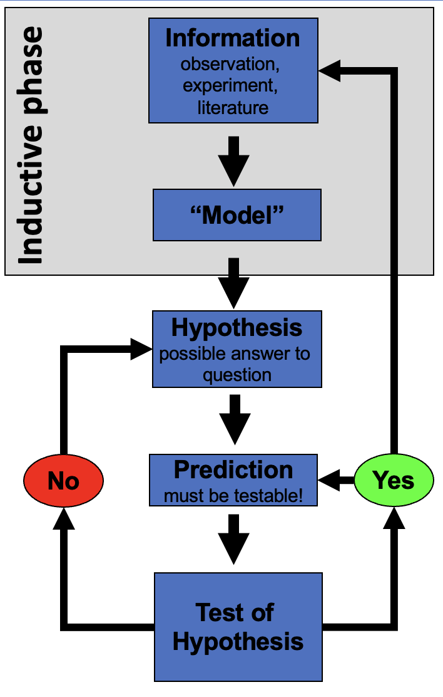
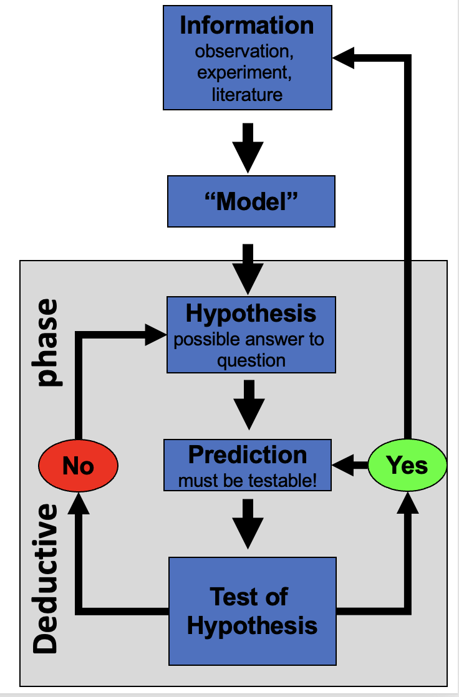

## Welcome to Biostatistics

::::::: columns
:::: {.column width="60%"}
- This course teaches the whole pipeline: **raw data → clean → summarize → visualize → test → report**
- You do **not** need prior coding experience — everyone starts exactly here
- The only way to learn this is to **type the code yourself** and break it

::: callout-important
**Getting stuck is not failing — it is the job.** \
Every working scientist reads error messages and searches for answers every day.
:::
::::

:::: {.column width="40%"}
::: callout-note
**Today's roadmap**

1.  Asking a good question
2.  Organizing a project
3.  Meeting R and Positron
4.  Loading data and your first plot
:::
::::
:::::::

## Part 1 · Asking a Good Question {.divider}

## What makes something science?

:::::: columns
::: {.column width="60%"}
- Science makes **predictions** and tests them with a **falsifiable** approach — statistics
- A claim that could never be shown wrong is not testable, and not science

**Example:**

- *"Needles on the sheltered side of a tree are longer"* — testable ✅
- *"The forest decides needle length"* — not testable ❌
:::

:::: {.column width="40%"}
::: callout-note
**📖 New word**

**Falsifiable** = a prediction that could, in principle, be proven wrong. A good hypothesis is one you could disprove.
:::
::::
::::::

## Two ways of reasoning toward that question

::::::: columns
:::: {.column width="50%"}
**Inductive (specific → general)**

{height="3in"}

You measure needles on a few trees, notice a pattern, and generalize: *"needle length seems to vary with side of tree."*

::: callout-note
**Weakness:** the pattern held in your sample — it is not guaranteed to hold everywhere.
:::
::::

:::: {.column width="50%"}
**Deductive (general → specific)**

{height="3in"}

You start from a general rule — *"exposure affects needle length"* — and predict what a new tree should show, then check.

::: callout-note
**Weakness:** only as strong as the general rule you started from.
:::
::::
:::::::

::: callout-tip
**In practice we do both, back and forth** — notice a pattern (induction), propose a rule, then test it on new data (deduction).
:::

## Our class question

:::::: columns
:::: {.column width="60%"}
Pine needles on the **north/shady** side of a tree vs. the **south/sunny** side:

- **Question:**
- **Prediction:**
- **H₀ (null):**
- **Hₐ (alternate):**

::: callout-note
**📖 New words**

- **Question**: what is your question
- **Precition**: what do you think will happen
- **H₀** — the "nothing is happening" claim
- **Hₐ** — the claim we suspect might be true
- Note: Hₐ does **NOE** say *which* side is longer — that would be a **prediction**, a stronger, riskier claim
:::
::::

::: {.column width="40%"}
{width="2.03in"}
:::
::::::

## Designing a defensible sample

::::::: columns
:::: {.column width="60%"}
- **Can we test this with needles from one tree?**
  - No — that tree could just happen to have short needles.
  - Treating many needles from *one* tree as if they were independent replicates is called **pseudoreplication** (Hurlbert 1984).
- **The tree — not the needle — is the unit of replication.**
  - We need needles from *many* trees, sampled the same way each time.
- **Randomize** which trees and branches you sample, so your own bias doesn't sneak into the data.

::: callout-important
**Dependent vs. independent variables**

- **Independent (X):** side of tree — what we group by
- **Dependent (Y):** needle length — what we measure
:::
::::

:::: {.column width="40%"}
::: callout-tip
**🖐 Today in the field**

Each group collects needles from the shady side **and** the sunny side of the same trees, using one agreed-on method — same height, same "mature needle" definition, same spot on the branch.

We are going to the field to collect pine needles - easy but yes... and then come back, decide how to measure, measure them, enter data in excel
:::
::::
:::::::

## Part 2 · Organizing Your Project {.divider}

## Data is the raw material — treat it that way

::::::: columns
:::: {.column width="60%"}
- Decide your **variable names and units before you collect anything** — this is a **controlled vocabulary**
- Example: `length_mm`, not `Length (mm)` — no spaces, no units hidden in the header text or variable names, all lowercase
- Plan where data goes the moment you collect it — do not let it pile up in email or texts

::: callout-note
**✅ Key idea**

A few minutes of naming discipline today saves hours of confusion in Wrangling Your Data, when we clean messy data.
:::
::::

:::: {.column width="40%"}
::: callout-tip
**Controlled vocabulary example**

| Bad             | Good        |
|-----------------|-------------|
| `Needle Length` | `length_mm` |
| `N/S`           | `n_s`       |
| `Sun Exposure`  | `sun`       |
:::
::::
:::::::

## One folder per project

::::::: columns
:::: {.column width="60%"}
```         
pine_project/
├── data/       ← raw files, never overwritten
├── scripts/    ← your .R code
└── figures/    ← plots you save
```

- Open this folder as your workspace in Positron (**File → Open Folder…**)
- Every file path then becomes **relative**
  - no more `C:/Users/.../Desktop/final_FINAL2.xlsx`
  - now set_wd to set the working directory!!! EVER!!!

::: callout-note
**✅ Key idea**

Keep **raw data untouched**. \
R writes new, processed files — so you can always trace your steps back to the original numbers.
:::
::::

:::: {.column width="40%"}
::: callout-note
**📖 New word**

**Metadata** = data *about* your data: who collected it, when, how, with what instrument. \
Without it, data are nearly useless — even to future-you.
:::
::::
:::::::

::: callout-tip
**🖐 Preview**

Tidy data — one row per observation, one column per variable — is the target we're organizing toward. We'll formalize this in Wrangling Your Data.
:::

## Part 3 · Meet R and Positron {.divider}

## R is the engine, Positron is the dashboard

:::::: columns
::: {.column width="60%"}
- **R** — a free language for data and statistics
- **Positron** — the editor (IDE) you drive it through
- Four panes you'll use constantly:

| Pane              | Where    | What it does              |
|-------------------|----------|---------------------------|
| **Editor**        | top-left | your scripts live here    |
| **Console**       | bottom   | where code actually runs  |
| **Environment**   | right    | everything you've stored  |
| **Plots / Files** | right    | figures and project files |
:::

:::: {.column width="40%"}
::: callout-note
**📖 New word**

**IDE** = Integrated Development Environment. R is the car engine; Positron is the seat, wheel, and dashboard.
:::
::::
::::::

## R as a calculator, and storing values

::::::: columns
:::: {.column width="60%"}
Type math into the **console** and press Enter:

``` r
3 + 5
12 / 7
2 ^ 10
```

To keep a value, give it a name with the **assignment operator** `<-`:

``` r
x <- 7      # store 7 under the name x
x           # read it back
x * 2       # use it in math
```

::: callout-warning
**⚠️ Watch out!**

R is case-sensitive: `x` and `X` are different objects. Use `<-`, not `=`, to assign.
:::
::::

:::: {.column width="40%"}
::: callout-note
**📖 New word**

**Object** = a named container holding a value. Look for it appear in the **Environment** pane the moment you create it.
:::
::::
:::::::

## Names, comments, and functions

::::::: columns
:::: {.column width="60%"}
- Use **`lower_snake_case`**: `needle_length`, not `x2` or `NeedleLength`
- Anything after `#` is a **comment** — a note for humans, ignored by R

``` r
# average of four needle lengths, in mm
needle_length <- c(20, 21, 23, 25)
mean(needle_length)     # a function call
```

A **function** takes **arguments** in `()` and returns a result. Stuck? Ask for help:

``` r
?mean
args(mean)
```

::: callout-tip
**🖐 Try it yourself**

Predict what `round(3.14159, 2)` returns before you run it.
:::
::::

:::: {.column width="40%"}
::: callout-note
**📖 New words**

- **Comment** — ignored by R, read by humans
- **Argument** — an input handed to a function
- **Function** — a named, reusable operation
:::
::::
:::::::

## Vectors, data types, and scripts

::::::: columns
:::: {.column width="60%"}
A **vector** is a row of values made with `c()` — a spreadsheet column is really just a vector:

``` r
length_mm <- c(20, 21, 23, 25)      # numeric
side      <- c("n", "s")            # character — needs quotes
```

The **console forgets**. A **script** (`.R` file) remembers:

- **File → New File → R File**, save it, run lines with Ctrl/Cmd+Enter

::: callout-warning
**⚠️ Watch out!**

Without quotes, `s` means "find an object called s," not the text "s." R will error if no such object exists.
:::
::::

:::: {.column width="40%"}
::: callout-note
**✅ Key idea**

Console = scratch paper. Script = the lab notebook you keep and rerun.
:::
::::
:::::::

## Packages — extending what R can do

::::::: columns
:::: {.column width="60%"}
**Install once**, in the console:

``` r
install.packages("tidyverse")
```

**Load every session**, at the top of every script:

``` r
library(tidyverse)   # wrangling + ggplot2
```

::: callout-warning
**⚠️ Watch out!**

*"could not find function..."* almost always means you forgot the `library()` line for that session.
:::
::::

:::: {.column width="40%"}
::: callout-note
**📖 New words**

- **Package** — the installed toolbox (once)
- **Library** — loading it for today's session (every time)
:::
::::
:::::::

## Part 4 · Load Data and Make Your First Plot {.divider}

## Bring the data in

::::::: columns
:::: {.column width="60%"}
Put the file in `data/`, then:

```{r}
library(tidyverse)

pine_df <- read_csv("data/pine_needles.csv")
```

::: callout-note
**✅ Key idea**

`read_csv()` comes free with `library(tidyverse)`. Your file's first row becomes the **column names** in R.
:::
::::

:::: {.column width="40%"}
::: callout-note
**Our columns**

- `n_s` — `"n"` (north/sheltered) or `"s"` (south/exposed)
- `sun` — `"shady"` or `"sunny"`, same grouping said a different way
- `length_mm` — needle length in millimeters
:::
::::
:::::::

## Look before you trust it

::::::: columns
:::: {.column width="60%"}
```{r}
glimpse(pine_df)
```

```{r}
dim(pine_df)
```

::: callout-tip
**🖐 Notice**

`n_s` and `sun` always travel together — `n` with `shady`, `s` with `sunny`. Two columns encoding the same grouping. Useful redundancy, or something to simplify? We'll revisit this in Wrangling Your Data.
:::
::::

:::: {.column width="40%"}
::: callout-warning
**⚠️ Watch out!**

If a number column shows as `<chr>` in `glimpse()`, a stray letter or comma is hiding in that column.
:::
::::
:::::::

## Your first plot: `ggplot`, built in layers

::::::: columns
:::: {.column width="60%"}
Every `ggplot` needs three things, joined with `+`:

1.  **data** — which data frame
2.  **aes()** — which columns map to x and y
3.  **geom** — how to draw it

```{r}
#| fig-width: 3.2
#| fig-height: 2.2
ggplot(pine_df, aes(x = n_s, y = length_mm)) +
  geom_point()
```

::: callout-warning
**⚠️ Watch out!**

`+` sits at the **end** of a line, never the start.
:::
::::

:::: {.column width="40%"}
::: callout-note
**✅ Key idea**

*Seeing* your data is the single most important habit in this course — before you summarize or test anything, plot it.
:::
::::
:::::::

## One layer at a time

::::::: columns
:::: {.column width="60%"}
```{r}
#| fig-width: 3.2
#| fig-height: 2.2
ggplot(pine_df, aes(x = sun, y = length_mm)) +
  geom_boxplot() +
  geom_jitter(width = 0.15, alpha = 0.6, color = "tomato") +
  labs(x = "Sun exposure",
       y = "Needle length (mm)",
       title = "Needle length by sun exposure")
```

::: callout-tip
**🖐 Try it yourself**

Swap `sun` for `group`. What does that plot tell you instead?
:::
::::

:::: {.column width="40%"}
::: callout-note
**✅ Key idea**

A boxplot shows the summary; the jittered points show every real value underneath it. Show both when you can.
:::
::::
:::::::

## Save your plot

::::::: columns
:::: {.column width="60%"}
```{r}
#| eval: false
needle_plot <- ggplot(pine_df, aes(x = sun, y = length_mm)) +
  geom_boxplot() +
  geom_jitter(width = 0.15, alpha = 0.6, color = "tomato") +
  labs(x = "Sun exposure", y = "Needle length (mm)")

ggsave("figures/needle_length.png",
       plot = needle_plot,
       width = 3, height = 3, units = "in", dpi = 300)
```

::: callout-warning
**⚠️ Watch out!**

`ggsave()` wants the **filename first**, then `plot =`. Always use `dpi = 300` — print/poster quality.
:::
::::

:::: {.column width="40%"}
::: callout-note
**📖 File format tip**

Save figures as **PNG** for reports and submissions.
:::
::::
:::::::

## Wrap-up

::::::: columns
:::: {.column width="60%"}
Today you:

- Turned a question into a testable **H₀ / Hₐ**
- Organized a project folder with **data/scripts/figures**
- Ran your first R code — objects, functions, vectors, packages
- Loaded real data and made — and saved — your **first `ggplot`**

::: callout-tip
**🖐 Before next class**

Finish the worksheet: load `pine_needles.csv`, run `glimpse()`, and make one more plot — `length_mm` by `n_s` this time. Save it to `figures/`.
:::
::::

:::: {.column width="40%"}
::: callout-note
**Up next — Wrangling Your Data**

- `filter()`, `select()`, `mutate()`, `arrange()`
- Cleaning a genuinely messy version of this dataset
- The pipe `|>` and building a pipeline
:::
::::
:::::::

## Getting unstuck

When code breaks — and it will, that is normal:

1.  Read the **error message** out loud; it usually names the line
2.  Check the usual suspects: `library(tidyverse)` loaded? Spelling? A missing `)` or `+` at the *start* of a line?
3.  `?function_name` opens the help page
4.  Bring the **exact error** (copy-paste it) to class or office hours

::: callout-note
**✅ Key idea**

Every working scientist googles error messages daily. Getting stuck is not failing — it is the job.
:::
