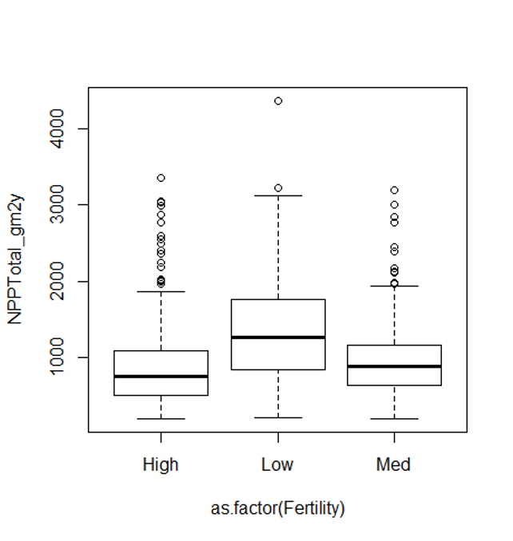

---
metadata-files:
  - ../../_templates/_lectures.yml
title: "Lecture: Multiple Regression"
subtitle: "Several predictors"
description: "The multiple regression model, partial regression slopes, ANOVA and hypothesis tests for regression, assumptions and diagnostics, collinearity, interactions, dummy variables, model comparison, and predictor importance — on the Gotelli ant-diversity dataset."
categories: [Regression]
order: 11
week: 7
author: "Bill Perry"

format:
  html:
    downloads: [docx, pptx]  # This creates download links for all three
  revealjs:
    output-ext: "slides.html"
  docx:
    reference-doc: ../../ms_templates/custom-reference-compact.docx
    fig-width: 3
    fig-height: 3
    fig-dpi: 300
    dpi: 300            # tell Pandoc the real render dpi so it sizes figures correctly
  pptx: default
execute:
  echo: true
---

```{r}
#| include: false
#| message: false
#| warning: false
# install.packages("relaimpo")
library(relaimpo)
library(plotly)
library(knitr)
library(patchwork)
library(grid)
library(gridExtra)
library(car)
library(boot)
library(tidyverse)

# To simulate the lion data in example 17.1
lion_data <- tibble(
  proportion_black = c(0.21, 0.14, 0.11, 0.13, 0.12, 0.13, 0.12, 0.18, 0.23, 0.22,
                      0.20, 0.17, 0.15, 0.27, 0.26, 0.21, 0.30, 0.42, 0.43, 0.59,
                      0.60, 0.72, 0.29, 0.10, 0.48, 0.44, 0.34, 0.37, 0.34, 0.74, 0.79, 0.5),
  age_years = c(1.1, 1.5, 1.9, 2.2, 2.6, 3.2, 3.2, 2.9, 2.4, 2.1,
               1.9, 1.9, 1.9, 1.9, 2.8, 3.6, 4.3, 3.8, 4.2, 5.4,
               5.8, 6.0, 3.4, 4.0, 7.3, 7.3, 7.8, 7.1, 7.1, 13.1, 8.8, 5.4))

set.seed(123)
fish_data <- tibble(
  length_mm = runif(40, 180, 320),
  mass_g = 0.00001 * length_mm^3 * runif(40, 0.9, 1.1)
)
fish_data$lake <- factor(rep(c("Lake A", "Lake B"), each = 20))

ant_df <- read_csv("data/ant_sp_diversity_gotelli.csv")
```

## Where We Left Off

::::::: columns
:::: {.column width="60%"}
Covered last time:

- Regression, t-tests, and ANOVA
- Regression assumptions
- Sum-of-squares allocation and subdivision from total sums of squares

::: callout-note
**✅ Key idea from last lecture**

A simple regression has one predictor and one partition of variance (regression vs. residual). Today we add more predictors — the logic barely changes, but the bookkeeping does.
:::
::::

:::: {.column width="40%"}
```{r}
#| echo: false
#| fig-height: 3.4
#| fig-width: 3.4
#| message: false
#| warning: false
#| fig-alt: "Scatterplot of lion age versus proportion of black in the nose, with a fitted regression line. Green segments show the deviation of each fitted value from the overall mean (explained variation) and red segments show the deviation of each observed point from its fitted value (residual variation), illustrating how total variation is partitioned in regression."
model <- lm(age_years ~ proportion_black, data = lion_data)
lion_data <- lion_data %>%
  mutate(predicted = predict(model))

y_mean <- mean(lion_data$age_years)
highest_point <- lion_data %>% slice_max(age_years, n = 1)
offset <- 0.003

ggplot(lion_data, aes(proportion_black, age_years)) +
  geom_segment(aes(x = proportion_black - offset, xend = proportion_black - offset,
                   y = predicted, yend = y_mean),
               color = "green", alpha = 0.6) +
  geom_segment(aes(x = proportion_black + offset, xend = proportion_black + offset,
                   y = age_years, yend = predicted),
               color = "red", alpha = 0.6) +
  geom_hline(yintercept = y_mean, color = "lightblue",
             linetype = "dotted", linewidth = 1) +
  geom_smooth(method = "lm", se = FALSE) +
  geom_point() +
  labs(x = "Prop. Black", y = "Age yrs") +
  annotate("segment",
           x = highest_point$proportion_black + 0.01,
           xend = highest_point$proportion_black + 0.01,
           y = highest_point$age_years,
           yend = y_mean,
           color = "black") +
  geom_point(aes(y = predicted), color = "blue", size = 2) +
  geom_point(aes(y = y_mean), color = "lightblue", size = 2) +
  theme_minimal(base_size = 9)
```
::::
:::::::

## Part 1 · Why Multiple Regression? {.divider}

## Today's Objectives

::::::: columns
:::: {.column width="60%"}
The multiple linear regression model:

- Regression parameters
- Analysis of variance
- Null hypotheses
- Explained variance
- Assumptions and diagnostics
- Collinearity
- Interactions
- Dummy variables
- Model selection
- Importance of predictors
::::

:::: {.column width="40%"}
::: callout-note
**📖 Reference**

Whitlock & Schluter, Ch. 17 — Regression, and Gotelli & Ellison, *A Primer of Ecological Statistics*, Ch. 9 — Regression, are the core references for this lecture.
:::
::::
:::::::

## When Do We Need More Than One Predictor?

::::::: columns
:::: {.column width="60%"}
What if there's more than one predictor (X) variable?

- If predictors are continuous
- A mix between categorical and continuous
- We can use multiple linear regression
::::

:::: {.column width="40%"}
|  | Continuous X | Categorical X |
|:---|:---|:---|
| **Continuous Y** | Regression | ANOVA |
| **Categorical Y** | Logistic regression |  |
::::
:::::::

## From a Line to a (Hyper)plane

::::::: columns
:::: {.column width="40%"}
Abundance of ants can be modeled as a function of:

- latitude
- longitude
- both

Instead of a line, it's modeled with a (hyper)plane.
::::

:::: {.column width="60%"}
```{r}
#| echo: false
#| message: false
#| warning: false
#| paged-print: false
#| fig-alt: "Visualization of the fitted regression plane for ant species richness modeled from elevation and latitude: an interactive 3D scatterplot with a fitted mesh surface in HTML output, or a 2D heat map with contour lines and observed points sized by ant species count in docx/pptx output. Ant species richness declines with increasing elevation and increasing latitude."
model <- lm(ant_spp ~ elevation + latitude, data = ant_df)

elevation_range <- seq(min(ant_df$elevation), max(ant_df$elevation), length.out = 30)
latitude_range <- seq(min(ant_df$latitude), max(ant_df$latitude), length.out = 30)
grid <- expand.grid(elevation = elevation_range, latitude = latitude_range)
grid$ant_spp <- predict(model, newdata = grid)

if (knitr::is_html_output()) {
  # Interactive 3D view (revealjs / html)
  ant_plot <- plot_ly() %>%
    add_trace(
      data = ant_df,
      x = ~elevation,
      y = ~latitude,
      z = ~ant_spp,
      type = "scatter3d",
      mode = "markers",
      marker = list(size = 5, color = "red"),
      name = "Observed"
    ) %>%
    add_trace(
      data = grid,
      x = ~elevation,
      y = ~latitude,
      z = ~ant_spp,
      type = "mesh3d",
      opacity = 0.5,
      name = "Fitted Plane"
    ) %>%
    layout(
      scene = list(
        xaxis = list(title = "Elevation"),
        yaxis = list(title = "Latitude"),
        zaxis = list(title = "Ant Species")
      ),
      title = "Ant Species Diversity by Elevation and Latitude"
    )
  ant_plot
} else {
  # Static 2D fallback for docx/pptx: same fitted plane, shown as a contour
  ant_plot <- ggplot() +
    geom_tile(data = grid, aes(x = elevation, y = latitude, fill = ant_spp)) +
    geom_contour(data = grid, aes(x = elevation, y = latitude, z = ant_spp), color = "white", alpha = 0.5) +
    geom_point(data = ant_df, aes(x = elevation, y = latitude, size = ant_spp), color = "red") +
    scale_fill_viridis_c(name = "Fitted\nant spp") +
    labs(title = "Ant Species: Fitted Plane (2D View)",
         x = "Elevation", y = "Latitude", size = "Observed") +
    theme_minimal(base_size = 8)
  ant_plot
}
```
::::
:::::::

## What Multiple Regression Is Used For

::::::: columns
:::: {.column width="40%"}
Used in a similar way to simple linear regression:

- Describe the nature of the relationship between Y and the X's
- Determine explained/unexplained variation in Y
- Predict new Ys from X
- Find the "best" model
::::

:::: {.column width="60%"}
```{r}
#| echo: false
#| message: false
#| warning: false
#| paged-print: false
#| fig-alt: "Same fitted-plane visualization of ant species richness by elevation and latitude shown above, repeated here to illustrate what multiple regression is used for."
ant_plot
```
::::
:::::::

## The Challenges of Multiple Regression

::::::: columns
:::: {.column width="60%"}
Crawley (2012): "Multiple regression models provide some of the most profound challenges faced by the analyst":

- Overfitting
- Parameter proliferation
- Multicollinearity
- Model selection
::::

:::: {.column width="40%"}
{width="2.89in"}
::::
:::::::

## Part 2 · The Multiple Regression Model {.divider}

## The Multiple Regression Model

::::::: columns
:::: {.column width="60%"}
- A set of i = 1 to n observations
- Fixed X-values for p predictor variables (X₁, X₂ … Xₚ)
- Random Y-values:

$$y_i = \beta_0 + \beta_1 x_{i1} + \beta_2 x_{i2} + ... + \beta_p x_{ip} + \epsilon_i$$
::::

:::: {.column width="40%"}
- yᵢ: value of Y for the i-th observation, X₁ = x_i1, X₂ = x_i2, …, Xₚ = x_ip
- β₀: population intercept — the mean value of Y when X₁ = 0, X₂ = 0, …, Xₚ = 0
::::
:::::::

## Partial Regression Slopes

::::::: columns
:::: {.column width="60%"}
$$y_i = \beta_0 + \beta_1 x_{i1} + \beta_2 x_{i2} + ... + \beta_p x_{ip} + \epsilon_i$$

- β₁: partial regression slope — change in Y per unit change in X₁, holding other X-vars constant
- β₂: partial regression slope for X₂, holding others constant
- βₚ: partial regression slope for Xₚ, holding others constant
::::

:::: {.column width="40%"}
::: callout-note
**✅ Key idea — what "partial" means**

The relationship between a predictor and the response **while holding all other predictors constant**. It tells you the isolated effect of one variable, controlling for the influence of others.
:::
::::
:::::::

## Partial Regression Slopes — the Ant Model

::::::: columns
:::: {.column width="60%"}
Model: `ant_spp ~ elevation + latitude`

- The partial slope for elevation tells you how ant species richness changes with elevation when latitude is held constant
  - 1-m increase in elevation → ant spp decrease by 0.012 spp, holding latitude constant
  - Or: 100-m increase in elevation → lose 1.2 spp
- The partial slope for latitude tells you how ant species richness changes with latitude when elevation is held constant
  - 1-degree increase in latitude → ant spp decrease by 2 species, holding elevation constant
  - Moving north = fewer ant spp, even comparing sites at the same elevation
::::

:::: {.column width="40%"}
```{r}
#| fig-height: 3.4
#| fig-width: 3.4
model <- lm(ant_spp ~ elevation + latitude, data = ant_df)
summary(model)
```
::::
:::::::

## Regression Parameters — the Error Term

::::::: columns
:::: {.column width="60%"}
$$y_i = \beta_0 + \beta_1 x_{i1} + \beta_2 x_{i2} + ... + \beta_p x_{ip} + \epsilon_i$$

- εᵢ: unexplained error — the difference between yᵢ and the value predicted by the model (ŷᵢ)
- ant_spp = β₀ + β₁(lat) + β₂(elevation) + εᵢ
::::

:::: {.column width="40%"}
::: callout-tip
**🖐 Notice**

This is exactly the same "signal vs. noise" structure as a simple regression — just with more terms on the signal side.
:::
::::
:::::::

## Regression Parameters — Estimation

::::::: columns
:::: {.column width="60%"}
$$y_i = \beta_0 + \beta_1 x_{i1} + \beta_2 x_{i2} + ... + \beta_p x_{ip} + \epsilon_i$$

- Estimate multiple regression parameters (intercept, partial slopes) using OLS to fit the regression line
- OLS minimizes $\sum(y_i - \hat{y}_i)^2$, the SS (vertical distance) between observed yᵢ and predicted ŷᵢ for each xᵢⱼ
- ε estimated as residuals: εᵢ = yᵢ − ŷᵢ
- Calculation solves a set of simultaneous normal equations with matrix algebra
::::

:::: {.column width="40%"}
::: callout-note
**✅ Key idea**

You'll never do this matrix algebra by hand — R's `lm()` does it instantly. What matters is knowing *what* it's minimizing.
:::
::::
:::::::

## Regression Parameters — Prediction

::::::: columns
:::: {.column width="60%"}
The regression equation can be used for prediction by substituting new values for the predictor (X) variables.

- Confidence intervals are calculated for parameters
- Confidence and prediction intervals depend on the number of observations and predictors
  - More observations decrease interval width
  - More predictors increase interval width
- Predictions should be restricted to within the range of the X variables
::::

:::: {.column width="40%"}
::: callout-warning
**⚠️ Watch out!**

Extrapolating a multiple regression beyond the observed range of *any* predictor is riskier than in simple regression — the fitted (hyper)plane has no guarantee of being right outside the data cloud.
:::
::::
:::::::

## Part 3 · ANOVA for Multiple Regression {.divider}

## Partitioning Variance — Sums of Squares

::::::: columns
:::: {.column width="60%"}
Variance — $SS_{total}$ is partitioned into $SS_{regression}$ and $SS_{residual}$.

- $SS_{regression}$ is the variance in Y explained by the model
- $SS_{residual}$ is the variance not explained by the model
::::

:::: {.column width="40%"}
| Source | SS | df |
|:---|:---|:---|
| Regression | $\sum (y_i - \bar{y})^2$ | $p$ |
| Residual | $\sum (y_i - \hat{y}_i)^2$ | $n-p-1$ |
| Total | $\sum (y_i - \bar{y})^2$ | $n-1$ |
::::
:::::::

## From Sums of Squares to Mean Squares

::::::: columns
:::: {.column width="60%"}
SS converted to (non-additive) MS = SS/df:

- $MS_{residual}$: estimates population variance
- $MS_{regression}$: estimates population variance + variation due to the strength of the X-Y relationships
- MS is an estimate of variance that doesn't increase with sample size the way SS does
::::

:::: {.column width="40%"}
| Source | SS | df | MS |
|:---|:---|:---|:---|
| Regression | $\sum (y_i - \bar{y})^2$ | $p$ | SS/df |
| Residual | $\sum (y_i - \hat{y}_i)^2$ | $n-p-1$ | SS/df |
| Total | $\sum (y_i - \bar{y})^2$ | $n-1$ |  |
::::
:::::::

## Hypotheses — the "Basic" Test

::::::: columns
:::: {.column width="60%"}
Two null hypotheses are usually tested in MLR. The "basic" H₀: all partial regression slopes equal 0; β₁ = β₂ = … = βₚ = 0.

- If the "basic" H₀ is true, $MS_{regression}$ and $MS_{residual}$ estimate the same variance, and their ratio (F-ratio) ≈ 1
- If the "basic" H₀ is false (at least one β ≠ 0), $MS_{regression}$ estimates variance + partial regression slope effects, and the F-ratio will be > 1 — compared to the F-distribution for a p-value
::::

:::: {.column width="40%"}
::: callout-note
**📖 Reference**

Gotelli & Ellison, Ch. 9, covers this F-test framework for multiple regression in detail.
:::
::::
:::::::

## Hypotheses — Testing One Specific β

::::::: columns
:::: {.column width="60%"}
Also: is any *specific* β = 0 (explanatory role)?

- E.g., does latitude have an effect on ant species?
- These H's are tested through model comparison
- **Model 1** — with 2 predictors X₁, X₂: $y_i = \beta_0 + \beta_1 x_{i1} + \beta_2 x_{i2} + \epsilon_i$
- **Model 2** — to test H₀ that β₂ = 0, compare the fit of Model 1 to Model 2 with 1 predictor: $y_i = \beta_0 + \beta_1 x_{i1} + \epsilon_i$
::::

:::: {.column width="40%"}
::: callout-tip
**🖐 Notice**

This is a preview of the model-comparison approach we'll use throughout this lecture — fit two nested models and compare their fit.
:::
::::
:::::::

## Hypotheses — the Partial F-Test

::::::: columns
:::: {.column width="60%"}
- If $SS_{regression}$ of model 1 = model 2, we cannot reject H₀: β₁ = 0 — adding X₂ did not explain any additional variance
- If $SS_{regression}$ of model 1 > model 2, there's evidence to reject H₀: β₂ = 0 — adding X₂ explains more variance
- SS for β₂ is $SS_{extra,\beta_2}$ = Full $SS_{regression}$ − Reduced $SS_{regression}$ — this quantifies how much additional variance X₂ explains
- Use a partial F-test to test H₀: β₂ = 0:

$$F_{1,n-p} = \frac{MS_{Extra}}{Full\ MS_{Residual}}$$
::::

:::: {.column width="40%"}
::: callout-tip
**🖐 Notice**

R also gives you a t-test for each coefficient that answers exactly this same question — you rarely need to run the partial F-test by hand.
:::
::::
:::::::

## Explained Variance

::::::: columns
:::: {.column width="60%"}
Explained variance (r²) is calculated the same way as for simple regression:

$$r^2 = \frac{SS_{Regression}}{SS_{Total}} = 1 - \frac{SS_{Residual}}{SS_{Total}}$$
::::

:::: {.column width="40%"}
::: callout-warning
**⚠️ Watch out!**

- r² values cannot be used to directly compare models with different numbers of predictors
- r² values will always increase as predictors are added, even useless ones
- r² values with different transformations of Y are not comparable
:::
::::
:::::::

## Part 4 · Assumptions and Diagnostics {.divider}

## Assumptions and Diagnostics — Outliers

::::::: columns
:::: {.column width="60%"}
- Assume fixed X's — unrealistic in most biological settings, but a working assumption
- No major (influential) outliers
- Check leverage and influence with Cook's Dᵢ
::::

:::: {.column width="40%"}
```{r}
#| fig-height: 3.2
#| fig-width: 3.4
#| fig-alt: "Cook's distance plot showing each observation's influence on the ant species richness regression model, as vertical bars from zero, used to identify potentially influential outliers."
plot(model, which = 4)
```
::::
:::::::

## Assumptions and Diagnostics — Residuals

::::::: columns
:::: {.column width="60%"}
- Normality, equal variance, independence
- Residual QQ-plots, residuals-vs-predicted-values plot
- Distribution/variance issues are often corrected by transforming Y
::::

:::: {.column width="40%"}
```{r}
#| echo: false
#| fig-width: 3.4
#| fig-height: 3.2
#| fig-alt: "Two stacked diagnostic plots for the ant species richness regression model: a residuals-versus-fitted-values plot for checking equal variance, and a normal Q-Q plot of residuals for checking normality."
par(mfrow = c(2, 1), mar = c(4, 4, 2, 1))
plot(model, which = 1)
plot(model, which = 2)
par(mfrow = c(1, 1))
```
::::
:::::::

## Assumptions and Diagnostics — Sample Size and Collinearity

::::::: columns
:::: {.column width="60%"}
- **More observations than predictor variables** — ideally at least **10× observations than predictors**, to avoid "overfitting." 2 predictors = 20 observations, minimum!
- **No collinearity** — need uncorrelated predictor variables (assessed using a scatterplot matrix and VIFs)
- **Each X has a linear relationship with Y after accounting for other predictors** — checked with Added Variable (AV) plots, also called partial regression plots
::::

:::: {.column width="40%"}
::: callout-tip
**📖 AV plots in R**

- All predictors: `avPlots(model)`
- One predictor: `avPlot(model, variable = "proportion_black")`

AV plots show the relationship between Y and X₁ after removing the linear effects of all other predictors.
:::
::::
:::::::

## Why Not Just Regress Y on Each X Separately?

::::::: columns
:::: {.column width="40%"}
Regressing Y vs. each X separately does not consider the effect of other predictors — but we want to know the shape of the relationship while holding other predictors constant.
::::

:::: {.column width="60%"}
```{r}
#| echo: false
#| message: false
#| warning: false
#| paged-print: false
#| fig-width: 3.6
#| fig-height: 3.6
#| fig-alt: "Two stacked scatterplots with fitted regression lines and confidence bands: ant species richness versus elevation (top, negative relationship) and ant species richness versus latitude (bottom, negative relationship), each fit separately without controlling for the other predictor."
p1 <- ggplot(ant_df, aes(x = elevation, y = ant_spp)) +
  geom_point(size = 3, color = "darkblue") +
  geom_smooth(method = "lm", se = TRUE, color = "red") +
  labs(x = "Elevation (m)", y = "Ant Species Richness") +
  theme_minimal(base_size = 8)

p2 <- ggplot(ant_df, aes(x = latitude, y = ant_spp)) +
  geom_point(size = 3, color = "darkblue") +
  geom_smooth(method = "lm", se = TRUE, color = "red") +
  labs(x = "Latitude (degrees)", y = "Ant Species Richness") +
  theme_minimal(base_size = 8)

p1 / p2
```
::::
:::::::

## Part 5 · Collinearity {.divider}

## Collinearity — the Problem

::::::: columns
:::: {.column width="60%"}
- Potential predictor variables are often correlated (e.g., morphometrics, nutrients, climatic parameters)
- Multicollinearity (strong correlation between predictors) causes problems for parameter estimates
- Severe collinearity causes unstable parameter estimates — a small change in a single value can result in large changes in βₚ estimates
- Inflates partial-slope error estimates, and causes a loss of power
::::

:::: {.column width="40%"}
```{r}
#| echo: false
#| message: false
#| warning: false
#| paged-print: false
cor_matrix <- cor(ant_df[, c("elevation", "latitude", "ant_spp")])
print(cor_matrix)
```
::::
:::::::

## Collinearity — Detecting It

::::::: columns
:::: {.column width="60%"}
Collinearity can be detected by:

- **Variance Inflation Factors (VIF)**: $VIF_{X_j} = 1/(1-r^2)$; VIF > 10 = bad
- Best/simplest solution: exclude variables that are highly correlated with other variables — they're probably measuring similar things and are redundant
::::

:::: {.column width="40%"}
::: callout-note
**✅ Key idea**

A high VIF doesn't mean your model is "wrong" — it means you can't trust the *individual* partial slopes for the correlated predictors, even if the overall model fits well.
:::
::::
:::::::

## Part 6 · Interactions {.divider}

## Interactions — Additive vs. Multiplicative

::::::: columns
:::: {.column width="60%"}
Predictors can be modeled as:

- [additive]{.underline} (effect of temp, plus precip, plus fertility), or
- [multiplicative (interactive)]{.underline}
- **Interaction:** the effect of Xᵢ depends on the level of Xⱼ
- The partial slope of Y vs. X₁ is different for different levels of X₂ (and vice versa) — measured by β₃

$$y_i = \beta_0 + \beta_1X_{i1} + \beta_2X_{i2} + \epsilon_i \quad \text{vs.} \quad y_i = \beta_0 + \beta_1X_{i1} + \beta_2X_{i2} + \beta_3X_{i1}X_{i2} + \epsilon_i$$

This leads to "curvature" of the regression (hyper)plane.
::::

:::: {.column width="40%"}
::: callout-tip
**🖐 Notice**

An interaction term is just another predictor: the product $X_1 \times X_2$, fit with its own coefficient β₃.
:::
::::
:::::::

## Interactions — Curvature of the Regression Plane

::::::: columns
:::: {.column width="30%"}
Interaction terms lead to "curvature" of the regression (hyper)plane.
::::

:::: {.column width="70%"}
```{r}
#| echo: false
#| message: false
#| warning: false
#| paged-print: false
#| fig-alt: "Visualization of the ant species richness model that includes an elevation-by-latitude interaction: an interactive 3D scatterplot with a curved fitted surface in HTML output, or a 2D heat map with contour lines and observed points sized by ant species count in docx/pptx output, showing that the fitted surface is curved rather than a flat plane."
model_interaction_int <- lm(ant_spp ~ elevation * latitude, data = ant_df)

elevation_range_int <- seq(min(ant_df$elevation), max(ant_df$elevation), length.out = 30)
latitude_range_int <- seq(min(ant_df$latitude), max(ant_df$latitude), length.out = 30)
grid_int <- expand.grid(elevation = elevation_range, latitude = latitude_range)
grid_int$ant_spp <- predict(model_interaction_int, newdata = grid_int)

z_matrix_int <- matrix(grid_int$ant_spp, nrow = 30, ncol = 30)

if (knitr::is_html_output()) {
  ant_int_plot <- plot_ly() %>%
    add_trace(
      data = ant_df,
      x = ~elevation,
      y = ~latitude,
      z = ~ant_spp,
      type = "scatter3d",
      mode = "markers",
      marker = list(size = 5, color = "red"),
      name = "Observed"
    ) %>%
    add_surface(
      x = elevation_range_int,
      y = latitude_range_int,
      z = z_matrix_int,
      opacity = 0.7,
      colorscale = "Viridis",
      name = "Interaction Model"
    ) %>%
    layout(
      scene = list(
        xaxis = list(title = "Elevation"),
        yaxis = list(title = "Latitude"),
        zaxis = list(title = "Ant Species")
      ),
      title = "Ant Species: Interaction Model (Curved Surface)"
    )
  ant_int_plot
} else {
  # Static 2D fallback for docx/pptx: same fitted (curved) surface, shown as a contour
  ant_int_plot <- ggplot() +
    geom_tile(data = grid_int, aes(x = elevation, y = latitude, fill = ant_spp)) +
    geom_contour(data = grid_int, aes(x = elevation, y = latitude, z = ant_spp), color = "white", alpha = 0.5) +
    geom_point(data = ant_df, aes(x = elevation, y = latitude, size = ant_spp), color = "red") +
    scale_fill_viridis_c(name = "Fitted\nant spp") +
    labs(title = "Ant Species: Interaction Model (2D View)",
         x = "Elevation", y = "Latitude", size = "Observed") +
    theme_minimal(base_size = 8)
  ant_int_plot
}
```
::::
:::::::

## Interactions — the Cost

::::::: columns
:::: {.column width="60%"}
Adding interactions:

- Means many more predictors ("parameter proliferation") — 2ⁿ terms are required; 6 parameters = 64 terms, 7 parameters = 128 terms
- Makes interpretation more complex
- **When to include interactions? When they make biological sense!**
::::

:::: {.column width="40%"}
::: callout-warning
**⚠️ Watch out!**

Don't add interaction terms just to see if they're significant — with enough predictors, some interaction will hit p < 0.05 by chance alone.
:::
::::
:::::::

## Part 7 · Dummy Variables {.divider}

## Dummy Variables

::::::: columns
:::: {.column width="60%"}
Multiple linear regression accommodates continuous and categorical variables (gender, vegetation type, etc.). Categorical vars become "dummy vars": number of dummy variables = number of categories − 1.

- **Sex M/F:** need 1 dummy var with two values (0, 1)
- **Fertility L/M/H:** need 2 dummy vars, each with two values (0, 1): fert1 (0 if L or H, 1 if M), fert2 (1 if H, 0 if L or M)
::::

:::: {.column width="40%"}
| Fertility | fert1 | fert2 |
|:---|:---|:---|
| Low | 0 | 0 |
| Med | 1 | 0 |
| High | 0 | 1 |
::::
:::::::

## Dummy Variables — the Reference Condition

::::::: columns
:::: {.column width="60%"}
Coefficients are interpreted relative to a reference condition:

- R codes dummy variables automatically
- It picks the "reference" level alphabetically
- Dummy variables with more than 2 levels add extra predictor variables to the model
::::

:::: {.column width="40%"}
| Fertility | fert1 | fert2 |
|:---|:---|:---|
| Low | 0 | 0 |
| Med | 1 | 0 |
| High | 0 | 1 |
::::
:::::::

## Dummy Variables — Worked Example

::::::: columns
:::: {.column width="60%"}
{width="3.12in"}
::::

:::: {.column width="40%"}
{width="2.60in"}
::::
:::::::

## Part 8 · Comparing Models {.divider}

## Comparing Models — the Problem

::::::: columns
:::: {.column width="60%"}
When you have multiple predictors (and interactions!):

- How do you choose the "best" model?
- Which predictors should you include?
- **Occam's razor:** the "best" model balances complexity with fit to the data
- To choose: compare "nested" models
- **Overfitting:** getting a high r² just by having more (useless) predictors — so r² alone is not a good way to choose between nested models
::::

:::: {.column width="40%"}
::: callout-note
**📖 Reference**

Whitlock & Schluter, Ch. 17, covers model comparison and selection for regression.
:::
::::
:::::::

## Comparing Models — Penalizing Complexity

::::::: columns
:::: {.column width="60%"}
Need to account for the increase in fit that comes just from added predictors:

- Adjusted r²
- Akaike's Information Criterion (AIC)
- Both "penalize" models for extra predictors
- Higher adjusted r² and lower AIC are better when comparing models (p = predictors, n = sample size)
::::

:::: {.column width="40%"}
$$\text{Adjusted } r^2 = 1 - \frac{SS_{Residual}/(n - (p + 1))}{SS_{Total}/(n - 1)}$$
$$\text{AIC} = n[\ln(SS_{Residual})] + 2(p + 1) - n\ln(n)$$
::::
:::::::

## Comparing Models — How to Search

::::::: columns
:::: {.column width="60%"}
- Can fit all possible models, then compare AICs or adjusted r² — tedious with lots of predictors
- Automated forward (and backward) stepwise procedures: start with no terms (or all terms), add (remove) the term with the largest (smallest) partial F statistic
- We will use a manual form of backward selection
::::

:::: {.column width="40%"}
::: callout-tip
**🖐 Notice**

Automated stepwise selection is convenient but controversial — it can overfit and doesn't know which predictors make biological sense. Manual, hypothesis-driven selection is usually better for a small model.
:::
::::
:::::::

## Comparing Models — the Full Model

```{r}
#| echo: false
#| message: false
#| warning: false
#| paged-print: false
full_model <- lm(ant_spp ~ elevation + latitude, data = ant_df)
elevation_only <- lm(ant_spp ~ elevation, data = ant_df)
latitude_only <- lm(ant_spp ~ latitude, data = ant_df)

cat("\n========== FULL MODEL (Both Variables) ==========\n")
summary(full_model)
```

## Comparing Models — Elevation Only

```{r}
#| echo: false
#| message: false
#| warning: false
#| paged-print: false
cat("\n========== ELEVATION ONLY MODEL ==========\n")
summary(elevation_only)
```

## Comparing Models — Latitude Only

```{r}
#| echo: false
#| message: false
#| warning: false
#| paged-print: false
cat("\n========== LATITUDE ONLY MODEL ==========\n")
summary(latitude_only)
```

## Comparing Models — Putting It Together

```{r}
#| echo: false
#| message: false
#| warning: false
#| paged-print: false
cat("\n========== MODEL COMPARISON TABLE ==========\n")

full_adj_r2 <- summary(full_model)$adj.r.squared
elev_adj_r2 <- summary(elevation_only)$adj.r.squared
lat_adj_r2 <- summary(latitude_only)$adj.r.squared

full_aic <- AIC(full_model)
elev_aic <- AIC(elevation_only)
lat_aic <- AIC(latitude_only)

comparison <- data.frame(
  Model = c("Both Variables",
            "Elevation Only",
            "Latitude Only"),
  Adjusted_R2 = c(full_adj_r2, elev_adj_r2, lat_adj_r2),
  AIC = c(full_aic, elev_aic, lat_aic),
  R2_vs_Full = c(0, elev_adj_r2 - full_adj_r2, lat_adj_r2 - full_adj_r2),
  AIC_vs_Full = c(0, elev_aic - full_aic, lat_aic - full_aic)
)
print(comparison)

cat("\n========== KEY FINDINGS ==========\n")
cat(sprintf("Full Model AIC: %.2f (Adjusted R^2: %.4f)\n", full_aic, full_adj_r2))
cat(sprintf("Elevation Only AIC: %.2f (Adjusted R^2: %.4f)\n", elev_aic, elev_adj_r2))
cat(sprintf("Latitude Only AIC: %.2f (Adjusted R^2: %.4f)\n", lat_aic, lat_adj_r2))

cat("\n--- Differences from Full Model ---\n")
cat(sprintf("Removing latitude: AIC increases by %.2f, Adj R^2 decreases by %.4f\n",
            elev_aic - full_aic, elev_adj_r2 - full_adj_r2))
cat(sprintf("Removing elevation: AIC increases by %.2f, Adj R^2 decreases by %.4f\n",
            lat_aic - full_aic, lat_adj_r2 - full_adj_r2))

cat("\n========== CONCLUSION ==========\n")
cat("Full model has LOWEST AIC (best fit)\n")
cat("Full model has HIGHEST Adjusted R^2 (explains most variance)\n")
cat("Removing either variable worsens model performance\n")
cat("\nBoth elevation and latitude are important predictors of ant species diversity!\n")
```

## Part 9 · Relative Importance of Predictors {.divider}

## How Important Is Each Predictor?

::::::: columns
:::: {.column width="60%"}
Usually we want to know the relative importance of predictors in explaining Y. Three general approaches:

- Using F-tests (or t-tests) on partial regression slopes
- Using the coefficient of partial determination
- Using standardized partial regression slopes
::::

:::: {.column width="40%"}
::: callout-note
**✅ Key idea**

None of these three approaches is "the" right answer — each answers a slightly different question about importance.
:::
::::
:::::::

## Approach 1 — F-Tests on Partial Slopes

::::::: columns
:::: {.column width="60%"}
Using F-tests (or t-tests) on partial regression slopes:

- Conduct F-tests of H₀ that each partial regression slope = 0
- If you cannot reject H₀, discard the predictor
- Can get additional clues from the relative size of F-values
- Does **not** tell us the absolute importance of a predictor — you usually cannot directly compare slope parameters
::::

:::: {.column width="40%"}
::: callout-warning
**⚠️ Watch out!**

A bigger F-value doesn't automatically mean a "more important" predictor if the predictors are on very different scales.
:::
::::
:::::::

## Approach 2 — Coefficient of Partial Determination

::::::: columns
:::: {.column width="60%"}
The reduction in variation of Y due to adding predictor Xⱼ:

$$r_{X_j}^2 = \frac{SS_{Extra}}{Reduced\ SS_{Residual}}$$

- $SS_{Extra}$ = increase in $SS_{regression}$ when Xⱼ is added to the model
- Reduced $SS_{residual}$ is the unexplained SS from the model *without* Xⱼ
::::

:::: {.column width="40%"}
::: callout-tip
**🖐 Notice**

This is the same $SS_{Extra}$ logic from the partial F-test earlier — just expressed as a proportion of variance instead of an F-ratio.
:::
::::
:::::::

## Approach 3 — Standardized Partial Regression Slopes

::::::: columns
:::: {.column width="60%"}
Predictors on different scales cannot be directly compared — why?

- Standardize all variables (mean = 0, SD = 1)
- Scales are then identical, and a larger standardized partial slope means a more important variable
::::

:::: {.column width="40%"}
::: callout-note
**✅ Key idea**

Standardizing puts every predictor in "SD units," so a slope of 0.5 always means "half an SD change in Y per SD change in X" — directly comparable across predictors.
:::
::::
:::::::

## Partial Eta Squared and Delta R²

::::::: columns
:::: {.column width="60%"}
Using partial r² values — **partial eta squared (pEta²):**

- **Elevation: 0.3189 (31.9%)** — elevation explains 31.9% of the variance *after controlling for latitude*
- **Latitude: 0.3564 (35.6%)** — latitude explains 35.6% of the variance *after controlling for elevation*
- Both are important predictors! Latitude is slightly stronger

**Delta R² (semi-partial R²):**

- Elevation: 0.2087 — if you removed elevation, R² would drop by 20.9%
- Latitude: 0.2468 — if you removed latitude, R² would drop by 24.7%
- Shows the *unique* contribution of each predictor to the total variance explained
::::

:::: {.column width="40%"}
```{r}
#| echo: false
#| message: false
#| warning: false
#| paged-print: false
anova_result <- Anova(full_model, type = "II")

cat("\n== Type II ANOVA (car package) ==\n")
print(anova_result)

SSR <- anova_result$`Sum Sq`
df_terms <- anova_result$Df
SSE <- sum(residuals(full_model)^2)
SST <- sum((ant_df$ant_spp - mean(ant_df$ant_spp))^2)

results <- data.frame(
  Coefficients = rownames(anova_result),
  SSR = SSR,
  df = df_terms,
  pEta_sqr = SSR / (SSR + SSE),
  dR_sqr = SSR / SST
)

cat("== Coefficients Table ==\n")
print(results, row.names = FALSE, digits = 4)

cat("\n== Summary Statistics ==\n")
cat(sprintf("SSE: %.1f\n", SSE))
cat(sprintf("SST: %.1f\n", SST))
cat(sprintf("Model R^2: %.4f\n", summary(full_model)$r.squared))
```
::::
:::::::
