```{r}
#| echo: false
#| message: false
#| warning: false
#| paged-print: false
#| collapse: true
library(car)
library(lme4)
library(lmerTest)
library(emmeans)
library(performance)
library(DHARMa)
library(afex)
library(patchwork)
library(janitor)
library(broom)
library(tidyverse)

options(contrasts = c("contr.sum", "contr.poly"))
options(scipen = 999)  # no sci notation
```

## Where We Left Off

::::::: columns
:::: {.column width="60%"}
Covered last time — two-factor ANOVA:

- Example, linear model, analysis of variance
- Null hypotheses
- Interactions and main effects
- Unequal sample size
- Assumptions

::: callout-note
**✅ Key idea from last lecture**

In a factorial design, every level of B appears under every level of A. Today: what happens when B is only ever nested *inside* one specific level of A?
:::
::::

:::: {.column width="40%"}
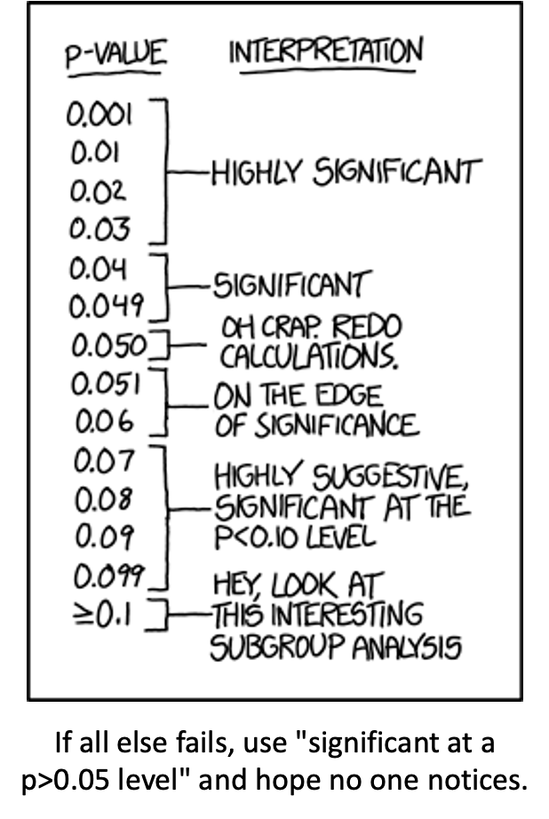{width="280"}
::::
:::::::

## Part 1 · Multifactor Designs {.divider}

## Two-Factor (2-Way) ANOVA, Recap

::::::: columns
:::: {.column width="60%"}
- We often consider more than 1 factor (independent categorical variables) to reduce unexplained variance and look at interactions
- 2-factor designs (2-way ANOVA) are very common in ecology
- Can have more factors (e.g., 3-way ANOVA) — interpretation gets tricky
- Most multifactor designs are: factorial, nested, or mixed
::::

:::: {.column width="40%"}
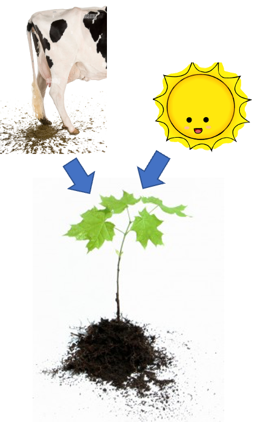{width="280"}
::::
:::::::

## Factorial Versus Nested Designs

::::::: columns
:::: {.column width="60%"}
Consider two factors, A and B:

- **Factorial/crossed:** every level of B in every level of A
- **Nested/hierarchical:** levels of B occur only in 1 level of A
  - both fixed — rare
  - one fixed, one random
  - both random — rare in ecology, common in genetics
::::

:::: {.column width="40%"}
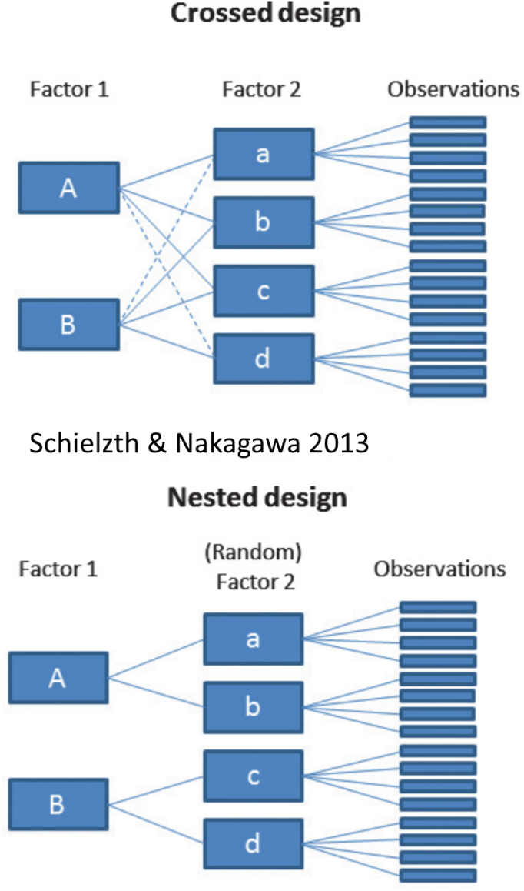{width="280"}
::::
:::::::

## Part 2 · Factorial Designs — Examples {.divider}

## Factorial Designs Overview

::::::: columns
:::: {.column width="40%"}
Factorial designs: both factors are typically fixed (but not always).
::::

:::: {.column width="60%"}
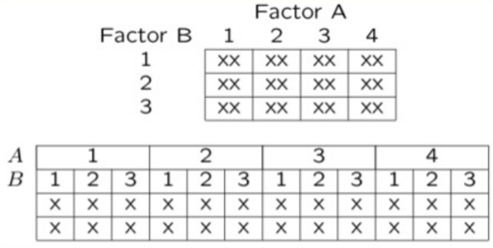{width="380"}
::::
:::::::

## Factorial Design Example: Seedling Growth

::::::: columns
:::: {.column width="40%"}
Effects of light level on growth of seedlings of different size:

- 3 light levels (Factor A)
- 3 size classes (Factor B)
- 5 replicate seedlings in each cell
::::

:::: {.column width="60%"}
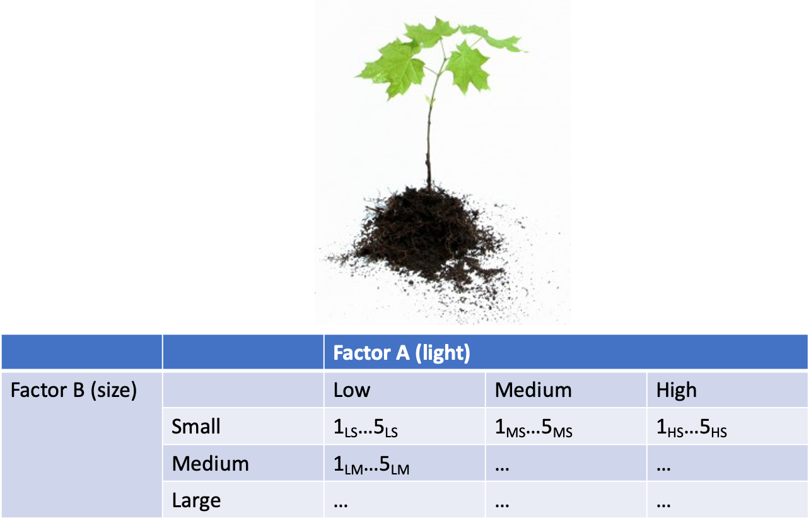{width="380"}
::::
:::::::

## Factorial Design Example: Salamander Growth

::::::: columns
:::: {.column width="40%"}
Effects of food level and tadpole presence on larval salamander growth:

- 2 food levels (Factor A)
- Presence/absence of tadpoles (Factor B)
- 8 replicates in each cell
::::

:::: {.column width="60%"}
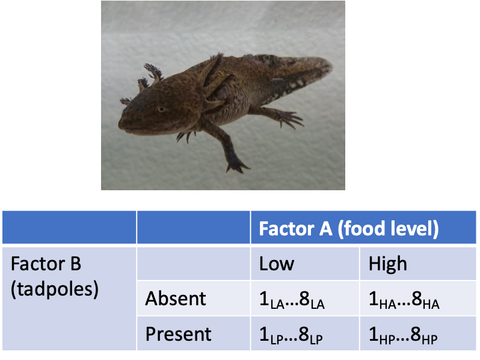{width="380"}
::::
:::::::

## Factorial Design Example: Limpet Fecundity

::::::: columns
:::: {.column width="40%"}
Effect of season and density on limpet fecundity:

- 2 seasons (Factor A)
- 4 density treatments (Factor B)
- 3 replicates in each cell
::::

:::: {.column width="60%"}
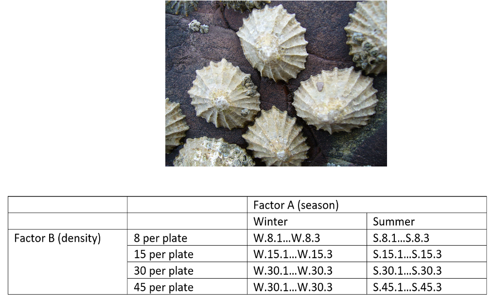{width="380"}
::::
:::::::

## Part 3 · Nested Designs — Examples {.divider}

## Nested Designs Overview

::::::: columns
:::: {.column width="40%"}
**Nested designs cover:** nested design examples, the linear model, analysis of variance, null hypotheses, unbalanced designs, assumptions, mixed-model ANOVA.

**Nested designs:** Factor A is usually fixed; Factor B is usually random.
::::

:::: {.column width="60%"}
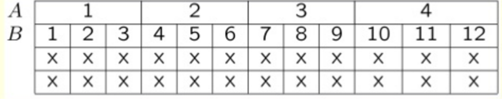{width="380"}
::::
:::::::

## Nested Design Example: Limpet Growth

::::::: columns
:::: {.column width="40%"}
Study on effects of enclosure size on limpet growth:

- 2 enclosure sizes (Factor A)
- 5 replicate enclosures (Factor B)
- 5 replicate limpets per enclosure
::::

:::: {.column width="60%"}
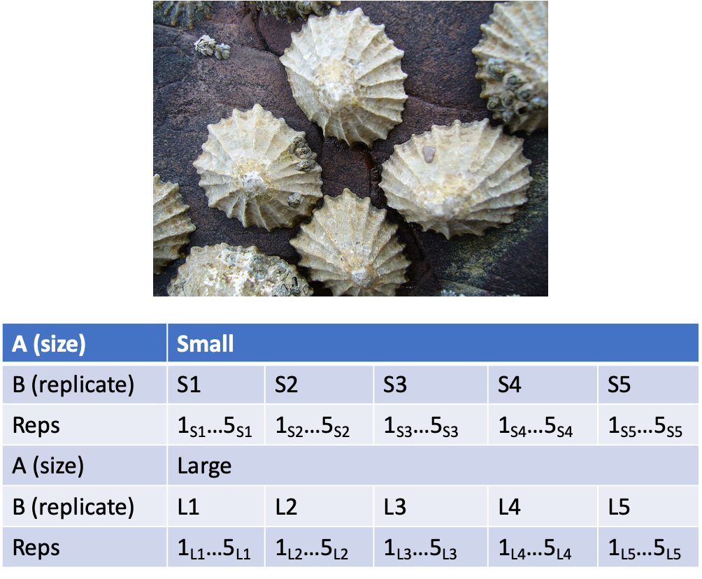{width="380"}
::::
:::::::

## Nested Design Example: Reef Fish

::::::: columns
:::: {.column width="40%"}
Study on reef fish recruitment:

- 5 sites (Factor A)
- 6 transects at each site (Factor B)
- Replicate observations along each transect
::::

:::: {.column width="60%"}
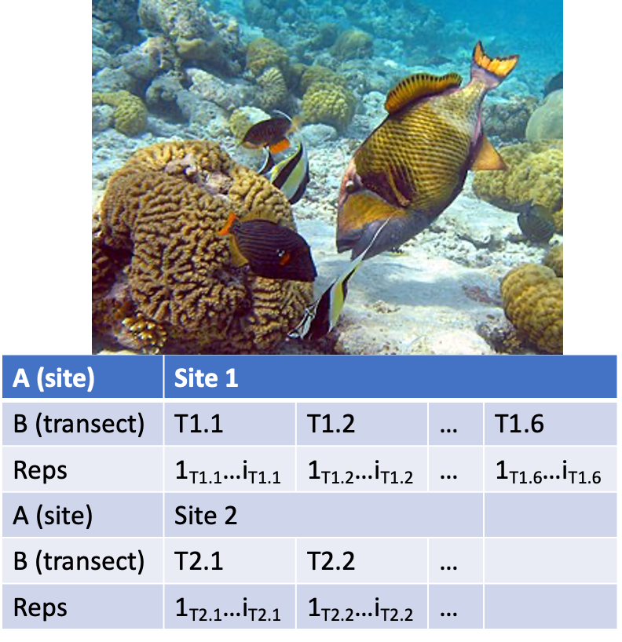{width="380"}
::::
:::::::

## Nested Design Example: Sea Urchin Grazing

::::::: columns
:::: {.column width="40%"}
Effects of sea urchin grazing on biomass of filamentous algae:

- 4 levels of urchin grazing: none, low, medium, high
- 4 patches of rocky bottom (3–4 m²) nested in each grazing level
- 5 replicate quadrats per patch

*This is our worked example for the rest of the lecture.*
::::

:::: {.column width="60%"}
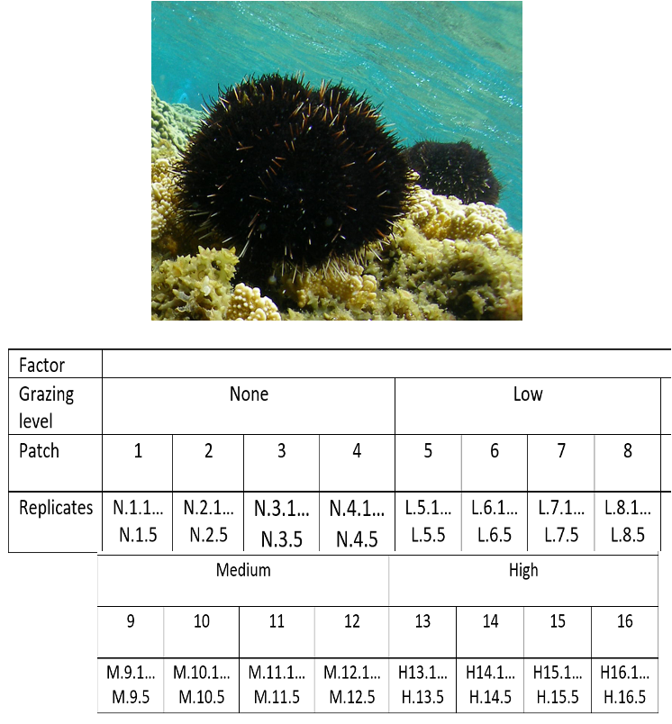{width="380"}
::::
:::::::

## Part 4 · The Nested Design Model {.divider}

## Nested Design: Linear Model Structure

::::::: columns
:::: {.column width="40%"}
Consider a nested design with:

- p levels of factor A (i = 1…p) — e.g., 4 grazing levels
- q levels of factor B (j = 1…q), nested within each level of A — e.g., 4 different patches per grazing level
- n replicates (k = 1…n) in each combination of A and B — e.g., 5 replicate quadrats in each patch in each grazing level
::::

:::: {.column width="60%"}
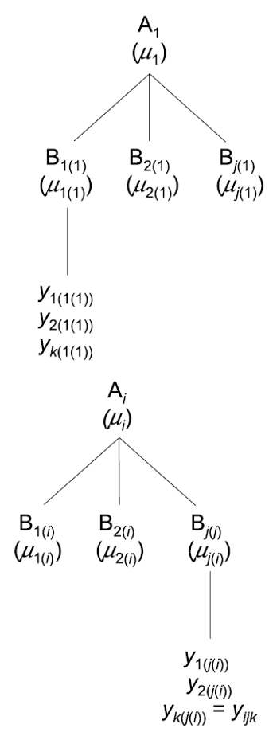{width="380"}
::::
:::::::

## Calculating Means in a Nested Design

::::::: columns
:::: {.column width="40%"}
We can calculate several means:

- Overall mean (across all levels of A and B) = $\bar{y}$
- A mean for each level of A (across all levels of B in that A) = $\bar{y}_i$
- A mean for each level of B within each A = $\bar{y}_{j(i)}$
::::

:::: {.column width="60%"}
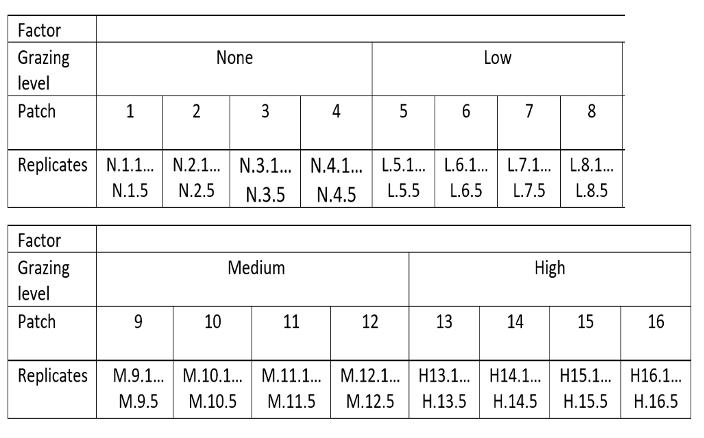{width="380"}
::::
:::::::

## Nested Design Means, Visualized

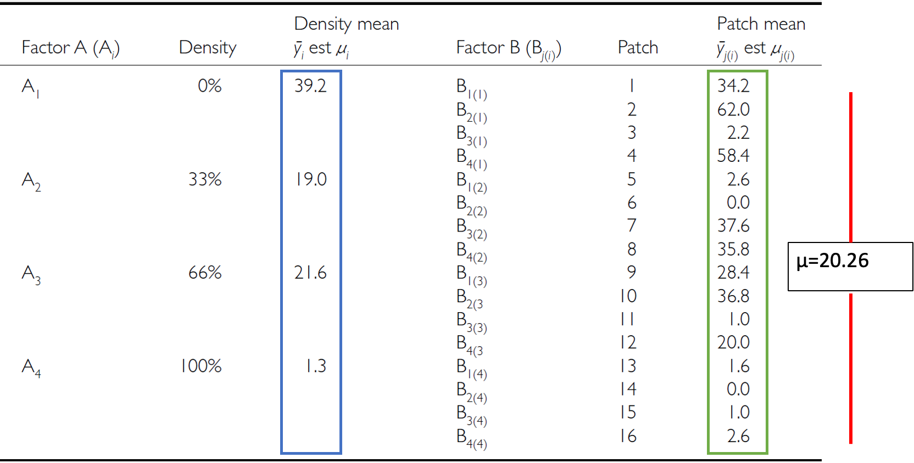{width="380"}

## The Nested Design Linear Model

::::::: columns
:::: {.column width="60%"}
$$y_{ijk} = \mu + \alpha_i + \beta_{j(i)} + \varepsilon_{ijk}$$

- $y_{ijk}$ is the response variable — the value of the k-th replicate in the j-th level of B in the i-th level of A (e.g., algal biomass in the 3rd quadrat, in the 2nd patch, in the low-grazing treatment)
- $\mu$ is the overall mean (overall average algal biomass)
::::

:::: {.column width="40%"}
::: callout-tip
**🖐 Notice**

This looks almost identical to the two-way ANOVA model — the difference is entirely in the subscript: $\beta_{j(i)}$, not $\beta_j$. B only exists *inside* a specific A.
:::
::::
:::::::

## Fixed and Random Effects in the Nested Model

::::::: columns
:::: {.column width="60%"}
$$y_{ijk} = \mu + \alpha_i + \beta_{j(i)} + \varepsilon_{ijk}$$

- $\alpha_i$ is the fixed effect of factor A — the difference between the average biomass in all low-grazing-level quadrats and the overall mean
- $\beta_{j(i)}$ is the *random* effect of factor B nested within factor A — usually a random variable measuring variance among all possible levels of B within each level of A (variance among all possible patches that could have been used in the low-grazing treatment)
::::

:::: {.column width="40%"}
::: callout-note
**✅ Key idea**

B being random is the whole point of nesting: you don't care about *these specific* patches — you care about patch-to-patch variability in general.
:::
::::
:::::::

## The Error Term in the Nested Model

::::::: columns
:::: {.column width="60%"}
$$y_{ijk} = \mu + \alpha_i + \beta_{j(i)} + \varepsilon_{ijk}$$

- $\varepsilon_{ijk}$ is the error term — the unexplained variance associated with the k-th replicate in the j-th level of B in the i-th level of A
- $\alpha_i$ is the effect of the i-th level of A: $\mu_i - \mu$
- $\varepsilon_{ijk}$: the difference between the observed algal biomass in the 3rd quadrat in the 2nd patch in the low-grazing treatment, and the *predicted* biomass (the average biomass in that 2nd patch in the low-grazing treatment)
::::

:::: {.column width="40%"}
::: callout-tip
**🖐 Notice**

The residual is measured against the *cell* mean (this specific patch), not the treatment mean — that's what makes it "nested," arithmetically.
:::
::::
:::::::

## Part 5 · Partitioning Variance {.divider}

## Analysis of Variance: Residual and Total

::::::: columns
:::: {.column width="40%"}
- $SS_{resid}$ is the difference between each observation and the mean for its level of factor B, summed over all observations
- $SS_{total} = SS_A + SS_B + SS_{resid}$
- SS can be turned into MS by dividing by the appropriate df
::::

:::: {.column width="60%"}
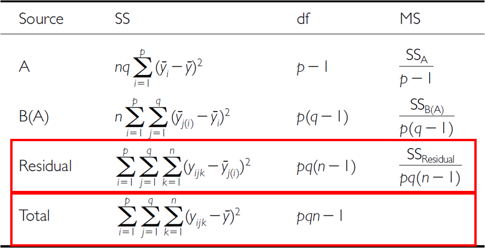{width="380"}
::::
:::::::

## Analysis of Variance: SSA

::::::: columns
:::: {.column width="40%"}
As before, we partition the variance in the response variable using SS. $SS_A$ is the SS of differences between the mean in each level of A and the overall mean.
::::

:::: {.column width="60%"}
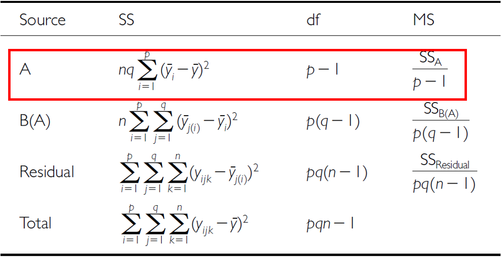{width="380"}
::::
:::::::

## Analysis of Variance: SSB

::::::: columns
:::: {.column width="40%"}
$SS_B$ is the SS of the difference between the mean in each level of B and the mean of the corresponding level of A, summed across all levels of A.
::::

:::: {.column width="60%"}
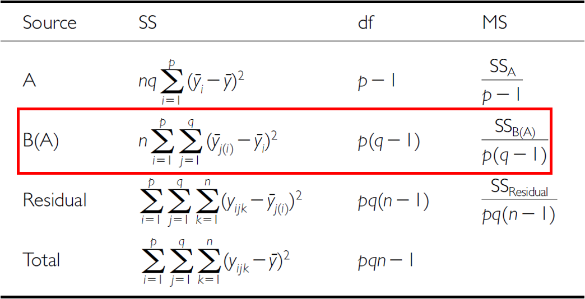{width="380"}
::::
:::::::

## The Nested ANOVA Table

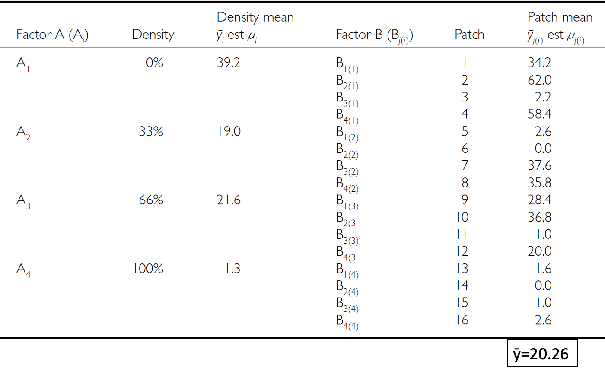{width="380"}

## Part 6 · Hypotheses and Assumptions {.divider}

## Null Hypotheses: Factor A

::::::: columns
:::: {.column width="40%"}
Two hypotheses are tested on values of MS. **1. No effects of factor A** — assuming A is fixed:

- $H_0(A)$: $\mu_1 = \mu_2 = ... = \mu_i = \mu$
- Same as in 1-factor ANOVA, using means from B factors nested within each level of A
- (no difference in algal biomass across all grazing levels: $\mu_{none} = \mu_{low} = \mu_{med} = \mu_{high}$)
::::

:::: {.column width="60%"}
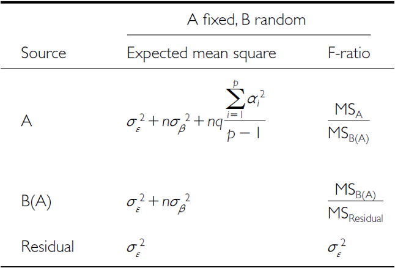{width="380"}
::::
:::::::

## Null Hypotheses: Factor B

::::::: columns
:::: {.column width="40%"}
**2. No effects of factor B nested in A** — assuming B is random:

- $H_0(B)$: $\sigma^2_\beta = 0$ (no variance added due to differences between all possible levels of B)
- (no variance added due to differences between patches)
::::

:::: {.column width="60%"}
{width="380"}
::::
:::::::

## Conclusions from the Analysis

::::::: columns
:::: {.column width="40%"}
**Conclusion:**

"Significant variation between replicate patches within each treatment, but no significant difference in the amount of filamentous algae between treatments."
::::

:::: {.column width="60%"}
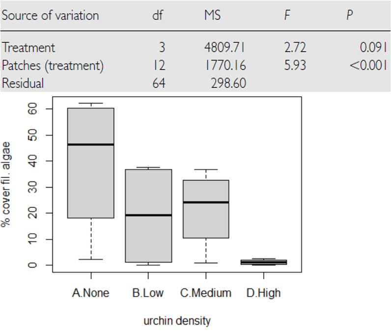{width="380"}
::::
:::::::

## Unbalanced Nested Designs

::::::: columns
:::: {.column width="40%"}
Unequal sample sizes can arise from:

- An uneven number of B levels within each A
- An uneven number of replicates within each level of B

Not a problem unless you have unequal variance or a large deviation from normality.
::::

:::: {.column width="60%"}
{width="380"}
::::
:::::::

## Nested Design Assumptions

::::::: columns
:::: {.column width="60%"}
As usual, we assume: equal variance, normality, no outliers, independence of observations.

Equal variance + normality need to be assessed at **both levels**:

- Since means for each level of B within each A are used for the H-test about A, need to assess whether *those means* meet normality and equal variance
- Examine residuals for the H-test about B
- Transformations can be used
::::

:::: {.column width="40%"}
::: callout-warning
**⚠️ Watch out!**

This is the part people most often get wrong: checking assumptions on the *raw data* isn't enough for a nested design — you need to check them at the level each hypothesis test actually operates on.
:::
::::
:::::::

## Part 7 · The Sea Urchin Example — Data {.divider}

## The Nested Design, the Hard Way

::::::: columns
:::: {.column width="60%"}
This analysis examines the effects of varying sea urchin densities on the percentage cover of filamentous algae. The experiment was designed with:

- Four random patches
- Four urchin density treatments (none = removed, low = control, medium = 33% of original density, high = 66% of original density)
- Five replicate quadrats measured within each treatment-patch combination
::::

:::: {.column width="40%"}
::: callout-note
**📖 Reference**

Quinn & Keough (2002), *Experimental Design and Data Analysis for Biologists* — this dataset and analysis follow their treatment of the sea urchin/algae example.
:::
::::
:::::::

## Data Overview

::::::: columns
:::: {.column width="50%"}
The data frame contains: `patch` (random patches 1–16 where treatments were applied), `treat` (urchin density treatment), `quad` (replicate quadrats within each treatment-patch combination), `algae` (percentage cover of filamentous algae — the response variable).

```{r}
#| echo: false
#| message: false
#| warning: false
#| paged-print: false
#| collapse: true
u_df <- read_csv("data/andrew.csv") %>% clean_names()

u_df <- u_df %>%
  mutate(treat = case_when(
         treat == "removal" ~ "none",
         treat == "control" ~ "high",
         treat == "dens_33" ~ "low",
         treat == "dens_66" ~ "medium",
         TRUE ~ "other")) %>%
  mutate(treat = factor(treat,
                        levels = c("none", "low", "medium", "high"),
                        labels = c("none", "low", "medium", "high")),
         patch = as_factor(patch))

cat("Data\n\n")
head(u_df)
cat("\n\nTreatment levels:\n\n")
levels(u_df$treat)
```
::::

:::: {.column width="50%"}
```{r}
#| echo: false
#| message: false
#| warning: false
#| paged-print: false
#| collapse: true
u_summary <- u_df %>%
  group_by(treat) %>%
  summarise(
    n = n(),
    mean = mean(algae),
    sd = sd(algae),
    se = sd / sqrt(n),
    min = min(algae),
    max = max(algae)
  )
cat("Summary statistics by treatment:\n\n")
u_summary
```
::::
:::::::

## A First Look at the Data

```{r}
#| echo: false
#| fig-width: 3.6
#| fig-height: 3
u_df %>% ggplot(aes(treat, algae)) +
  stat_summary(aes(treat, algae), fun = "mean", geom = "point", size = 3) +
  geom_point(aes(color = as.factor(patch)), position = position_dodge2(width = 0.3)) +
  theme_minimal(base_size = 9) +
  labs(color = "Patch")
```

## Part 8 · The Wrong Way — Naive Factorial Model {.divider}

## Manual Nested ANOVA — Setting Up

::::::: columns
:::: {.column width="60%"}
In this experimental design, `patch` is nested within `treat` because each patch received only one treatment level — a hierarchical design where the effect of patches must be considered *within* each treatment (Quinn & Keough 2002).

We'll use a traditional nested ANOVA. You *could* make this easy by averaging `algae` per patch and running a one-way ANOVA — but your power is significantly reduced, and you lose estimates of variability among patches.

**This first attempt is really a regular factorial ANOVA** — not appropriate, since it's pseudoreplicated. Also, the F-value for Treat is using $MS_{resid}$ when it should use $MS_{treat:patch}$.
::::

:::: {.column width="40%"}
```{r}
#| echo: true
#| message: false
#| warning: false
#| paged-print: false
#| collapse: true
u_fact_model <- aov(algae ~ treat + treat:patch, data = u_df)
cat("Factorial model summary:\n\n")
summary(u_fact_model)
```
::::
:::::::

## Why the Factorial ANOVA Is Not Correct

::::::: columns
:::: {.column width="40%"}
- We can correct this by specifying the error term
- The MS needed for the F-value is really MS(patch nested in treatment), because those are the true replicates
- We can specify that — the problem is this approach can't really handle unbalanced designs
::::

:::: {.column width="60%"}
```{r}
#| echo: true
#| message: false
#| warning: false
#| paged-print: false
#| collapse: true
u_nested_model <- aov(algae ~ treat + Error(treat:patch), data = u_df)
cat("Correctly specified nested ANOVA:\n\n")
summary(u_nested_model)
```
::::
:::::::

## Part 9 · Modern Approaches — afex and Mixed Models {.divider}

## What to Do If It's an Unbalanced Design

::::::: columns
:::: {.column width="50%"}
The `afex` package is specifically designed for ANOVA with Type III SS, and handles nested designs well — even when unbalanced.
::::

:::: {.column width="50%"}
```{r}
#| echo: true
#| message: false
#| warning: false
#| paged-print: false
#| collapse: true
options(contrasts = c("contr.sum", "contr.poly"))

u_afex_model <- aov_car(algae ~ treat + Error(patch),
                     data = u_df,
                     fun_aggregate = mean)
cat("AFEX nested ANOVA results:\n\n")
summary(u_afex_model)
```
::::
:::::::

## The Modern Way — Mixed-Model ANOVA

::::::: columns
:::: {.column width="50%"}
Fit the model with treatment as a fixed effect, and patch nested within treatment as a random effect: `lmer(algae ~ treat + (1|treat:patch), ...)`.

**BOBYQA** (Bound Optimization BY Quadratic Approximation) is an optimization algorithm used in mixed-effects modeling to find the parameter values that maximize the likelihood function — useful for fitting complex nested models.

**Notation we'll get into later:**

- Random intercept, fixed slope — `(1|patch)`
- Random intercept, random slope — `(1|treat:patch)`
::::

:::: {.column width="50%"}
```{r}
#| echo: true
#| message: false
#| warning: false
#| paged-print: false
#| collapse: true
u_lmer_model <- lmer(algae ~ treat + (1|treat:patch), data = u_df,
                    control = lmerControl(optimizer = "bobyqa",
                                         optCtrl = list(maxfun = 2e5)))
cat("Mixed model summary:\n\n")
summary(u_lmer_model)
```
::::
:::::::

## Mixed-Model ANOVA — Method 1: F-Distribution

::::::: columns
:::: {.column width="50%"}
- Accounts for the uncertainty in variance-component estimation
- More conservative (higher p-values)
- Better for small samples
::::

:::: {.column width="50%"}
```{r}
#| echo: true
#| message: false
#| warning: false
#| paged-print: false
#| collapse: true
u_anova_result <- Anova(u_lmer_model, type = 3, ddf = "Satterthwaite",
                       test.statistic = "F")
cat("Type III ANOVA with F test:\n\n")
u_anova_result
```
::::
:::::::

## Mixed-Model ANOVA — Method 2: Chi-Square

::::::: columns
:::: {.column width="50%"}
- Assumes variance components are known (not estimated)
- More liberal (lower p-values)
- Assumes large samples

**Why different results?** Chi-square = F × numerator df. The F-test accounts for the denominator df (12, here — reflecting sample size); Chi-square assumes infinite denominator df (i.e., a large sample).

**Rule of thumb:** under 100 observations or < 20 random-effect levels, use the F-test. Over 500 observations and > 50 random-effect levels, Chi-square is okay. In between, the F-test is safer.
::::

:::: {.column width="50%"}
```{r}
#| echo: true
#| message: false
#| warning: false
#| paged-print: false
#| collapse: true
u_anova_f <- Anova(u_lmer_model, type = 3, test.statistic = "Chisq")
cat("Type III ANOVA with Chi-square test:\n\n")
u_anova_f
```
::::
:::::::

## The Nested Model, Restated

::::::: columns
:::: {.column width="50%"}
$$algae_{ijk} = \mu + \alpha_i + \beta_{j(i)} + \epsilon_{ijk}$$

- $\mu$ is the overall mean
- $\alpha_i$ is the fixed effect of treatment i
- $\beta_{j(i)}$ is the random effect of patch j nested within treatment i
- $\epsilon_{ijk}$ is the residual error for quadrat k in patch j within treatment i
::::

:::: {.column width="50%"}
```{r}
#| echo: false
#| message: false
#| warning: false
#| paged-print: false
#| collapse: true
cat("Final ANOVA results:\n\n")
u_anova_result
```
::::
:::::::

## Part 10 · Post-Hoc and Interpretation {.divider}

## Interpreting the Variance Components

::: callout-important
The nested ANOVA reveals that there was no significant effect of urchin density treatment on algae cover (χ² = 8.1513, df = 3, p = 0.04306). The variance component for patches nested within treatments (294.3) indicates substantial spatial heterogeneity in algae cover, highlighting the importance of accounting for this spatial variation in the analysis.
:::

## Post-Hoc Comparisons

::::::: columns
:::: {.column width="60%"}
Although the main effect of treatment was marginally significant (p = 0.04306), we can examine mean differences between treatments to understand patterns in the data.

```{r}
#| echo: true
#| message: false
#| warning: false
#| paged-print: false
#| collapse: true
u_emm <- emmeans(u_lmer_model, ~ treat)
cat("Estimated marginal means:\n\n")
u_emm
```
::::

:::: {.column width="40%"}
```{r}
u_pairs <- pairs(u_emm, adjust = "sidak")
cat("Pairwise comparisons (Sidak adjusted):\n\n")
u_pairs
```
::::
:::::::

## Compact Letter Display

::::::: columns
:::: {.column width="60%"}
```{r}
u_cld <- multcomp::cld(u_emm, alpha = 0.05, Letters = letters)
cat("Compact letter display:\n\n")
u_cld
```
::::

:::: {.column width="40%"}
::: callout-important
**Interpreting treatment comparisons**

Mean algae cover shows a pattern with increasing urchin density: None/Removed (39.20%) > Medium/33% Density (19.00%) > High/66% Density (21.55%) > Low/Control (1.30%). This suggests an inverse relationship between urchin density and algae cover. The high variability among patches within treatments contributed to the marginal statistical significance for the treatment effect.
:::
::::
:::::::

## Part 11 · Assumptions and Visualization {.divider}

## ANOVA Assumptions Testing — Base R

::::::: columns
:::: {.column width="60%"}
For valid inference from ANOVA, several assumptions must be met. We test these below with a base R approach — note that it doesn't work all that well for a mixed model.
::::

:::: {.column width="40%"}
::: callout-tip
**🖐 Notice**

`plot(mixed_model)` and friends were built for `lm()` objects — they mostly work for `lmer()`, but purpose-built tools like `DHARMa` (next module) do a better job.
:::
::::
:::::::

## Diagnostic Plots

```{r}
#| echo: false
#| message: false
#| warning: false
#| paged-print: false
#| fig-width: 3.8
#| fig-height: 2.6
u_fitted <- fitted(u_lmer_model)
u_residuals <- residuals(u_lmer_model)

u_qq_plot <- ggplot(data.frame(residuals = u_residuals), aes(sample = residuals)) +
  stat_qq() +
  stat_qq_line() +
  labs(title = "Normal Q-Q", x = "Theoretical Quantiles", y = "Sample Quantiles") +
  theme_minimal(base_size = 7)

u_hist_plot <- ggplot(data.frame(residuals = u_residuals), aes(x = residuals)) +
  geom_histogram(bins = 15, fill = "lightblue", color = "black") +
  labs(title = "Histogram", x = "Residuals", y = "Frequency") +
  theme_minimal(base_size = 7)

u_resid_plot <- ggplot(data.frame(fitted = u_fitted, residuals = u_residuals),
                    aes(x = fitted, y = residuals)) +
  geom_point() +
  geom_hline(yintercept = 0, linetype = "dashed", color = "red") +
  labs(title = "Residuals vs. Fitted", x = "Fitted Values", y = "Residuals") +
  theme_minimal(base_size = 7)

u_qq_plot + u_hist_plot + u_resid_plot
```

## Levene's Test for Homogeneity of Variance

::::::: columns
:::: {.column width="50%"}
```{r}
u_levene <- leveneTest(algae ~ treat, data = u_df)
cat("Levene's test for homogeneity of variance:\n\n")
u_levene
```
::::

:::: {.column width="50%"}
::: callout-important
**Interpreting the assumption tests**

The Q-Q plot shows some deviation from normality, particularly in the tails, and Levene's test indicates significant heterogeneity of variances across treatments (p = 0.00008785). Quinn & Keough (2002) noted "large differences in within-cell variances" in this dataset, and transformations (including arcsin) did not improve variance homogeneity. However, ANOVA is generally robust to heteroscedasticity with balanced designs, which is why they analyzed untransformed data. The Residuals vs. fitted plot also shows a pattern of increasing variance with increasing fitted values, confirming the heteroscedasticity.
:::
::::
:::::::

## Visualization — Boxplot

```{r}
#| echo: false
#| message: false
#| warning: false
#| paged-print: false
#| fig-width: 3.6
#| fig-height: 3
u_boxplot <- ggplot(u_df, aes(x = treat, y = algae, fill = treat)) +
  geom_boxplot(alpha = 0.7, outlier.shape = NA) +
  geom_jitter(width = 0.2, alpha = 0.4, size = 1) +
  scale_fill_viridis_d(option = "D", end = 0.85) +
  labs(title = "Algae Cover by Urchin Density Treatment",
       x = "Treatment", y = "Algae Cover (%)") +
  theme_minimal(base_size = 9) +
  theme(legend.position = "none")
u_boxplot
```

## Visualization — Means Plot

```{r}
#| echo: false
#| message: false
#| warning: false
#| paged-print: false
#| fig-width: 3.4
#| fig-height: 2.8
u_means_plot <- ggplot(u_summary, aes(x = treat, y = mean, group = 1)) +
  geom_point(size = 3, shape = 21, fill = "white") +
  geom_errorbar(aes(ymin = mean - se, ymax = mean + se), width = 0.2) +
  labs(title = "Mean Algae Cover by Treatment",
       x = "Treatment", y = "Mean Algae Cover (%)") +
  theme_minimal(base_size = 8)
u_means_plot
```

## Part 12 · Discussion and Manual Calculation {.divider}

## Scientific Interpretation

::: callout-important
Our nested ANOVA analysis revealed substantial spatial heterogeneity in algae cover, with significant variation among patches within each treatment. The effect of urchin density treatments on filamentous algae cover was marginally significant at the α = 0.05 level (p = 0.043). Descriptive statistics show algae cover increasing as urchin density decreases, with None/Removed showing the highest cover (39.20%), followed by Medium/33% Density (19.00%), High/66% Density (21.55%), and Low/Control showing minimal algae cover (1.30%). The substantial variance component associated with patches nested within treatments (294.31, ~39.5% of total variance) underscores the importance of spatial heterogeneity in structuring algal communities — and the necessity of accounting for it when designing and analyzing ecological field experiments.
:::

## We Can Do This Manually — but Ugh

::::::: columns
:::: {.column width="50%"}
Nobody would ever do this by hand in practice — but seeing it once makes the "which MS goes on the bottom of the F-ratio" logic concrete.

```{r}
#| echo: true
#| message: false
#| warning: false
#| paged-print: false
u_man_model <- aov(algae ~ treat + treat:patch, data = u_df)
u_anova_summary <- summary(u_man_model)[[1]]
cat("Standard ANOVA table:\n\n")
u_anova_summary
```

```{r}
#| echo: true
#| message: false
#| warning: false
#| paged-print: false
u_MS_treat <- u_anova_summary[1, "Mean Sq"]
u_MS_patch <- u_anova_summary[2, "Mean Sq"]
u_MS_residual <- u_anova_summary[3, "Mean Sq"]

u_df_treat <- u_anova_summary[1, "Df"]
u_df_patch <- u_anova_summary[2, "Df"]
u_df_residual <- u_anova_summary[3, "Df"]

cat("MS Treatment:", u_MS_treat, "\n")
cat("MS Patch(Treatment):", u_MS_patch, "\n")
cat("MS Residual:", u_MS_residual, "\n\n")
```
::::

:::: {.column width="50%"}
```{r}
#| echo: true
#| message: false
#| warning: false
#| paged-print: false
u_F_treat_correct <- u_MS_treat / u_MS_patch        # Treatment tested against patches
u_F_patch <- u_MS_patch / u_MS_residual             # Patches tested against residual

cat("F Treatment:", u_F_treat_correct, "\n")
cat("F Patch(Treatment):", u_F_patch, "\n\n")
```

```{r}
#| echo: true
#| message: false
#| warning: false
#| paged-print: false
u_p_treat_correct <- pf(u_F_treat_correct, u_df_treat, u_df_patch, lower.tail = FALSE)
u_p_patch <- pf(u_F_patch, u_df_patch, u_df_residual, lower.tail = FALSE)

u_corrected_table <- data.frame(
  Source = c("Treatment", "Patches(Treatment)", "Residual"),
  Df = c(u_df_treat, u_df_patch, u_df_residual),
  MS = round(c(u_MS_treat, u_MS_patch, u_MS_residual), 1),
  F = c(round(u_F_treat_correct, 2), round(u_F_patch, 2), NA),
  p = c(ifelse(u_p_treat_correct < 0.001, "<0.001", round(u_p_treat_correct, 3)),
        ifelse(u_p_patch < 0.001, "<0.001", round(u_p_patch, 3)),
        NA)
)
cat("Corrected ANOVA table:\n\n")
u_corrected_table
```
::::
:::::::
