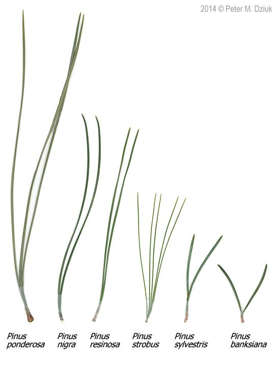
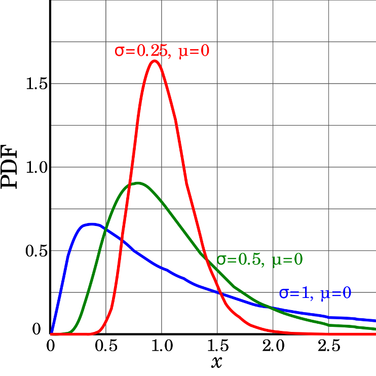
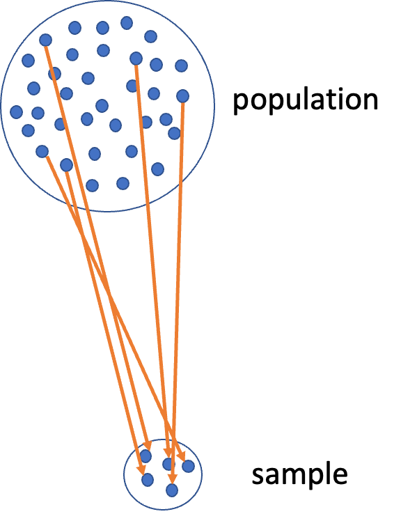

---
metadata-files:
  - ../../_templates/_lectures.yml
title: "Lecture: Non-Parametric T-Tests"
subtitle: "Rank-based tests"
description: "Rank-based tests on our own pine needle data — where the assumptions hold and the tests cost us power — then lake trout mass, where the assumptions genuinely fail and robust, rank-based, and permutation tests earn their keep."
categories: [Mean comparison, Nonparametric]
order: 7
week: 4
author: "Bill Perry"

format:
  html:
    downloads: [docx, pptx]  # This creates download links for all three
  revealjs:
    output-ext: "slides.html"
  docx:
    reference-doc: ../../ms_templates/custom-reference-compact.docx
    fig-width: 2.5
    fig-height: 2.5
    fig-dpi: 300
    dpi: 300            # tell Pandoc the real render dpi so it sizes figures correctly
  pptx: default
execute:
  echo: true
---

## Where We Left Off

::::::: columns
:::: {.column width="60%"}
A brief review:

- Hypotheses
- One- and two-sided t-tests
- One-sample, two-sample, and **paired** t-tests — and how much more the paired test got out of the same four trees
- **Assumptions of parametric tests**
- What next — when assumptions fail!
  - we will always cover parametric tests first
  - then non-parametric approaches
  - later, other approaches use the appropriate underlying distribution when it isn't normal, but Poisson or other

::: callout-note
**✅ Key idea from last lecture**

A t-test's p-value is only trustworthy if its assumptions hold. Today is about how to tell whether they do — and what to do when they don't.
:::
::::

:::: {.column width="40%"}
{width="3.12in" height="2.08in"}

::: callout-warning
**⚠️ The trap we're walking into first**

It is tempting to treat non-parametric tests as the "safe" option you can always fall back on. We are going to start by showing why that instinct is wrong.
:::
::::
:::::::


## Today's Overview

::::::: columns
:::: {.column width="60%"}
Today runs in two halves, and the order matters:

1. **Our own pine needles first.** We check the assumptions on the data *you* collected, find that they hold, measure **how big** the effect actually was with Cohen's d, and then run the non-parametric tests anyway — to see exactly what they cost.
2. **Then the lake trout.** A dataset where the assumptions are genuinely, badly broken — which is where robust tests, rank-based tests, and permutation tests earn their keep.

::: callout-note
**✅ The question behind today**

Not *"which test is safest?"* but *"which test does this data deserve?"*
:::
::::

:::: {.column width="40%"}
{width="3.12in" height="2.08in"}

{width="3.12in" height="1.38in"}
::::
:::::::

## Part 1 · Start With Our Own Data {.divider}

## Our pine needles, where we left them

::::::: columns
:::: {.column width="60%"}
```{r nonparametric-t-tests-01}
#| message: false
#| warning: false
library(tidyverse)
library(janitor)
library(car)          # leveneTest()
library(patchwork)
library(perm)         # permutation tests
library(effectsize)   # cohens_d()

source("themes_functions/r_themes_and_functions.R")

pine_df <- read_csv("data/pine_data.csv")
```

```{r nonparametric-t-tests-14}
#| message: false
# same two-stage summary as last week: one value per tree per side
p_df <- pine_df %>%
  group_by(team, side) %>%
  summarise(needle_length_mm = mean(needle_length_mm, na.rm = TRUE),
            .groups = "drop")

p_wide_df <- p_df %>%
  pivot_wider(names_from = side, values_from = needle_length_mm)

p_wide_df
```

[📥 Pine needle data](data/pine_data.csv){.btn .btn-primary download="pine_data.csv"} [📥 Lake trout data](data/lake_trout.csv){.btn .btn-primary download="lake_trout.csv"} [📥 Sagebrush cricket data](data/sage_brush_crickets_feeding_mating.csv){.btn .btn-primary download="sage_brush_crickets_feeding_mating.csv"}

[📥 Tools script](themes_functions/r_themes_and_functions.R){.btn .btn-primary download="r_themes_and_functions.R"} [📥 Script skeleton](data/07_nonparametric_t_tests.R){.btn .btn-primary download="07_nonparametric_t_tests.R"}
::::

:::: {.column width="40%"}
::: callout-note
**✅ Reminder**

4 teams, 4 trees, both sides of each tree. The data are **paired** by design.

Last week these four trees gave us:

| Comparison | p |
|:--|--:|
| Unpaired two-sample t | 0.425 |
| **Paired t** | **0.072** |
:::

::: callout-note
**✅ Same two tools as last week**

`source()` gives you `theme_regular()` and `summary_stats()` again. Nothing new to learn.
:::
::::
:::::::

## Do our assumptions actually hold?

::: callout-note
**🔮 Predict first:** Before we run anything — do you expect needle length to be normally distributed with equal variance on the two sides of a tree? Commit to an answer.
:::

::::::: columns
:::: {.column width="60%"}
Before reaching for anything non-parametric, we have to establish that we *need* it. Same two checks as last week.

```{r nonparametric-t-tests-21}
#| message: false
#| warning: false
#| paged-print: false
# normality, one side at a time -- all 32 needles per side
shapiro.test(pine_df$needle_length_mm[pine_df$side == "sunny"])
shapiro.test(pine_df$needle_length_mm[pine_df$side == "shady"])
```

```{r nonparametric-t-tests-22}
#| message: false
#| warning: false
#| paged-print: false
# equal variance
leveneTest(needle_length_mm ~ factor(side), data = pine_df)
```
::::

:::: {.column width="40%"}
::: callout-important
**⚠️ Everything passes**

| Check | p |
|:--|--:|
| Shapiro-Wilk, sunny | 0.29 |
| Shapiro-Wilk, shady | 0.86 |
| Levene's | 0.99 |

Remember the direction of these tests: **H₀ is that the assumption holds.** A large p means we have no evidence against it.

There is **nothing wrong with this data.** The paired t-test we ran last week was entitled to every bit of its p = 0.072.
:::

::: callout-tip
**🖐 So why are we here?**

Because "my data are fine" is a conclusion you have to *earn*, not assume — and because plenty of students would have reached for a rank test anyway, thinking it was the cautious choice. Let's find out what that caution would have cost.
:::
::::
:::::::

## Effect Size — How Big, Not Just Whether

::::::: columns
:::: {.column width="60%"}
Our paired t-test gave **p = 0.072**. The usual reflex is to call that "not significant" and stop.

But `p` never told us the one thing a reader actually wants to know: **how much shorter are shady needles?** A p-value answers *"could this be noise?"* — not *"does this matter?"*

**Cohen's d** answers the second question. It is the difference between the groups expressed in **standard deviations**, so it has no units and can be compared across studies:

$$d = \frac{\bar{x}_1 - \bar{x}_2}{s}$$

For a **paired** design the difference is the paired difference, and `s` is the standard deviation *of those differences*:

```{r nonparametric-t-tests-25}
diffs <- p_wide_df$shady - p_wide_df$sunny

mean(diffs) / sd(diffs)     # Cohen's d, by hand
```
::::

:::: {.column width="40%"}
::: callout-note
**✅ Read the formula out loud**

"The shady side averaged **1.36 standard deviations** below the sunny side."

That sentence stands on its own. It does not depend on how many trees we sampled, and it would mean the same thing to someone measuring a different pine species in a different forest.
:::

::: callout-tip
**🖐 Cohen's rough conventions**

| \|d\| | Label |
|--:|:--|
| 0.2 | small |
| 0.5 | medium |
| 0.8 | large |

Ours is **1.36**. These are rules of thumb, not laws — what counts as "large" is a question about pine trees, not about statistics.
:::
::::
:::::::

## Why We Report It — What d Tells Us That p Could Not

::::::: columns
:::: {.column width="60%"}
Here is the relationship that explains everything:

$$t = d \times \sqrt{n}$$

```{r nonparametric-t-tests-26}
2.7227 / sqrt(4)      # our t statistic, over root n
```

**The t-statistic is the effect size multiplied by the square root of your sample size.** So a p-value confounds two completely different things: *how big the effect is*, and *how hard you looked*.

- A **huge** effect with n = 4 → large p. That is us.
- A **trivial** effect with n = 10,000 → tiny p, and no biological meaning at all.

Effect size separates them. That is why journals, and every reporting guideline written in the last twenty years, ask for it alongside the p-value.
::::

:::: {.column width="40%"}
```{r nonparametric-t-tests-27}
#| message: false
library(effectsize)

cohens_d(p_wide_df$shady,
         p_wide_df$sunny,
         paired = TRUE)
```

::: callout-important
**⚠️ Look at that confidence interval: [-2.74, 0.10]**

*This* is the honest summary of our four trees: the effect is **probably large and probably negative**, but with n = 4 we cannot rule out zero.

Notice that the CI crossing zero is the same fact as p \> 0.05 — but it says it far more usefully. "No significant difference" sounds like *we found nothing*. "d = -1.36, CI [-2.74, 0.10]" says *we found a large effect we could not pin down*, which is a completely different message to a reader, and the correct one.
:::

::: callout-tip
**🖐 Where this goes next**

Effect size is the input to a **power analysis** — given d, how many trees would we have needed? That is next week's lecture.
:::
::::
:::::::

## Ranks, in one slide

::::::: columns
:::: {.column width="60%"}
Every non-parametric test today works the same way: **throw away the measurements, keep only their order.**

```{r nonparametric-t-tests-23}
#| message: false
p_df %>%
  mutate(rank = rank(needle_length_mm)) %>%
  arrange(rank)
```
::::

:::: {.column width="40%"}
::: callout-note
**✅ What just happened**

The shortest tree-side average became rank 1, the longest rank 8. A needle that was 4 mm longer than its neighbour and one that was 0.1 mm longer are now **exactly one rank apart**.

That is the whole trade. You become immune to outliers and to any weird distribution — and in exchange you give up the magnitudes.

A rank-based test then asks: *are the ranks of one group systematically higher than the other's?*
:::

::: callout-tip
**🖐 Watch for the statistic**

Rank tests report **`W`** (Mann-Whitney) or **`V`** (signed-rank), never `t`. If you see a `W`, you are reading rank-based output.
:::
::::
:::::::

## Running both rank-based tests

::::::: columns
:::: {.column width="60%"}
```{r nonparametric-t-tests-15}
#| warning: false
# Unpaired: Mann-Whitney U  (the t-test's two-sample partner)
wilcox.test(needle_length_mm ~ side, data = p_df)
```

```{r nonparametric-t-tests-16}
#| warning: false
# Paired: Wilcoxon signed-rank  (the paired t-test's partner)
wilcox.test(p_wide_df$shady, p_wide_df$sunny, paired = TRUE)
```
::::

:::: {.column width="40%"}
::: callout-tip
**🖐 Notice `V = 0`**

The signed-rank statistic is **zero** — meaning *every single tree* moved in the same direction. There is no arrangement of these four trees that would look more consistent.

Notice too that R says **"exact test"** for both. With no tied values it enumerates every possible arrangement rather than approximating. Hold on to that word — the next slide explains why it matters.
:::
::::
:::::::

## Same answer, less power

::::::: columns
:::: {.column width="60%"}
| Comparison | Parametric | Non-parametric |
|------------------|------------------|------------------|
| Unpaired (2 groups) | t-test **p = 0.425** | Mann-Whitney **p = 0.486** |
| Paired (4 trees) | paired t **p = 0.072** | signed-rank **p = 0.125** |

**Both methods tell the same story:**

- the unpaired comparison finds nothing
- the paired comparison is far more sensitive
- the direction is identical — shady needles shorter

**But the rank test costs you.** In both rows the non-parametric p-value is larger. That is the price of throwing away the actual measurements and keeping only their order — and we paid it on data that never needed it.
::::

:::: {.column width="40%"}
::: callout-important
**⚠️ At n = 4, the signed-rank test hits a wall**

With 4 pairs there are only 2⁴ = **16** possible arrangements of plus and minus signs. The most extreme possible result — all four the same way, which is exactly what we got — has a two-sided p of 2/16 = **0.125**.

So with four trees, a Wilcoxon signed-rank test **can never return a p-value below 0.125**, no matter how enormous the effect.

```{r nonparametric-t-tests-17}
2 / 2^4     # smallest possible two-sided p, 4 pairs
```

The test did not fail to find our effect. It was **arithmetically incapable** of declaring it significant.
:::
::::
:::::::

## What that means in practice

::::::: columns
:::: {.column width="60%"}
- Non-parametric tests are the right call when normality is genuinely broken and cannot be fixed
- But they are **not free**, and they are **not a safe default**
- At small n they can be so blunt that no result could ever reach significance — check the floor **before** you run one

::: callout-note
**✅ Key idea**

Choose the test that matches your data's distribution, not the one that feels safest. For our four trees, the *parametric* paired t-test — whose assumptions we just checked and could not reject — is the more honest and more informative choice.
:::
::::

:::: {.column width="40%"}
::: callout-tip
**🖐 Try it yourself**

How many pairs would you need before a signed-rank test could reach p \< 0.05?

``` r
2 / 2^5    # 5 pairs
2 / 2^6    # 6 pairs
```
:::

::: callout-warning
**⚠️ Where we go next**

We have now seen what these tests cost. What we have **not** seen is what they buy you — because nothing about the pine data was broken.

For that we need a dataset that is a genuine mess.
:::
::::
:::::::

## Part 2 · A Dataset Where the Assumptions Really Do Fail {.divider}

## Meet the lake trout

::::::: columns
:::: {.column width="60%"}
```{r nonparametric-t-tests-24}
#| message: false
#| warning: false
lt_df <- read_csv("data/lake_trout.csv")
```

```{r nonparametric-t-tests-02}
lt_df %>% group_by(lake) %>% reframe(summary_stats(mass_g))
```

[📥 Lake trout data](data/lake_trout.csv){.btn .btn-primary download="lake_trout.csv"}
::::

:::: {.column width="40%"}
::: callout-tip
**🖐 Notice the design**

Six lakes of trout: `sampling_site`, `species`, `length_mm`, `mass_g`, `lake`.

**Everything from here on uses `mass_g`.** Look hard at the `n` and `sd` columns for **NE 12** and **Island Lake** — 322 fish against 10, and very different spreads.

That imbalance is the rest of the lecture. Where the pine data was clean, this is everything that can go wrong at once.
:::
::::
:::::::

## Part 3 · Assumptions of Parametric Tests {.divider}

## Parametric vs. Non-Parametric Tests

::::::: columns
:::: {.column width="60%"}
T-tests are **parametric** tests.

- **Parametric tests:**
  - specify/assume the probability distribution the parameters came from
  - basic assumptions of parametric t-tests: random sampling, normality, equal variance (or Welch's t-test), no outliers
- **Non-parametric tests:** no assumption about the probability distribution/normality
  - Mukasa et al. 2021, DOI: 10.4236/ojbm.2021.93081

::: callout-note
**📖 Reference**

Whitlock & Schluter, *Analysis of Biological Data*, Ch. 13 — Handling Violations of Assumptions, is the core reference for this whole lecture.
:::
::::

:::: {.column width="40%"}
{width="3.12in" height="2.66in"}
::::
:::::::

## Assumptions of Parametric Tests — Overview

::::::: columns
:::: {.column width="60%"}
- If a parametric test's assumptions are violated, the test becomes unreliable
- This is because the test statistic may no longer follow the distribution it's supposed to
- Most parametric tests are robust to mild/moderate violations of normality
::::

:::: {.column width="40%"}
{width="3.12in" height="2.60in"}
::::
:::::::

## Assumptions — Random Sampling

::::::: columns
:::: {.column width="60%"}
Basic assumptions of parametric t-tests: random sampling, normality, equal variance, no outliers.

**Random sampling:**

- samples are randomly collected from populations; part of experimental design
- necessary for sample → population inference
::::

:::: {.column width="40%"}
{width="2.52in" height="3.03in"}
::::
:::::::

## Assumptions — Normality Testing

::: callout-note
**🔮 Predict first:** We're about to look at histogram, dotplot, boxplot, and QQ-plot views of the *same* NE 12 mass data. Which of the four do you expect to be most convincing about normality?
:::

::::::: columns
:::: {.column width="60%"}
Let's test normality for one lake — **`NE 12`** — as if we were going to run a one-sample t-test. We need a new data frame with only NE 12 data, called `ne12_data`.

**Normality:** samples from a normally distributed population

- Graphical tests: histograms, dotplots, boxplots, **QQ-plots**
- "Formal" tests: **Shapiro-Wilk test** — sometimes not useful
::::

:::: {.column width="40%"}
```{r nonparametric-t-tests-03}
#| echo: false
#| message: false
#| warning: false
#| fig-height: 3.6
#| fig-width: 4
#| paged-print: false
#| fig-alt: "Four-panel figure showing the mass distribution of Lake NE 12 trout as a histogram, a dotplot, a boxplot, and a QQ-plot, used to visually assess whether the data are approximately normally distributed."
ne12_data <- lt_df %>%
  filter(lake == "NE 12") %>%
  filter(!is.na(mass_g))  # Remove any NA values

ne12_histo_plot <- ggplot(ne12_data, aes(x = mass_g)) +
  geom_histogram(binwidth = 200, fill = "darkblue", color = "white") +
  labs(title = "Histogram") +
  theme_regular(base_size = 7)

ne12_dot_plot <- ggplot(ne12_data, aes(x = mass_g, y = "")) +
  geom_dotplot(binwidth = 60, stackdir = "center", fill = "darkblue", dotsize = 0.5) +
  labs(title = "Dotplot", y = "") +
  theme_regular(base_size = 7) +
  theme(axis.text.y = element_blank(), axis.ticks.y = element_blank())

ne12_box_plot <- ggplot(ne12_data, aes(y = mass_g)) +
  geom_boxplot(fill = "darkblue") +
  labs(title = "Boxplot", x = "") +
  theme_regular(base_size = 7) +
  theme(axis.text.x = element_blank(), axis.ticks.x = element_blank()) +
  coord_flip()

ne12_qq_plot <- ggplot(ne12_data, aes(sample = mass_g)) +
  stat_qq(color = "darkblue") +
  stat_qq_line() +
  labs(title = "QQ Plot") +
  theme_regular(base_size = 7)

combined_stats_plot <- (ne12_histo_plot + ne12_dot_plot) / (ne12_box_plot + ne12_qq_plot) +
  plot_annotation(
    title = "Lake NE 12 Trout Mass Distribution",
    subtitle = paste("n =", nrow(ne12_data), "fish samples"),
    theme = theme(plot.title = element_text(hjust = 0.5),
                  plot.subtitle = element_text(hjust = 0.5))
  )
combined_stats_plot
```
::::
:::::::

## Shapiro-Wilk Test for Normality

::::::: columns
:::: {.column width="60%"}
**H₀ is that the data ARE normally distributed** — so a *small* p-value rejects normality.

- Graphical tests: histograms, dotplots, boxplots, **QQ-plots**
- "Formal" tests: **Shapiro-Wilk** — sometimes not useful
::::

:::: {.column width="40%"}
```{r nonparametric-t-tests-04}
#| message: false
#| warning: false
#| paged-print: false
shapiro.test(ne12_data$mass_g)
```

::: callout-warning
**⚠️ p prints as `< 2.2e-16`**

That is R telling you the p-value is smaller than it will bother to print. Not a borderline call — NE 12 mass is **strongly** non-normal, exactly as the histogram and QQ-plot showed. This is the case the rest of the lecture is for.
:::
::::
:::::::

## Testing the Equal Variance Assumption

::::::: columns
:::: {.column width="60%"}
**Equal variance:** samples are from populations with a similar degree of variability.

Equal variance is about **two groups**, so here we bring in the comparison we will use for the rest of the lecture: **NE 12 vs. Island Lake**.

- Graphical test: boxplots
- Formal test: **Levene's test** — H₀ is "the variances are equal," so you *want* p \> 0.05
::::

:::: {.column width="40%"}
```{r nonparametric-t-tests-05}
#| message: false
#| warning: false
#| fig-width: 3.2
#| fig-height: 2.4
#| fig-alt: "Boxplot of trout mass for Lake NE 12 and Island Lake, showing Island Lake fish are far heavier and far more variable."
isl_ne12_df <- lt_df %>%
  filter(lake %in% c("NE 12", "Island Lake")) %>%
  filter(!is.na(mass_g))

isl_ne12_df %>%
  ggplot(aes(lake, mass_g)) +
  geom_boxplot() +
  theme_regular(base_size = 10)
```

```{r nonparametric-t-tests-06}
#| message: false
#| warning: false
#| paged-print: false
leveneTest(mass_g ~ factor(lake), data = isl_ne12_df)
```

**p is far below 0.05 — the variances are not equal.**
::::
:::::::

## Testing for Outliers

::::::: columns
:::: {.column width="60%"}
**No outliers:** no "extreme" values very different from the rest of the sample.

- Graphical tests: boxplots, histograms
- "Formal tests": Grubbs' test — no one really does this
::::

:::: {.column width="40%"}
```{r nonparametric-t-tests-07}
#| echo: false
#| fig-width: 3.2
#| fig-height: 2.8
#| fig-alt: "Stacked histogram and boxplot of Lake NE 12 trout mass, used to visually check for outliers."
ne12_histo_plot + ne12_box_plot + plot_layout(ncol = 1)
```

::: callout-warning
**⚠️ Watch out!**

Outliers are a problem for non-parametric tests as well — switching to a rank-based test doesn't make an outlier stop mattering.
:::
::::
:::::::

## Part 4 · When Assumptions Fail {.divider}

## Alternative Tests When Assumptions Fail

::::::: columns
:::: {.column width="60%"}
What if t-test assumptions fail? Alternative tests, with more relaxed assumptions, are available. In which case would you use each?

- **Welch's t-test:** *distribution normal but variance unequal*
- **Mann-Whitney-Wilcoxon test:** *distribution not normal and/or outliers present (but both groups should still have similar distributions and ~equal variance)*
- **Permutation test for two samples:** *distribution not normal (but both groups should still have similar distributions and ~equal variance)*
::::

:::: {.column width="40%"}
```{r nonparametric-t-tests-08}
#| echo: false
#| fig-width: 3.2
#| fig-height: 4
#| fig-alt: "Stacked histogram, boxplot, and QQ-plot of Lake NE 12 trout mass, shown together to help decide which alternative test to use when t-test assumptions are questionable."
ne12_histo_plot + ne12_box_plot + ne12_qq_plot + plot_layout(ncol = 1)
```
::::
:::::::

## Understanding QQ-Plots

::::::: columns
:::: {.column width="60%"}
**QQ-plots:** a tool for assessing normality.

- On x: theoretical quantiles from a standard normal distribution
- On y: ordered sample values
- Deviation from normal can be detected as deviation from a straight line
::::

:::: {.column width="40%"}
```{r nonparametric-t-tests-09}
#| message: false
#| warning: false
#| echo: false
#| fig-width: 3.4
#| fig-height: 2.8
#| fig-alt: "Side-by-side boxplot and QQ-plot of trout mass for Lake NE 12 and Island Lake, colored by lake, used to compare the two groups' distributions and assess normality."
ne12_island_box_plot <- isl_ne12_df %>%
  ggplot(aes(lake, mass_g)) +
  geom_boxplot() +
  theme_regular(base_size = 9)

ne12_island_qq_plot <- isl_ne12_df %>%
  ggplot(aes(sample = mass_g, color = lake)) +
  stat_qq() +
  stat_qq_line() +
  theme_regular(base_size = 9)

ne12_island_box_plot + ne12_island_qq_plot + plot_layout(guides = "collect")
```
::::
:::::::

## Data Transformations

::::::: columns
:::: {.column width="60%"}
In some cases, data can be mathematically "transformed" to meet the assumptions of parametric tests. This usually involves:

- log₁₀ transformations
- square root transformations
- and many others

```{r nonparametric-t-tests-10}
#| message: false
#| warning: false
#| fig-width: 3.4
#| fig-height: 2.4
#| fig-alt: "Side-by-side boxplots comparing raw trout mass to log10-transformed trout mass for Lake NE 12 and Island Lake, showing the log transformation narrowing the gap in spread between the two lakes."
log_box_plot <- isl_ne12_df %>%
  ggplot(aes(lake, log10(mass_g))) +
  geom_boxplot() +
  theme_regular(base_size = 9)

ne12_island_box_plot + log_box_plot
```

The log scale pulls the two spreads much closer together — but it does **not** fix them completely. Levene's test on `log10(mass_g)` is still significant.
::::

:::: {.column width="40%"}
{width="3.12in" height="2.68in"}

[source](https://www.elsblog.org/the_empirical_legal_studi/2006/08/variable_transf.html)
::::
:::::::

## Data Transformations — Why Log?

::::::: columns
:::: {.column width="55%"}
Log isn't a trick you try at random — it fixes a specific shape of problem:

- Right-skewed data (a long tail of large values) → `log10(x)`
- Effects that are **multiplicative** rather than additive (doubling a value, not adding a fixed amount) → `log10(x)`
- Ratio-scale ecological measurements — mass, concentration, population size, area — are almost always multiplicative
::::

:::: {.column width="45%"}
::: callout-note
**✅ The mechanism, in one line**

A trout that is twice as heavy as another isn't "500 g more" — it's "2×." Log turns that multiplicative relationship into an additive one, which is what a t-test's equal-spread assumption expects. It compresses the right tail: 100 g → 1000 g and 1000 g → 10,000 g become the *same* distance, one log unit.
:::
::::
:::::::

## Data Transformations — Beyond Log

::::::: columns
:::: {.column width="55%"}
Log is the one you will reach for most in ecology, but match the transform to the shape of the problem:

| Transformation | Use when... |
|---|---|
| `log10(x)` | right-skewed, multiplicative, ratio-scale data (mass, concentration, abundance) |
| `sqrt(x)` | count data, moderate right skew (Poisson-like variance) |
| `asin(sqrt(x))` | proportions or percentages bounded 0–1 |
| `1/x` | rates, or extreme right skew that log doesn't fix |
| Box-Cox | no obvious transform works — let the data pick the power |

**None of these are guaranteed to work.** You check afterward, every time — that's Part 5 of the worksheet, and it's the whole point of the take-home.
::::

:::: {.column width="45%"}
```{r nonparametric-t-tests-28}
#| message: false
#| warning: false
#| fig-width: 3.4
#| fig-height: 2.4
#| fig-alt: "Side-by-side boxplots comparing log10-transformed and square-root-transformed trout mass for Lake NE 12 and Island Lake."
sqrt_box_plot <- isl_ne12_df %>%
  ggplot(aes(lake, sqrt(mass_g))) +
  geom_boxplot() +
  theme_regular(base_size = 9)

log_box_plot + sqrt_box_plot
```

`sqrt()` narrows the spread less than `log10()` did here — this skew behaves more like a multiplicative effect than a count.
::::
:::::::

## A Transformation Can Fix One Problem, Not the Other

::::::: columns
:::: {.column width="55%"}
```{r nonparametric-t-tests-29}
#| message: false
#| warning: false
#| paged-print: false
leveneTest(log10(mass_g) ~ factor(lake), data = isl_ne12_df)
```

Compare that to the Levene's result on raw `mass_g` a few slides back — both fail. **Normality improved with the log transform. Equal variance did not.** Checking a transformation is not one pass/fail box — you re-test *every* assumption, separately, on the transformed variable.
::::

:::: {.column width="45%"}
::: callout-important
**⚠️ This is the take-home's whole trap**

The sagebrush cricket data works the same way: a transformation can help one assumption without rescuing the other. There is no single "correct" test hiding in the data — there's a **best-justified** one. Check every assumption on the raw data, then again on any transformed version, before you decide.
:::
::::
:::::::

## Part 5 · Welch's T-Test — a One-Slide Refresher {.divider}

## Welch's t-Test — why it exists, in one number

::::::: columns
:::: {.column width="55%"}
You met Welch's last week: **same t-statistic idea, separate variance estimates, fractional degrees of freedom.** Nothing new to learn. What is new is *this dataset*, which shows you why it matters.

```{r nonparametric-t-tests-11}
#| message: false
#| warning: false
#| paged-print: false
# Student's -- assumes equal variances
t.test(mass_g ~ lake, data = isl_ne12_df, var.equal = TRUE)
```

```{r nonparametric-t-tests-12}
#| message: false
#| warning: false
#| paged-print: false
# Welch's -- does not
t.test(mass_g ~ lake, data = isl_ne12_df, var.equal = FALSE)
```
::::

:::: {.column width="45%"}
::: callout-important
**⚠️ Same data. Same means. Sixty orders of magnitude apart.**

| | t | df | p |
|:--|--:|--:|--:|
| Student's | 14.18 | 330 | **5.7 × 10⁻³⁶** |
| Welch's | 5.14 | **9.06** | **0.0006** |

(R only prints `< 2.2e-16` for the first one — that is the smallest number it will show you. The true value is 5.7 × 10⁻³⁶.)

Look at the **df**. Student's pooled 322 Island-sized fish with 10 NE 12-sized ones and claimed **330 degrees of freedom**. Welch's looked at the same data and said: you really only have about **9**.

Both still reject H₀ — but Student's was never entitled to that much confidence. With n = 322 vs 10 and Levene's p ≈ 6 × 10⁻⁷, the pooled variance is meaningless.
:::

::: callout-tip
**🖐 The rule**

Unequal n **and** unequal variance is exactly the combination Welch's was built for. When in doubt, `var.equal = FALSE` is the safer default — it costs you almost nothing when variances really are equal.
:::
::::
:::::::

## Part 6 · Rank-Based Tests {.divider}

## Rank-Based Tests — now on data that needs them

::::::: columns
:::: {.column width="60%"}
Same two tests you ran on the pine needles in Part 1 — ranks instead of measurements, no assumption about the distribution.

- Ranks of data: observations are assigned ranks; sums (and signs, for paired tests) of ranks for groups are compared
- **Mann-Whitney U test** — common alternative to the independent-samples t-test
- **Wilcoxon signed-rank test** — alternative to the paired t-test
- Assumptions: similar distributions for groups, equal variance
- Less power than parametric tests
- Best when normality can't be met by transformation (weird distribution) or there are large outliers

::: callout-note
**✅ The difference from Part 1**

On the pine needles the rank test was a **cost** — we gave up power on data that was already well behaved.

Here, NE 12 mass is non-normal at p \< 2.2 × 10⁻¹⁶ and full of outliers. There is nothing to give up. **This** is the case the test was built for.
:::
::::

:::: {.column width="40%"}
::: callout-note
**📖 Reference**

Whitlock & Schluter, Ch. 13, covers the Mann-Whitney U test and Wilcoxon signed-rank test as the standard rank-based alternatives.
:::
::::
:::::::

## Mann-Whitney U Test Results

::::::: columns
:::: {.column width="60%"}
```{r nonparametric-t-tests-13}
#| warning: false
wilcox_test_result <- wilcox.test(mass_g ~ lake, data = isl_ne12_df)

wilcox_test_result
```
::::

:::: {.column width="40%"}
::: callout-tip
**🖐 `W` again, and no "exact" this time**

The statistic is `W`, not `t` — rank-based output, as in Part 1.

But notice what R *doesn't* say: with 332 fish and plenty of tied masses it cannot enumerate every arrangement, so this is the **normal approximation**, not an exact test. At this sample size that is fine — the floor problem that crippled our four trees does not exist here.
:::
::::
:::::::

## Part 7 · Permutation Tests {.divider}

## Permutation Tests — Concept

::::::: columns
:::: {.column width="60%"}
- Permutation tests are based on resampling: reshuffling the original data
- Resampling allows parameter estimation when the distribution is unknown, including SEs and CIs of statistics (means, medians)
- A common approach is the bootstrap: resample with replacement many times, recalculate sample stats
- We use the `perm` package
- H₀: µ_A = µ_B, Hₐ: µ_A ≠ µ_B
- Calculates the difference Δ in means between two groups
::::

:::: {.column width="40%"}
```{r nonparametric-t-tests-18}
#| echo: false
#| message: false
#| warning: false
#| fig-width: 3.2
#| fig-height: 2.8
#| fig-alt: "Boxplot comparing trout mass between Lake NE 12 and Island Lake, colored by lake, shown as context for the permutation test comparing means between the two groups."
ne12_island_box_plot
```
::::
:::::::

## Permutation Tests — Method

::::::: columns
:::: {.column width="60%"}
- Randomly reshuffle observations between groups (keeping n₍NE 12₎ = 322 and n₍Island₎ = 10), calculate Δ
- Repeat > 1,000 times
- Record the proportion of the differences in means as extreme as (or more extreme than) observed
- This is equivalent to a p-value, and can be used in the "traditional" hypothesis-testing framework
::::

:::: {.column width="40%"}
::: callout-tip
**🖐 For a graphical explanation**

[jwilber.me/permutationtest](https://www.jwilber.me/permutationtest/)
:::
::::
:::::::

## Permutation Test Implementation

::::::: columns
:::: {.column width="60%"}
In R, using the `perm` package. Assumptions: both groups have a similar distribution; equal variance.

```{r nonparametric-t-tests-19}
library(perm)

# Balance the design: take 10 NE 12 fish, keep all of Island Lake
set.seed(123)
perm_df <- bind_rows(
  isl_ne12_df %>%
    filter(lake == "NE 12") %>%
    slice_sample(n = 10),
  isl_ne12_df %>%
    filter(lake == "Island Lake")
)

# The difference the test is about
perm_df %>% group_by(lake) %>% reframe(summary_stats(mass_g))
```
::::

:::: {.column width="40%"}
```{r nonparametric-t-tests-20}
permTS(mass_g ~ lake,
       data = perm_df,
       alternative = "two.sided",
       method = "exact.mc",
       control = permControl(nmc = 10000))
```
::::
:::::::

## Part 8 · Summary {.divider}

## Summary — Testing Assumptions

::::::: columns
:::: {.column width="60%"}
**Key assumptions:**

- **Random sampling** — samples are randomly collected from populations
- **Normality** — data follows a normal distribution
- **Equal variance** — samples come from populations with similar variability
- **No outliers** — no extreme values that can skew results
::::

:::: {.column width="40%"}
::: callout-note
**Assessing assumptions**

- Key to do *every time*
- Should be acknowledged in the manuscript
:::
::::
:::::::

## Summary — Effect Size

::::::: columns
:::: {.column width="60%"}
**Always report an effect size next to your p-value.**

- **Cohen's d** = the difference between groups, in standard deviations — unitless, and comparable across studies
- **t = d × √n**, so a p-value confounds *how big the effect is* with *how hard you looked*
- A **confidence interval on d** says what a bare "n.s." never can: whether you found nothing, or found something you could not pin down
- Effect size is also the input to a power analysis — next week

::: callout-note
**✅ On our four trees**

Paired **d = −1.36**, CI [−2.74, 0.10], p = 0.072. A large effect, imprecisely measured. Reporting only "p = 0.072, n.s." would have thrown that away.
:::
::::

:::: {.column width="40%"}
::: callout-tip
**🖐 In a results sentence**

> Needles on the shady side were 1.09 mm shorter than on the sunny side (paired *t*₃ = −2.72, *p* = 0.072, *d* = −1.36, 95% CI [−2.74, 0.10]).

Every number there does work the others cannot.
:::
::::
:::::::

## Summary — Data Transformations

::::::: columns
:::: {.column width="60%"}
When assumptions aren't met, transformations may help normalize data:

- **Log transformation:** `log10(x)` — useful for right-skewed data, multiplicative effects
- **Square root:** `sqrt(x)` — useful for count data, moderately right-skewed distributions
- **Box-Cox:** a more flexible family of power transformations
- More specialized transformations exist, especially for percentages or proportions
::::

:::: {.column width="40%"}
::: callout-tip
**🖐 Recall**

We saw `log10()` shrink the gap between the NE 12 and Island Lake boxplots earlier — that's the transformation working.
:::
::::
:::::::

## Summary — Parametric Test Options

:::::: columns
::: {.column width="50%"}
**1. Standard t-test**

Strengths:

- High statistical power when assumptions are met
- Well understood and widely accepted

Weaknesses:

- Sensitive to violations of normality, equal variance
- Heavily influenced by outliers
:::

::: {.column width="50%"}
**2. Welch's t-test**

Covered in full in the **T-Tests** lecture; the one-slide refresher in Part 5 is all we needed today.

- Robust to unequal variances **and** unequal n — which is exactly our NE 12 vs. Island Lake case
- Still **parametric**: it fixes the variance assumption, not the normality one
- Costs almost nothing when variances really are equal, so it is a safe default
- On these data it moved df from **330 to 9.06** — that is the whole story
:::
::::::

## Summary — Non-Parametric Options

:::::: columns
::: {.column width="50%"}
**3. Mann-Whitney-Wilcoxon test**

Strengths:

- Non-parametric: doesn't assume normal distribution
- Robust against outliers
- Works with ordinal data

Weaknesses:

- Less statistical power than parametric tests
- Still assumes similar distributions and approximately equal variance
- Tests median differences rather than mean differences
- **At small n there is a hard floor on the p-value** — with 4 pairs a signed-rank test cannot go below 0.125 (see Part 1)
:::

::: {.column width="50%"}
**4. Permutation tests**

Strengths:

- Distribution-free: doesn't assume a specific distribution
- Can be applied to many types of test statistics
- Valid at small n — the p-value is exact, not an approximation
- Directly estimates p-values through resampling

Weaknesses:

- Computationally intensive
- Assumes exchangeability under the null hypothesis
- Requires similar distributions and equal variance
- **Hits the same small-n floor as the rank tests** — being exact is not the same as being powerful, because there are only so many ways to rearrange 8 numbers
:::
::::::

## Key Takeaway

::::::: columns
:::: {.column width="60%"}
Statistical tests have different strengths and assumptions. The choice should be guided by your data's characteristics, not just convenience.

**Always visualize your data before deciding on the appropriate test.**
::::

:::: {.column width="40%"}
::: callout-note
**✅ Key idea**

Standard t-test → Welch's → Mann-Whitney/Permutation isn't a strict ladder of "better" tests — each answers a slightly different question (means vs. medians) under different assumptions. Pick based on what your data actually looks like.
:::
::::
:::::::

## Looking Ahead — The Take-Home

::::::: columns
:::: {.column width="60%"}
Part 8 of the worksheet (sagebrush crickets, due before Study Design & Sampling) hands you a new dataset and asks **you** to run the whole decision process from today:

1. Check normality and equal variance on the raw data
2. Try a transformation if the raw data doesn't pass
3. Check normality and equal variance **again**, on the transformed data — don't assume it worked
4. Pick a test, justify the pick, and report it properly

There is no lecture slide that tells you the answer this time.
::::

:::: {.column width="40%"}
::: callout-tip
**🖐 Remember from today**

`log10()` fixed normality for the lake trout but **not** equal variance. Expect the crickets to behave similarly — a transformation earning partial credit is a completely normal outcome, not a sign you did something wrong.
:::
::::
:::::::
