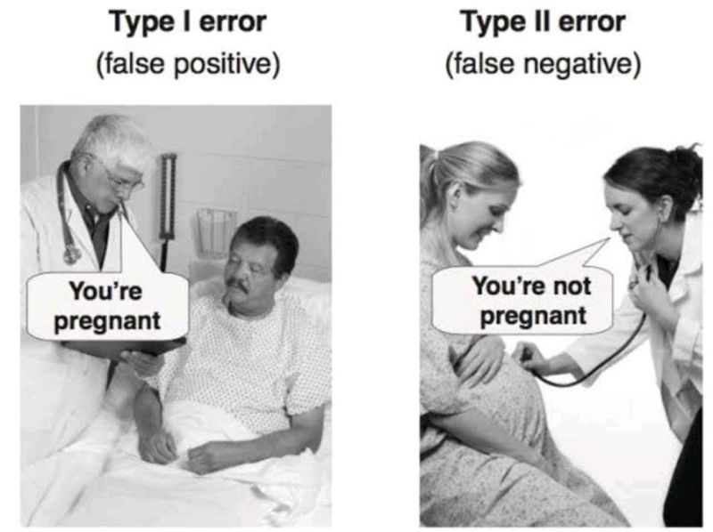

---
metadata-files:
  - ../../_templates/_lectures.yml
title: "Lecture: Power and Type I & II Error"
subtitle: "Errors and power"
description: "P-values and the hypothesis-testing framework, Type I/II error, effect size, statistical power, error bars, and pseudoreplication — on the mouse-mass and pine needle datasets."
categories: [Inference, Power]
order: 8
week: 5
author: "Bill Perry"

format:
  html:
    downloads: [docx, pptx]  # This creates download links for all three
  revealjs:
    output-ext: "slides.html"
  docx:
    reference-doc: ../../ms_templates/custom-reference-compact.docx
    fig-width: 2.5
    fig-height: 2.5
    fig-dpi: 300
    dpi: 300            # tell Pandoc the real render dpi so it sizes figures correctly
  pptx: default
execute:
  echo: true
---

## Where We Left Off

::::::: columns
:::: {.column width="60%"}
Covered last time:

- Statistical inference fundamentals
- Hypothesis testing principles
- T-distributions
- One-sample, two-sample, and paired t-tests

::: callout-note
**✅ Key idea from last lecture**

A t-test gives you a p-value and a decision — reject or fail to reject H₀. Today asks the next question: how good is that decision, and how often could it be wrong?
:::
::::

:::: {.column width="40%"}
{width="2.70in" height="3.28in"}

::: callout-note
**Today's objectives**

1. Brief review
2. Hypothesis tests for two populations
3. Assumptions of parametric tests
4. Power of parametric tests
5. Introduction to non-parametric tests
:::
::::
:::::::

## Part 1 · Statistical Hypothesis Testing {.divider}

## Statistical Hypothesis Testing

::::::: columns
:::: {.column width="60%"}
- Major goal of statistics: inferences about populations from samples
  - assign a degree of confidence to inferences
- Statistical hypothesis testing: a formalized approach to inference
- Hypotheses ask whether samples come from populations with certain properties
- Often interested in questions about population means — but other questions are of interest too

::: callout-note
**📖 Reference**

Gotelli & Ellison, *A Primer of Ecological Statistics*, Ch. 4 — Framing and Testing Hypotheses.
:::
::::

:::: {.column width="40%"}
{width="3.12in" height="2.60in"}
::::
:::::::

## Part 2 · Hypothesis Components {.divider}

## Hypothesis Components

::::::: columns
:::: {.column width="60%"}
Useful hypotheses rely on specifying:

- **H₀** — the hypothesis of "no effect"
  - two samples from populations with the same mean
  - or a sample is from a population of mean = X
- **Hₐ** (research or alternate hypothesis)
  - the opposite of H₀
  - predicts an effect of x on y
  - *but does NOT suggest a direction* — that's a prediction
::::

:::: {.column width="40%"}
{width="3.12in" height="2.60in"}
::::
:::::::

## Hypothesis Examples

::::::: columns
:::: {.column width="60%"}
Together, H₀ and Hₐ encompass all possible outcomes:

- H₀: µ = 0, Hₐ: µ ≠ 0 — mean equals 0 or it does not
- H₀: µ = 35, Hₐ: µ ≠ 35 — mean equals 35 or it does not
- H₀: µ₁ = µ₂, Hₐ: µ₁ ≠ µ₂ — mean of population 1 equals mean of population 2, or it does not
- H₀: µ > 0, Hₐ: µ ≤ 0 — can be **directional**: mean is greater than 0, or mean is not greater than 0
  - this becomes a one-sided test, since it predicts only one direction
::::

:::: {.column width="40%"}
{width="3.12in" height="2.60in"}
::::
:::::::

## Part 3 · P-Values {.divider}

## Statistical Testing Framework

::::::: columns
:::: {.column width="60%"}
Statistical tests assess the likelihood of the null hypothesis being true.

- If H₀ is likely false, Hₐ is assumed correct
- More precisely: the long-run probability of obtaining our sample value (or a more extreme one) **if the null hypothesis is true**
  - p(data | H₀) — the probability of observing the data given that H₀ is true
::::

:::: {.column width="40%"}
{width="3.12in" height="2.60in"}
::::
:::::::

## Understanding P-Values

::::::: columns
:::: {.column width="60%"}
Hypothesis tests are expressed as a p-value (0 = never, 1 = always).

Interpret a p-value as: the probability of obtaining a sample value of the statistic (or a more extreme one) if H₀ is true.

- **High p-value:** high probability of obtaining our sample statistic under H₀
  - if H₀ were true, you would frequently observe data similar to your sample
  - your observed results are quite compatible with what H₀ predicts
- **Low p-value:** low probability of obtaining our sample statistic under H₀
  - if H₀ were true, you would rarely observe data this extreme
  - your results are unusual under H₀ — either you witnessed a rare event, or H₀ may be incorrect
::::

:::: {.column width="40%"}
{width="3.12in" height="2.60in"}
::::
:::::::

## P-Value Interpretation

::::::: columns
:::: {.column width="60%"}
Statistical test results:

- p = 0.3 means that if I repeated the study 100 times, I would get this (or a more extreme) result due to chance **30 times**
- p = 0.03 means that if I repeated the study 100 times, I would get this (or a more extreme) result due to chance **3 times**

*Which p-value suggests H₀ is likely false?*

**At what point do we reject H₀?**

p < 0.05 is the conventional "significance threshold" (α = alpha).

p < 0.05 means: if H₀ is true and we repeated the study 100 times, we would get this (or a more extreme) result less than 5 times due to chance.
::::

:::: {.column width="40%"}
::: callout-note
**✅ Key idea**

α is chosen *before* data collection. It's a policy about how much Type I error risk you're willing to accept — not something you pick after seeing the p-value.
:::
::::
:::::::

## Significance Levels and Interpretation

::::::: columns
:::: {.column width="60%"}
- **α is the rate at which we will reject a true null hypothesis (Type I error rate)**
- Lowering α lowers the likelihood of incorrectly rejecting a true H₀ (e.g., 0.01, 0.001)
- *Both hypotheses and α are specified BEFORE data collection and analysis*

Traditionally, α = 0.05 is used as the cutoff for rejecting H₀. There is nothing magical about 0.05 — actual p-values should be reported, and α still needs to be decided prior to the study.
::::

:::: {.column width="40%"}
| p-value range | Interpretation |
|----|----|
| P > 0.10 | No evidence against H₀ — data appear consistent with H₀ |
| 0.05 < P < 0.10 | Weak evidence against H₀ in favor of Hₐ |
| 0.01 < P < 0.05 | Moderate evidence against H₀ in favor of Hₐ |
| 0.001 < P < 0.01 | Strong evidence against H₀ in favor of Hₐ |
| P < 0.001 | Very strong evidence against H₀ in favor of Hₐ |
::::
:::::::

## Understanding P-Values Visually

::::::: columns
:::: {.column width="60%"}
A **p-value** is the probability of observing the sample result (or something more extreme) if the null hypothesis is true.

**Common interpretations:**

- p < 0.05: strong evidence against H₀
- 0.05 ≤ p < 0.10: moderate evidence against H₀
- p ≥ 0.10: insufficient evidence against H₀

**Common misinterpretations:**

- p-value is **NOT** the probability that H₀ is true
- p-value is **NOT** the probability that results occurred by chance
- Statistical significance ≠ practical significance

Note there's a difference in how the hypotheses are stated for a one-sample vs. a two-sample t-test.
::::

:::: {.column width="40%"}
```{r power-and-error-01}
#| echo: false
#| message: false
#| warning: false
#| fig-width: 3.4
#| fig-height: 3.2
#| fig-alt: "Density curve of a t-distribution with 20 degrees of freedom for a two-tailed test, showing the two red rejection regions beyond the critical t-values, a blue shaded region marking the observed t-statistic and its two-tailed p-value, and dashed lines marking the critical and observed t-values."
library(ggplot2)

df <- 20
alpha <- 0.05
critical_t <- qt(1-alpha/2, df)
observed_t <- 2.5
p_value <- 2 * (1 - pt(abs(observed_t), df))

x <- seq(-4, 4, length.out = 1000)
y <- dt(x, df)
plot_data <- data.frame(x = x, y = y)

right_critical_region <- data.frame(
  x = seq(critical_t, 4, length.out = 100),
  y = dt(seq(critical_t, 4, length.out = 100), df)
)
left_critical_region <- data.frame(
  x = seq(-4, -critical_t, length.out = 100),
  y = dt(seq(-4, -critical_t, length.out = 100), df)
)
p_region <- data.frame(
  x = seq(observed_t, 4, length.out = 100),
  y = dt(seq(observed_t, 4, length.out = 100), df)
)

p_plot <- ggplot() +
  geom_line(data = plot_data, aes(x = x, y = y)) +
  geom_area(data = right_critical_region, aes(x = x, y = y), fill = "red", alpha = 0.3) +
  geom_area(data = left_critical_region, aes(x = x, y = y), fill = "red", alpha = 0.3) +
  geom_area(data = p_region, aes(x = x, y = y), fill = "blue", alpha = 0.5) +
  geom_vline(xintercept = critical_t, linetype = "dashed", color = "darkred") +
  geom_vline(xintercept = -critical_t, linetype = "dashed", color = "darkred") +
  geom_vline(xintercept = observed_t, linetype = "dashed", color = "blue") +
  annotate("text", x = critical_t, y = 0.15, label = paste("Critical t =", round(critical_t, 3)), color = "darkred", hjust = .2) +
  annotate("text", x = -critical_t, y = 0.15, label = paste("Critical t = -", round(critical_t, 3)), color = "darkred", hjust = .5) +
  annotate("text", x = observed_t, y = 0.08, label = paste("Observed t =", round(observed_t, 2)), color = "blue", hjust = 0.8) +
  annotate("text", x = 0, y = 0.35, label = paste("Two-tailed p-value =", round(p_value, 4)), color = "blue") +
  annotate("text", x = 3, y = 0.03, label = "alpha/2 == 0.025", color = "darkred", parse = TRUE) +
  annotate("text", x = -3, y = 0.03, label = "alpha/2 == 0.025", color = "darkred", parse = TRUE) +
  labs(title = "Two-tailed t-test",
       subtitle = paste("df =", df, ", α = 0.05 (0.025 in each tail)"),
       x = "t-statistic", y = "Probability Density") +
  theme_minimal(base_size = 9) +
  theme(legend.position = "bottom")
print(p_plot)
```
::::
:::::::

## Part 4 · Historical Context {.divider}

## Historical Context

{width="3.96in" height="3.00in"}

## Fisher's Perspective

::::::: columns
:::: {.column width="60%"}
> "If p is between 0.1 and 0.9 there is certainly no reason to suspect the hypothesis tested. If it is below 0.02 it is strongly indicated that the hypothesis fails to account for the whole of the facts. We shall not often be astray if we draw a conventional line at .05 …"

— R.A. Fisher, on the p-value as an informal measure of discrepancy between data and H₀
::::

:::: {.column width="40%"}
{width="3.12in" height="2.60in"}
::::
:::::::

## Part 5 · Decision Errors {.divider}

## Decision Errors

::::::: columns
:::: {.column width="60%"}
- **Even good studies can reach incorrect conclusions**
- These are called "decision errors"
- There are two types of decision errors
- We want to know the probability of making each of them

::: callout-note
**📖 Reference**

Gotelli & Ellison, Ch. 4 — the "Errors in Hypothesis Testing" section covers exactly this material.
:::
::::

:::: {.column width="40%"}
{width="3.65in" height="2.92in"}
::::
:::::::

## Type I and Type II Errors — Concept

::::::: columns
:::: {.column width="60%"}
- **Type I error rate, α**: wrongly reject H₀ when it's true
  - α = 0.05 means a Type I error rate of 5%
- **Type II error rate, β**: wrongly fail to reject H₀ when it's false
- **Power = 1 − β**: the probability of correctly rejecting H₀ when Hₐ is true
- Inverse relationship between Type I and Type II error — but not a straightforward one
- Can result from chance — a sample not representative of the population
- **Which type of error is more dangerous?**
::::

:::: {.column width="40%"}
{width="3.12in" height="2.34in"}

the dotted line is α = 0.05
::::
:::::::

## Type I and Type II Errors — Illustrated

::::::: columns
:::: {.column width="60%"}
When making decisions based on hypothesis tests, two types of errors can occur:

**Type I Error (False Positive)**

- Rejecting H₀ when it's actually true
- Probability = α (significance level)
- "Finding an effect that isn't real"

**Type II Error (False Negative)**

- Failing to reject H₀ when it's actually false
- Probability = β — "missing an effect that is real"

**Statistical Power = 1 − β**

- Probability of correctly rejecting a false H₀
- Increases with: larger sample size, larger effect size, lower variability, higher α level

The farther apart the means, or the lower the variance, the lower the β error — i.e., the higher the power.
::::

:::: {.column width="40%"}
{width="3.12in" height="2.60in"}
::::
:::::::

## Type I and Type II Errors — From Real Distributions

::::::: columns
:::: {.column width="60%"}
When making decisions based on hypothesis tests, two types of errors can occur:

**Type I Error (False Positive)** — rejecting H₀ when it's actually true. Probability = α.

**Type II Error (False Negative)** — failing to reject H₀ when it's actually false. Probability = β.

**Statistical Power = 1 − β** — increases with larger sample size, larger effect size, lower variability, higher α level.

The farther apart the means, or the lower the variance, the lower the β error — i.e., the higher the power.
::::

:::: {.column width="40%"}
```{r power-and-error-02}
#| echo: false
#| message: false
#| warning: false
#| fig-width: 3.4
#| fig-height: 3.2
#| fig-alt: "Overlapping density curves for a null distribution (purple) centered at 0 and an alternative distribution (green) centered at 3, with the Type I error region shaded red in the right tail of the null curve and the Type II error region shaded blue under the alternative curve to the left of the critical value."
x <- seq(-4, 8, length.out = 1000)
null_y <- dnorm(x, mean = 0, sd = 1)
alt_y <- dnorm(x, mean = 3, sd = 1.5)

crit_val <- qnorm(0.95)

type_1_region <- data.frame(
  x = seq(crit_val, 8, length.out = 100),
  y = dnorm(seq(crit_val, 8, length.out = 100), mean = 0, sd = 1)
)
type_2_region <- data.frame(
  x = seq(-4, crit_val, length.out = 100),
  y = dnorm(seq(-4, crit_val, length.out = 100), mean = 3, sd = 1.5)
)

error_plot <- ggplot() +
  geom_line(data = data.frame(x = x, y = null_y),
            aes(x = x, y = y, color = "Null Distribution")) +
  geom_line(data = data.frame(x = x, y = alt_y),
            aes(x = x, y = y, color = "Alternative Distribution")) +
  geom_area(data = type_1_region, aes(x = x, y = y), fill = "red", alpha = 0.3) +
  geom_area(data = type_2_region, aes(x = x, y = y), fill = "blue", alpha = 0.3) +
  geom_vline(xintercept = crit_val, linetype = "dashed") +
  annotate("text", x = 2, y = 0.3, label = "Type I Error (α)", color = "red") +
  annotate("text", x = 0, y = 0.15, label = "Type II Error (β)", color = "blue") +
  scale_color_manual(values = c("Null Distribution" = "purple",
                                "Alternative Distribution" = "darkgreen"),
                     name = "") +
  labs(title = "Type I and Type II Errors",
       x = "Test Statistic", y = "Probability Density") +
  theme_minimal(base_size = 9) +
  theme(legend.position = "bottom")
error_plot
```
::::
:::::::

## Practice Exercise: Interpreting Errors and Power

::: callout-tip
**Practice Exercise: interpreting p-values and errors**

Given the following scenarios, identify whether a Type I or Type II error might have occurred:

1. A researcher concludes that island mice size is larger, when in fact it is not.
2. A study fails to detect a real difference in mouse size on islands when there is one, and concludes there is no effect.
3. Let's calculate the power of our t-test to detect a 1g difference in mass between sampling sites:

- **Pooled standard deviation** — the combined standard deviation of both groups, weighted by their respective degrees of freedom
- **Cohen's d** — the standardized difference between means; here assuming a difference of 1 unit (g)

```{r power-and-error-03}
library(car)
library(patchwork)
library(tidyverse)

m_df <- read_csv("data/mice_weights.csv") %>%
  filter(!is.na(mass_g))

sidney_df    <- m_df %>% filter(sampling_site == "Sidney Island")
vancouver_df <- m_df %>% filter(sampling_site == "Vancouver")

n1 <- nrow(sidney_df)
n2 <- nrow(vancouver_df)
sd_pooled <- sqrt((var(sidney_df$mass_g) * (n1-1) +
                  var(vancouver_df$mass_g) * (n2-1)) /
                  (n1 + n2 - 2))

# delta = 0.423: the standardized effect size (Cohen's d)
effect_size <- 1 / sd_pooled  # Cohen's d
df <- n1 + n2 - 2
alpha <- 0.05
power <- power.t.test(n = min(n1, n2),
                     delta = effect_size,
                     sd = 1,  # Using standardized effect size
                     sig.level = alpha,
                     type = "two.sample",
                     alternative = "two.sided")
power
```
:::

## Part 6 · Statistical Power {.divider}

## What if We Calculated Power for the Pine Needles You Measured?

::::::: columns
:::: {.column width="60%"}
```{r power-and-error-04}
#| message: false
pine_df <- read_csv("data/pine_data.csv")

# the two-stage summary again: one value per tree per side
p_df <- pine_df %>%
  group_by(team, side) %>%
  summarise(needle_length_mm = mean(needle_length_mm, na.rm = TRUE),
            .groups = "drop")

shady_df <- p_df %>% filter(side == "shady")
sunny_df <- p_df %>% filter(side == "sunny")

pine_n <- nrow(shady_df)

pine_sd_pooled <- sqrt((var(shady_df$needle_length_mm) * (pine_n - 1) +
                        var(sunny_df$needle_length_mm) * (pine_n - 1)) /
                       (2 * pine_n - 2))

observed_diff <- abs(mean(shady_df$needle_length_mm) -
                     mean(sunny_df$needle_length_mm))

cat("Trees per side:", pine_n, "\n")
cat("Observed difference:", round(observed_diff, 2), "mm\n")
cat("Pooled SD:", round(pine_sd_pooled, 2), "mm\n")
```

[📥 Download the data](data/pine_data.csv){.btn .btn-primary download="pine_data.csv"}
::::

:::: {.column width="40%"}
```{r power-and-error-05}
cohens_d <- observed_diff / pine_sd_pooled
cat("Cohen's d =", round(cohens_d, 2), "\n\n")

pine_power <- power.t.test(n = pine_n,
                           delta = cohens_d,
                           sd = 1,
                           sig.level = 0.05,
                           type = "two.sample",
                           alternative = "two.sided")

cat("Power to detect it:", round(pine_power$power, 3), "\n")
```

::: callout-important
**⚠️ 11% power**

Even if this difference is completely real, an unpaired study with 4 trees per side would **miss it about 9 times out of 10.**
:::
::::
:::::::

## How Many Trees Would We Have Needed?

::::::: columns
:::: {.column width="60%"}
Turn the calculation around: instead of asking "what power do we have?", ask **"what n would we need?"** This is the version you should run *before* collecting anything.

```{r power-and-error-06}
# n per side for the conventional 80% power, unpaired
power.t.test(delta = cohens_d, sd = 1,
             power = 0.80, sig.level = 0.05,
             type = "two.sample")$n
```

**44 trees per side.** We collected four.

::: callout-note
**📖 Reference**

Whitlock & Schluter, Ch. 14 — Designing Experiments, includes planning the sample size needed for a study.
:::
::::

:::: {.column width="40%"}
::: callout-warning
**⚠️ This is why "we found no difference" is usually the wrong conclusion**

A non-significant result from an underpowered study does not mean there is no effect. It means **the study could never have found one.**

"Absence of evidence is not evidence of absence" — but only if you actually check your power.
:::
::::
:::::::

## Pairing Buys You Power — Here Is How Much

::::::: columns
:::: {.column width="60%"}
The paired design does not just give a smaller p-value. It changes the **whole economics of the study.**

```{r power-and-error-07}
p_wide_df <- p_df %>%
  pivot_wider(names_from = side, values_from = needle_length_mm)

diffs <- p_wide_df$shady - p_wide_df$sunny
dz    <- abs(mean(diffs)) / sd(diffs)      # effect size for the DIFFERENCES

cat("Differences:", round(diffs, 2), "\n")
cat("Cohen's dz =", round(dz, 2), "\n\n")

cat("Paired power at n = 4:",
    round(power.t.test(n = 4, delta = dz, sd = 1,
                       type = "paired")$power, 3), "\n")

cat("Trees needed for 80% power, paired:",
    ceiling(power.t.test(delta = dz, sd = 1, power = 0.80,
                         type = "paired")$n), "\n")
```
::::

:::: {.column width="40%"}
| Design | Power at n = 4 | Trees for 80% |
|-----------|-----------|-----------|
| Unpaired | 11% | **44 per side** |
| Paired | 46% | **7 total** |

::: callout-important
**Same trees. Same needles. Same measurements.**

Pairing takes this study from needing **44 trees per side** to needing **7 trees**. That is not a statistical trick — it is what respecting the design of your own experiment is worth.
:::

::: callout-tip
**🖐 Now the p-value makes sense**

Our paired test gave p = 0.072. With 46% power, landing just outside significance is exactly what you should expect — not a surprise, and not evidence of no effect.
:::
::::
:::::::

## What Is Power?

::::::: columns
:::: {.column width="60%"}
Statistical power is the probability of detecting a true effect — of rejecting the null hypothesis when it really is false. Power of 80% means an 80% chance of finding a difference of a given size, **if that difference is actually there.**

A power analysis is typically done for one of these purposes:

1. **Before data collection**, to determine required sample size — by far the most useful
2. After a study, to evaluate whether the sample size was adequate
3. To determine the minimum detectable effect size with the sample you have

::: callout-note
**✅ Key idea**

**80% power is the usual convention** for an adequately powered study. Our unpaired pine analysis has 11%, and our paired analysis 46% — both below it. This is a *pilot study*: enough to estimate an effect size and plan a real one, not enough to settle the question.
:::
::::

:::: {.column width="40%"}
::: callout-warning
**⚠️ A warning about "post-hoc power"**

Computing power *from the effect size you observed* — which is exactly what we just did — is a known trap. It is fine for what we used it for: **planning the next study**.

It is **not** a valid way to explain away a non-significant result, because observed power is just a re-expression of the p-value. If someone reports "our result was non-significant but we had low power," they have said the same thing twice.
:::
::::
:::::::

## Part 7 · Error Bars {.divider}

## Error Bars and Their Interpretation

::::::: columns
:::: {.column width="60%"}
Error bars are graphical representations of the variability of data that show:

- The **precision** of a measurement
- The **uncertainty** around an estimate
- A **confidence interval** for a parameter

Common types of error bars:

1. **Standard Error (SE)** — shows precision of the mean
2. **Standard Deviation (SD)** — shows variability in the data
3. **Confidence Interval (CI)** — shows the plausible range for a parameter

When interpreting graphs:

- Always check what the error bars represent
- Non-overlapping 95% CI bars suggest statistically significant differences
- Error bars help assess both statistical and practical significance
::::

:::: {.column width="40%"}
```{r power-and-error-08}
#| echo: false
#| message: false
#| warning: false
#| fig-width: 3.4
#| fig-height: 3.2
#| fig-alt: "Faceted bar chart of mean mouse mass by sampling site, split into a Standard Deviation panel and a Standard Error panel, each showing black error bars for that error type and an additional red 95% confidence interval error bar on each bar."
error_bar_comparison <- m_df %>%
  group_by(sampling_site) %>%
  summarize(
    mean_length = mean(mass_g, na.rm = TRUE),
    sd = sd(mass_g, na.rm = TRUE),
    n = sum(!is.na(mass_g)),
    se = sd / sqrt(n),
    ci_lower = mean_length - qt(0.975, df = n - 1) * se,
    ci_upper = mean_length + qt(0.975, df = n - 1) * se,
    .groups = "drop"
  ) %>%
  pivot_longer(
    cols = c(sd, se),
    names_to = "error_type",
    values_to = "error_value"
  ) %>%
  mutate(
    error_type = case_when(
      error_type == "sd" ~ "Standard Deviation",
      error_type == "se" ~ "Standard Error"
    )
  )

ggplot() +
  geom_bar(data = error_bar_comparison,
           aes(x = sampling_site, y = mean_length, fill = sampling_site),
           stat = "identity", position = position_dodge(), alpha = 0.7) +
  geom_errorbar(data = error_bar_comparison,
                aes(x = sampling_site, ymin = mean_length - error_value,
                    ymax = mean_length + error_value,
                    group = error_type),
                position = position_dodge(width = 0.9), width = 0.2) +
  geom_errorbar(data = error_bar_comparison %>% distinct(sampling_site, ci_lower, ci_upper, mean_length),
                aes(x = sampling_site, ymin = ci_lower, ymax = ci_upper),
                position = position_dodge(width = 0.9), width = 0.1, color = "red") +
  facet_wrap(~error_type) +
  annotate("text", x = 1.5, y = max(error_bar_comparison$mean_length) * 1.4,
           label = "95% CI (red)", color = "red") +
  labs(title = "Different Types of Error Bars",
       subtitle = "Comparing SD, SE, and 95% CI",
       x = "sampling_site", y = "Mean Mass (g)") +
  theme_minimal(base_size = 9) +
  theme(legend.position = "bottom")
```
::::
:::::::

## Part 8 · Pseudoreplication {.divider}

## Sampling and Pseudoreplication

::::::: columns
:::: {.column width="60%"}
**Pseudoreplication** occurs when measurements that are not independent are analyzed as if they were independent.

- A critical consideration in experimental design
- Results in underestimated standard errors and confidence intervals
- Leads to inflated Type I error rates (false positives)

**Examples of pseudoreplication:**

- Measuring the same individual multiple times
- Treating multiple fish from the same tank as independent
- Using multiple data points from a single site

**How to avoid pseudoreplication:**

- Identify the true experimental unit
- Use appropriate statistical techniques (e.g., mixed models)
- Be clear about the level of replication

::: callout-important
**We have been doing this all along**

Our pine needle data has 64 rows. Analysed as 64 independent needles it would look like a large, well-powered study. Analysed honestly — **4 trees** — it has 11% power unpaired, 46% paired.

Pseudoreplication would not have made the study better. It would only have made us **believe** it was.
:::
::::

:::: {.column width="40%"}
```{r power-and-error-09}
#| echo: false
#| message: false
#| warning: false
#| fig-width: 4
#| fig-height: 3
#| fig-alt: "Two side-by-side scatterplots comparing pseudoreplicated versus proper analysis of body mass by location (Mainland vs. Island), each point colored by island ID. The left panel treats individual mice as replicates with a tight black error bar on the pooled mean; the right panel treats island means as replicates with a wider black error bar, illustrating how pseudoreplication understates true uncertainty."
set.seed(42)
pseudo_data <- data.frame(
  island_id = rep(1:6, each = 10),  # 6 islands, 10 mice each
  location = rep(c("Mainland", "Island"), each = 30),  # 30 mainland, 30 island mice
  body_mass = NA
)

for (island in 1:6) {
  if (island <= 3) {
    island_means <- c(22, 24, 28)
    island_mean <- island_means[island]
    pseudo_data$location[pseudo_data$island_id == island] <- "Mainland"
  } else {
    island_means <- c(26, 23, 27)
    island_mean <- island_means[island - 3]
    pseudo_data$location[pseudo_data$island_id == island] <- "Island"
  }

  if (pseudo_data$location[pseudo_data$island_id == island][1] == "Island") {
    pseudo_data$body_mass[pseudo_data$island_id == island] <-
      rnorm(10, mean = island_mean + 3, sd = 6)
  } else {
    pseudo_data$body_mass[pseudo_data$island_id == island] <-
      rnorm(10, mean = island_mean, sd = 20)
  }
}

pseudo_plot <- pseudo_data %>%
  ggplot(aes(x = location, y = body_mass, color = factor(island_id))) +
  geom_point(position = position_jitter(width = 0.1), size = 2, alpha = 0.7) +
  stat_summary(aes(group = 1), fun = mean, geom = "point",
               shape = 18, size = 4, color = "black") +
  stat_summary(aes(group = 1), fun.data = mean_se, geom = "errorbar",
               width = 0.2, color = "black", linewidth = 1) +
  labs(title = "Pseudoreplication Analysis",
       subtitle = "Ind mice reps",
       x = "Location", y = "Body Mass (g)", color = "Island ID") +
  theme_minimal(base_size = 9) +
  theme(legend.position = "right") +
  ylim(10, 40)

correct_data <- pseudo_data %>%
  group_by(island_id, location) %>%
  summarize(mean_body_mass = mean(body_mass),
            se_body_mass = sd(body_mass)/sqrt(n()),
            .groups = 'drop')

correct_plot <- correct_data %>%
  ggplot(aes(x = location, y = mean_body_mass, color = factor(island_id))) +
  geom_point(size = 2, position = position_dodge2(width = 0.4)) +
  geom_errorbar(aes(ymin = mean_body_mass - se_body_mass,
                   ymax = mean_body_mass + se_body_mass),
               width = 0.4, alpha = 0.5, position = position_dodge2(width = 0.4)) +
  stat_summary(aes(group = 1), fun = mean, geom = "point",
               shape = 18, size = 4, color = "black") +
  stat_summary(aes(group = 1), fun.data = mean_se, geom = "errorbar",
               width = 0.2, color = "black", linewidth = 1) +
  labs(title = "Proper Analysis",
       subtitle = "Islands as reps",
       x = "Location", y = "Mean Body Mass per Island (g)", color = "Island ID") +
  theme_minimal(base_size = 9) +
  theme(legend.position = "right") +
  ylim(10, 40)

combined_plot <- pseudo_plot + correct_plot +
  plot_layout(ncol = 2, guides = "collect")
print(combined_plot)
```
::::
:::::::

## Summary and Key Takeaways

::::::: columns
:::: {.column width="60%"}
**Key concepts covered:**

1. **P-values** measure evidence against the null hypothesis
   - Not the probability that H₀ is true
   - Should be interpreted in context with effect size
2. **Hypothesis testing** provides a framework for making decisions
   - Null and alternative hypotheses must be specified beforehand
   - α level determines the Type I error rate
::::

:::: {.column width="40%"}
3. **Type I and Type II errors** represent different kinds of mistakes
   - Type I (α): false positive — rejecting a true H₀
   - Type II (β): false negative — failing to reject a false H₀
   - Statistical power = 1 − β
4. **Error bars** communicate uncertainty in different ways
   - Always check what type of error bar is shown
   - CI bars help assess statistical significance
5. **Pseudoreplication** inflates significance
   - Identify true experimental units
   - Account for non-independence in analysis
::::
:::::::
