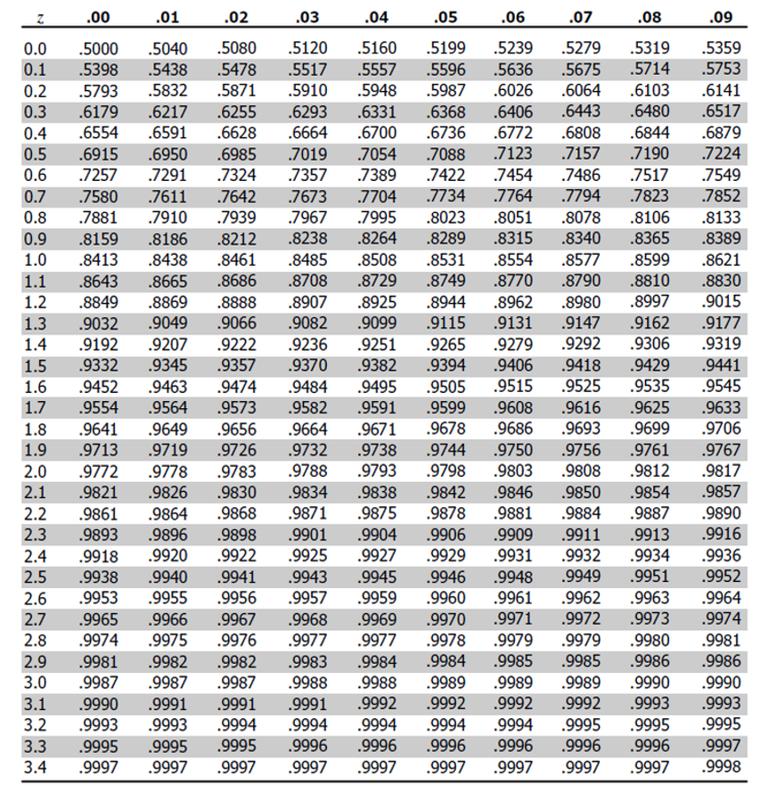
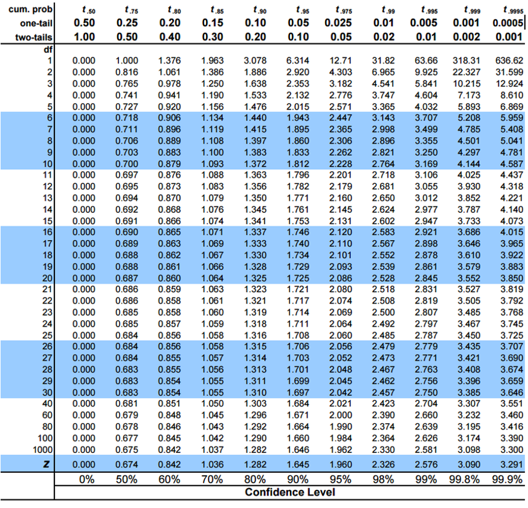
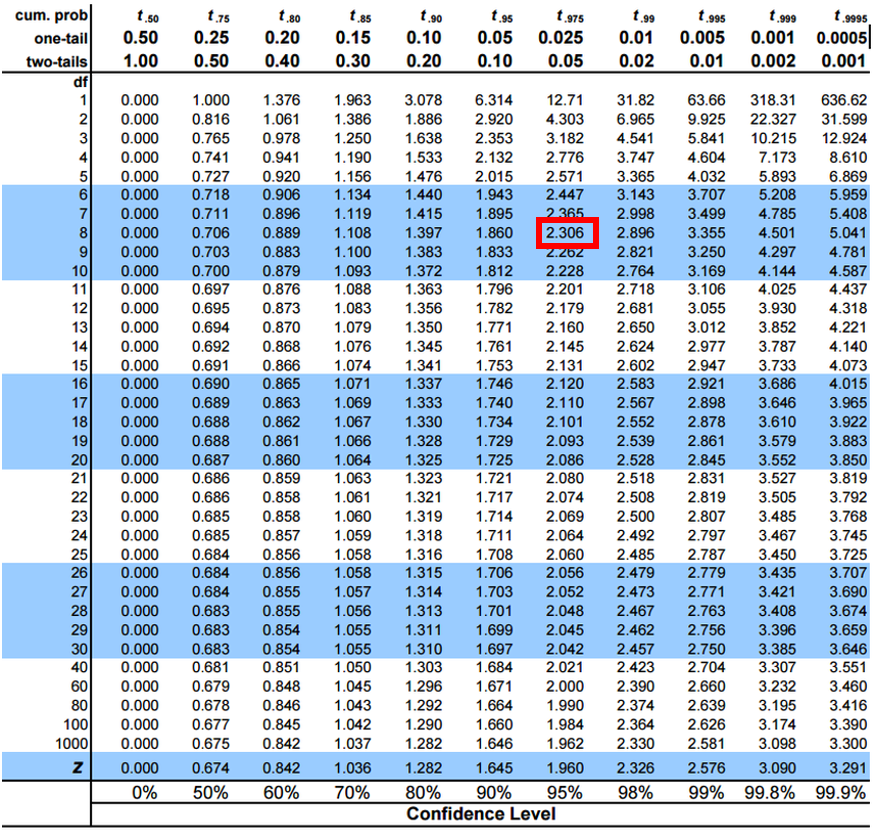
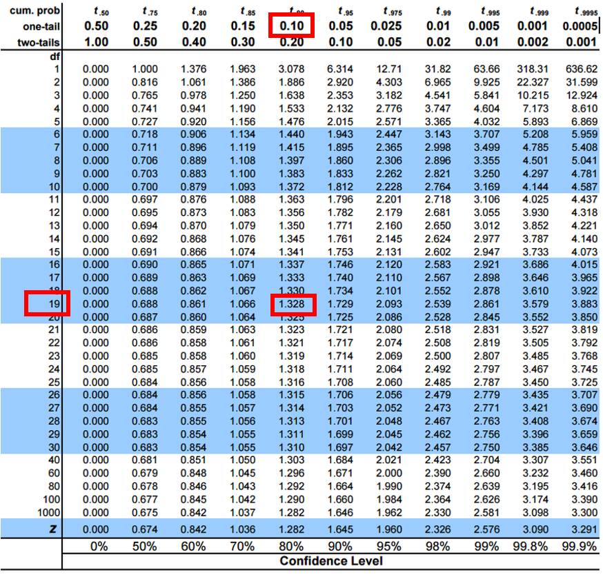
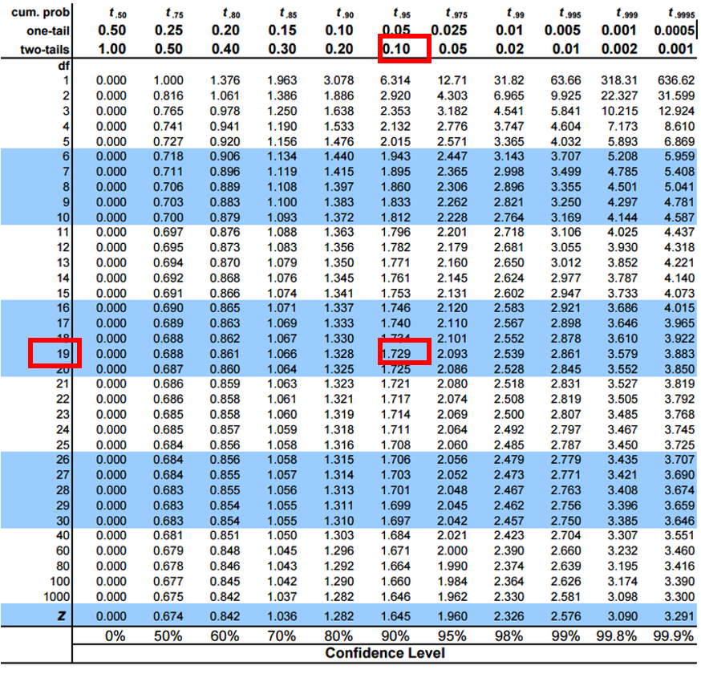

---
metadata-files:
  - ../../_templates/_lectures.yml
title: "Lecture: Probability & Inference"
subtitle: "From the normal curve to the confidence interval"
description: "The normal distribution, standardizing to the standard normal, z-scores and areas under the curve, checking the normality assumption, standard error, confidence intervals, the t-distribution, and one- and two-tailed hypothesis testing — on the Arctic grayling length dataset."
categories: [Probability, Inference]
order: 5
week: 3
author: "Bill Perry"

format:
  html:
    downloads: [docx, pptx]
  revealjs:
    output-ext: "slides.html"
  docx:
    reference-doc: ../../ms_templates/custom-reference-compact.docx
    fig-width: 2.5
    fig-height: 2.5
    fig-dpi: 300
    dpi: 300
  pptx: default
execute:
  echo: true
---

```{r pi-setup}
#| message: false
#| warning: false
#| include: false
library(tidyverse)
library(patchwork) # stacks the two panels on the "two sets of units" slide
library(janitor)   # round_half_up() - rounds 0.5 up, the way you were taught

grayling_df <- read_csv("data/gray_I3_I8.csv")

i3_df <- grayling_df %>% filter(lake == "I3")

# the three numbers the whole lecture hangs on
i3_mean <- mean(i3_df$length_mm, na.rm = TRUE)
i3_sd   <- sd(i3_df$length_mm,   na.rm = TRUE)
i3_n    <- sum(!is.na(i3_df$length_mm))
i3_se   <- i3_sd / sqrt(i3_n)

# one helper, used by every "shade a tail" figure in this lecture, so the
# same 40 lines of ggplot are not repeated five times
shade_curve <- function(dens, from = -Inf, to = Inf, xlim = c(-4, 4),
                        xlab = "z", title = NULL, subtitle = NULL,
                        marks = NULL) {
  curve_df <- tibble(x = seq(xlim[1], xlim[2], length.out = 600)) %>%
    mutate(y = dens(x))
  fill_df <- curve_df %>% filter(x >= from, x <= to)

  ggplot(curve_df, aes(x, y)) +
    geom_area(data = fill_df, fill = "darkblue", alpha = 0.35) +
    geom_line(linewidth = 0.8) +
    {if (!is.null(marks)) geom_vline(xintercept = marks, colour = "red",
                                     linetype = "dashed")} +
    labs(x = xlab, y = "Density", title = title, subtitle = subtitle) +
    theme_classic(base_size = 9)
}
```

## Probability and Statistical Inference

::::: columns
::: {.column width="60%"}
Today we build one chain of reasoning, start to finish:

1.  Real data have a **distribution**
2.  Any normal distribution can be **standardized** to standard normal distribution
3.  Area under that curve is **probability**
4.  All of it **assumes normality** — so we check
5.  From one fish to the **mean**: SD, SE, confidence intervals
6.  When σ is unknown we use the **t-distribution** the safe alternative
7.  Putting a number on evidence: **hypothesis tests**

[📥 Download the data](https://wlperry.github.io/ecostats_2026/content/probability_inference/data/gray_I3_I8.csv){.btn .btn-primary download="gray_I3_I8.csv"}
:::

::: {.column width="40%"}
```{r pi-01}
#| echo: false
#| fig-alt: "Dodged histogram of Arctic grayling length in millimeters, coloured by lake (I3 and I8), showing the distribution of fish lengths for each lake."
grayling_df %>%
  ggplot(aes(length_mm, fill = lake)) +
  geom_histogram(alpha = 0.7, binwidth = 10, position = "dodge") +
  labs(x = "Length (mm)", y = "Count",
       caption = "Arctic grayling, lakes I3 and I8") +
  theme_classic(base_size = 9)
```
:::
:::::

## Part 1 · From data to a distribution {.divider}

## The normal distribution

::::::: columns
::::: {.column width="60%"}
A **probability distribution** spreads probability across the possible outcomes — but *how* depends on the data:

- **Discrete** (a die): each outcome has its own probability, P(4) = 1/6
- **Continuous** (fish length): any *exact* value has probability **zero**. Probability lives in **ranges**, as **area** under the curve

The curve's height is a **density** — probability *per mm*, not a probability. **Density × width ≈ probability.**

> Density is a **rate**, so it is not capped at 1: `dnorm(0, sd = 0.1)` = **3.989**. Nothing is 399% likely — proof that height ≠ probability.

The **normal** is the density we lean on: symmetric, fixed by **μ** (where it sits) and **σ** (how wide), total area 1.

Lake I3: **μ ≈ `r round_half_up(i3_mean, 1)` mm**, **σ ≈ `r round_half_up(i3_sd, 1)` mm** — *our* curve. Every dataset has its own.

:::: {.content-visible unless-format="revealjs"}
::: callout-note
**📖 Reference**

Whitlock & Schluter Ch. 10 — The Normal Distribution.\
Gotelli & Ellison Ch. 2 — Random Variables and Probability Distributions.
:::
::::
:::::

::: {.column width="40%"}
```{r pi-02}
#| echo: false
#| fig-alt: "Histogram of Lake I3 grayling lengths on the density scale with a red normal curve, using the sample mean and standard deviation, drawn over the top."
i3_df %>%
  ggplot(aes(length_mm)) +
  geom_histogram(aes(y = after_stat(density)), binwidth = 10,
                 fill = "lightblue", colour = "white") +
  stat_function(fun = dnorm, args = list(mean = i3_mean, sd = i3_sd),
                colour = "red", linewidth = 1) +
  labs(x = "Length (mm)", y = "Density",
       caption = "I3 fish, with the normal curve for this mean and SD") +
  theme_classic(base_size = 9)
```
:::
:::::::

## Why we standardize

::::: columns
::: {.column width="60%"}
There is a **different normal curve for every μ and σ**. Nobody can tabulate ***infinitely*** many curves.

So we rescale every value into the same units — **standard deviations from the mean**:

### $z = \frac{x_i - \mu}{\sigma}$

- $x_i$ = the observation
- $μ$ = mean of the distribution
- $σ$ = standard deviation of the distribution

Subtracting μ slides the curve to centre 0. Dividing by σ squeezes it to width 1.

The result is the **standard normal distribution**: **μ = 0, σ = 1**. One curve. One table.

> A z-score is not a new measurement. It is the same fish, expressed as "how many SDs from average."
:::

::: {.column width="40%"}
```{r pi-03}
#| echo: false
#| fig-alt: "Standard normal density curve centred at zero with dashed vertical lines at minus three through three standard deviations."
tibble(x = seq(-4, 4, length.out = 600)) %>%
  mutate(y = dnorm(x)) %>%
  ggplot(aes(x, y)) +
  geom_line(colour = "red", linewidth = 0.9) +
  geom_vline(xintercept = -3:3, linetype = "dashed",
             colour = "grey50", linewidth = 0.3) +
  scale_x_continuous(breaks = -3:3,
                     labels = c("-3σ", "-2σ", "-1σ", "0", "1σ", "2σ", "3σ")) +
  labs(title = "Standard normal", x = "z", y = "Density") +
  theme_classic(base_size = 9)
```
:::
:::::

## Practice 1 · Standardize the I3 fish

::: callout-tip
**z = (length − mean) / standard deviation**

```{r pi-04}
i3_mean <- mean(i3_df$length_mm, na.rm = TRUE)
i3_sd   <- sd(i3_df$length_mm,   na.rm = TRUE)

i3_df <- i3_df %>%
  mutate(z_score = (length_mm - i3_mean) / i3_sd)

i3_df %>%
  select(lake, length_mm, z_score) %>%
  head(4)
```

**A fish of `r round_half_up(i3_mean, 0)` mm gets z = 0. A fish one SD above average gets z = 1.**
:::

## The same fish, two sets of units

::::: columns
::: {.column width="60%"}
Standardizing changes the **axis labels**, not the **shape**.

- **Top**: millimetres, centred near `r round_half_up(i3_mean, 0)`
- **Bottom**: z, centred at 0
- Same fish, same bars, same skew — only the ruler changed

That matters: **standardizing does not make non-normal data normal.** It only puts it on a common ruler. We come back to this in Part 3.
:::

::: {.column width="40%"}
```{r pi-05}
#| echo: false
#| fig-alt: "Two stacked histograms of the same Lake I3 grayling. The top panel is raw length in millimetres centred near 266; the bottom panel is the same fish as z-scores centred at 0. Both have identical shape, with red lines marking plus and minus one, two and three standard deviations."
# the SAME fish, drawn twice - only the x-axis changes
raw_plot <- i3_df %>%
  ggplot(aes(length_mm)) +
  geom_histogram(fill = "darkblue", alpha = 0.7, binwidth = 10) +
  geom_vline(xintercept = i3_mean, linewidth = 0.8) +
  geom_vline(xintercept = i3_mean + c(-1, 1) * i3_sd,
             colour = "red", linewidth = 0.6) +
  geom_vline(xintercept = i3_mean + c(-2, 2) * i3_sd,
             colour = "red", linewidth = 0.6, linetype = "dashed") +
  geom_vline(xintercept = i3_mean + c(-3, 3) * i3_sd,
             colour = "red", linewidth = 0.6, linetype = "dotted") +
  labs(title = "Original data", x = "Length (mm)", y = "Count") +
  theme_classic(base_size = 9)

i3_z_plot <- i3_df %>%
  ggplot(aes(z_score)) +
  geom_histogram(fill = "darkblue", alpha = 0.7, binwidth = 0.35) +
  geom_vline(xintercept = 0, linewidth = 0.8) +
  geom_vline(xintercept = c(-1, 1), colour = "red", linewidth = 0.6) +
  geom_vline(xintercept = c(-2, 2), colour = "red", linewidth = 0.6,
             linetype = "dashed") +
  geom_vline(xintercept = c(-3, 3), colour = "red", linewidth = 0.6,
             linetype = "dotted") +
  scale_x_continuous(breaks = -3:3) +
  labs(title = "Standardized (z)", x = "z (SDs from the mean)", y = "Count") +
  theme_classic(base_size = 9)

raw_plot / i3_z_plot
```
:::
:::::

## Part 2 · Area under the curve is probability {.divider}

## The 68–95–99.7 rule

::::: columns
::: {.column width="60%"}
Because the standard normal is **one fixed curve**, its areas are fixed too:

- **68%** of the curve within ±1σ
- **95%** within ±**1.96**σ — "±2" is the rule of thumb, 1.96 is the number
- **99.7%** within ±3σ

Our I3 fish, counted directly:

```{r pi-06}
within_1sd <- mean(abs(i3_df$z_score) <= 1, na.rm = TRUE)
round_half_up(100 * within_1sd, 1)   # percent within 1 SD
```

Theory says 68%. We get **`r round_half_up(100 * mean(abs(i3_df$z_score) <= 1, na.rm = TRUE), 1)`%**.

Hold that gap. It is the whole point of Part 3.
:::

::: {.column width="40%"}
```{r pi-07}
#| echo: false
#| fig-alt: "Standard normal curve with the region between minus one and one shaded, labelled 68 percent."
shade_curve(dnorm, from = -1, to = 1, marks = c(-1, 1),
            title = "68% lies within ±1σ")
```
:::
:::::

## `pnorm`, `qnorm`, `dnorm` — which is which

::::: columns
::: {.column width="60%"}
All three describe the **same** standard normal curve. They differ in what you hand them and what you get back.

| Function   | You give it | You get back                   |
|------------|-------------|--------------------------------|
| `pnorm(z)` | a **z**     | the **area to the left** of it |
| `qnorm(p)` | an **area** | the **z** that cuts it off     |
| `dnorm(z)` | a **z**     | the **height** of the curve    |

- **`p` = probability, `q` = quantile** — and they are inverses
- `dnorm` is the curve's **height**, used to *draw* it. **A height is not a probability** — only area is

```{r pi-08}
pnorm(1.96)     # area left of 1.96
qnorm(0.975)    # the z that puts 97.5% on its left
```
:::

::: {.column width="40%"}
```{r pi-09}
#| echo: false
#| fig-alt: "Standard normal curve with the area to the left of z equals 1.22 shaded blue, a red dashed line at 1.22, and an arrow marking the curve height at that point."
shade_curve(dnorm, to = 1.22, marks = 1.22,
            title = "pnorm(1.22) = shaded area",
            subtitle = "dnorm(1.22) = height of the line at 1.22") +
  annotate("point", x = 1.22, y = dnorm(1.22), colour = "darkgreen", size = 2)
```
:::
:::::

## Reading the z-table

::::::: columns
::::: {.column width="42%"}
The z-table is `pnorm()` printed on paper: **cumulative area to the LEFT of z**.

- Find the **ones and tenths** of z down the left column
- Find the **hundredths** across the top
- Read the area where they meet

One table works for every dataset — because every dataset gets standardized first. (Contrast the t-table later, which needs a row for each sample size.)

:::: {.content-visible unless-format="revealjs"}
::: callout-note
**📖 Reference**

Whitlock & Schluter Ch. 10 — standardizing a value and reading the standard normal table.
:::
::::
:::::

::: {.column width="58%"}
{fig-alt="Standard normal (z) table giving the cumulative area to the left of z, with z values from 0.0 to 3.4 down the rows and hundredths across the columns." width="5.5in" .stat-table}
:::
:::::::

## Worked example — how rare is a 300 mm grayling?

::::: columns
::: {.column width="60%"}
**Step 1 — standardize.**

$z = \frac{300 - `r round_half_up(i3_mean, 2)`}{`r round_half_up(i3_sd, 2)`} = `r round_half_up((300 - i3_mean) / i3_sd, 2)`$

**Step 2 — look it up.** Row 1.2, column 0.02 → **0.8888**

**Step 3 — read it as biology.**

- 88.9% of I3 fish are **shorter** than 300 mm
- 100 − 88.9 = **11.1%** are **longer**

Catch 100 fish in I3 and about 11 should beat 300 mm.

**Same answer, in R — no table:**

```{r pi-10}
z_fish <- (300 - i3_mean) / i3_sd
round_half_up(z_fish, 2)              # 1.22, matches the table
round_half_up(100 * (1 - pnorm(z_fish)), 1)   # % longer than 300 mm
```
:::

::: {.column width="40%"}
```{r pi-11}
#| echo: false
#| fig-alt: "Standard normal curve with the upper tail beyond z equals 1.22 shaded, representing the 11 percent of fish longer than 300 millimetres."
shade_curve(dnorm, from = (300 - i3_mean) / i3_sd, marks = (300 - i3_mean) / i3_sd,
            title = "P(fish > 300 mm)",
            subtitle = "the shaded upper tail ≈ 11%")
```
:::
:::::

## Running it backwards — `qnorm`

::::: columns
::: {.column width="60%"}
The table question can be asked the other way round, and in fisheries it usually is:

> *We had a length and wanted a probability. Now we have a probability and want a length.*

**"How big must a grayling be to land in the top 5%?"** — the trophy-fish question, and the size-limit question.

- `qnorm(0.95)` = **`r round_half_up(qnorm(0.95), 3)`** — the z with 5% above it
- Back to millimetres: $x = \mu + z\sigma$

```{r pi-12}
z_top5 <- qnorm(0.95)
length_top5 <- i3_mean + z_top5 * i3_sd
round_half_up(length_top5, 1)   # mm
```

Only 5% of I3 fish should exceed **`r round_half_up(i3_mean + qnorm(0.95) * i3_sd, 1)` mm**.

**Every number on this slide assumed the fish are normal. Do we know that?**
:::

::: {.column width="40%"}
```{r pi-13}
#| echo: false
#| fig-alt: "Standard normal curve with the upper five percent shaded beyond z equals 1.645."
shade_curve(dnorm, from = qnorm(0.95), marks = qnorm(0.95),
            title = "The top 5%",
            subtitle = "z = 1.645  →  312 mm")
```
:::
:::::

## Part 3 · Checking the assumption {.divider}

## Shapiro-Wilk — and its backwards logic

::::: columns
::: {.column width="60%"}
The Shapiro-Wilk test asks one question, and its hypotheses run **opposite** to what you expect:

- **H₀: the data ARE normal**
- **Hₐ: the data are NOT normal**

So:

- **p \> 0.05** → no evidence against normal → **carry on**
- **p \< 0.05** → evidence of **non-normality** → **be careful**

> A small p-value here is **bad news**, not a result. That reversal is why this test gets misread every semester.

**Two cautions:** with **large n** it flags departures too small to matter; with **small n** it misses ones that matter. Always **read the Q-Q plot too** — points on the line = normal.
:::

::: {.column width="40%"}
```{r pi-14}
shapiro.test(i3_df$length_mm)
```

```{r pi-15}
#| echo: false
#| fig-alt: "Normal quantile-quantile plot of Lake I3 grayling lengths, with points curving away from the reference line at both ends."
i3_df %>%
  ggplot(aes(sample = length_mm)) +
  stat_qq(size = 0.8) + stat_qq_line(colour = "red") +
  labs(title = "Q-Q plot: I3 lengths",
       x = "Theoretical quantiles", y = "Sample quantiles") +
  theme_classic(base_size = 9)
```
:::
:::::

## So how wrong were we?

::::::: columns
::::: {.column width="60%"}
p = 0.0002. The I3 fish are **not** normal. Every probability in Part 2 assumed they were — so let's audit them against the fish themselves.

|   | normal theory | actual data |
|------------------------|------------------------|------------------------|
| within ±1 SD | 68% | **`r round_half_up(100 * mean(abs(i3_df$z_score) <= 1, na.rm = TRUE), 1)`%** |
| 95th percentile | `r round_half_up(i3_mean + qnorm(0.95) * i3_sd, 1)` mm | `r round_half_up(unname(quantile(i3_df$length_mm, 0.95, na.rm = TRUE)), 1)` mm |
| P(fish \> 300 mm) | `r round_half_up(100 * (1 - pnorm(300, i3_mean, i3_sd)), 1)`% | **`r round_half_up(100 * mean(i3_df$length_mm > 300, na.rm = TRUE), 1)`%** |

**The centre is fine. The tail is off by a third.**

And the tail is exactly where inference lives — critical values, rejection regions, p-values all sit out in the tails.

**This is why we check assumptions before trusting a p-value.**

:::: {.content-visible unless-format="revealjs"}
::: callout-note
**📖 Reference**

Whitlock & Schluter Ch. 13 — Handling Violations of Assumptions.
:::
::::
:::::

::: {.column width="40%"}
```{r pi-16}
# theory vs. the actual fish, out in the tail
round_half_up(100 * (1 - pnorm(300, i3_mean, i3_sd)), 1)
round_half_up(100 * mean(i3_df$length_mm > 300, na.rm = TRUE), 1)
```

```{r pi-17}
#| echo: false
#| fig-alt: "Density of Lake I3 grayling lengths in blue with the fitted normal curve dashed in red, showing the normal curve sitting above the data in the right tail."
i3_df %>%
  ggplot(aes(length_mm)) +
  geom_density(fill = "lightblue", alpha = 0.6) +
  stat_function(fun = dnorm, args = list(mean = i3_mean, sd = i3_sd),
                colour = "red", linetype = "dashed", linewidth = 0.9) +
  geom_vline(xintercept = 300, colour = "darkgreen") +
  labs(x = "Length (mm)", y = "Density",
       caption = "red dashed = normal model; green = 300 mm") +
  theme_classic(base_size = 9)
```
:::
:::::::

## Part 4 · From one fish to the mean {.divider}

## SD and SE answer different questions

::::: columns
::: {.column width="60%"}
Everything so far described **individual fish**. Science usually asks about the **mean**. Those need different spreads.

| Question                          | Spread        |
|-----------------------------------|---------------|
| How long is a **single fish**?    | **SD** (s)    |
| Where is the **population mean**? | **SE** (s/√n) |

- Fish spread is however wide the fish are — more fish does **not** narrow it
- Mean spread **shrinks as n grows** — averages are steadier than individuals
- "5% of fish exceed `r round_half_up(i3_mean + qnorm(0.95) * i3_sd, 1)` mm" uses **SD**; "the mean is near `r round_half_up(i3_mean, 1)`" uses **SE**

**Using SE where you meant SD makes your interval √n times too narrow.**
:::

::: {.column width="40%"}
```{r pi-18}
i3_n  <- sum(!is.na(i3_df$length_mm))
i3_se <- i3_sd / sqrt(i3_n)

tibble(
  n  = i3_n,
  SD = round_half_up(i3_sd, 1),
  SE = round_half_up(i3_se, 1)
)
```
:::
:::::

## What a confidence interval actually is

:::::: columns
:::: {.column width="60%"}
We have one sample and one mean, `r round_half_up(i3_mean, 1)` mm. The true μ is some other number we will never see. A **confidence interval** is our honest statement of how close we probably are.

**The recipe:** $\bar{y} \pm (\text{critical value}) \times SE$

**What "95%" means:** repeat the whole study many times, build an interval each time, and **95% of those intervals will contain μ**. The figure shows 20 such studies — one misses.

::: callout-warning
**The interpretation everyone gets wrong**

❌ "There is a 95% chance μ is in **my** interval."

✅ "95% of intervals built this way capture μ."

μ is a fixed number — it is not moving around. **The interval is what is random.** Yours either caught μ or it didn't; you don't get to know which.
:::
::::

::: {.column width="40%"}
```{r pi-19}
#| echo: false
#| fig-alt: "Twenty simulated confidence intervals drawn as horizontal segments against a vertical line at the true mean; nineteen cross the line in grey and one that misses is shown in red."
set.seed(11)
ci_sim <- map_dfr(1:20, function(i) {
  s <- rnorm(15, mean = i3_mean, sd = i3_sd)
  tt <- t.test(s)
  tibble(study = i, lo = tt$conf.int[1], hi = tt$conf.int[2],
         est = mean(s))
}) %>%
  mutate(caught = lo <= i3_mean & hi >= i3_mean)

ci_sim %>%
  ggplot(aes(y = study, colour = caught)) +
  geom_segment(aes(x = lo, xend = hi, yend = study), linewidth = 0.7) +
  geom_point(aes(x = est), size = 0.9) +
  geom_vline(xintercept = i3_mean, linewidth = 0.8) +
  scale_colour_manual(values = c("TRUE" = "grey40", "FALSE" = "red"),
                      guide = "none") +
  labs(x = "Length (mm)", y = "Study #",
       caption = "vertical line = true μ") +
  theme_classic(base_size = 9)
```
:::
::::::

## If we knew σ, we would use z

::::: columns
::: {.column width="60%"}
When the population σ is **genuinely known**, the critical value comes straight off the standard normal:

### $CI = \bar{y} \pm 1.96 \cdot \frac{\sigma}{\sqrt{n}}$

- 1.96 because 95% of the standard normal lies within ±1.96
- 90% CI → 1.645 · 99% CI → 2.576 · all from `qnorm()`

```{r pi-20}
qnorm(0.975)   # 95%
qnorm(0.95)    # 90%
```

**Wider confidence costs a wider interval.** You cannot be more certain and more precise at the same time — only a bigger n buys you both.
:::

::: {.column width="40%"}
```{r pi-21}
#| echo: false
#| fig-alt: "Standard normal curve with the central 95 percent shaded between minus 1.96 and 1.96 and dashed red lines at both boundaries."
shade_curve(dnorm, from = -1.96, to = 1.96, marks = c(-1.96, 1.96),
            title = "95% of the standard normal",
            subtitle = "lies between z = ±1.96")
```
:::
:::::

## But we never know σ — so z is too confident

::::: columns
::: {.column width="60%"}
Look again at that formula. It needs **σ**, the *population* standard deviation. We have never once had it.

What we actually have is **s**, computed from our `r i3_n` fish. And s is itself an estimate — a different sample gives a different s.

**Two sources of uncertainty, not one:**

1.  the mean wobbles from sample to sample
2.  our **estimate of the spread** also wobbles

Using 1.96 accounts for the first and ignores the second. Intervals come out **too narrow** and we claim more precision than we earned.

Gosset hit exactly this at Guinness — tiny barley samples, σ never known. His fix: **use a curve with fatter tails**, so the critical value is bigger and the interval honest.

**That curve is Student's t.**
:::

::: {.column width="40%"}
{fig-alt="Vintage photo of William Sealy Gosset, who published as 'Student' while working at the Guinness brewery, with a humorous speech bubble reading 'Cheers!' and a pint of Guinness beside him." width="2.49in"}
:::
:::::

## The t-distribution

:::::: columns
:::: {.column width="60%"}
Same bell shape as the normal, but **heavier in the tails** — that extra thickness is the price of estimating σ.

- Shape set by **degrees of freedom, df = n − 1**
- **Small df** → very heavy tails → large critical values
- **df grows** → t creeps toward the normal
- Past n ≈ 30 they agree to about two decimals — which is where the "n \> 30" rule of thumb came from

::: callout-important
**The rule that matters:** whenever σ is **estimated from the sample**, use **t** — at *any* sample size. "n \> 30, use z" is a convenience from the era of paper tables, not a statistical law. R uses t always.
:::
::::

::: {.column width="40%"}
```{r pi-22}
#| echo: false
#| fig-alt: "Overlaid density curves comparing the standard normal as a dashed black line with t-distributions at 3, 10 and 30 degrees of freedom, showing heavier tails at low degrees of freedom."
tibble(x = rep(seq(-4, 4, length.out = 400), 4),
       Distribution = rep(c("t (df=3)", "t (df=10)", "t (df=30)", "Normal"),
                          each = 400)) %>%
  mutate(
    Distribution = factor(Distribution,
                          levels = c("t (df=3)", "t (df=10)", "t (df=30)", "Normal")),
    y = case_when(
      Distribution == "t (df=3)"  ~ dt(x, 3),
      Distribution == "t (df=10)" ~ dt(x, 10),
      Distribution == "t (df=30)" ~ dt(x, 30),
      TRUE                        ~ dnorm(x))) %>%
  ggplot(aes(x, y, colour = Distribution, linetype = Distribution)) +
  geom_line(linewidth = 0.8) +
  scale_colour_manual(values = c("#E31A1C", "#FF7F00", "darkblue", "grey50")) +
  scale_linetype_manual(values = c("solid", "solid", "solid", "dashed")) +
  labs(x = "Value", y = "Density") +
  theme_classic(base_size = 9) +
  theme(legend.position = "bottom", legend.title = element_blank())
```
:::
::::::

## Reading the t-table

::::: columns
::: {.column width="50%"}
### $CI = \bar{y} \pm t \cdot \frac{s}{\sqrt{n}}$

Only the multiplier changed: **t in place of 1.96**.

- **Rows** = degrees of freedom (n − 1)
- **Columns** = probability, with **two header rows**: one-tail and two-tail
- **A CI is always two-tailed** — it has two ends. Use the two-tail column

The bottom row (df = ∞) is 1.96: the t-table *contains* the z-table.

```{r pi-23}
qt(0.975, df = 8)    # 95% CI, n = 9
qt(0.975, df = 65)   # 95% CI, n = 66
```
:::

::: {.column width="50%"}
{fig-alt="Student's t critical-value table with one-tail and two-tail probabilities across the top and degrees of freedom down the rows." width="5.5in" .stat-table}
:::
:::::

## Worked CI — by table and by R

::::: columns
::: {.column width="50%"}
A sample of **9** fish: mean = 272.8, s = 37.81

1.  **df** = 9 − 1 = **8**
2.  **Two-tail 0.05 column, row 8** → **t = 2.306**
3.  **SE** = 37.81 / √9 = 12.60
4.  **Margin** = 2.306 × 12.60 = **29.06**
5.  **CI** = 272.8 ± 29.06 = **243.7 to 301.9 mm**

> "The 95% CI for mean length is 243.7–301.9 mm."

Had we wrongly used 1.96, we'd have reported ±24.7 — an interval **15% too narrow**, claiming precision we never had.
:::

::: {.column width="50%"}
{fig-alt="Student's t critical-value table with the two-tail 0.05 column and the df = 8 row highlighted, meeting at the critical value 2.306." width="5.5in" .stat-table}
:::
:::::

## Practice 2 · z vs t on a real sample

::: callout-tip
Ten fish from I3. Same mean, same SE — only the multiplier differs.

```{r pi-24}
set.seed(42)
small_sample <- i3_df %>% slice_sample(n = 10)
s_mean <- mean(small_sample$length_mm)
s_se   <- sd(small_sample$length_mm) / sqrt(10)

tibble(method = c("z (wrong)", "t (correct)"),
       crit  = round_half_up(c(1.96, qt(0.975, 9)), 3),
       lower = round_half_up(s_mean - crit * s_se, 1),
       upper = round_half_up(s_mean + crit * s_se, 1))
```

R agrees:

```{r pi-25}
t.test(small_sample$length_mm)$conf.int
```

**The t interval is wider — and that extra width is the honest cost of not knowing σ.**
:::

## Part 5 · Hypothesis testing {.divider}

## The logic

::::::: columns
::::: {.column width="60%"}
A confidence interval asks *where is μ?* A hypothesis test asks *is μ equal to some specific value?* Same machinery, different question.

1.  **H₀** — the boring claim: no effect, no difference
2.  **Hₐ** — what we suspect instead
3.  **Assume H₀ is true** and ask: how likely is data like ours?
4.  **p-value** — probability of our result, or more extreme, **if H₀ is true**
5.  **α** — how rare is rare enough, set **before** looking. Usually 0.05
6.  **Decide** — p \< α → reject H₀

$t = \frac{\bar{y} - \mu_0}{s / \sqrt{n}}$ — how many SEs is our mean from the claim?

:::: {.content-visible unless-format="revealjs"}
::: callout-note
**📖 Reference**

Whitlock & Schluter Ch. 6 — Hypothesis Testing.\
Gotelli & Ellison Ch. 4 — Framing and Testing Hypotheses.
:::
::::
:::::

::: {.column width="40%"}
```{r pi-26}
#| echo: false
#| fig-alt: "A t-distribution curve with the upper tail beyond the observed test statistic shaded, illustrating a p-value as tail area."
shade_curve(function(x) dt(x, 11), from = 2.1, marks = 2.1,
            xlab = "t",
            title = "The p-value is an AREA",
            subtitle = "our result, and everything more extreme")
```
:::
:::::::

## One-tailed: all of α at one end

::::: columns
::: {.column width="55%"}
**Use when the question has a direction**: *are these fish **longer** than 285 mm?* A shorter result would not interest us — it goes with H₀.

- **H₀: μ ≤ 285 · Hₐ: μ \> 285**
- n = 20, so **df = 19**
- **All 5% sits in the upper tail**
- t-table, **one-tail** 0.05, row 19 → **t = 1.729**

Reject H₀ only if our t exceeds **+1.729**.

```{r pi-27}
qt(0.95, df = 19)     # one-tailed, α = 0.05
```
:::

::: {.column width="45%"}
```{r pi-28}
#| echo: false
#| fig-height: 2.8
#| fig-alt: "A t-distribution with 19 degrees of freedom and only the upper tail beyond 1.729 shaded red as the rejection region."
shade_curve(function(x) dt(x, 19), from = qt(0.95, 19),
            marks = qt(0.95, 19), xlab = "t",
            title = "One-tailed, df = 19",
            subtitle = "5% all in one tail → t = 1.729")
```

{fig-alt="Student's t table with the one-tail column and df row highlighted at the critical value." width="4.2in" .stat-table-half}
:::
:::::

## Two-tailed: α split between both ends

:::::: columns
:::: {.column width="55%"}
**Use when either direction would matter**: *do these fish **differ** from 285 mm?* Longer or shorter, we want to know.

- **H₀: μ = 285 · Hₐ: μ ≠ 285**
- Same df = 19, same total α = 0.05
- But now **2.5% in each tail**
- t-table, **two-tail** 0.05, row 19 → **t = 2.093**

```{r pi-29}
qt(0.975, df = 19)    # two-tailed, α = 0.05
```

::: callout-important
**Same α, same df, bigger critical value** (2.093 \> 1.729) — splitting α pushes each cutoff further out, so a two-tailed test is **harder to pass**.

Pick your tails from the **question**, before seeing the data. **When in doubt, two-tailed** — it is also R's default.
:::
::::

::: {.column width="45%"}
```{r pi-30}
#| echo: false
#| fig-height: 2.8
#| fig-alt: "A t-distribution with 19 degrees of freedom and both tails beyond plus and minus 2.093 shaded red as rejection regions."
tcrit <- qt(0.975, 19)
curve_df <- tibble(x = seq(-4, 4, length.out = 600)) %>% mutate(y = dt(x, 19))
ggplot(curve_df, aes(x, y)) +
  geom_area(data = filter(curve_df, x <= -tcrit), fill = "darkblue", alpha = 0.35) +
  geom_area(data = filter(curve_df, x >=  tcrit), fill = "darkblue", alpha = 0.35) +
  geom_line(linewidth = 0.8) +
  geom_vline(xintercept = c(-tcrit, tcrit), colour = "red", linetype = "dashed") +
  labs(x = "t", y = "Density", title = "Two-tailed, df = 19",
       subtitle = "2.5% each side → t = ±2.093") +
  theme_classic(base_size = 9)
```

{fig-alt="Student's t table with the two-tail column and df row highlighted at the critical value." width="4.2in" .stat-table-half}
:::
::::::

## Practice 3 · One-sample t-test

::: callout-tip
**Are I3 grayling different from a historical mean of 260 mm?**

H₀: μ = 260 · Hₐ: μ ≠ 260

```{r pi-31}
t.test(i3_df$length_mm, mu = 260)
```

Read the output in this order:

1.  **t** — how many SEs from 260 we landed
2.  **df** — n − 1
3.  **p-value** — compare to α = 0.05
4.  **conf.int** — and notice: *does it contain 260?* The CI and the test always agree
:::

## Practice 4 · Two-sample t-test

::: callout-tip
**Are I8 fish longer than I3 fish?** Directional → one-tailed.

```{r pi-32}
t.test(length_mm ~ lake, data = grayling_df, alternative = "less")
```

`lake` is alphabetical, so R tests **I3 − I8**. "I8 longer" therefore means I3 − I8 is **less** than zero → `alternative = "less"`.

Note "Welch Two Sample t-test" — R does **not** assume the two lakes have equal variances, and here that matters: sd(I3) = `r round_half_up(i3_sd, 1)` mm but sd(I8) = `r round_half_up(sd(grayling_df$length_mm[grayling_df$lake == "I8"], na.rm = TRUE), 1)` mm.
:::

## What a p-value is not

::::::: columns
::::: {.column width="60%"}
**It is:** the probability of data like ours **if H₀ were true**.

**It is not:**

- the probability that H₀ is true
- the probability the result is due to chance
- a measure of **how big** the effect is

**Small p means detectable, not large.** With n = 168, a biologically meaningless 2 mm difference can return p = 10⁻¹⁶.

**So, every time:**

- report **p \< 0.001**, not `p = 1.2e-16`
- report the **effect size** — the difference in millimetres
- report the **CI** — it shows size *and* uncertainty in one line
- **significant ≠ important**. That call is biology, not arithmetic

:::: {.content-visible unless-format="revealjs"}
::: callout-note
**📖 Reference**

Gotelli & Ellison Ch. 4 — "Statistical Significance and P-Values."
:::
::::
:::::

::: {.column width="40%"}
```{r pi-33}
#| echo: false
#| fig-alt: "Standard normal curve with a red dashed line at an observed statistic of 2.1 and the area beyond it shaded, labelled as the one-tailed p-value."
shade_curve(dnorm, from = 2.1, marks = 2.1,
            title = "p = the shaded area",
            subtitle = "not the height, not the line")
```
:::
:::::::

## Summary

**The chain, end to end:**

1.  Data have a distribution — μ and σ describe a **normal** one
2.  **z = (x − μ)/σ** collapses every normal curve onto **one** standard curve
3.  Area under that curve is **probability** — `pnorm` for areas, `qnorm` for cutoffs
4.  **All of it assumes normality.** Shapiro-Wilk plus a Q-Q plot; our fish failed, and the *tail* was off by a third
5.  **SD** describes fish; **SE = s/√n** describes means. Never swap them
6.  **CI = ȳ ± t · SE** — 95% of intervals built this way capture μ
7.  σ is never known, so the multiplier is **t**, not 1.96 — fatter tails, wider interval, honest
8.  A **p-value** is tail area under H₀. It measures detectability, never importance

::: callout-note
**Up next — t-Tests**, then **Power and Error**, where Type I/II errors and statistical power get the full treatment they need.
:::

## Readings

:::::: columns
::: {.column width="60%"}
**Before next class** — chapter PDFs are on **Canvas**:

- **Whitlock & Schluter** — **Ch. 10**, The Normal Distribution; **Ch. 4**, Estimating with Uncertainty; **Ch. 11**, Inference for a Normal Population. If you read only one, read **Ch. 4**
- **Gotelli & Ellison** — **Ch. 2**, Random Variables and Probability Distributions; **Ch. 4**, Framing and Testing Hypotheses

| Today's topic                 | Read                     |
|-------------------------------|--------------------------|
| Normal distribution, z-scores | W&S Ch. 10               |
| Checking normality            | W&S Ch. 13               |
| SE and confidence intervals   | W&S Ch. 4                |
| The t-distribution            | W&S Ch. 11               |
| Hypothesis tests, p-values    | W&S Ch. 6; Gotelli Ch. 4 |
:::

:::: {.column width="40%"}
::: callout-note
**📖 R for Data Science (2e)**

- [§9 — Layers](https://r4ds.hadley.nz/layers.html)
- [§10 — Exploratory data analysis](https://r4ds.hadley.nz/EDA.html)
- [§13 — Numbers](https://r4ds.hadley.nz/numbers.html)
:::
::::
::::::
