---
metadata-files:
  - ../../_templates/_lectures.yml
title: "Lecture: Study Design & Sampling"
subtitle: "Designing studies"
description: "Causality, natural vs. manipulative experiments, replication and pseudoreplication, controls, randomization, sampling designs, and a priori/post hoc power analysis."
categories: [Design, Sampling]
order: 9
week: 5
author: "Bill Perry"

format:
  html:
    downloads: [docx, pptx]  # This creates download links for all three
  revealjs:
    output-ext: "slides.html"
  docx:
    reference-doc: ../../ms_templates/custom-reference-compact.docx
    fig-width: 3
    fig-height: 3
    fig-dpi: 300
    dpi: 300            # tell Pandoc the real render dpi so it sizes figures correctly
  pptx: default
execute:
  echo: true
---

```{r}
#| message: false
#| warning: false
#| include: false
library(tidyverse)
library(patchwork)
library(flextable)
library(pwr)  # For power analysis
library(ggplot2)
library(viridis)

set.seed(42)
```

## Where We Left Off

::::::: columns
:::: {.column width="60%"}
Covered last time:

- What are the assumptions again, and how do you assess them?
- What to do when assumptions fail:
  - Mann-Whitney Wilcoxon rank-sum test
  - Permutation tests
  - There's also a paired Wilcoxon signed-rank test — it uses only the sign (+, 0, or −) of each pair's difference, so it's possible but not very powerful or widely used

::: callout-note
**✅ Key idea from last lecture**

A good test choice can't rescue a badly designed study. Today is about the design decisions that come *before* you ever pick a test.
:::
::::

:::: {.column width="40%"}
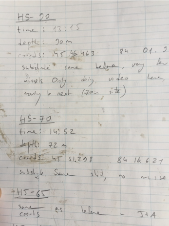{width="3.12in" height="2.08in"}
::::
:::::::

## Today's Overview

::::::: columns
:::: {.column width="60%"}
Today we'll cover Chapter 1 in Whitlock and Schluter:

- Study design
- Causality in ecology
- Experimental design: replication, controls, randomization, independence
- Sampling in field studies
- Power analysis: *a priori* and *post hoc*
- Study design and analysis

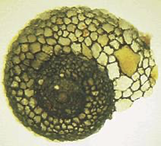{width="3.12in"}
::::

:::: {.column width="40%"}
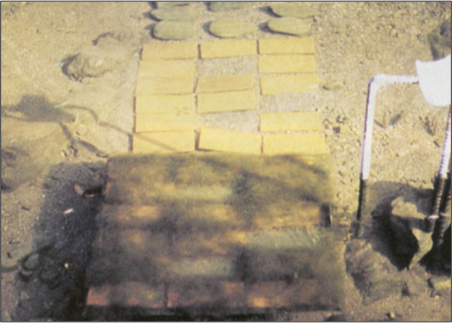{width="3.12in" height="2.07in"}

Lamberti and Resh 1983
::::
:::::::

## Part 1 · Study Design Fundamentals {.divider}

## Study Design Fundamentals

::::::: columns
:::: {.column width="60%"}
- Data analysis has close links to study design
- **Statistics cannot save a poorly designed study!**
- Key question: **what is your research question?**

Common scientific questions:

- Spatial/temporal patterns in variable Y? — what are the problems with this data?
- Effect of factor X on variable Y? — what should you be worried about, and how do you fix it?
- Are values of variable Y consistent with hypothesis H?
- What is the best estimate of parameter θ?

::: callout-note
**📖 Reference**

Gotelli & Ellison, *A Primer of Ecological Statistics*, Ch. 6 — Designing Successful Field Studies.
:::
::::

:::: {.column width="40%"}
{width="3.12in" height="2.48in"}

What sort of experiment is this design, and what are the issues with it?
::::
:::::::

## Part 2 · Causality in Ecology {.divider}

## Causality in Ecology — Introduction

::::::: columns
:::: {.column width="60%"}
- Common question: what is the **cause** of Y?
- Causality is challenging; modern statistics lacks clear language for causality
- Strength of causal inference varies with study design!
- Key factor: control of confounding variables, non-independence, and correlated variables
::::

:::: {.column width="40%"}
{width="3.12in" height="3.99in"}
::::
:::::::

## Causality in Ecology — Framework

::::::: columns
:::: {.column width="60%"}
- Common question: what is the **cause** of Y?
- Causality is challenging; modern statistics lacks clear language for causality
- Strength of causal inference varies with study design
- Key factor: control of confounding variables, non-independence, and correlated variables
::::

:::: {.column width="40%"}
{width="3.12in" height="2.58in"}
::::
:::::::

## Causality Example

::::::: columns
:::: {.column width="60%"}
**Example:** Spider and lizard populations on small islands

**Hypothesis:** On small islands, lizard predation controls spider density

We're interested in causality. How do we get there?

- What type of experiment is this?
- What are the potential problems with testing this hypothesis?
::::

:::: {.column width="40%"}
{width="2.66in" height="4.56in"}
::::
:::::::

## Part 3 · Natural vs. Manipulative Experiments {.divider}

## Natural Experiments

::::::: columns
:::: {.column width="60%"}
- Not really experiments at all!
- Utilizes natural variation in the predictor variable
- E.g., survey plots across a natural gradient of lizard density

**Potential problems:**

- Cannot determine the direction of the cause ↔ effect relationship
- Uncontrolled variables may affect results
::::

:::: {.column width="40%"}
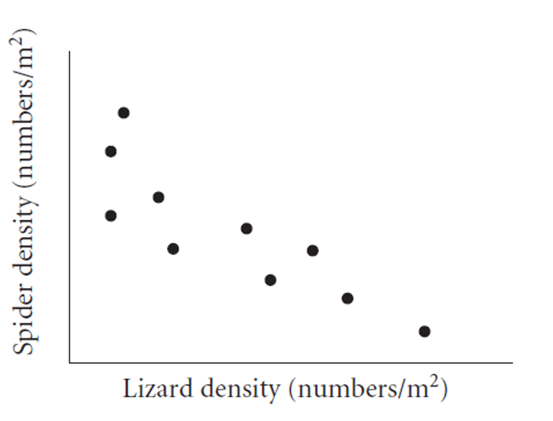{width="3.12in" height="2.77in"}
::::
:::::::

## Strengthening Natural Experiments

::::::: columns
:::: {.column width="60%"}
**Good design:** stronger inference from natural experiments.

- Reduce confounding (select plots similar in relevant ways)
- Adjust for confounding (measure relevant covariates)
- Identify and measure potential confounding variables
::::

:::: {.column width="40%"}
{width="3.12in" height="4.23in"}
::::
:::::::

## Manipulative Experiments

::::::: columns
:::: {.column width="60%"}
The experimenter directly manipulates the predictor variable and measures the response.

Randomized, controlled trials: the gold standard.

**Challenges:**

- Often restricted to small "plots"; a scale-replication trade-off
- Often restricted to small, short-lived organisms
- Often limited to a small number of treatments; a treatment-replication trade-off
- Still requires **careful control of confounding variables!**
::::

:::: {.column width="40%"}
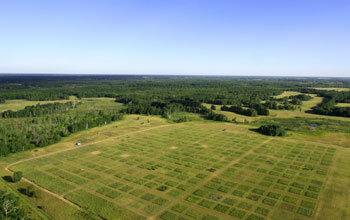{width="3.12in" height="2.88in"}

[Cedar Creek Ecosystem Science Reserve](https://www.mnmas.org/about-us)
::::
:::::::

## Part 4 · Experimental Design Principles {.divider}

## Experimental Design Principles

::::::: columns
:::: {.column width="60%"}
Main problem of study design & interpretation: **confounding variables**.

- Is the result due to X, or other factors?

Good study design seeks to eliminate confounding through:

- Replication
- Randomization
- Controls
- Independence
::::

:::: {.column width="40%"}
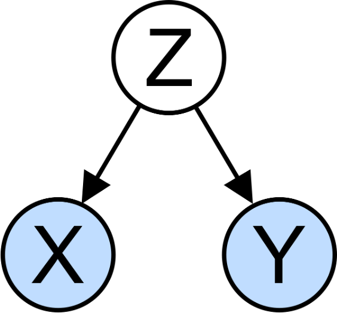{width="3.12in" height="2.08in"}
::::
:::::::

## Replication

::::::: columns
:::: {.column width="60%"}
Replication is important because:

- Ecological systems are variable
- Many statistical methods need an estimate of that variability

Without appropriate replication: is the difference due to the manipulation, or something else?

::: callout-warning
**⚠️ Watch out!**

Replication must be on the appropriate scale — match the scale of replication to the population of interest, or you'll run into **pseudoreplication** (Hurlbert 1984, *Pseudoreplication and the Design of Ecological Field Experiments*).
:::
::::

:::: {.column width="40%"}
{width="3.12in" height="2.75in"}
::::
:::::::

## Replication Examples

::::::: columns
:::: {.column width="60%"}
- **Example 1:** Effects of forest fire on soil invertebrate diversity — replicate samples from burnt and unburnt parts of *a single* forest. What hypothesis is this design addressing?
- **Example 2:** Effects of copper on barnacle settling — 2 aquaria (+Cu, control), 5 settling plates in each. Are settling plates replicates?
- **Example 3:** Effects of sewage discharge on water quality — 10 water samples above discharge, 10 below. Are samples replicates?
::::

:::: {.column width="40%"}
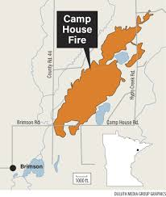{width="3.12in"}
::::
:::::::

## Consequences of Pseudoreplication

::::::: columns
:::: {.column width="60%"}
When you pseudoreplicate, you:

- Underestimate variability
- Increase the Type I error rate

Replicates must be on a scale appropriate to the population (and hypothesis!) of interest:

- Different burnt/unburnt forest areas
- Different aquaria
- Different plants and streams
::::

:::: {.column width="40%"}
{width="3.12in"}
::::
:::::::

## When Replication Is Difficult

::::::: columns
:::: {.column width="60%"}
**What if replication is impossible, difficult, or expensive?**

**Example:** effect of temperature on phytoplankton growth — 4 chambers (5, 10, 15, 20°C), 10 beakers in each. Are beakers true replicates?

**Possible solutions:**

- Rerun the experiment a few times, changing the temperature of chambers — block by time
- Try to account for all possible differences between chambers (light levels, humidity, contamination) — block by chamber
::::

:::: {.column width="40%"}
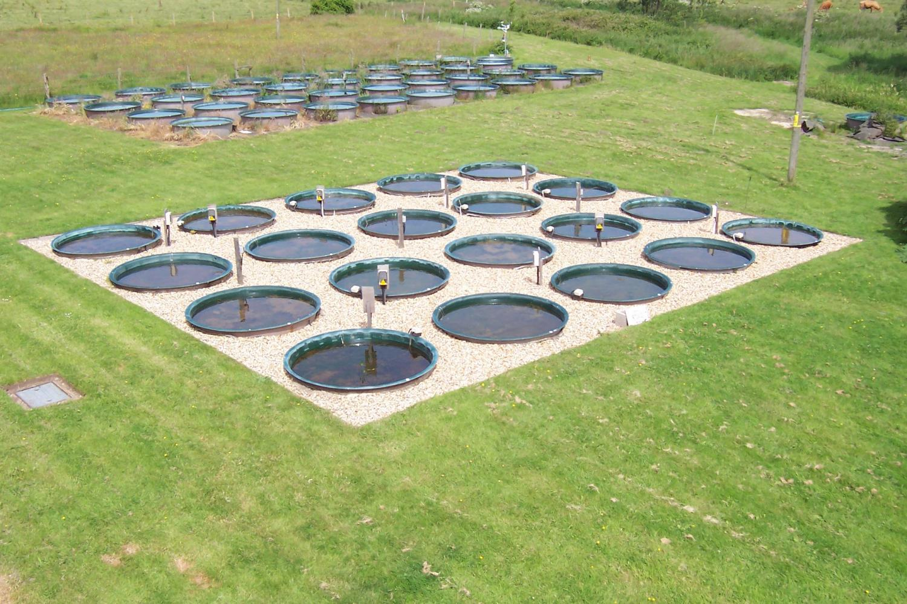{width="3.12in"}
::::
:::::::

## Controls or Reference?

::::::: columns
:::: {.column width="60%"}
**Key question:** is the response due to the manipulation/hypothesized mechanism, or an external factor?

Controls help address this question:

- Experimental units treated exactly as the manipulated units, except for the manipulation under investigation
- Can be tricky to implement; requires careful thought

**Examples:**

- In toxicology, controls and treatment groups must both be injected, but the control does not receive the substance under study
- Predator exclosures often produce "cage effects" — you need two controls: a grazer/predator control and a "cage control"
::::

:::: {.column width="40%"}
{width="3.12in" height="2.26in"}
::::
:::::::

## Activity: Designing Controls

::: callout-warning
**Activity: designing controls for pine experiments**

Work in small groups to design appropriate controls for each experiment:

1. Testing whether pine needle length is affected by a particular fertilizer
2. Testing whether pine needle density affects water retention during drought, using enclosed branches
3. Testing whether sunlight exposure affects pine seedling growth, using shade cloth

For each experiment, identify:

- What would be appropriate controls?
- What factors need to be controlled besides the main variable?
- Could there be "cage effects" or similar issues to consider?
:::

## Independence

::::::: columns
:::: {.column width="60%"}
Independence of observations is an assumption of many statistical methods. Events are independent if the occurrence of one has no effect on the occurrence of another.

- E.g., offspring of one mother for treatment, offspring of another for control

**Temporal/spatial autocorrelation:** a violation of independence.

- Values of variables at a certain place/time are correlated with values at another place/time
- "Everything is related to everything, but near things are more related than distant things"
- Special methods exist to adjust for autocorrelation
::::

:::: {.column width="40%"}
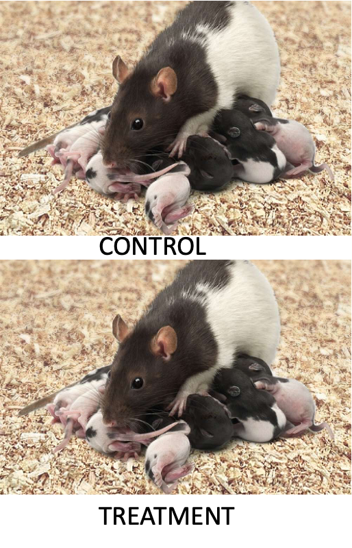{width="3.12in" height="4.11in"}
::::
:::::::

## Randomization

::::::: columns
:::: {.column width="60%"}
Randomization helps deconfound "lurking" variables — it attempts to equalize the effects of confounders.

**Random sampling from a population:**

- Experimental units should represent a random sample from the population of interest
- Ensures unbiased population estimates and inference
- E.g., animals in an experiment are a random subset of all animals that could have been used
::::

:::: {.column width="40%"}
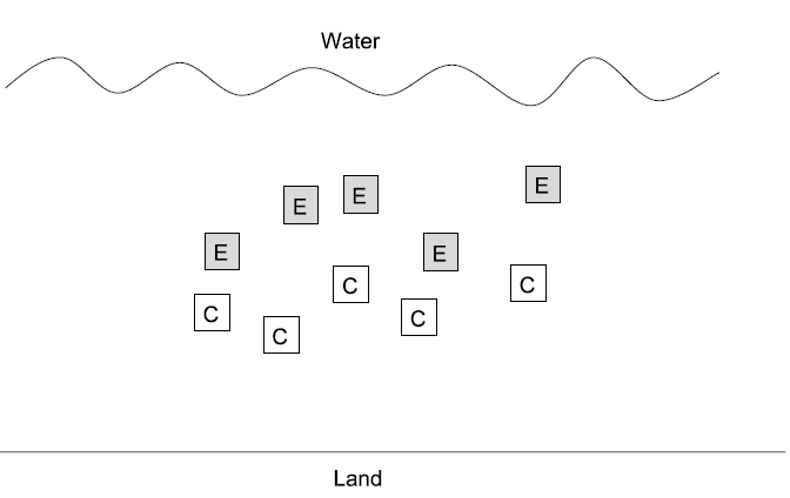{width="3.12in" height="2.20in"}
::::
:::::::

## Randomization in Practice

::::::: columns
:::: {.column width="60%"}
**Allocation of experimental units to treatment/control:**

- Experimental units must have an equal chance of being allocated to control or experimental group
- Properly done by random number generation

Randomization is essential at two levels:

- Random selection from the population
- Random assignment to treatments
::::

:::: {.column width="40%"}
```{r}
#| echo: false
#| paged-print: false
# Example of randomization in R
# Select 10 trees randomly from 100 possible trees
all_trees <- 1:100
selected_trees <- sample(all_trees, 10)

# Randomly assign 5 trees to treatment and 5 to control
treatment_trees <- sample(selected_trees, 5)
control_trees <- selected_trees[!selected_trees %in% treatment_trees]

data.frame(
  Treatment = treatment_trees,
  Control = control_trees
)
```
::::
:::::::

## Part 5 · Sampling Design in Field Studies {.divider}

## Sampling Design — Simple Random

::::::: columns
:::: {.column width="60%"}
**Simple random design:**

- All individuals/sampling units have an equal chance of being selected
- Assign a number to all possible units, select units using a random number generator
- Often tricky in ecology; haphazard sampling is a common (imperfect) alternative
- Most population estimates and tests assume random sampling

::: callout-note
**📖 Reference**

Gotelli & Ellison, Ch. 7 — A Bestiary of Experimental and Sampling Designs, covers all four sampling designs on this and the following three slides.
:::
::::

:::: {.column width="40%"}
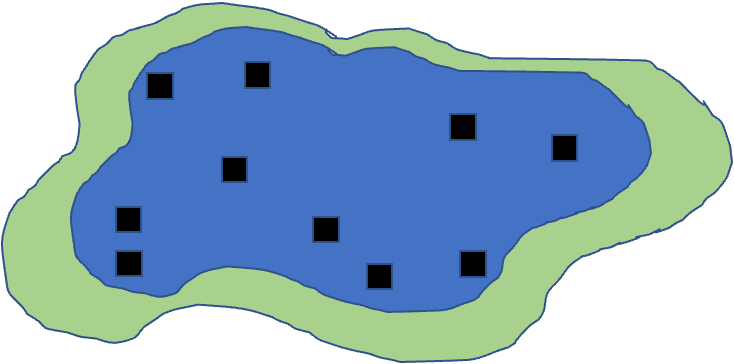{width="3.12in" height="2.23in"}
::::
:::::::

## Sampling Design — Stratified

::::::: columns
:::: {.column width="60%"}
**Stratified designs:** if there are distinct strata (groups) in the population, you may want to sample each independently.

- Samples collected from each stratum randomly, n proportional to the "size" of the stratum
- Means and variances need to be estimated using a different procedure; strata are included in the model
::::

:::: {.column width="40%"}
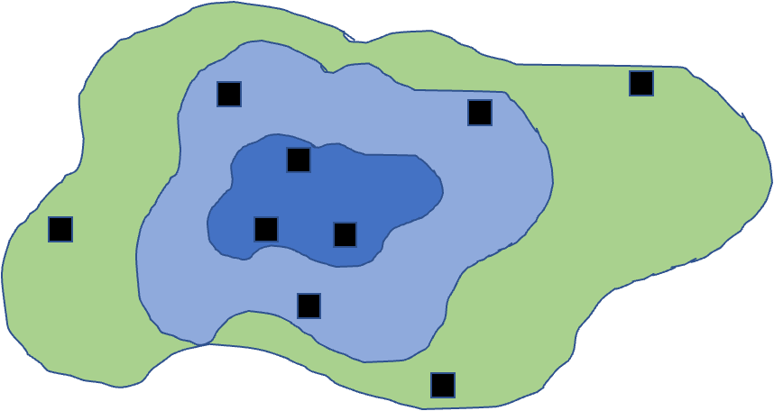{width="3.12in" height="2.50in"}
::::
:::::::

## Sampling Design — Cluster

::::::: columns
:::: {.column width="60%"}
**Cluster designs:**

- Focus on sampling subunits nested in larger units
- Used when other designs are impractical (e.g., due to cost)
- Mean calculation is easy; variance needs a modified procedure
- Nested ANOVA is often the appropriate analytical method
::::

:::: {.column width="40%"}
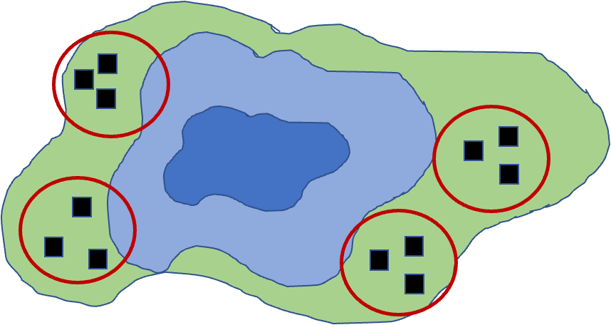{width="3.12in" height="2.60in"}
::::
:::::::

## Sampling Design — Systematic

::::::: columns
:::: {.column width="60%"}
**Systematic designs:**

- Sampling units evenly dispersed — "transect" sampling is common in ecology
- Used to determine changes along a gradient
- Risk: might coincide with some natural pattern
::::

:::: {.column width="40%"}
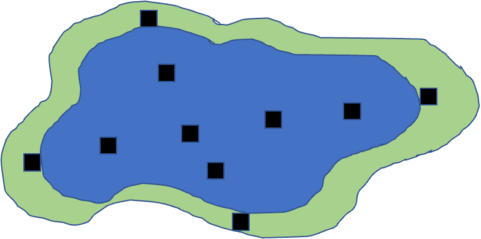{width="3.12in" height="2.34in"}
::::
:::::::

## Activity: Field Sampling Pine Trees

::: callout-note
**Activity: field sampling pine trees**

Let's consider sampling pine needles across campus:

```{r}
#| echo: false
#| fig-height: 3.4
#| fig-width: 3.4
#| fig-alt: "Scatterplot of a 10-by-10 campus grid with light grey points marking all grid locations and dark green points marking simulated pine tree locations, which are clustered toward the north (higher y-values) side of campus."
# Let's create a campus map grid (simplified)
campus_grid <- expand.grid(x = 1:10, y = 1:10)

# Place "pine trees" clustered toward the north side (higher y values)
set.seed(46)
pine_locations <- data.frame(
  x = sample(1:10, 30, replace = TRUE),
  # Using rbeta to skew distribution toward higher y values
  # Alpha=1, Beta=3 creates right-skewed distribution, then scale to 1-10 range
  y = round(rbeta(30, 3, 1) * 9 + 1)
)

ggplot() +
  geom_point(data = campus_grid, aes(x, y), color = "lightgrey", size = 0.5) +
  geom_point(data = pine_locations, aes(x, y), color = "darkgreen", size = 3) +
  theme_minimal(base_size = 9) +
  labs(title = "Pine Tree Locations on Campus Grid (North Clustered)")
```

In groups of 3–4, design a sampling strategy to:

1. Estimate average needle length across campus (simple random sampling)
2. Compare needle lengths between north and south campus areas (stratified sampling)
3. Study how needle length changes with distance from the main road (systematic sampling)

For each strategy, describe:

- How many samples you would take
- Where you would take them
- What additional variables you might measure
:::

## Part 6 · Power Analysis {.divider}

## Power Analysis Wrap-Up

::::::: columns
:::: {.column width="60%"}
- Power is an important aspect of experimental design:
  - Low power → higher likelihood of Type II error (1 − β)
  - A study's power tells us how likely we are to see an effect if one really exists
- Power analysis can be used:
  - Before the experiment (*a priori*): how many samples do we need? What effect size can we detect?
  - After the experiment (*post hoc*): was a finding of no effect due to a lack of true effect, or poor design?
- Power is a function of: effect size (ES), sample size (n), standard deviation (σ), and α (typically 0.05)
::::

:::: {.column width="40%"}
$$\text{Power} \propto \frac{ES \cdot \alpha \cdot \sqrt{n}}{\sigma}$$

::: callout-note
**📖 Reference**

Whitlock & Schluter, Ch. 14 — Designing Experiments, covers planning the sample size needed for a study.
:::
::::
:::::::

## A Priori Power Analysis

::::::: columns
:::: {.column width="60%"}
Using power analysis to plan experiments:

- **Sample size calculation:** how many samples will be needed? Need to know: desired power, variability, significance level, effect size.
- **Effect size calculation:** what kind of effect can we find, given a particular design? Need to know: desired power, variability, significance level, n.

**Cohen's d** — a standardized measure of effect size, particularly for comparing two means:

- 0.2 = small effect, 0.5 = medium effect, 0.8 = large effect
::::

:::: {.column width="40%"}
::: callout-tip
**📖 Why standardize?**

Cohen's d helps determine the *practical* significance of a finding, as opposed to just statistical significance (p-values). A Cohen's d of 0.8 means the groups differ by 0.8 standard deviations — large enough to be substantial in practical terms.
:::
::::
:::::::

## A Priori Power Analysis — Example

::::::: columns
:::: {.column width="60%"}
How many samples do you need to find this difference?

```{r}
# A priori power analysis for t-test
# How many samples needed per group?
effect_size <- 0.8  # Cohen's d
significance <- 0.05
desired_power <- 0.8

pwr.t.test(d = effect_size,
           sig.level = significance,
           power = desired_power,
           type = "two.sample")
```
::::

:::: {.column width="40%"}
::: callout-tip
**🖐 Notice**

`pwr.t.test()` solves for whichever argument you leave out — here, `n`. Leave out a different argument (e.g., `power`) and it solves for that instead.
:::
::::
:::::::

## Post Hoc Power Analysis

::::::: columns
:::: {.column width="60%"}
- Imagine you did not reject the null hypothesis — is the result still worth publishing?
- Is a non-significant result due to low power (poor design), or an actual no-effect situation?
  - You have n and an estimate of σ
  - You need to define the effect size you wanted to detect
  - In return, you get an estimate of the experiment's power
- Cohen's d is calculated as: d = (Mean1 − Mean2) / SD_pooled
::::

:::: {.column width="40%"}
::: callout-tip
**🖐 Why it matters**

Post hoc power can help convince reviewers that you are a good experimenter, but there really is no effect — please publish my non-significant finding!
:::
::::
:::::::

## Post Hoc Power Analysis — Example

::::::: columns
:::: {.column width="60%"}
```{r}
# Post hoc power analysis
# If we had n = 20 per group
effect_size <- 0.5  # Medium effect size
significance <- 0.05
sample_size <- 20  # per group

pwr.t.test(n = sample_size,
           d = effect_size,
           sig.level = 0.05,
           type = "two.sample")
```
::::

:::: {.column width="40%"}
::: callout-note
**✅ Key idea**

Same function as *a priori* power analysis — `pwr.t.test()` — just with `n` supplied and `power` left out to solve for instead.
:::
::::
:::::::

## Activity: Power Analysis for a Pine Needle Experiment

::: callout-important
**Activity: power analysis for a pine needle experiment**

Let's design a study to compare needle lengths between exposed and sheltered pine trees:

```{r}
#| fig-height: 3
#| fig-width: 3
# Based on pilot data, we have these estimates:
exposed_mean <- 75    # mm
sheltered_mean <- 85  # mm
pooled_sd <- 12        # mm

effect_size <- abs(exposed_mean - sheltered_mean) / pooled_sd
effect_size

pwr.t.test(d = effect_size,
           sig.level = 0.05,
           power = 0.8,
           type = "two.sample")
```
:::

## Activity: Power Curve Visualization

::: callout-important
**Activity: power analysis for a pine needle experiment**

```{r}
#| echo: false
#| fig-height: 3.2
#| fig-width: 3.6
#| fig-alt: "Line plot of statistical power versus sample size per group (5 to 30), rising from low power at small sample sizes toward 1 as sample size increases, with a dashed red horizontal reference line at 80% power marking the sample size needed to reach adequate power."
sample_sizes <- seq(5, 30, by = 1)
power_values <- sapply(sample_sizes, function(n) {
  power <- pwr.t.test(n = n,
                     d = effect_size,
                     sig.level = 0.05,
                     type = "two.sample")$power
  return(power)
})

power_df <- data.frame(
  sample_size = sample_sizes,
  power = power_values
)

ggplot(power_df, aes(x = sample_size, y = power)) +
  geom_line(color = "blue", linewidth = 1) +
  geom_hline(yintercept = 0.8, linetype = "dashed", color = "red") +
  theme_minimal(base_size = 9) +
  labs(title = "Power Analysis for Pine Needle Study",
       x = "Sample Size (per group)",
       y = "Statistical Power")
```

**Questions:**

1. How many trees should we sample to achieve 80% power?
2. If we can only sample 5 trees per group, what is our power?
3. How would increasing variability (SD) affect our sample size requirements?
:::

## Part 7 · Wrap-Up {.divider}

## Study Design and Analysis

::::::: columns
:::: {.column width="60%"}
- Study design is closely linked to statistical analysis
- Recall: categorical vs. continuous variables; dependent vs. independent variables
- The nature of your variables dictates the analytical approach:
  - Match your analysis to your design
  - You cannot "fix" a poor design with fancy statistics
::::

:::: {.column width="40%"}
{width="3.12in" height="5.54in"}
::::
:::::::

## Summary and Take-Home Messages

::::::: columns
:::: {.column width="60%"}
Key concepts we covered today:

1. **Study design is critical** — statistics cannot save poor design
2. **Natural vs. manipulative experiments** — different approaches to causality
3. **Principles of good design:** replication at the right scale, proper randomization, appropriate controls, independence
4. **Power analysis** — planning for sufficient sample size
5. **Match analysis to design** — your statistical approach should follow from your experimental design
::::

:::: {.column width="40%"}
::: callout-important
**Remember:**

- Correlation ≠ causation
- Beware of pseudoreplication
- Design before you collect data
- Consider practical constraints
- Report everything transparently
:::
::::
:::::::

## References and Additional Resources

- Gotelli, N. J., & Ellison, A. M. (2012). *A Primer of Ecological Statistics* (2nd ed.). Sinauer Associates.
- Hurlbert, S. H. (1984). Pseudoreplication and the design of ecological field experiments. *Ecological Monographs*, 54(2), 187–211.
- Quinn, G. P., & Keough, M. J. (2002). *Experimental Design and Data Analysis for Biologists*. Cambridge University Press.
- Zuur, A. F., Ieno, E. N., & Elphick, C. S. (2010). A protocol for data exploration to avoid common statistical problems. *Methods in Ecology and Evolution*, 1(1), 3–14.
