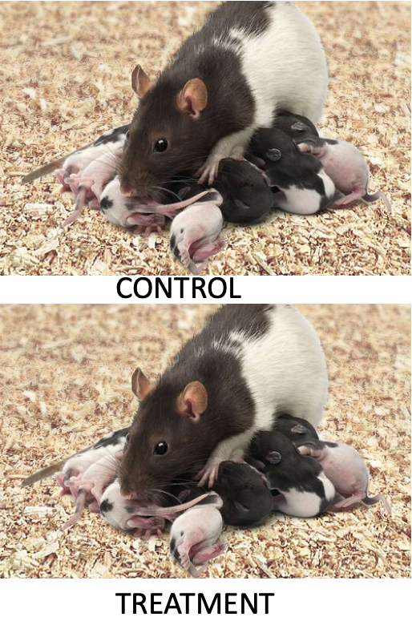

---
metadata-files:
  - ../../_templates/_lectures.yml
title: "Lecture: Study Design & Sampling"
subtitle: "Designing studies"
description: "Bias versus sampling error as the two jobs of a design: controls, randomization and blinding against bias; replication, balance and blocking against sampling error. Natural versus manipulative experiments, press and pulse designs, sampling layouts, BACI, and how each design maps onto the analysis we will run later."
categories: [Design, Sampling]
order: 9
week: 5
author: "Bill Perry"

format:
  html:
    downloads: [docx, pptx]  # This creates download links for all three
  revealjs:
    output-ext: "slides.html"
  docx:
    reference-doc: ../../ms_templates/custom-reference-compact.docx
    fig-width: 2.5
    fig-height: 2.5
    fig-dpi: 300
    dpi: 300            # tell Pandoc the real render dpi so it sizes figures correctly
  pptx: default
execute:
  echo: true
---

```{r study-design-sampling-01}
#| message: false
#| warning: false
#| include: false
library(tidyverse)
library(patchwork)
library(pwr)         # power analysis
library(effectsize)  # cohens_d()

source("themes_functions/r_themes_and_functions.R")

set.seed(42)

# ---- numbers reused in the text below, computed once ----
pine_df <- read_csv("data/pine_data.csv", show_col_types = FALSE)

p_df <- pine_df %>%
  group_by(team, side) %>%
  summarise(needle_length_mm = mean(needle_length_mm, na.rm = TRUE),
            .groups = "drop")

pine_wide <- p_df %>%
  pivot_wider(names_from = side, values_from = needle_length_mm)

d_unpaired <- abs(cohens_d(needle_length_mm ~ side, data = p_df)$Cohens_d)
d_paired   <- abs(cohens_d(pine_wide$sunny, pine_wide$shady, paired = TRUE)$Cohens_d)

n_unpaired_80 <- ceiling(pwr.t.test(d = d_unpaired, power = 0.80,
                                    sig.level = 0.05, type = "two.sample")$n)
n_paired_80   <- ceiling(pwr.t.test(d = d_paired, power = 0.80,
                                    sig.level = 0.05, type = "paired")$n)
```

## Where We Left Off

::::::: columns
:::: {.column width="60%"}
Covered last time:

- Type I and Type II error, and the decision table
- **Power** — the chance of detecting an effect that is really there
- *A priori* power to plan a study, retrospective power to plan the *next* one
- Pairing our four trees took the study from needing `r 2 * n_unpaired_80` trees to needing `r n_paired_80`

::: callout-note
**✅ Key idea from last lecture**

Power is a property of a **design**, not of a test. Last time we measured it. Today we build the thing being measured — and we do it before any data exist.
:::
::::

:::: {.column width="40%"}
{width="3.12in" height="2.08in"}
::::
:::::::

## Today's Overview

::::::: columns
:::: {.column width="60%"}
One idea organizes the whole lecture:

> A design has exactly **two jobs** — get rid of **bias**, and shrink **sampling error**. Every technique today does one or the other.

- **Bias** → controls, randomization, blinding
- **Sampling error** → replication, balance, blocking
- Then: sampling layouts in the field, and which analysis each design leads to

::: callout-note
**📖 Reading**

Whitlock & Schluter, Ch. 14 — Designing Experiments (§14.4 is bias, §14.5 is sampling error) and Ch. 1 — Statistics and Samples. Gotelli & Ellison, Ch. 6 — Designing Successful Field Studies, and Ch. 7 — A Bestiary of Experimental and Sampling Designs.
:::
::::

:::: {.column width="40%"}
{width="3.12in" height="2.07in"}

Lamberti and Resh 1983
::::
:::::::

## Part 1 · Bias and Sampling Error {.divider}

## The Two Ways an Estimate Goes Wrong

::::::: columns
:::: {.column width="60%"}
Your study produces an estimate. It can miss the truth two different ways:

- **Bias** — your estimate is centred on the *wrong value*. Collect more data and you converge, confidently, on the wrong answer.
- **Sampling error** — your estimate is centred on the *right value* but bounces around it. Collect more data and it tightens up.

**This distinction is the whole lecture**, because the two problems have completely different cures:

| Problem | Gets worse with | Cured by |
|---------------|--------------|-------------------|
| Bias | nothing — more data does not help | controls, randomization, blinding |
| Sampling error | small n, high variance | replication, balance, blocking |

::: callout-important
**⚠️ Why this matters more than any test**

A p-value describes sampling error only. **No statistical test can detect bias in your own design.** That is why design comes first.
:::
::::

:::: {.column width="40%"}
{width="3.12in" height="2.08in"}

A confounder is a bias machine: it moves the estimate off the truth, and it does not care how many samples you take.
::::
:::::::

## Start From the Question

::::::: columns
:::: {.column width="60%"}
Before either job, one question: **what is your research question?**

Gotelli & Ellison's four canonical forms:

- Spatial or temporal **pattern** in Y?
- **Effect** of factor X on Y?
- Are values of Y **consistent with** hypothesis H?
- What is the best **estimate** of parameter θ?

Each one implies a different design. "I will go measure some things and see what turns up" implies none of them.

::: callout-note
**📖 Reference**

Gotelli & Ellison, Ch. 6 — Designing Successful Field Studies.
:::
::::

:::: {.column width="40%"}
{width="3.12in"}
::::
:::::::

## Part 2 · Causality and the Inference Gradient {.divider}

## How Much Causal Weight Can a Design Carry?

::::::: columns
:::: {.column width="60%"}
- The question we usually want answered is **what causes Y?**
- Statistics has no test for causality — **the design carries the causal claim**, not the analysis
- Strength of causal inference runs on a gradient, and what moves you up it is **control of confounding**

From weakest to strongest:

1. Observational field study
2. Field study with measured covariates
3. Randomized, controlled experiment

::: callout-warning
**⚠️ The same regression, three different claims**

`lm(y ~ x)` returns the identical output at all three levels. What changes is what you are *entitled to say* about it.
:::
::::

:::: {.column width="40%"}
{width="3.12in" height="3.99in"}
::::
:::::::

## Causality Example — Spiders and Lizards

::::::: columns
:::: {.column width="60%"}
**Hypothesis:** on small islands, lizard predation controls spider density.

Ask, in order:

- What **type** of study could test this?
- What could produce a lizard–spider correlation with **no causal link at all**?
- What would you have to **measure** to rule that out? What would you have to **manipulate**?

::: callout-note
**✅ Where we are going**

We will answer this twice today — once as a natural experiment, once as a manipulative one — and the design, not the statistics, is what differs.
:::
::::

:::: {.column width="40%"}
{width="2.66in" height="4.56in"}
::::
:::::::

## Part 3 · Natural and Manipulative Experiments {.divider}

## Natural Experiments

::::::: columns
:::: {.column width="60%"}
Not experiments at all — you use **natural variation** in the predictor. Survey plots across an existing gradient of lizard density.

**What you gain:** real scale, real systems, long time spans, questions you could never manipulate.

**What you give up:**

- Direction of causation is not identified — lizards may eat spiders, or spiders may feed lizards
- Uncontrolled variables ride along with the predictor

::: callout-note
**📖 Reference**

Whitlock & Schluter §14.7 — "What if you can't do experiments?" — is exactly this problem, and covers **matching** and **adjusting for covariates** as the two partial fixes.
:::
::::

:::: {.column width="40%"}
{width="3.12in" height="2.77in"}
::::
:::::::

## Strengthening a Natural Experiment

::::::: columns
:::: {.column width="60%"}
You cannot randomize, so you attack confounding directly:

- **Reduce** it — choose plots that are alike in everything except lizard density (this is **matching**)
- **Adjust** for it — measure the covariates and put them in the model
- **Name** it — you cannot adjust for a confounder you never wrote down

Know which one you have:

- A **confounder** drives both X and Y — you must adjust for it
- A **mediator** sits on the causal path X → M → Y — adjusting for it *removes the effect you are trying to measure*

::: callout-warning
**⚠️ Same variable, opposite advice**

Moisture as a confounder: control for it. Moisture as a mediator: controlling for it destroys your result. Only the biology tells you which — no diagnostic will.
:::
::::

:::: {.column width="40%"}
{width="3.12in" height="4.23in"}
::::
:::::::

## Manipulative Experiments

::::::: columns
:::: {.column width="60%"}
You set the predictor yourself and measure the response. Randomized and controlled, this is the strongest design available.

**What it costs you** — Gotelli & Ellison's trade-offs:

- **Scale for replication** — replicable plots are small plots
- **Organism for tractability** — small, short-lived species
- **Treatments for replication** — every extra treatment level costs replicates
- Confounding does **not** disappear; you now own it
::::

:::: {.column width="40%"}
{width="3.12in" height="2.88in"}

[Cedar Creek Ecosystem Science Reserve](https://www.mnmas.org/about-us)
::::
:::::::

## Press, Pulse, Snapshot, Trajectory

::::::: columns
:::: {.column width="60%"}
Gotelli & Ellison's two axes for manipulations — and they answer different questions:

- **Pulse** — apply the treatment once, then walk away. Measures **recovery**: how fast does the system bounce back?
- **Press** — maintain the treatment continuously. Measures the **new equilibrium** the system settles into.

And for sampling the response:

- **Snapshot** — measure once at the end. Cheap, and blind to everything in between.
- **Trajectory** — measure repeatedly through time. Expensive, and the only way to see dynamics.

::: callout-important
**⚠️ A snapshot can hide a complete reversal**

Many treatment effects change sign as a system responds. Measure once, at one time, and you get whichever answer that moment happened to hold.
:::
::::

:::: {.column width="40%"}
{width="3.12in"}

Mesocosms let you press a treatment *and* follow a trajectory — at the cost of scale.
::::
:::::::

## Part 4 · Job One: Getting Rid of Bias {.divider}

## Controls — and Why One Is Usually Not Enough

::::::: columns
:::: {.column width="60%"}
A control is a unit treated **exactly** like the manipulated units, except for the one thing under investigation.

That word *exactly* is where designs fail. Your manipulation almost always does something besides the thing you care about:

- **Toxicology:** controls get injected too — same needle, same handling, no toxin
- **Predator exclosures:** a cage changes flow, light and sediment. You need *two* controls — an open plot **and** a cage-with-holes
- **Anything you attach, bury, or visit** does something merely by being attached, buried or visited

::: callout-note
**Vocabulary**

The second kind is a **procedural** or **sham** control. Next slide: real data where forgetting it would have produced a completely wrong paper.
:::
::::

:::: {.column width="40%"}
{width="3.12in" height="2.26in"}
::::
:::::::

## A Sham Control Earns Its Keep — Sponges on Mangrove Roots

::::::: columns
:::: {.column width="55%"}
Ellison, Farnsworth & Twilley (1996) asked whether epibiont sponges promote mangrove root growth. Four treatments, **14 roots each**:

```{r study-design-sampling-02}
#| message: false
sponge_df <- read_csv("data/sponge_root_growth.csv")

sponge_df %>%
  group_by(treatment) %>%
  reframe(summary_stats(growth_mm_d))
```

- `Control` — bare root
- `Foam` — inert foam, the **sham control**
- `Haliclona`, `Tedania` — the two sponges
::::

:::: {.column width="45%"}
::: callout-note
**Read the means before the tests**

Bare root grows slowest. Foam — which is not alive — grows nearly as fast as the sponges. That ordering is the whole story.
:::
::::
:::::::

## The Sponge Result, in Two Tests

::::::: columns
:::: {.column width="55%"}
```{r study-design-sampling-03}
# Is there an artifact of having ANYTHING attached?
t.test(growth_mm_d ~ treatment,
       data = filter(sponge_df,
                     treatment %in% c("Control", "Foam")))
```

```{r study-design-sampling-04}
# Do the living sponges beat the inert foam?
sponge_df %>%
  filter(treatment != "Control") %>%
  mutate(kind = if_else(treatment == "Foam", "sham", "sponge")) %>%
  t.test(growth_mm_d ~ kind, data = .)
```
::::

:::: {.column width="45%"}
::: callout-important
**⚠️ The paper you would have written without the foam**

- `Control` vs `Foam`: **p = 0.021** — the *inert* object significantly increases root growth
- `Foam` vs sponges: **p = 0.33** — the living sponges add nothing detectable

With only a bare control you would have reported "sponges promote root growth," with a real p-value and a clean figure. The effect is mostly **having an object attached**.

**The sham control is what stands between a correct result and a confident wrong one.**
:::
::::
:::::::

## Randomization

::::::: columns
:::: {.column width="60%"}
Randomization is how you deconfound the variables you never thought of. It works at **two** levels, and both matter:

1. **Selection** — which units enter the study. Makes the sample represent the population.
2. **Assignment** — which unit gets which treatment. Makes the groups exchangeable *before* treatment.

Haphazard is not random. "Whichever tree I reached first" correlates with trail access, which correlates with light, soil and disturbance.

```{r study-design-sampling-05}
# Selection: 10 trees from the 100 in the stand
selected <- sample(1:100, 10)

# Assignment: 5 to treatment, the rest to control
treated <- sample(selected, 5)

tibble(tree = selected,
       group = if_else(tree %in% treated, "treatment", "control")) %>%
  arrange(group)
```
::::

:::: {.column width="40%"}
{width="3.12in" height="2.20in"}

::: callout-tip
**🖐 `set.seed()` makes it reproducible, not less random**

Record the seed and anyone can reconstruct exactly which trees you assigned where.
:::
::::
:::::::

## Blinding

::::::: columns
:::: {.column width="60%"}
The measurer's expectations leak into the measurements. This is a **bias**, so no amount of data fixes it.

- **Single-blind** — the subject does not know the treatment
- **Double-blind** — the person *measuring* does not know either
- A **placebo** is what makes subject-blinding possible at all

W&S spend most of Ch. 14's opening on this because medicine learned it the hard way. Ecology mostly has not.

::: callout-important
**⚠️ This lands on our own study**

You measured needles **knowing** which side of the tree they came from, and knowing the hypothesis. Nobody cheated. But "is this needle bent or straight, include it or not" is a judgement call, and judgement calls drift toward the expected answer.

The fix is cheap: someone relabels the envelopes, you measure blind to `side`.
:::
::::

:::: {.column width="40%"}
{width="3.12in" height="2.58in"}

Expectation is a powerful thing.
::::
:::::::

## Part 5 · Job Two: Shrinking Sampling Error {.divider}

## Replication — and at What Scale

::::::: columns
:::: {.column width="60%"}
Replication does two jobs: it shrinks the standard error, and it is the **only** way to estimate variability at all.

The hard part is never *how many*. It is **of what**.

- **Fire and soil invertebrates:** samples from burnt and unburnt parts of *one* forest. What population does that describe? One forest.
- **Copper and barnacles:** 2 aquaria, 5 plates each. `n = 2`, not 10.
- **Sewage and water quality:** 10 samples above the outfall, 10 below. `n = 1` above and `n = 1` below — one location each.

::: callout-warning
**⚠️ The rule**

Replicates must vary at the scale your **hypothesis** applies to. Anything finer is **pseudoreplication** (Hurlbert 1984), and it shrinks your SE without adding information — a bias dressed as precision.
:::
::::

:::: {.column width="40%"}
{width="3.12in"}
::::
:::::::

## We Already Fixed This Once

::::::: columns
:::: {.column width="60%"}
Our own pine data has 64 rows and **8 trees' worth of sides** — 4 trees, two sides each.

Every analysis we have run since Week 4 starts by averaging the 8 needles per side away:

```{r study-design-sampling-06}
p_df
```

That `group_by() %>% summarise()` is not data cleaning. It is the line where we choose the **tree** as the experimental unit, because the tree is what the hypothesis is about.
::::

:::: {.column width="40%"}
{width="3.12in"}

One tank, many measurements, `n = 1`.
::::
:::::::

## Balance

::::::: columns
:::: {.column width="60%"}
For a fixed total effort, **equal group sizes give the smallest standard error** on the difference.

- 10 and 10 beats 15 and 5, using the same 20 units
- Balance also makes the tests robust: unequal variances hurt far less when n is equal
- Unbalanced designs are harder to interpret in ANOVA — sums of squares stop being unique (we will hit this in Week 9)

::: callout-tip
**🖐 When imbalance is not your fault**

Mortality, lost plots and weather happen. Balance is a design goal, not a moral requirement — but *plan* for balance, and report what you actually ended up with.
:::
::::

:::: {.column width="40%"}
::: callout-note
**📖 Reference**

Whitlock & Schluter §14.5 — reducing the influence of sampling error: replication, balance, blocking, and choosing extreme treatment levels.
:::

::: callout-note
**Extreme treatments**

If you want to detect a dose response with few replicates, spread your doses wide. Four doses clustered near the middle waste your replicates on a range where nothing happens.
:::
::::
:::::::

## Blocking — and What Our Paired Design Really Was

::::::: columns
:::: {.column width="60%"}
**Blocking:** group the units into sets that are alike, then randomize treatments *within* each set. Variation among blocks is removed from the comparison instead of contaminating it.

- Chambers differ? Run every temperature in every chamber — **block by chamber**
- Days differ? Run all treatments each day — **block by time**
- Ridiculously variable sites? Put all treatments at each site

::: callout-important
**✅ A paired design is a block of size two**

Two sides of the *same tree* share genotype, soil, age and history. Pairing removes all of it from the comparison. That is why `r n_paired_80` trees do the work of `r 2 * n_unpaired_80`.

**Non-independence you ignore costs you. Non-independence you plan for pays you.** Blocking is how you get paid.
:::

Blocked designs need blocked *analyses* — Week 9 and Week 10.
::::

:::: {.column width="40%"}
```{r study-design-sampling-07}
#| echo: false
#| fig-height: 3.2
#| fig-width: 3.4
#| fig-alt: "Line plot of mean needle length for the shady and sunny side of each of the four trees, one line per tree. Every line slopes upward from shady to sunny, but the four lines sit at clearly different heights, showing that most of the variation is between trees and pairing removes it."
p_df %>%
  ggplot(aes(side, needle_length_mm, group = team, colour = team)) +
  geom_line(linewidth = 0.9) +
  geom_point(size = 2.6) +
  theme_regular(base_size = 9) +
  theme(legend.position = "none") +
  labs(title = "Four trees, four blocks",
       x = "Side", y = "Mean needle length (mm)")
```

Every tree slopes the same way. The trees sit at different heights. Blocking keeps the slope and throws away the heights.
::::
:::::::

## Independence and Autocorrelation

::::::: columns
:::: {.column width="60%"}
Most tests assume observations are **independent** — knowing one tells you nothing about another.

**Autocorrelation** is the standard violation: things near each other in space or time resemble each other.

> "Everything is related to everything, but near things are more related than distant things."

- Samples 1 m apart on a transect are not two independent samples
- Measurements on consecutive days are not independent
- Offspring of one mother are not independent of each other

The fix is either design (space samples beyond the correlation range) or model (Week 10 and beyond).
::::

:::: {.column width="40%"}
{width="3.12in" height="4.11in"}
::::
:::::::

## Part 6 · Sampling Layouts in the Field {.divider}

## Simple Random and Stratified

::::::: columns
:::: {.column width="50%"}
**Simple random** — every unit has an equal chance of selection. Number the units, draw with a random number generator.

- What nearly every test assumes you did
- Genuinely awkward in the field; *haphazard* is the common substitute, and it is not the same thing

**Stratified** — if the population has distinct strata, sample each one separately, with n proportional to stratum size.

- **More precise than simple random** when strata differ, because within-stratum variance is all that is left
- Strata must go **into the model**, not be ignored
::::

:::: {.column width="25%"}
{width="2.4in"}

Simple random
::::

:::: {.column width="25%"}
{width="2.4in"}

Stratified
::::
:::::::

## Cluster and Systematic

::::::: columns
:::: {.column width="50%"}
**Cluster** — sample subunits nested inside larger units. Used when travel or access makes anything else impossible.

- Cheap, and **less** precise than simple random for the same total n
- The clusters are your replicates → **nested ANOVA** (Week 9) or a mixed model (Week 10)

**Systematic** — units evenly spaced; the transect is the ecological classic.

- Ideal for describing change **along a gradient**
- One real risk: your spacing lines up with a periodicity in the system
::::

:::: {.column width="25%"}
{width="2.4in"}

Cluster
::::

:::: {.column width="25%"}
{width="2.4in"}

Systematic
::::
:::::::

## BACI — When You Cannot Randomize an Impact

::::::: columns
:::: {.column width="60%"}
Nobody randomizes an oil spill. **Before–After–Control–Impact** is the design for impacts you did not choose:

- Measure **before** and **after**, at both an **impact** site and a **control** site
- The evidence is the **interaction**: did impact-versus-control *change* from before to after?
- Before/after alone confounds the impact with time. Control/impact alone confounds it with place. You need both.

::: callout-warning
**⚠️ Look at the figure — what is missing?**

Visited beach versus restricted beach, measured once. Real difference, real data. But the beaches may always have differed. With **no "before,"** the impact and the site are inseparable.
:::

BACI is a factorial design with an interaction → Week 9.
::::

:::: {.column width="40%"}
{width="3.12in" height="2.48in"}
::::
:::::::

## Part 7 · Sample Size Is a Design Decision {.divider}

## How Big, Decided Before You Start

::::::: columns
:::: {.column width="60%"}
We did the mechanics last lecture. The design point is the one worth keeping:

- Power rises with the **effect size**, with **√n**, and with **α** — and falls as **σ** rises
- **Type II error is β. Power is 1 − β.**
- Two ways to run it *a priori*: solve for the **n** you need, or for the **effect size** your affordable n could detect

```{r study-design-sampling-08}
# Our pine pilot, unpaired vs paired — same trees, same needles
pwr.t.test(d = d_paired, power = 0.80,
           sig.level = 0.05, type = "paired")$n
```

**`r n_unpaired_80` trees per side (`r 2 * n_unpaired_80` total) unpaired, versus `r n_paired_80` trees paired.** Nothing changed but the design.
::::

:::: {.column width="40%"}
::: callout-note
**Plan for precision, not just for power**

W&S §14.6 frames this as planning the **width of your confidence interval**. "How precise will my estimate be?" is often the more honest question than "will I get a star?"
:::

::: callout-important
**⚠️ Retrospective power, one more time**

Computing power from the effect size you *observed* re-expresses your p-value and tells you nothing new. Use it to plan the next study. To argue *for* no effect, use an equivalence test or a CI that excludes anything meaningful.
:::
::::
:::::::

## Part 8 · From Design to Analysis {.divider}

## Your Design Chooses Your Analysis

::::::: columns
:::: {.column width="60%"}
This is Gotelli & Ellison Ch. 7's whole point, and it is also the rest of this course. **Write the design down and the analysis is already decided:**

| Your design | The analysis | When |
|-----------------|-------------------|--------|
| One continuous predictor | Regression | Week 6 |
| Several continuous predictors | Multiple regression | Week 7 |
| One categorical factor | One-way ANOVA | Week 8 |
| Two crossed factors, or BACI | Two-way ANOVA + interaction | Week 9 |
| Subsamples inside units; clusters | Nested ANOVA | Week 9 |
| Blocks, repeated measures, split-plot | Mixed model | Week 10 |
| Counts, or presence/absence | GLM | Week 11 |
| Factor plus a continuous covariate | ANCOVA | Week 12 |

::: callout-important
**You cannot choose your analysis at the end**

You chose it the day you decided what to measure and how to lay it out. Everything after that is bookkeeping.
:::
::::

:::: {.column width="40%"}
{width="3.12in" height="5.54in"}
::::
:::::::

## Summary

::::::: columns
:::: {.column width="60%"}
1. A design has two jobs: **kill bias**, **shrink sampling error**. No test does either for you.
2. **Bias** → controls (usually more than one), randomization at both levels, blinding.
3. **Sampling error** → replication at the right scale, balance, blocking.
4. **Natural experiments** buy realism with causal ambiguity; manipulations buy inference with scale. Press or pulse, snapshot or trajectory — choose deliberately.
5. **Replicate the thing your hypothesis is about.** Pseudoreplication buys false precision.
6. **Your design has already chosen your analysis.**
::::

:::: {.column width="40%"}
::: callout-important
**The sponge slide, if you remember nothing else**

The inert foam grew roots almost as well as the living sponges. Without that sham control, the paper reports a sponge effect — correctly analysed, properly significant, and wrong.

Design is not the paperwork before the science. It *is* the science.
:::
::::
:::::::

## Readings

- **Whitlock & Schluter**, Ch. 14 — Designing Experiments (§14.4 bias; §14.5 sampling error; §14.6 planning for precision; §14.7 observational studies), and Ch. 1 — Statistics and Samples.
- **Gotelli & Ellison**, Ch. 6 — Designing Successful Field Studies, and Ch. 7 — A Bestiary of Experimental and Sampling Designs.
- Hurlbert, S. H. (1984). Pseudoreplication and the design of ecological field experiments. *Ecological Monographs*, 54(2), 187–211.
- Ellison, A. M., Farnsworth, E. J., & Twilley, R. R. (1996). Facultative mutualism between red mangroves and root-fouling sponges in Belizean mangal. *Ecology*, 77(8), 2431–2444.
- Quinn, G. P., & Keough, M. J. (2002). *Experimental Design and Data Analysis for Biologists*. Cambridge University Press.
