---
metadata-files:
  - ../../_templates/_lectures.yml
title: "Lecture: Study Design & Sampling"
subtitle: "Designing studies"
description: "Bias versus sampling error as the two jobs of a design: controls, randomization and blinding against bias; replication, balance and blocking against sampling error. Natural versus manipulative experiments, press and pulse designs, sampling layouts, BACI, and how each design maps onto the analysis we will run later."
categories: [Design, Sampling]
order: 9
week: 5
author: "Bill Perry"

format:
  html:
    downloads: [docx, pptx]  # This creates download links for all three
  revealjs:
    output-ext: "slides.html"
  docx:
    reference-doc: ../../ms_templates/custom-reference-compact.docx
    fig-width: 2.5
    fig-height: 2.5
    fig-dpi: 300
    dpi: 300            # tell Pandoc the real render dpi so it sizes figures correctly
  pptx: default
execute:
  echo: true
---

```{r study-design-sampling-01}
#| message: false
#| warning: false
#| include: false
library(tidyverse)
library(patchwork)
library(pwr)         # power analysis
library(effectsize)  # cohens_d()

source("themes_functions/r_themes_and_functions.R")

set.seed(42)

# ---- numbers reused in the text below, computed once ----
pine_df <- read_csv("data/pine_data.csv", show_col_types = FALSE)

p_df <- pine_df %>%
  group_by(team, side) %>%
  summarise(needle_length_mm = mean(needle_length_mm, na.rm = TRUE),
            .groups = "drop")

pine_wide <- p_df %>%
  pivot_wider(names_from = side, values_from = needle_length_mm)

d_unpaired <- abs(cohens_d(needle_length_mm ~ side, data = p_df)$Cohens_d)
d_paired   <- abs(cohens_d(pine_wide$sunny, pine_wide$shady, paired = TRUE)$Cohens_d)

n_unpaired_80 <- ceiling(pwr.t.test(d = d_unpaired, power = 0.80,
                                    sig.level = 0.05, type = "two.sample")$n)
n_paired_80   <- ceiling(pwr.t.test(d = d_paired, power = 0.80,
                                    sig.level = 0.05, type = "paired")$n)
```

## Where We Left Off

:::::: columns
:::: {.column width="60%"}
Covered last time:

- Type I and Type II error, and the decision table
- **Power** — the chance of detecting an effect that is really there
- *A priori* power to plan a study, retrospective power to plan the *next* one
- Pairing our four trees took the study from needing `r 2 * n_unpaired_80` trees to needing `r n_paired_80`

::: callout-note
**✅ Key idea from last lecture**

Power is a property of a **design**, not of a test. Last time we measured it. Today we build the thing being measured — and we do it before any data exist.
:::
::::

::: {.column width="40%"}
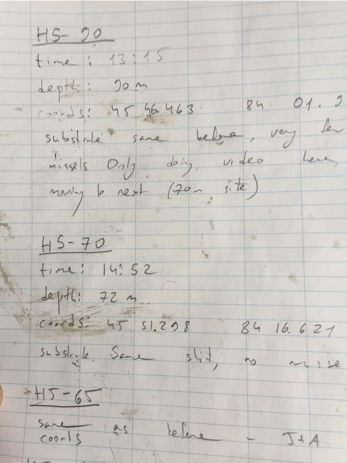{fig-alt="Handwritten field notebook page of site data." width="2.31in" height="2.65in"}
:::
::::::

## Today's Overview

:::::: columns
:::: {.column width="60%"}
One idea organizes the whole lecture:

> A design has exactly **two jobs** — get rid of **bias**, and shrink **sampling error**. Every technique today does one or the other.

- **Bias** → controls, randomization, blinding
- **Sampling error** → replication, balance, blocking
- Then: sampling layouts in the field, and which analysis each design leads to

::: callout-note
**📖 Reading**

Whitlock & Schluter, Ch. 14 — Designing Experiments (§14.4 is bias, §14.5 is sampling error) and Ch. 1 — Statistics and Samples. Gotelli & Ellison, Ch. 6 — Designing Successful Field Studies, and Ch. 7 — A Bestiary of Experimental and Sampling Designs.
:::
::::

::: {.column width="40%"}
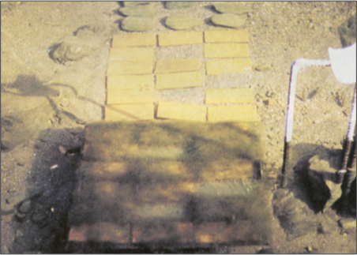{fig-alt="Grazed and ungrazed tiles on a streambed." width="3.12in" height="2.07in"}

Lamberti and Resh 1983
:::
::::::

## 🗳️ How Today Works

::: callout-warning
**🗳️ Five times today, you make the call**

Five slides are marked **🗳️ DECIDE**. Each one asks a multiple-choice question and I will *not* tell you the answer on that slide.

**How it works:** write your letter down — actually write it — then hold up fingers 1–4. If the room splits, turn to the person next to you, argue for ninety seconds, and we vote again. Nothing here is graded. The point is that you commit before you find out.
:::

## Part 1 · Bias and Sampling Error {.divider}

## The Two Ways an Estimate Goes Wrong

::::::: columns
:::: {.column width="60%"}
Your study produces an estimate. It can miss the truth two different ways:

- **Bias** — your estimate is centred on the *wrong value*. Collect more data and you converge, confidently, on the wrong answer.
- **Sampling error** — your estimate is centred on the *right value* but bounces around it. Collect more data and it tightens up.

**This distinction is the whole lecture**, because the two problems have completely different cures:

::: callout-important
**⚠️ Why this matters more than any test**

A p-value describes sampling error only. **No statistical test can detect bias in your own design.** That is why design comes first.
:::
::::

:::: {.column width="40%"}
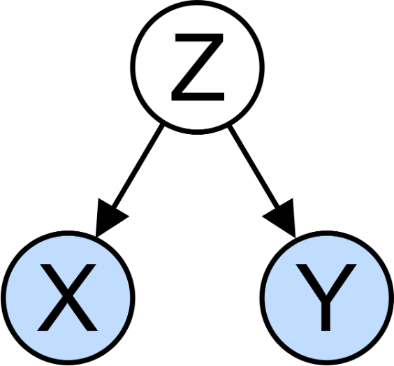{fig-alt="Confounder Z with arrows to both X and Y." width="1.74in" height="1.42in"}

A confounder is a bias machine: it moves the estimate off the truth, and it does not care how many samples you take.

::: compact-table
| Problem | Gets worse with | Cured by |
|------------------------|------------------------|------------------------|
| Bias | nothing — more data does not help | controls, randomization, blinding |
| Sampling error | small n, high variance | replication, balance, blocking |
:::
::::
:::::::

## Start From the Question

:::::: columns
:::: {.column width="60%"}
Before either job, one question: **what is your research question?**

Gotelli & Ellison's four canonical forms:

- Spatial or temporal **pattern** in Y?
- **Effect** of factor X on Y?
- Are values of Y **consistent with** hypothesis H?
- What is the best **estimate** of parameter θ?

Each one implies a different design. "I will go measure some things and see what turns up" implies none of them.

::: callout-note
**📖 Reference**

Gotelli & Ellison, Ch. 6 — Designing Successful Field Studies.
:::
::::

::: {.column width="40%"}
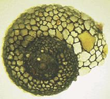{fig-alt="Grazed patch cleared of algae on a rock surface." width="2.22in"}
:::
::::::

## Part 2 · Causality and the Inference Gradient {.divider}

## The Design Carries the Causal Claim

:::::: columns
:::: {.column width="60%"}
Statistics has **no test for causality**. The design carries the causal claim; the analysis just reports numbers. Strength of inference runs on a gradient, and what moves you up it is control of confounding:

1.  Observational field study — **weak**
2.  Field study with measured covariates
3.  Randomized, controlled experiment — **strong**

**Our running example, all day:** on small islands, does lizard predation control spider density?

::: callout-warning
**⚠️ The same regression, three different claims**

`lm(spiders ~ lizards)` returns the identical output at all three levels. What changes is what you are *entitled to say* about it.
:::
::::

::: {.column width="40%"}
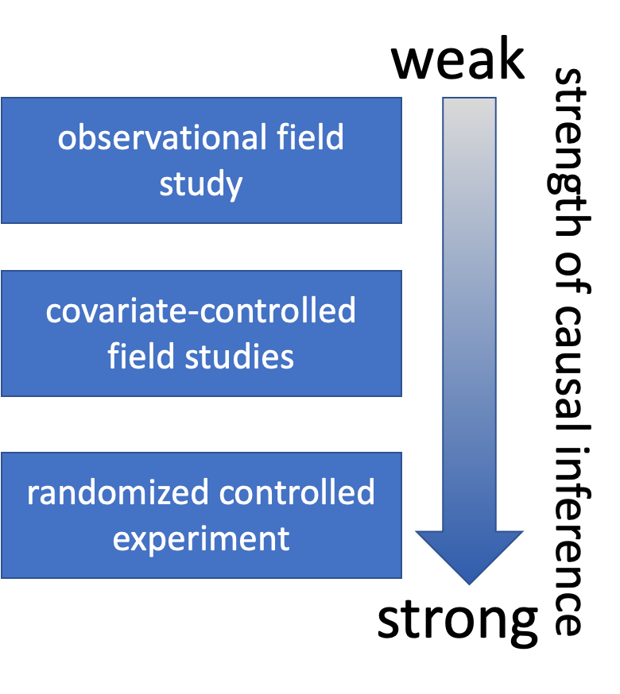{.tall-fig fig-alt="Three designs stacked from weak to strong causal inference." width="2.22in" height="2.55in"}
:::
::::::

## Part 3 · Natural and Manipulative Experiments {.divider}

## Natural Experiments

:::::: columns
:::: {.column width="60%"}
Not experiments at all — you use **natural variation** in the predictor. Survey plots across an existing gradient of lizard density.

**What you gain:** real scale, real systems, long time spans, questions you could never manipulate.

**What you give up:**

- Direction of causation is not identified — lizards may eat spiders, or spiders may feed lizards
- Uncontrolled variables ride along with the predictor

::: callout-note
**📖 Reference**

Whitlock & Schluter §14.7 — "What if you can't do experiments?" — is exactly this problem, and covers **matching** and **adjusting for covariates** as the two partial fixes.
:::
::::

::: {.column width="40%"}
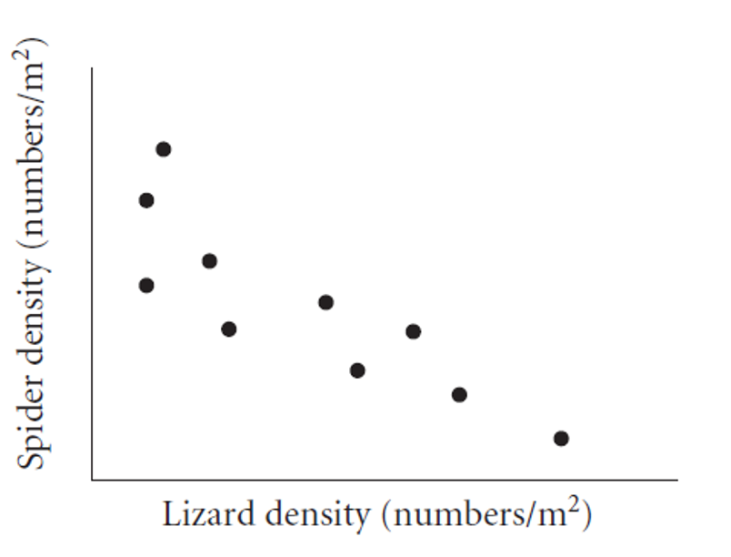{fig-alt="Spider density falls as lizard density rises." width="2.13in" height="1.95in"}
:::
::::::

## 🗳️ DECIDE · You Are the Reviewer

:::::: columns
:::: {.column width="60%"}
A manuscript lands on your desk. The authors surveyed 40 island plots and report that **spider density falls as lizard density rises**. They did not measure moisture.

You know that **moisture** is related to both lizards and spiders on these islands.

**Your review says the authors must:**

**(a)** Control for moisture — it is a confounder, and failing to control for it invalidates the result

**(b)** Not control for moisture — doing so could erase the very effect they are measuring

**(c)** Nothing yet — you cannot tell which advice is right from the data alone

**(d)** Control for moisture *and* report the uncontrolled result, letting readers choose

::: callout-warning
**✍️ Write your letter down, then vote.**
:::
::::

::: {.column width="40%"}
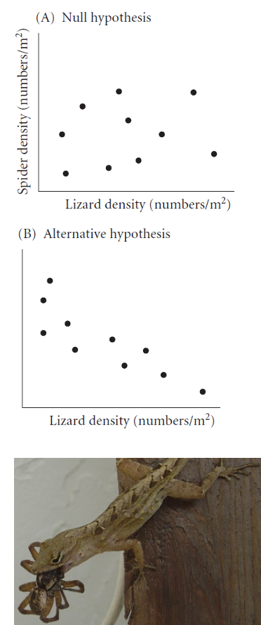{.tall-fig fig-alt="Null and alternative scatterplots, with a lizard eating a spider." width="2.01in" height="3.91in"}
:::
::::::

## The Answer · Confounder or Mediator?

:::::: columns
:::: {.column width="60%"}
::: callout-important
**✅ The answer is (c)** — and this is the uncomfortable part of observational work.

If moisture drives lizards *and* spiders independently, it is a **confounder** and (a) is right. If moisture drives lizards, which then eat spiders, it is a **mediator** on the causal path — and controlling for it deletes the effect, so (b) is right.

**The data cannot distinguish these two.** The arrows come from the biology, not from the numbers. Anyone who tells you "always control for everything you measured" is wrong.
:::
::::

::: {.column width="40%"}
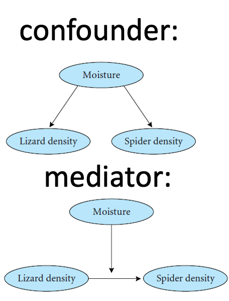{.tall-fig fig-alt="Confounder and mediator causal diagrams for moisture, lizards and spiders." width="2.04in" height="3.21in"}
:::
::::::

## Strengthening a Natural Experiment

::::: columns
::: {.column width="60%"}
You cannot randomize, so you attack confounding directly:

- **Reduce** it — choose plots that are alike in everything except lizard density (this is **matching**)
- **Adjust** for it — measure the covariates and put them in the model
- **Name** it — you cannot adjust for a confounder you never wrote down

Know which one you have — the diagrams on the right are the whole distinction:

- A **confounder** drives both X and Y — adjust for it
- A **mediator** sits on the path X → M → Y — adjusting for it removes the effect you came to measure
:::

::: {.column width="40%"}
{.tall-fig fig-alt="Confounder and mediator causal diagrams for moisture, lizards and spiders." width="2.16in" height="3.42in"}
:::
:::::

## Manipulative Experiments

::::: columns
::: {.column width="60%"}
You set the predictor yourself and measure the response. Randomized and controlled, this is the strongest design available.

**What it costs you** — Gotelli & Ellison's trade-offs:

- **Scale for replication** — replicable plots are small plots
- **Organism for tractability** — small, short-lived species
- **Treatments for replication** — every extra treatment level costs replicates
- Confounding does **not** disappear; you now own it
:::

::: {.column width="40%"}
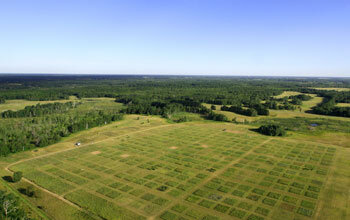{fig-alt="Aerial view of a grid of experimental field plots." width="2.56in" height="2.42in"}

[Cedar Creek Ecosystem Science Reserve](https://www.mnmas.org/about-us)
:::
:::::

## Press, Pulse, Snapshot, Trajectory

:::::: columns
::: {.column width="60%"}
Gotelli & Ellison's two axes for manipulations — and they answer different questions:

- **Pulse** — apply the treatment once, then walk away. Measures **recovery**: how fast does the system bounce back?
- **Press** — maintain the treatment continuously. Measures the **new equilibrium** the system settles into.

And for sampling the response:

- **Snapshot** — measure once at the end. Cheap, and blind to everything in between.
- **Trajectory** — measure repeatedly through time. Expensive, and the only way to see dynamics.
:::

:::: {.column width="40%"}
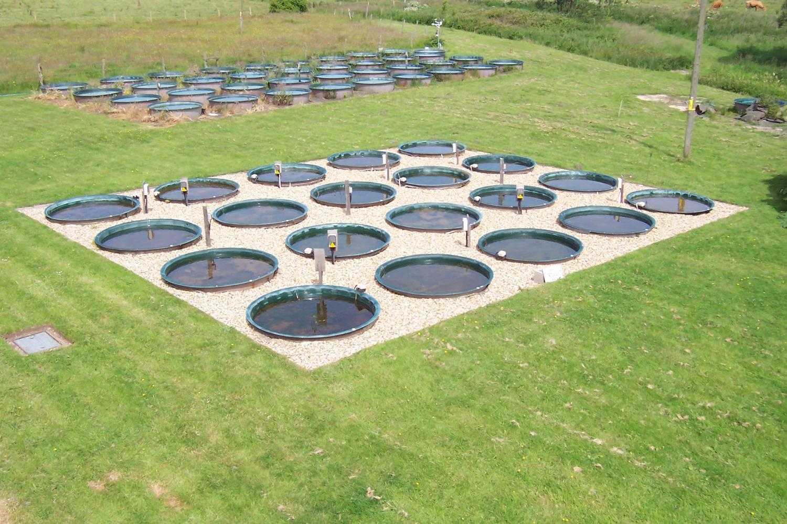{fig-alt="Array of replicated outdoor mesocosm tanks." width="2.46in"}

Mesocosms let you press a treatment *and* follow a trajectory — at the cost of scale.

::: callout-important
**⚠️ A snapshot can hide a complete reversal**

Many treatment effects change sign as a system responds. Measure once, at one time, and you get whichever answer that moment happened to hold.
:::
::::
::::::

## Part 4 · Job One: Getting Rid of Bias {.divider}

## Controls — and Why One Is Usually Not Enough

:::::: columns
:::: {.column width="60%"}
A control is a unit treated **exactly** like the manipulated units, except for the one thing under investigation.

That word *exactly* is where designs fail. Your manipulation almost always does something besides the thing you care about:

- **Toxicology:** controls get injected too — same needle, same handling, no toxin
- **Predator exclosures:** a cage changes flow, light and sediment. You need *two* controls — an open plot **and** a cage-with-holes
- **Anything you attach, bury, or visit** does something merely by being attached, buried or visited

::: callout-note
**Vocabulary**

The second kind is a **procedural** or **sham** control. Next slide: real data where forgetting it would have produced a completely wrong paper.
:::
::::

::: {.column width="40%"}
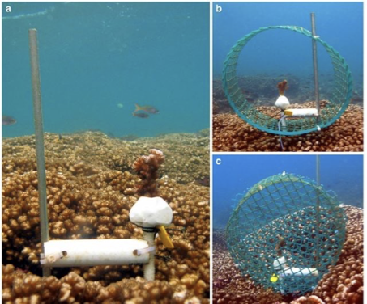{fig-alt="Caged and uncaged predator-exclusion apparatus on a reef." width="2.71in" height="2.01in"}
:::
::::::

## A Sham Control Earns Its Keep — Sponges on Mangrove Roots

:::::: columns
::: {.column width="55%"}
Ellison, Farnsworth & Twilley (1996) asked whether epibiont sponges promote mangrove root growth. Four treatments, **14 roots each**:

```{r study-design-sampling-02}
#| message: false
sponge_df <- read_csv("data/sponge_root_growth.csv")

sponge_df %>%
  group_by(treatment) %>%
  reframe(summary_stats(growth_mm_d))
```

- `Control` — bare root
- `Foam` — inert foam, the **sham control**
- `Haliclona`, `Tedania` — the two sponges
:::

:::: {.column width="45%"}
::: callout-note
**Read the means before you read any test.**

Four numbers. Nothing else is on this slide on purpose.
:::
::::
::::::

## 🗳️ DECIDE · You Are Writing the Abstract

::::::: columns
:::: {.column width="60%"}
Those four means are all the evidence you have. You now have to write the one sentence of the abstract that states what you found.

**Which claim do these data support?**

**(a)** Both sponge species increase mangrove root growth

**(b)** Only *Tedania* increases root growth; *Haliclona* does not

**(c)** We cannot tell whether the **sponges** do anything

**(d)** The sponges have no effect on root growth

::: callout-warning
**✍️ Write your letter down before you look at the next slide.**

Then argue it with your neighbour. Everyone in this room has enough information to get this right.
:::
::::

:::: {.column width="40%"}
| Treatment   | Growth (mm/d) |
|-------------|---------------|
| `Control`   | 0.33          |
| `Foam`      | 0.71          |
| `Haliclona` | 0.77          |
| `Tedania`   | 0.91          |

::: callout-note
Remember what `Foam` **is**: a piece of inert plastic. It is not alive and it is not a sponge.
:::
::::
:::::::

## The Sponge Result, in Two Tests {.tight-code}

```{r study-design-sampling-03}
# Is there an artifact of having ANYTHING attached?
sponge_df %>%
  filter(treatment %in% c("Control", "Foam")) %>%
  t.test(growth_mm_d ~ treatment, data = .)
```

```{r study-design-sampling-04}
# Do the living sponges beat the inert foam?
sponge_df %>%
  filter(treatment != "Control") %>%
  mutate(kind = if_else(treatment == "Foam", "sham", "sponge")) %>%
  t.test(growth_mm_d ~ kind, data = .)
```

## ✅ What the Two Sponge Tests Show

::::::: columns
:::: {.column width="50%"}
::: callout-important
**✅ The answer is (c).** Most rooms vote (a).

- `Control` vs `Foam`: **p = 0.021** — a piece of *inert plastic* significantly increases root growth
- `Foam` vs sponges: **p = 0.33** — the living sponges add nothing detectable on top of that

The sponges sit higher than the bare control, so (a) feels obvious. But the right comparison is not against *nothing* — it is against **an object that is not a sponge**, and against that, the sponges do not measurably win.
:::
::::

:::: {.column width="50%"}
::: callout-warning
**⚠️ The paper you would have written without the foam**

"Sponges promote mangrove root growth" — real p-value, clean figure, wrong conclusion. The effect is mostly **having something attached to your root**.

**A sham control is what stands between a correct result and a confident wrong one.**
:::
::::
:::::::

## Randomization

::::: columns
::: {.column width="60%"}
Randomization is how you deconfound the variables you never thought of. It works at **two** levels, and both matter:

1.  **Selection** — which units enter the study. Makes the sample represent the population.
2.  **Assignment** — which unit gets which treatment. Makes the groups exchangeable *before* treatment.

Haphazard is not random. "Whichever tree I reached first" correlates with trail access, which correlates with light, soil and disturbance.
:::

::: {.column width="40%"}
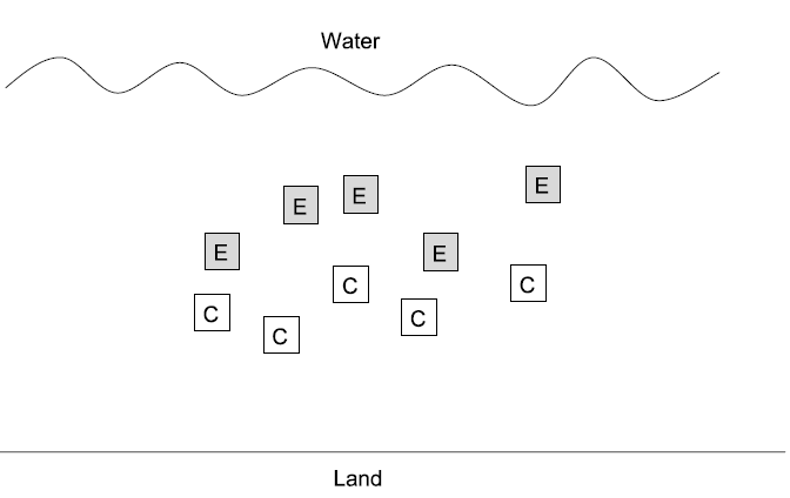{fig-alt="Shoreline plots with E and C units interspersed at random." width="2.4in" height="1.88in"}
:::
:::::

## Randomizing Both Levels in R

:::::: columns
::: {.column width="55%"}
```{r study-design-sampling-05}
# Selection: 10 trees from the 100 in the stand
selected <- sample(1:100, 10)

# Assignment: 5 to treatment, the rest to control
treated <- sample(selected, 5)

tibble(tree = selected,
       group = if_else(tree %in% treated, "treatment", "control")) %>%
  arrange(group)
```
:::

:::: {.column width="45%"}
::: callout-tip
**🖐 `set.seed()` makes it reproducible, not less random**

Record the seed and anyone can reconstruct exactly which trees you assigned where.
:::
::::
::::::

## Blinding

:::::: columns
:::: {.column width="60%"}
The measurer's expectations leak into the measurements. This is a **bias**, so no amount of data fixes it.

- **Single-blind** — the subject does not know the treatment
- **Double-blind** — the person *measuring* does not know either
- A **placebo** is what makes subject-blinding possible at all

W&S spend most of Ch. 14's opening on this because medicine learned it the hard way. Ecology mostly has not.

::: callout-important
**⚠️ This lands on our own study**

You measured needles **knowing** which side of the tree they came from, and knowing the hypothesis. Nobody cheated. But "is this needle bent or straight, include it or not" is a judgement call, and judgement calls drift toward the expected answer.

The fix is cheap: someone relabels the envelopes, you measure blind to `side`.
:::
::::

::: {.column width="40%"}
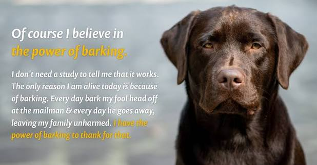{width="389"}

Expectation is a powerful thing.
:::
::::::

## Part 5 · Job Two: Shrinking Sampling Error {.divider}

## Replication — and at What Scale

:::::: columns
:::: {.column width="60%"}
Replication does two jobs: it shrinks the standard error, and it is the **only** way to estimate variability at all.

The hard part is never *how many*. It is **of what**.

::: callout-warning
**⚠️ The rule**

Replicates must vary at the scale your **hypothesis** applies to. Anything finer is **pseudoreplication** (Hurlbert 1984): it shrinks your SE without adding information — a bias dressed as precision.
:::

The next slide gives you three studies. Every one of them has been published in roughly this form.
::::

::: {.column width="40%"}
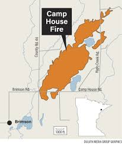{fig-alt="Map of the Camp House Fire burn footprint." width="3.12in"}
:::
::::::

## 🗳️ DECIDE · What Is *n*?

::::::: columns
:::: {.column width="60%"}
Write down the **true number of replicates per group** for each study. Three numbers.

**1. Fire and soil invertebrates.** 20 soil cores from the burnt part of a forest, 20 from the unburnt part of *the same forest*. **(a)** 20 **(b)** 2 **(c)** 1

**2. Copper and barnacle settlement.** 2 aquaria — one with copper, one without. 5 settling plates in each. **(a)** 10 **(b)** 5 **(c)** 2 **(d)** 1

**3. Sewage and water quality.** 10 water samples collected above the outfall, 10 below it. **(a)** 20 **(b)** 10 **(c)** 1

::: callout-warning
**✍️ Three letters, written down, before you vote.**

Number 3 is the one to argue about.
:::
::::

:::: {.column width="40%"}
::: callout-note
**The question to ask each time**

*"What is the smallest thing I could have independently assigned or independently chosen?"*

Count those. Not the measurements.
:::
::::
:::::::

## What *n* Actually Was

::::::: columns
:::: {.column width="60%"}
::: callout-important
**1. Fire → (c) n = 1 per group.** One burnt area, one unburnt area. The 20 cores describe *that* forest and support no claim about fire in general. To study fire you need **several burnt and several unburnt forests**.

**2. Copper → (d) n = 1 per group.** One aquarium per treatment. The 5 plates share water, temperature, and whatever went wrong in that tank. You need **several aquaria per treatment**.

**3. Sewage → (c) n = 1 per group.** This is the one that catches everybody. There is **one** upstream location and **one** downstream location. Ten samples from one place is ten measurements of one place.
:::

In all three, the published version reported the bigger number — and a satisfyingly small p-value.
::::

:::: {.column width="40%"}
::: callout-warning
**⚠️ What pseudoreplication does and does not do**

It barely moves your **means**. It shrinks your **standard error**. So the estimate stays put while the uncertainty around it quietly collapses.

That is why it is so hard to catch by eye, and why no diagnostic plot will flag it. Only the design will.
:::

You will do exactly this to a real dataset for homework — and get the opposite answer from the obvious one.
::::
:::::::

## We Already Fixed This Once

::::: columns
::: {.column width="60%"}
Our own pine data has 64 rows and **8 trees' worth of sides** — 4 trees, two sides each.

Every analysis we have run since Week 4 starts by averaging the 8 needles per side away:

```{r study-design-sampling-06}
p_df
```

That `group_by() %>% summarise()` is not data cleaning. It is the line where we choose the **tree** as the experimental unit, because the tree is what the hypothesis is about.
:::

::: {.column width="40%"}
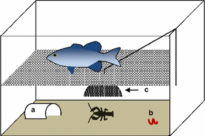{fig-alt="One aquarium holding many measurable items." width="3.12in"}

One tank, many measurements, `n = 1`.
:::
:::::

## Balance

:::::::: columns
:::: {.column width="60%"}
For a fixed total effort, **equal group sizes give the smallest standard error** on the difference.

- 10 and 10 beats 15 and 5, using the same 20 units
- Balance also makes the tests robust: unequal variances hurt far less when n is equal
- Unbalanced designs are harder to interpret in ANOVA — sums of squares stop being unique (we will hit this in Week 9)

::: callout-tip
**🖐 When imbalance is not your fault**

Mortality, lost plots and weather happen. Balance is a design goal, not a moral requirement — but *plan* for balance, and report what you actually ended up with.
:::
::::

::::: {.column width="40%"}
::: callout-note
**📖 Reference**

Whitlock & Schluter §14.5 — reducing the influence of sampling error: replication, balance, blocking, and choosing extreme treatment levels.
:::

::: callout-note
**Extreme treatments**

If you want to detect a dose response with few replicates, spread your doses wide. Four doses clustered near the middle waste your replicates on a range where nothing happens.
:::
:::::
::::::::

## Independence and Autocorrelation

Most tests assume observations are **independent** — knowing one tells you nothing about another. **Autocorrelation** is the standard violation: things near each other in space or time resemble each other. Samples 1 m apart are not two independent samples; consecutive days are not independent days; offspring of one mother are not independent of each other.

You have two options, and only two: **space your samples beyond the correlation range**, or **model it** (Week 10 onward).

**Or — you stop fighting it and use it.**

## Blocking, and Our Paired Design

:::::: columns
:::: {.column width="60%"}
**Blocking:** group units into sets that are alike, then randomize treatments *within* each set. Variation among blocks leaves the comparison instead of contaminating it.

- Chambers differ? Run every temperature in every chamber — **block by chamber**
- Days differ? Run all treatments each day — **block by time**
- Ridiculously variable sites? Put all treatments at each site

::: callout-important
**✅ A paired design is a block of size two**

Two sides of the *same tree* share genotype, soil, age and history. Pairing removes all of it from the comparison. That is why `r n_paired_80` trees do the work of `r 2 * n_unpaired_80`.

**Non-independence you ignore costs you. Non-independence you plan for pays you.** Blocking is how you get paid.
:::

Blocked designs need blocked *analyses* — Week 9 and Week 10.
::::

::: {.column width="40%"}
```{r study-design-sampling-07}
#| echo: false
#| fig-height: 3.0
#| fig-width: 3.4
#| fig-alt: "Line plot of mean needle length for the shady and sunny side of each of the four trees, one line per tree, with the four lines sloping the same way but sitting at different heights."
p_df %>%
  ggplot(aes(side, needle_length_mm, group = team, colour = team)) +
  geom_line(linewidth = 0.9) +
  geom_point(size = 2.6) +
  theme_regular(base_size = 9) +
  theme(legend.position = "none") +
  labs(title = "Four trees, four blocks",
       x = "Side", y = "Mean needle length (mm)")
```

Every tree slopes the same way. The trees sit at different heights. Blocking keeps the slope and throws away the heights.
:::
::::::

## Part 6 · Sampling Layouts in the Field {.divider}

## Simple Random and Stratified

:::::: columns
::: {.column width="50%"}
**Simple random** — every unit has an equal chance of selection. Number the units, draw with a random number generator.

- What nearly every test assumes you did
- Genuinely awkward in the field; *haphazard* is the common substitute, and it is not the same thing

**Stratified** — if the population has distinct strata, sample each one separately, with n proportional to stratum size.

- **More precise than simple random** when strata differ, because within-stratum variance is all that is left
- Strata must go **into the model**, not be ignored
:::

::: {.column width="25%"}
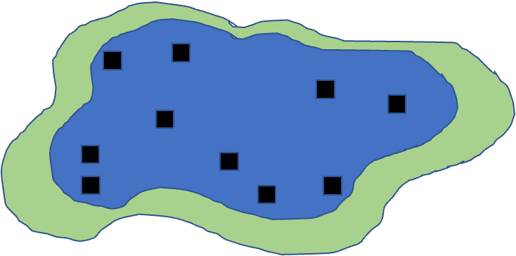{fig-alt="Lake with sample points scattered at random." width="2.4in"}

Simple random
:::

::: {.column width="25%"}
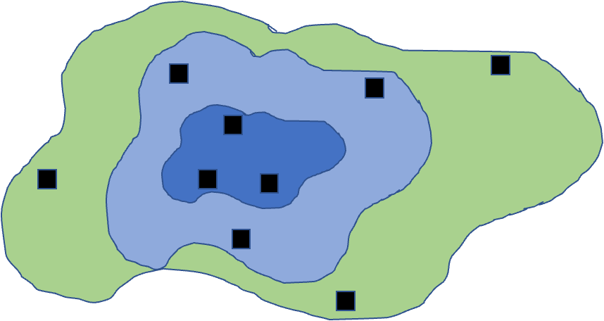{fig-alt="Lake split into depth strata, each sampled separately." width="2.4in"}

Stratified
:::
::::::

## Cluster and Systematic

:::::: columns
::: {.column width="50%"}
**Cluster** — sample subunits nested inside larger units. Used when travel or access makes anything else impossible.

- Cheap, and **less** precise than simple random for the same total n
- The clusters are your replicates → **nested ANOVA** (Week 9) or a mixed model (Week 10)

**Systematic** — units evenly spaced; the transect is the ecological classic.

- Ideal for describing change **along a gradient**
- One real risk: your spacing lines up with a periodicity in the system
:::

::: {.column width="25%"}
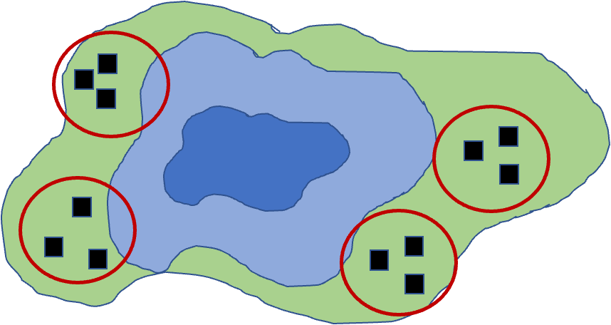{fig-alt="Lake with four sampled clusters of points." width="2.4in"}

Cluster
:::

::: {.column width="25%"}
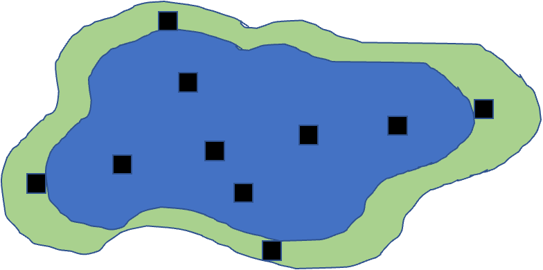{fig-alt="Lake with evenly spaced sample points." width="2.4in"}

Systematic
:::
::::::

## 🗳️ DECIDE · Where Do You Spend the Money?

:::::: columns
:::: {.column width="60%"}
A published study compares a **heavily visited** tidepool beach with a **restricted, no-access** beach. Invertebrate densities are lower, and 78.2% of boulders are disturbed at the visited beach versus 1.8% at the restricted one. Sampled once, this year.

You inherit this project with funding for **exactly one more sampling campaign**. You want to claim that *visitors* reduce invertebrate density.

**Where do you spend it?**

**(a)** More quadrats at both beaches — tighten the estimates you already have

**(b)** Add a third, intermediate-use beach — get a gradient

**(c)** Re-sample both beaches next year — get a time series

**(d)** No campaign can rescue this claim

::: callout-warning
**✍️ One letter. Write it down.**
:::
::::

::: {.column width="40%"}
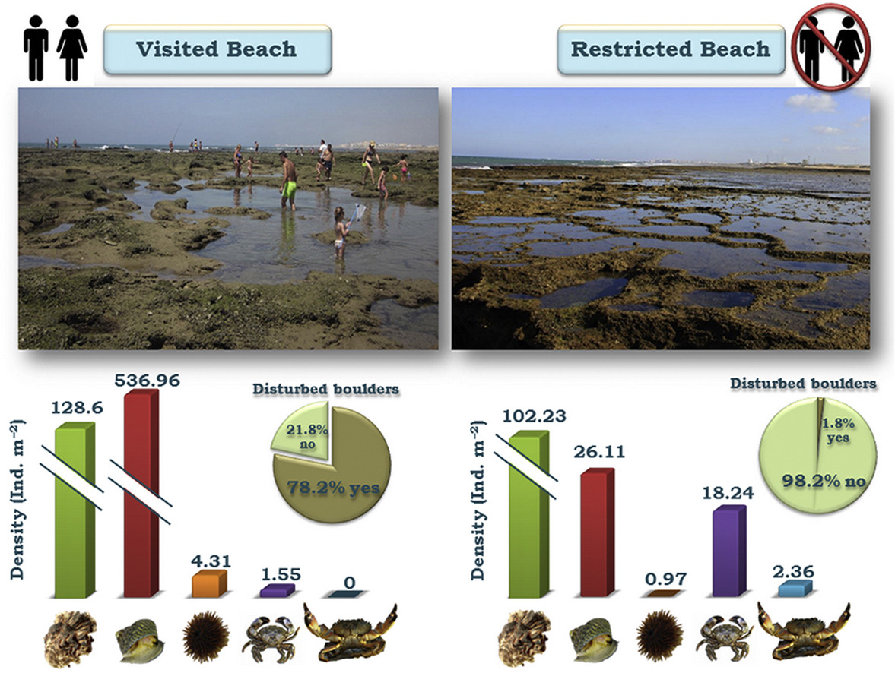{fig-alt="Visited versus restricted tidepool beach: densities and percent boulders disturbed." width="3.32in" height="3.37in"}
:::
::::::

## BACI — When You Cannot Randomize an Impact

::::::: columns
:::: {.column width="65%"}
::: callout-important
**✅ The answer is (d)**, and it is meant to be unsatisfying.

The two beaches may *always* have differed — in exposure, substrate, or wave energy — which is very likely *why* one became popular and one became restricted. **You cannot add a "before" retroactively.**

- **(a)** buys precision on a biased estimate
- **(b)** adds more sites confounded the same way
- **(c)** is the closest to useful, and it still has no pre-impact baseline
:::

**Before–After–Control–Impact** is the design you needed:

- Measure **before** and **after**, at both an **impact** and a **control** site
- The evidence is the **interaction** — did impact-versus-control *change* from before to after?
- Before/after alone confounds impact with **time**. Control/impact alone confounds it with **place**. You need both.
::::

:::: {.column width="35%"}
::: callout-note
**Why this matters beyond tidepools**

Nobody randomizes an oil spill, a dam, a clearcut or a hurricane. BACI is how environmental impact assessment is *supposed* to work — and the reason baseline monitoring has value long before anyone knows what will hit.
:::

BACI is a factorial design with an interaction → Week 9.
::::
:::::::

## Part 7 · Sample Size Is a Design Decision {.divider}

## How Big, Decided Before You Start

::::::: columns
::: {.column width="60%"}
We did the mechanics last lecture. The design point is the one worth keeping:

- Power rises with the **effect size**, with **√n**, and with **α** — and falls as **σ** rises
- **Type II error is β. Power is 1 − β.**
- Two ways to run it *a priori*: solve for the **n** you need, or for the **effect size** your affordable n could detect

```{r study-design-sampling-08}
# Our pine pilot, unpaired vs paired — same trees, same needles
pwr.t.test(d = d_paired, power = 0.80,
           sig.level = 0.05, type = "paired")$n
```

**`r n_unpaired_80` trees per side (`r 2 * n_unpaired_80` total) unpaired, versus `r n_paired_80` trees paired.** Nothing changed but the design.
:::

::::: {.column width="40%"}
::: callout-note
**Plan for precision, not just for power**

W&S §14.6 frames this as planning the **width of your confidence interval**. "How precise will my estimate be?" is often the more honest question than "will I get a star?"
:::

::: callout-important
**⚠️ Retrospective power, one more time**

Computing power from the effect size you *observed* re-expresses your p-value and tells you nothing new. Use it to plan the next study. To argue *for* no effect, use an equivalence test or a CI that excludes anything meaningful.
:::
:::::
:::::::

## The Two Ways to Buy Power

:::::: columns
::: {.column width="45%"}
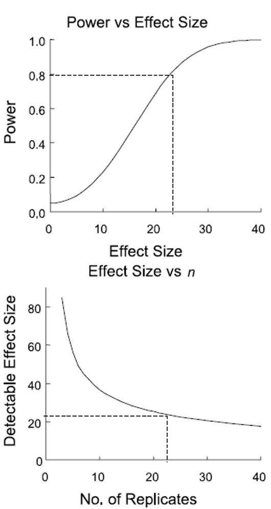{.tall-fig fig-alt="Power versus effect size, and detectable effect size versus replicates." width="1.92in" height="3.37in"}
:::

:::: {.column width="55%"}
::: callout-note
**Same two levers, two views**

Power climbs with the **effect size** you are chasing, and the **detectable** effect size falls as you add **replicates**. You choose one of them before the study; the other is then decided for you.
:::
::::
::::::

## Part 8 · From Design to Analysis {.divider}

## 🗳️ DECIDE · Match the Design to the Analysis

:::::::: columns
:::: {.column width="60%"}
With your neighbour. Five designs. For each, name the **analysis** — from the list on the right — that it forces you into. You have met all five.

**1.** Needle length measured on 40 trees, along with the light reaching each tree, in lux.

**2.** Sea urchin grazing measured on 4 patches inside each of 16 reefs.

**3.** Barnacle settlement at 2 copper levels × 2 temperatures, fully crossed.

**4.** Number of ant species per quadrat — counts, many of them zero.

**5.** Fish mass compared between two lakes, with body length also measured and known to matter.

::: callout-tip
**🖐 The tell**

For each one, ask: *how many predictors, what kind, and is anything nested inside anything else?*
:::
::::

::::: {.column width="40%"}
::: callout-note
**Pick from these**

- Regression
- Multiple regression
- One-way ANOVA
- Two-way ANOVA with interaction
- Nested ANOVA
- Mixed model
- GLM
- ANCOVA
:::

::: callout-warning
**✍️ Five answers, written down. Two minutes.**
:::
:::::
::::::::

## Your Design Chooses Your Analysis

**Answers: 1** regression · **2** nested ANOVA (or a mixed model) · **3** two-way ANOVA with interaction · **4** GLM · **5** ANCOVA.

This is Gotelli & Ellison Ch. 7's whole point, and it is also the rest of this course. **Write the design down and the analysis is already decided:**

::: compact-table
| Your design                           | The analysis                | When    |
|------------------------|------------------|----------|
| One continuous predictor              | Regression                  | Week 6  |
| Several continuous predictors         | Multiple regression         | Week 7  |
| One categorical factor                | One-way ANOVA               | Week 8  |
| Two crossed factors, or BACI          | Two-way ANOVA + interaction | Week 9  |
| Subsamples inside units; clusters     | Nested ANOVA                | Week 9  |
| Blocks, repeated measures, split-plot | Mixed model                 | Week 10 |
| Counts, or presence/absence           | GLM                         | Week 11 |
| Factor plus a continuous covariate    | ANCOVA                      | Week 12 |
:::

::: callout-important
**You cannot choose your analysis at the end**

You chose it the day you decided what to measure and how to lay it out. Everything after that is bookkeeping.
:::

## Summary

:::::: columns
::: {.column width="60%"}
1.  A design has two jobs: **kill bias**, **shrink sampling error**. No test does either for you.
2.  **Bias** → controls (usually more than one), randomization at both levels, blinding.
3.  **Sampling error** → replication at the right scale, balance, blocking.
4.  **Natural experiments** buy realism with causal ambiguity; manipulations buy inference with scale. Press or pulse, snapshot or trajectory — choose deliberately.
5.  **Replicate the thing your hypothesis is about.** Pseudoreplication buys false precision.
6.  **Your design has already chosen your analysis.**
:::

:::: {.column width="40%"}
::: callout-important
**The sponge slide, if you remember nothing else**

The inert foam grew roots almost as well as the living sponges. Without that sham control, the paper reports a sponge effect — correctly analysed, properly significant, and wrong.

Design is not the paperwork before the science. It *is* the science.
:::
::::
::::::

## 🗳️ One Last Decision — On Your Way Out

::: callout-warning
**🗳️ One last decision — on your way out**

On a scrap of paper, unsigned:

> **What is the single biggest threat to the validity of our own pine needle study — and what one change would you make to next year's collection?**

One sentence each. Hand it to me at the door.
:::

## Readings

- **Whitlock & Schluter**, Ch. 14 — Designing Experiments (§14.4 bias; §14.5 sampling error; §14.6 planning for precision; §14.7 observational studies), and Ch. 1 — Statistics and Samples.
- **Gotelli & Ellison**, Ch. 6 — Designing Successful Field Studies, and Ch. 7 — A Bestiary of Experimental and Sampling Designs.
- Hurlbert, S. H. (1984). Pseudoreplication and the design of ecological field experiments. *Ecological Monographs*, 54(2), 187–211.
- Ellison, A. M., Farnsworth, E. J., & Twilley, R. R. (1996). Facultative mutualism between red mangroves and root-fouling sponges in Belizean mangal. *Ecology*, 77(8), 2431–2444.
- Quinn, G. P., & Keough, M. J. (2002). *Experimental Design and Data Analysis for Biologists*. Cambridge University Press.
