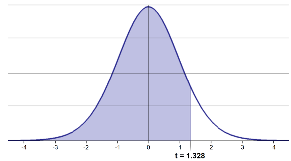
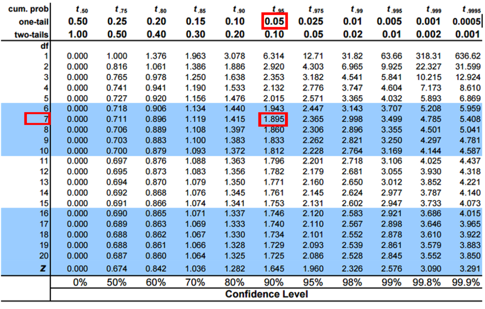
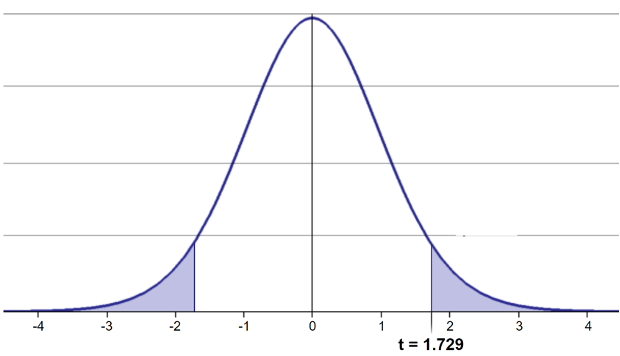
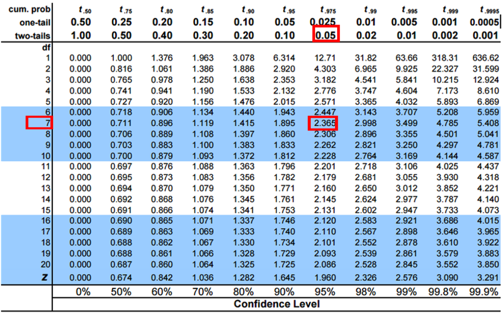

## Where We Left Off

::::::: columns
:::: {.column width="60%"}
Last time:

- Histograms / frequency distributions
- Probability distribution functions (PDFs)
- Z-scores and t-scores
- Tests of means using t-tests: one sample, two sample

::: callout-note
**✅ Key idea from last lecture**

A t-score is just a z-score computed with the *sample* standard deviation instead of the population standard deviation — that substitution is why we need the t-distribution at all. Today we put it to work.
:::
::::

:::: {.column width="40%"}
{width="241" height="330"}

::: callout-note
**Today's roadmap**

1. Hypothesis testing framework
2. The t-distribution
3. One-sample t-test
4. Two-sample t-test (Student's and Welch's)
5. Paired t-test
6. Checking assumptions throughout
:::
::::
:::::::

## Part 1 · Our Data {.divider}

## Setup — Loading the Class Pine Needle Data

::::::: columns
:::: {.column width="60%"}
```{r}
library(readxl)
library(tidyverse)
library(patchwork)
library(car)   # For diagnostic tests

pine_df        <- read_excel("data/class_pine needle length.xlsx")
pine_switch_df <- read_excel("data/class_pine needle length switched.xlsx")

glimpse(pine_df)
```

::: callout-note
**✅ Key idea**

For two sample T-tests, degrees of freedom = n₁ + n₂ − 2. With 8 needles per side, df = 8 + 8 − 2 = 14.
:::
::::

:::: {.column width="40%"}
::: callout-tip
**🖐 Recap**

`group` is the class team, `tree_no`/`tree_char` identify the tree, `side` is sunny vs. shady, `length_mm` is the needle length.
:::
::::
:::::::

## Averaging Out Pseudoreplication

::::::: columns
:::: {.column width="60%"}
```{r}
# Multiple needles per tree side are pseudoreplicates —
# average them so each tree/side is ONE data point
p_df <- pine_df %>%
  group_by(group, tree_no, tree_char, side) %>%
  summarise(length_mm = mean(length_mm, na.rm = TRUE))

ps_df <- pine_switch_df %>%
  group_by(group, tree_no, tree_char, side) %>%
  summarise(length_mm = mean(length_mm, na.rm = TRUE))

ps_shady_df <- ps_df %>% filter(side == "shady")
ps_sunny_df <- ps_df %>% filter(side == "sunny")
```

::: callout-important
**Why average first?** The true experimental unit here is *tree side*, not *needle*. Treating every needle as independent would inflate our sample size and our confidence — the same pseudoreplication trap from earlier in the course.
:::
::::

:::: {.column width="40%"}
```{r}
#| fig-width: 3
#| fig-height: 2.6
stats_df <- ps_df %>%
  group_by(side) %>%
  summarize(
    mean_length = mean(length_mm, na.rm = TRUE),
    sd_length   = sd(length_mm, na.rm = TRUE),
    se_length   = sd(length_mm, na.rm = TRUE) / sum(!is.na(length_mm))^.5,
    count       = sum(!is.na(length_mm)),
    .groups = "drop"
  )
stats_df
```
::::
:::::::

## The Data — Two Versions

::::::: columns
:::: {.column width="60%"}
```{r}
#| fig-width: 3.2
#| fig-height: 2.6
#| message: false
#| warning: false
#| fig-alt: "Boxplot of needle length by side of tree (shady vs. sunny) from the original (unswitched) pine needle file, with points for each field team connected by a line, showing each team's shady and sunny values."
p_plot <- p_df %>%
  ggplot(aes(side, length_mm, fill = side)) +
  geom_boxplot(alpha = 0.7) +
  geom_point(aes(group = group, color = group)) +
  geom_line(aes(group = group, color = group)) +
  labs(x = "Side of tree", y = "Length (mm)", caption = "Pine needles") +
  theme_minimal(base_size = 9) +
  theme(legend.position = "none")
p_plot
```
::::

:::: {.column width="40%"}
::: callout-warning
**⚠️ Watch out!**

`class_pine needle length switched.xlsx` has the `sunny`/`shady` labels swapped relative to the original file. From here on, **`ps_df`** (the switched version) is the dataset we'll actually test — it's the one that matches the field notes.
:::
::::
:::::::

## The Data We'll Test — `ps_df`

::::::: columns
:::: {.column width="60%"}
```{r}
#| fig-width: 3.2
#| fig-height: 2.6
#| message: false
#| warning: false
#| fig-alt: "Boxplot of needle length by side of tree (shady vs. sunny) from the corrected, switched-labels pine needle file, with points for each field team connected by a line — this is the dataset used for the rest of the analysis."
ps_plot <- ps_df %>%
  ggplot(aes(side, length_mm, fill = side)) +
  geom_boxplot(alpha = 0.7) +
  geom_point(aes(group = group, color = group)) +
  geom_line(aes(group = group, color = group)) +
  labs(x = "Side of tree", y = "Length (mm)", caption = "Pine needles switched") +
  theme_minimal(base_size = 9) +
  theme(legend.position = "none")
ps_plot
```
::::

:::: {.column width="40%"}
**Goals for today, using `ps_df`:**

- Statistical inference fundamentals
- Hypothesis testing principles
- t-distributions
- One-sample, two-sample, and paired t-tests
- Assumption tests
::::
:::::::

## Part 2 · Hypothesis Testing Framework {.divider}

## Hypothesis Testing — the Key Components

::::::: columns
:::: {.column width="60%"}
Hypothesis testing is a systematic way to evaluate research questions using data.

**Key components:**

1. **Null hypothesis (H₀)** — typically "no effect" or "no difference"
2. **Alternative hypothesis (Hₐ)** — the claim we're trying to support
3. **Statistical test** — method for evaluating evidence against H₀
4. **P-value** — probability of observing our result (or more extreme) if H₀ is true
5. **Significance level (α)** — threshold for rejecting H₀, typically 0.05

**Decision rule:** Reject H₀ if p-value < α.
::::

:::: {.column width="40%"}
::: callout-note
**📖 Reference**

Gotelli & Ellison, *A Primer of Ecological Statistics*, Ch. 4 — Framing and Testing Hypotheses (Statistical Significance and P-Values).
:::
::::
:::::::

## The Logic of a Statistical Test

::::::: columns
:::: {.column width="60%"}
A test assesses the likelihood of the null hypothesis being true.

- If H₀ is likely false, Hₐ is assumed correct
- More precisely: the long-run probability of obtaining our sample value (or a more extreme one) **if the null hypothesis is true**
- Written p(data | H₀) — the probability of the data, *given* H₀

::: callout-note
**✅ Key idea**

p(data | H₀) is **not** the same as p(H₀ | data). A t-test never tells you the probability that H₀ is true — only how surprising your data would be if it were.
:::
::::

:::: {.column width="40%"}
| p-value range | Interpretation |
|---|---|
| p > 0.10 | No evidence against H₀ |
| 0.05 < p < 0.10 | Weak evidence against H₀ |
| 0.01 < p < 0.05 | Moderate evidence against H₀ |
| 0.001 < p < 0.01 | Strong evidence against H₀ |
| p < 0.001 | Very strong evidence against H₀ |
::::
:::::::

## Part 3 · The t-Distribution {.divider}

## One-Tailed Questions

::::::: columns
:::: {.column width="60%"}
One-tailed questions ask about the area of the distribution to the left (or right) of a certain value, for a one-sample test.

- n = 8 (df = 7) — 95% of the observations found to the left
- t = 1.895 (5% are outside)

{width="267" height="198"}
::::

:::: {.column width="40%"}
{width="300"}
::::
:::::::

## Two-Tailed Questions

::::::: columns
:::: {.column width="60%"}
Two-tailed questions refer to the area *between* certain values.

- n = 8 (df = 7), 95% of the observations are between t = −2.365 and t = 2.365 (2.5% outside on each side)
- Compare to the one-tailed cutoff: t = 1.895 (5% outside)

{width="240"}
::::

:::: {.column width="40%"}
{width="300"}

::: callout-tip
**🖐 Notice**

The two-tailed critical value is *farther* from zero than the one-tailed value — splitting 5% into two tails means each tail only gets 2.5%.
:::
::::
:::::::

## Calculating a Confidence Interval

::::::: columns
:::: {.column width="60%"}
Using a two-sided test:

$$\text{CI} = \bar{y} \pm t \cdot \frac{s}{\sqrt{n}}$$

- 95% CI, Sample A: 17.6 ± 2.365 × (2.51 / 8^0.5) = ± 2.10
- The 95% CI is between 15.50 and 19.70
- "The 95% CI for the population mean from sample A is 17.6 ± 2.1"

::: callout-note
**📖 Reference**

Whitlock & Schluter, *Analysis of Biological Data*, Ch. 11 — Inference for a Normal Population.
:::
::::

:::: {.column width="40%"}
{width="300"}
::::
:::::::

## Applications of the t-Distribution

::::::: columns
:::: {.column width="60%"}
- Can assess confidence that the population mean is within a certain range
- Can use the t-distribution to ask:
  - "What is the probability of getting a sample with mean = ȳ from a population with mean = µ?" *(1-sample t-test)*
  - "What is the probability that two samples came from the same population?" *(2-sample t-test)*
::::

:::: {.column width="40%"}
::: callout-tip
**🖐 Try it yourself**

Before the next slide: which of these two questions do you think a one-sample t-test answers, and which needs a two-sample t-test?
:::
::::
:::::::

## Part 4 · One-Sample T-Test {.divider}

## One-Sample T-Test — Hypotheses and Assumptions

::::::: columns
:::: {.column width="60%"}
We want to test if the mean needle length on the shady side differs from 15mm.

**Activity: define hypotheses and identify assumptions**

- H₀: μ = 15 (the mean needle length on the shady side is 15mm)
- Hₐ: μ ≠ 15 (the mean needle length on the shady side is not 15mm)

**Assumptions for a t-test:**

1. Data is normally distributed
2. Observations are independent
3. No significant outliers
::::

:::: {.column width="40%"}
::: callout-note
**📖 Reference**

Whitlock & Schluter, Ch. 11, covers the one-sample t-test as the simplest hypothesis test on a normally distributed variable.
:::
::::
:::::::

## Checking Normality — QQ Plot

::::::: columns
:::: {.column width="60%"}
```{r}
#| fig-width: 3.2
#| fig-height: 2.6
#| message: false
#| warning: false
#| fig-alt: "QQ-plot of pine needle length with a confidence envelope, used to visually check whether needle length is approximately normally distributed."
# YOUR TASK: Test normality of all pine needle lengths
qqPlot(ps_df$length_mm,
       main = "QQ Plot for length of pine needles",
       ylab = "Sample Quantiles")
```
::::

:::: {.column width="40%"}
::: callout-tip
**🖐 Notice**

Points that hug the blue line support normality; points that curve away — especially in the tails — are a warning sign.
:::
::::
:::::::

## Checking Normality — Shapiro-Wilk Test

::::::: columns
:::: {.column width="60%"}
```{r}
shapiro.test(ps_df$length_mm)
```
::::

:::: {.column width="40%"}
::: callout-important
**H₀ for Shapiro-Wilk is "the data ARE normal."** A *non-significant* result (p > 0.05) is what we're hoping for here — it means we fail to reject normality.
:::
::::
:::::::

## Checking for Outliers

::::::: columns
:::: {.column width="60%"}
```{r}
#| fig-width: 3.2
#| fig-height: 2.6
#| fig-alt: "Boxplot of pine needle length by side of tree (shady vs. sunny), used to visually check for outliers before running t-tests."
shady_sunny_plot <- ps_df %>%
  ggplot(aes(x = side, y = length_mm, fill = side)) +
  geom_boxplot() +
  labs(x = "side", y = "Length (mm)", fill = "side") +
  theme_minimal(base_size = 9)
shady_sunny_plot
```
::::

:::: {.column width="40%"}
::: callout-tip
Points beyond the whiskers are potential outliers — always look before you test.
:::
::::
:::::::

## Practice Exercise 1: One-Sample t-Test

::: callout-tip
**Practice Exercise 1: One-sample t-test**

Let's perform a one-sample t-test to determine if the mean needle length on the shady side differs from 15mm:

```{r}
ps_shade_mean <- mean(ps_shady_df$length_mm, na.rm = TRUE)
cat("Mean:", round(ps_shade_mean, 1), "mm\n")

t_test_result <- t.test(ps_shady_df$length_mm, mu = 15)
t_test_result
```

Interpret this test result by answering these questions:

1. What was the null hypothesis?
2. What was the alternative hypothesis?
3. What does the p-value tell us?
4. Should we reject or fail to reject the null hypothesis at α = 0.05?
5. What is the practical interpretation of this result for botanists?
:::

## Visualizing the One-Sample Test — t Scale

::::::: columns
:::: {.column width="60%"}
```{r}
#| echo: false
#| message: false
#| warning: false
#| fig-width: 3.4
#| fig-height: 3.2
#| fig-alt: "T-distribution curve for the one-sample test, with the two-tailed rejection region shaded red, a dashed line at the critical t-value, and a solid green line marking the observed t-statistic, which falls inside the rejection region."
# Parameters for our scenario
hypothesized_mean <- 15   # The null hypothesis value
sample_mean <- 17.6       # Example sample mean (you can adjust this)
sample_sd <- 2.51         # Example sample standard deviation
sample_size <- 8          # Example sample size
alpha <- 0.05              # Significance level

df <- sample_size - 1
t_stat <- (sample_mean - hypothesized_mean) / (sample_sd / sqrt(sample_size))
t_crit <- qt(1 - alpha, df)

x <- seq(-4, 6, length.out = 1000)
null_y <- dt(x, df)

hyp_data <- data.frame(x = x, y = null_y, Hypothesis = "t-distribution (df = 29)")

rejection_region <- data.frame(
  x = seq(t_crit, 6, length.out = 100),
  y = dt(seq(t_crit, 6, length.out = 100), df)
)

hyp_plot <- ggplot(hyp_data, aes(x = x, y = y)) +
  geom_line(color = "blue") +
  geom_area(data = rejection_region, aes(x = x, y = y),
            fill = "red", alpha = 0.3, inherit.aes = FALSE) +
  geom_vline(xintercept = t_crit, linetype = "dashed") +
  geom_vline(xintercept = t_stat, linetype = "solid", color = "green") +
  annotate("text", x = t_crit + 2, y = max(null_y)/6,
           label = "Rejection\nRegion", color = "red") +
  annotate("text", x = t_stat+1, y = max(null_y)/3,
           label = paste("t =", round(t_stat, 2)), color = "green", vjust = -1) +
  labs(title = "One-Sample t-Test",
       subtitle = paste0("H0: μ = 15 vs Ha: μ ≠ 15 (α = 0.05, df = ", df, ")"),
       x = "t-statistic", y = "Probability Density") +
  theme_minimal(base_size = 9)
hyp_plot
```
::::

:::: {.column width="40%"}
::: callout-note
**✅ Key idea**

The green line (our observed t) falls inside the red rejection region — that's what "significant" looks like on a t-distribution.
:::
::::
:::::::

## Visualizing the One-Sample Test — Original Units

::::::: columns
:::: {.column width="60%"}
```{r}
#| echo: false
#| message: false
#| warning: false
#| fig-width: 3.6
#| fig-height: 3.2
#| fig-alt: "The same one-sample t-test rejection region re-plotted on the original millimeter measurement scale instead of the t-statistic scale, with vertical lines marking the hypothesized mean (15mm, blue) and observed sample mean (green)."
measurement_x <- seq(10, 20, length.out = 1000)
measurement_null_y <- dt((measurement_x - hypothesized_mean)/(sample_sd/sqrt(sample_size)), df) * (sample_sd/sqrt(sample_size))

measurement_data <- data.frame(x = measurement_x, y = measurement_null_y)

critical_value_upper <- hypothesized_mean + t_crit * (sample_sd/sqrt(sample_size))
critical_value_lower <- hypothesized_mean - t_crit * (sample_sd/sqrt(sample_size))

rejection_upper <- data.frame(
  x = seq(critical_value_upper, 15, length.out = 100),
  y = dt((seq(critical_value_upper, 15, length.out = 100) - hypothesized_mean)/(sample_sd/sqrt(sample_size)), df) * (sample_sd/sqrt(sample_size))
)

rejection_lower <- data.frame(
  x = seq(15, critical_value_lower, length.out = 100),
  y = dt((seq(15, critical_value_lower, length.out = 100) - hypothesized_mean)/(sample_sd/sqrt(sample_size)), df) * (sample_sd/sqrt(sample_size))
)

measurement_plot <- ggplot(measurement_data, aes(x = x, y = y)) +
  geom_line(color = "blue") +
  geom_area(data = rejection_upper, aes(x = x, y = y),
            fill = "red", alpha = 0.3, inherit.aes = FALSE) +
  geom_area(data = rejection_lower, aes(x = x, y = y),
            fill = "red", alpha = 0.3, inherit.aes = FALSE) +
  geom_vline(xintercept = critical_value_upper, linetype = "dashed") +
  geom_vline(xintercept = critical_value_lower, linetype = "dashed") +
  geom_vline(xintercept = sample_mean, linetype = "solid", color = "green") +
  geom_vline(xintercept = hypothesized_mean, linetype = "solid", color = "blue") +
  labs(title = "One-Sample t-Test in Original Scale",
       subtitle = paste0("Testing H0: μ = 15 (α = 0.05, df = ", df, ")"),
       x = "Measurement Value", y = "Probability Density") +
  coord_cartesian(xlim = c(10, 20)) +
  theme_minimal(base_size = 9)
measurement_plot
```
::::

:::: {.column width="40%"}
::: callout-tip
**🖐 Notice**

Same test, same conclusion — just relabeled onto the millimeter scale instead of the t scale. The blue line (H₀ = 15) sits outside the sample's plausible range.
:::
::::
:::::::

## Interpreting the One-Sample T-Test

::::::: columns
:::: {.column width="60%"}
**Activity: interpret the t-test results**

- What does the p-value tell us?
- Should we reject or fail to reject the null hypothesis?
::::

:::: {.column width="40%"}
::: callout-note
**How to report this result in a scientific paper**

"A one-sample t-test at α = 0.05 showed that the mean needle length (... mm, SD = ...) [was/was not] significantly different from the expected 15mm, t(...) = ..., p = ..."
:::
::::
:::::::

## Part 5 · Two-Sample T-Test {.divider}

## Two-Sample T-Tests — Introduction

::::::: columns
:::: {.column width="60%"}
For example — what is the probability that population X is the same as population Y?

How would you assess this question using what we learned?

This is what we will do with the needle length again...
::::

:::: {.column width="40%"}
{width="204"}
::::
:::::::

## Comparing Two Samples

::::::: columns
:::: {.column width="60%"}
What is the probability that population X is the same as population Y?

How would you assess this question using what we learned?
::::

:::: {.column width="40%"}
```{r}
#| fig-width: 3
#| fig-height: 2.6
#| fig-alt: "The boxplot of pine needle length by side of tree, repeated here as a lead-in to the two-sample t-test comparing the two sides."
shady_sunny_plot
```

::: callout-tip
**🖐 Try it yourself**

Based on the boxplot alone, what would you guess the two-sample t-test will conclude about needle length on the two sides?
:::
::::
:::::::

## Practice Exercise 2: Formulating Hypotheses

::: callout-tip
**Practice Exercise 2: Formulating hypotheses**

For the following research question about needle lengths, write the null and alternative hypotheses:

Are needle lengths on shady and sunny sides different?

```
H0 =
Ha =
```
:::

## Two-Sample T-Test Framework

::::::: columns
:::: {.column width="60%"}
Now let's compare needle lengths from the two sides.

**Question:** Is there a significant difference in needle length between the sides?

This requires a two-sample t-test, which compares means from two independent groups.

$$t = \frac{\bar{x}_1 - \bar{x}_2}{S_p\sqrt{\frac{1}{n_1} + \frac{1}{n_2}}}$$
::::

:::: {.column width="40%"}
**Where:**

- x̄₁, x̄₂: sample means of the two groups
- s²ₚ: pooled variance = [(n₁−1)s₁² + (n₂−1)s₂²] / (n₁+n₂−2)
- n₁, n₂: sample sizes of the two groups
- √(1/n₁ + 1/n₂): the pooled standard error

$$t = \frac{\text{SIGNAL}}{\text{NOISE}}$$

::: callout-note
**📖 Reference**

Whitlock & Schluter, Ch. 12 — Comparing Two Means.
:::
::::
:::::::

## Practice Exercise 3: Summary Statistics

::: callout-tip
**Practice Exercise 3: Calculate summary statistics grouped by side**

Before conducting the test, we need to understand the data for each group.

```{r}
group_summary <- ps_df %>%
  group_by(side) %>%
  summarize(
    mean_length = mean(length_mm),
    sd_length   = sd(length_mm),
    n           = n(),
    se_length   = sd_length / sqrt(n)
  )
group_summary
```
:::

## Practice Exercise 4: Effect Size

::: callout-tip
**Practice Exercise 4: Effect size**

We could also look at the difference in means:

```{r}
group_summary %>%
  summarize(difference = mean_length[side == "shady"] - mean_length[side == "sunny"])
```
:::

## Practice Exercise 5: Plotting Mean ± SE Directly

::: callout-tip
**Practice Exercise 5: Using ggplot to get a summary plot**

`ggplot` can compute and plot the mean and standard error directly:

```{r}
#| fig-width: 3.2
#| fig-height: 2.6
#| fig-alt: "Point-and-error-bar plot of mean needle length ± standard error for the shady and sunny sides."
needle_mean_se_plot <- ggplot(ps_df, aes(x = side, y = length_mm, color = side)) +
  stat_summary(fun = mean, geom = "point") +
  stat_summary(fun.data = mean_se, geom = "errorbar", width = 0.2) +
  labs(x = "side", y = "Mean Length (mm)") +
  theme_classic(base_size = 9)
needle_mean_se_plot
```
:::

## Testing Assumptions for a Two-Sample T-Test

::::::: columns
:::: {.column width="60%"}
For a two-sample t-test, we need to check:

1. Normality within each group
2. Equal variances between groups (for the standard t-test)
3. Independent observations

If assumptions are violated:

- Welch's t-test (unequal variances)
- Non-parametric alternatives (Mann-Whitney U test)
::::

:::: {.column width="40%"}
::: callout-note
**📖 Reference**

Whitlock & Schluter, Ch. 13 — Handling Violations of Assumptions, covers non-parametric alternatives when normality or equal variance fails.
:::
::::
:::::::

## Practice Exercise 6: Separate Group Data

::: callout-tip
**Practice Exercise 6: separate group data**

Note you need to test each group separately for normality — first, split the data:

```{r}
#| paged-print: false
head(ps_shady_df)
head(ps_sunny_df)
```
:::

## Practice Exercise 7: Combined Normality Test

::: callout-tip
**Practice Exercise 7: test normality at one time**

There are always a lot of ways to do this in R:

```{r}
normality_results <- ps_df %>%
  group_by(side) %>%
  summarize(
    shapiro_stat    = shapiro.test(length_mm)$statistic,
    shapiro_p_value = shapiro.test(length_mm)$p.value,
    normal_distribution = if_else(shapiro_p_value > 0.05, "Normal", "Non-normal"))
normality_results
```
:::

## Practice Exercise 8: Test Equal Variances

::: callout-tip
**Practice Exercise 8: test equal variances**

Levene's test can be done on the original data frame.

**Note:** the Levene's test result should be **NOT significant** — what is the null hypothesis here?

```{r}
#| message: false
#| warning: false
#| paged-print: false
levene_result <- leveneTest(length_mm ~ side, data = ps_df)
print("Levene's Test for Homogeneity of Variance:")
print(levene_result)
```
:::

## Conducting the Two-Sample T-Test — Standard

::::::: columns
:::: {.column width="60%"}
Now we can compare the mean needle lengths between shady and sunny sides.

- H₀: μ₁ = μ₂ (the needle lengths do not differ)
- Hₐ: μ₁ ≠ μ₂ (the mean needle lengths differ — direction not specified)

Deciding between:

- **Standard t-test (equal variances)**
- Welch's t-test (unequal variances)
::::

:::: {.column width="40%"}
```{r}
# Use var.equal = TRUE for standard t-test,
# var.equal = FALSE for Welch's t-test
t_test_result <- t.test(length_mm ~ side, data = ps_df, var.equal = TRUE)
print("Standard two-sample t-test:")
print(t_test_result)
```
::::
:::::::

## Conducting the Two-Sample T-Test — Welch's

::::::: columns
:::: {.column width="60%"}
Now we can compare the mean needle lengths between shady and sunny sides.

- H₀: μ₁ = μ₂ (the needle lengths do not differ)
- Hₐ: μ₁ ≠ μ₂ (the mean needle lengths differ — direction not specified)

Deciding between:

- Standard t-test (equal variances)
- **Welch's t-test (unequal variances)**
::::

:::: {.column width="40%"}
```{r}
t_test_result <- t.test(length_mm ~ side, data = ps_df, var.equal = FALSE)
print("Welch's two-sample t-test:")
print(t_test_result)
```
::::
:::::::

## Standard vs. Welch's t-Test

:::::: columns
::: {.column width="50%"}
**Standard t-test (Student's t-test)**

- **Assumes equal variances** between groups
- Uses a **pooled variance estimate** combining both groups
- Has **higher statistical power** when the equal-variance assumption is met
- Degrees of freedom = n₁ + n₂ − 2
:::

::: {.column width="50%"}
**Welch's t-test**

- **Does not assume equal variances** (the "unequal variances t-test")
- Uses **separate variance estimates** for each group
- More **robust** when group variances differ
- Uses the **Welch-Satterthwaite equation** — df is typically non-integer and smaller than the standard t-test's
:::
::::::

## Interpreting the Two-Sample T-Test

::::::: columns
:::: {.column width="60%"}
**Interpret the results of the two-sample t-test**

What can we conclude about needle lengths on the sunny vs. shady sides?

::: callout-note
**How to report this result in a scientific paper**

"A two-tailed, two-sample t-test at α = 0.05 showed [a significant/no significant] difference in needle length between sunny (M = ..., SD = ...) and shady (M = ..., SD = ...) sides of pine trees, t(...) = ..., p = ..."
:::
::::

:::: {.column width="40%"}
```{r}
#| echo: false
#| message: false
#| warning: false
#| fig-width: 3.4
#| fig-height: 3.2
#| fig-alt: "T-distribution curve with 14 degrees of freedom for the two-sample needle-length test, red rejection regions in both tails beyond the critical t-values, and a dashed blue line marking the extreme observed t-statistic (-13.797) far into the rejection region."
t_dist_df <- data.frame(x = seq(-10, 10, by = 0.01)) %>%
  mutate(density = dt(x, df = 14))

critical_t <- qt(0.975, df = 14)

t_plot <- ggplot(t_dist_df, aes(x = x, y = density)) +
  geom_line(linewidth = 1.2, color = "blue") +
  geom_area(data = subset(t_dist_df, x <= -critical_t | x >= critical_t),
            aes(x = x, y = density), fill = "red", alpha = 0.3) +
  geom_area(data = subset(t_dist_df, x >= -critical_t & x <= critical_t),
            aes(x = x, y = density), fill = "lightblue", alpha = 0.3) +
  geom_vline(xintercept = critical_t, color = "red", linewidth = 1) +
  geom_vline(xintercept = -critical_t, color = "red", linewidth = 1) +
  geom_vline(xintercept = 1.1279, color = "blue", linetype = "dashed", linewidth = 1) +
  annotate("text", x = critical_t, y = 0.15, label = paste("Critical t =", round(critical_t, 3)), hjust = -0.1, color = "red") +
  annotate("text", x = 1.1279, y = 0.25, label = "Observed t = -13.797", hjust = -0.1, color = "blue") +
  annotate("text", x = 0, y = 0.2, label = "p < 2.2e-16", size = 4) +
  labs(title = "T-Distribution with Observed T-Value",
       subtitle = "Two-Sample T-Test for Needle Length (df = 14)",
       x = "t-value", y = "Density") +
  theme_minimal(base_size = 9) +
  coord_cartesian(xlim = c(-5, 5), ylim = c(0, 0.4))
print(t_plot)
```
::::
:::::::

## Part 6 · Paired T-Test {.divider}

## What Does a Paired T-Test Tell Us?

::::::: columns
:::: {.column width="60%"}
**Paired t-test:**

- Compares two measurements from the same subjects or matched pairs
- Tests whether the mean difference between paired observations equals zero
- Examples: before/after measurements on the same individuals, left vs. right measurements, matched case-control studies
- Uses the *differences* between pairs as the data
- Generally more powerful, because it controls for individual variation

::: callout-note
**📖 Reference**

Whitlock & Schluter, Ch. 12, section on the paired design.
:::
::::

:::: {.column width="40%"}
```{r}
ps_wide_df <- ps_df %>%
  pivot_wider(
    names_from = "side",
    values_from = length_mm
  )

paired_t_test_result <- t.test(ps_wide_df$sunny, ps_wide_df$shady, paired = TRUE)
print("Paired t-test:")
print(paired_t_test_result)
```
::::
:::::::

## What Is Going On?

::::::: columns
:::: {.column width="60%"}
Note that there is a lot of variation *within* trees, but the trend is the same across trees.
::::

:::: {.column width="40%"}
```{r}
#| fig-width: 3
#| fig-height: 2.6
#| fig-alt: "The needle length by side-of-tree boxplot with team lines, repeated to show within-tree variation alongside the consistent shady-vs-sunny trend across trees, motivating the paired t-test."
ps_plot
```
::::
:::::::

## Part 7 · Assumptions and Wrap-Up {.divider}

## Assumptions of Parametric Tests

::::::: columns
:::: {.column width="60%"}
**Common assumptions for t-tests:**

1. Normality — data comes from normally distributed populations
2. Equal variances (for two-sample tests)
3. Independence — observations are independent
4. No outliers — extreme values can influence results

What can we do if our data violates these assumptions?
::::

:::: {.column width="40%"}
**Alternatives when assumptions are violated:**

- Data transformation (log, square root, etc.)
- Non-parametric tests
- Robust statistical methods
::::
:::::::

## Summary and Conclusions

::::::: columns
:::: {.column width="60%"}
In this lecture, we've:

1. Formulated hypotheses about pine needle length
2. Tested assumptions for parametric tests
3. Conducted one-sample, two-sample, and paired t-tests
4. Visualized data using appropriate methods
5. Learned how to interpret and report t-test results
::::

:::: {.column width="40%"}
::: callout-note
**Key takeaways**

- Always check assumptions before conducting tests
- Visualize your data to understand patterns
- Report results comprehensively
- Consider alternatives when assumptions are violated — non-parametric tests, coming up soon
:::
::::
:::::::
