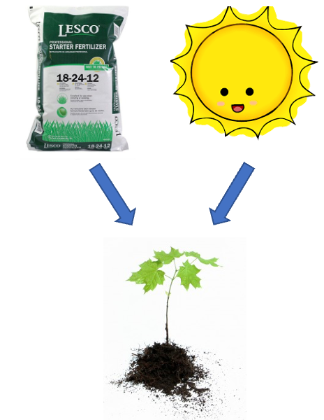
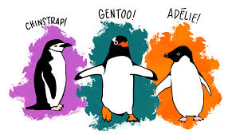
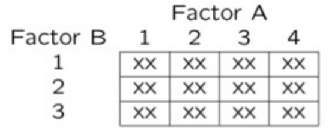
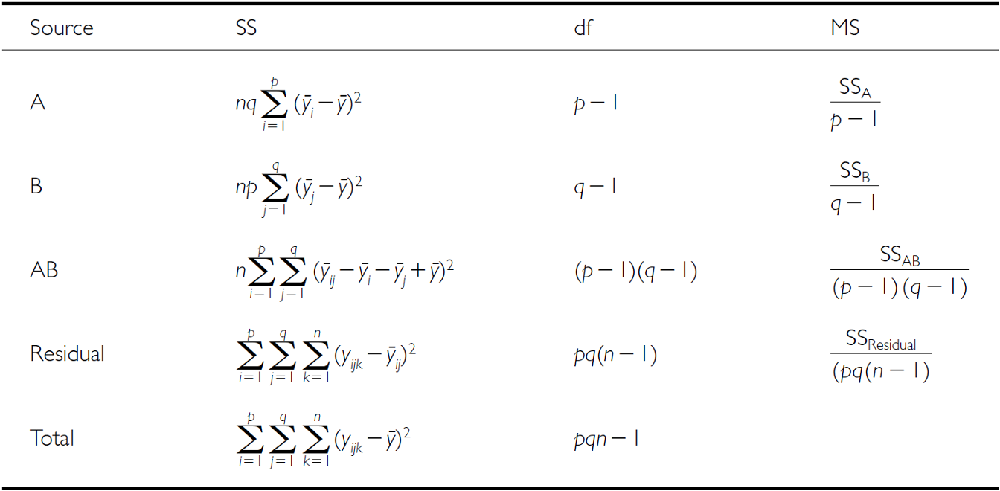
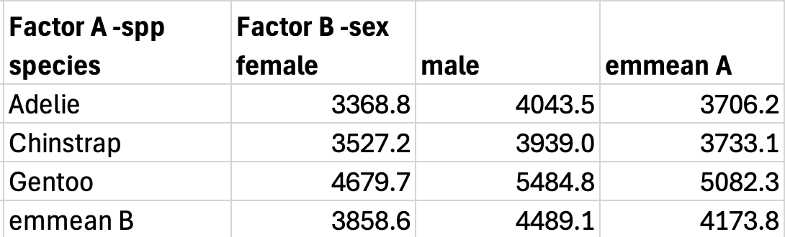
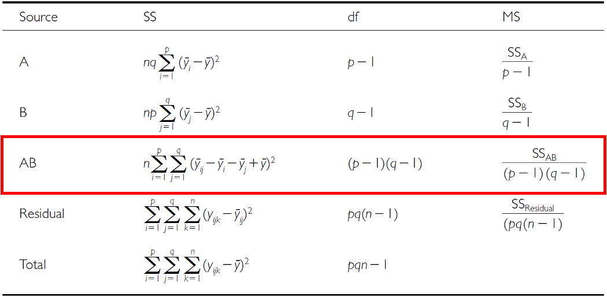
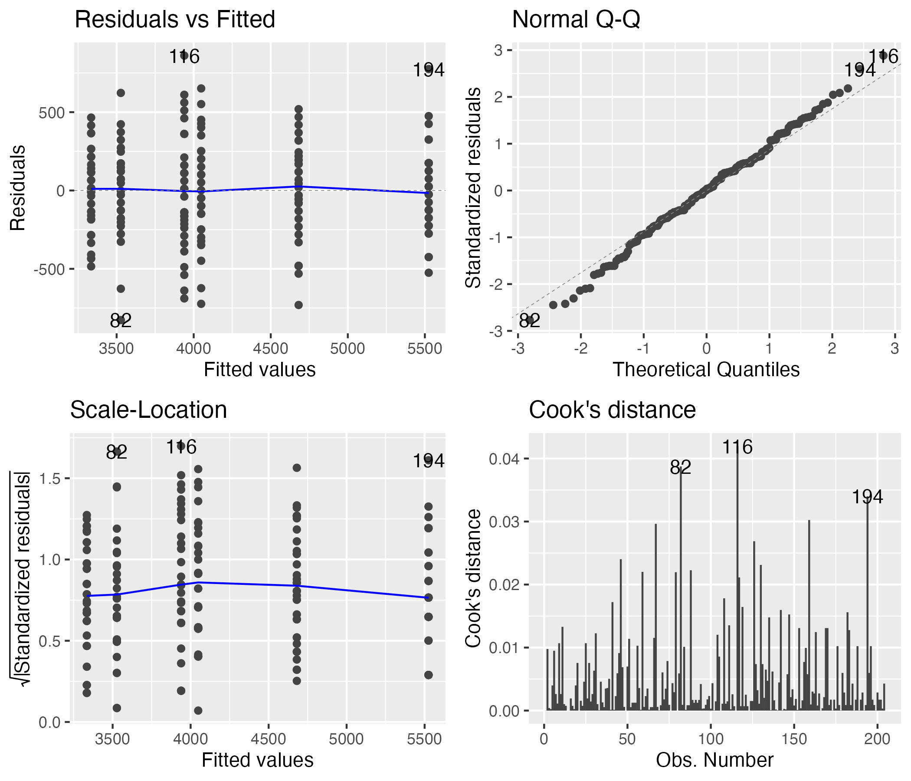

---
metadata-files:
  - ../../_templates/_lectures.yml
title: "Lecture: Two-Way ANOVA"
subtitle: "Factorial designs"
description: "Factorial (two-factor) ANOVA, main effects and interactions, estimated marginal means, Type I/II/III sums of squares, and balanced vs. unbalanced designs — on the palmerpenguins species-by-sex dataset."
categories: [ANOVA]
order: 13
week: 9
author: "Bill Perry"

knitr:
  opts_chunk:
    paged.print: true
    collapse: true

format:
  html:
    downloads: [docx, pptx]  # This creates download links for all three
  revealjs:
    output-ext: "slides.html"
  docx:
    reference-doc: ../../ms_templates/custom-reference-compact.docx
    fig-width: 2.5
    fig-height: 2.5
    fig-dpi: 300
    dpi: 300            # tell Pandoc the real render dpi so it sizes figures correctly
  pptx: default
execute:
  echo: true
---

```{r}
#| echo: false
#| message: false
#| warning: false
library(palmerpenguins)
library(emmeans)
library(ggfortify)
library(car)
library(broom)
library(patchwork)
library(tidyverse)

p_df <- penguins %>%
  filter(!is.na(body_mass_g),
         !is.na(sex),
         !is.na(species)) %>%
  select(species, sex, body_mass_g)
```

## Where We Left Off

::::::: columns
:::: {.column width="60%"}
Covered last time — one-way ANOVA:

- Analysis of variance: single and multi-factor designs
- Examples: diatoms, circadian rhythms
- Predictor variables: fixed vs. random
- The ANOVA model
- Analysis and partitioning of variance
- Null hypothesis
- Assumptions and diagnostics
- Post-hoc F-tests — Tukey and others
- Reporting the results

::: callout-note
**✅ Key idea from last lecture**

One-way ANOVA asks "do these groups differ?" for one factor. Today: what happens when two factors act *together* — separately, and possibly interacting?
:::
::::

:::: {.column width="40%"}
{width="3.12in"}
::::
:::::::

## Part 1 · Factorial ANOVA — the Concept {.divider}

## Two-Factor Designs (2-Way ANOVA)

::::::: columns
:::: {.column width="60%"}
- Very common in ecology
- Can have more factors (e.g., 3-way ANOVA), but interpretation gets very challenging
- Most multifactor designs are factorial or nested
- We'll cover a 2-factor ANOVA — this could be fertilizer and sunlight for plant biomass produced:
  - each can have an effect independently
  - the effect of one factor may interact with the other factor
  - example: a low- vs. high-light treatment might affect biomass; fertilizer might also affect biomass; but under higher light, the high-fertilizer treatment may grow better than expected

::: callout-note
**📖 Reference**

Gotelli & Ellison, *A Primer of Ecological Statistics*, Ch. 10 — The Analysis of Variance, extends to factorial designs like the one covered today.
:::
::::

:::: {.column width="40%"}
{width="2.29in"}

{width="2.29in"}
::::
:::::::

## Factorial ANOVA: Design Structure

::::::: columns
:::: {.column width="60%"}
Consider two factors:

- **Factorial/crossed:** every level of B in every level of A

{width="2.92in"}
::::

:::: {.column width="40%"}
{width="2.92in"}
::::
:::::::

## Factorial ANOVA: Effect Types

::::::: columns
:::: {.column width="60%"}
In factorial designs, we look at two types of factor effects:

- **Main effect of each factor** (pooling across the other factor)
- **Interaction effects** — is there a synergistic/antagonistic effect between factors?
::::

:::: {.column width="40%"}
{width="3.12in"}
::::
:::::::

## Part 2 · Setting Up — the Penguin Data {.divider}

## Introduction to Two-Way ANOVA

::::::: columns
:::: {.column width="60%"}
Two-way ANOVA examines:

- Main effect of Factor A (Species)
- Main effect of Factor B (Sex)
- Interaction between A × B
- **Balanced design:** equal sample sizes in all cells
- **Type III sums of squares** for unbiased estimates — if the design is balanced, the choice of SS type doesn't matter
::::

:::: {.column width="40%"}
```{r}
#| echo: false
#| message: false
#| warning: false
#| paged-print: false
summaryu_df <- p_df %>%
  group_by(species, sex) %>%
  summarise(
    n = sum(!is.na(body_mass_g)),
    mean_mass = mean(body_mass_g),
    sd_mass = sd(body_mass_g),
    se_mass = sd_mass/sqrt(n),
    .groups = 'drop'
  ) %>%
  arrange(species, sex)
print(summaryu_df)
```
::::
:::::::

## Data Preparation — Creating a Balanced Design

::::::: columns
:::: {.column width="60%"}
The penguin data frame is unbalanced — there are unequal samples per cell.

```{r}
#| echo: false
#| message: false
#| warning: false
#| paged-print: false
original_n <- p_df %>%
  count(species, sex) %>%
  arrange(species, sex)

p_df %>%
  count(species, sex) %>%
  pivot_wider(names_from = sex,
              values_from = n,
              values_fill = 0)
```
::::

:::: {.column width="40%"}
```{r}
#| echo: false
#| message: false
#| warning: false
#| paged-print: false
#| collapse: true
min_n <- min(original_n$n)
cat(paste("Minimum n =", min_n, "\n\n"))

set.seed(123)
balanced_df <- p_df %>%
  group_by(species, sex) %>%
  sample_n(min_n) %>%
  ungroup()

balanced_n <- balanced_df %>%
  count(species, sex) %>%
  pivot_wider(names_from = sex,
              values_from = n,
              values_fill = 0)
balanced_n
```

**Statistical model:**

$$Y_{ijk} = \mu + \alpha_i + \beta_j + (\alpha\beta)_{ij} + \varepsilon_{ijk}$$

μ = grand mean, α_i = effect of species i, β_j = effect of sex j, (αβ)_ij = interaction effect, ε_ijk = random error.
::::
:::::::

## Descriptive Statistics

::::::: columns
:::: {.column width="60%"}
```{r}
#| echo: false
#| message: false
#| warning: false
#| paged-print: false
summary_df <- balanced_df %>%
  group_by(species, sex) %>%
  summarise(
    n = sum(!is.na(body_mass_g)),
    mean_mass = mean(body_mass_g),
    sd_mass = sd(body_mass_g),
    se_mass = sd_mass/sqrt(n),
    .groups = 'drop'
  ) %>%
  arrange(species, sex)
print(summary_df)
```
::::

:::: {.column width="40%"}
```{r}
#| echo: false
#| fig-width: 3.4
#| fig-height: 3
#| fig-alt: "Boxplot of penguin body mass in grams by species, with boxes filled by sex, showing mass differences across the species-by-sex combinations in the balanced dataset."
p_box_plot <- balanced_df %>%
  ggplot(aes(species, body_mass_g, fill = sex)) +
  geom_boxplot() +
  theme_minimal(base_size = 9)
p_box_plot
```
::::
:::::::

## Part 3 · The Factorial Model {.divider}

## Factorial ANOVA Models

::::::: columns
:::: {.column width="60%"}
Factorial designs can be of 3 types:

- **Model 1** — 2 fixed factors (the focus for today)
- **Model 2** — 2 random factors
- **Model 3** — 1 fixed, 1 random (mixed model) — often nested

**Model 1 ANOVA:**

$$y_{ijk} = \mu + \alpha_i + \beta_j + (\alpha\beta)_{ij} + \varepsilon_{ijk}$$
::::

:::: {.column width="40%"}
::: callout-tip
**🖐 Notice**

The formula looks identical to Model 2 and Model 3 — what changes between them is whether α, β are treated as *fixed* effects (specific groups you care about) or *random* effects (a sample from a larger population of possible groups).
:::
::::
:::::::

## Model Components — the Main Effects

::::::: columns
:::: {.column width="60%"}
$$y_{ijk} = \mu + \alpha_i + \beta_j + (\alpha\beta)_{ij} + \varepsilon_{ijk}$$

- $y_{ijk}$: value of the k-th observation from the j-th and i-th combination of B and A (sex j of species i)
- μ: overall mean (overall mass)
- $\alpha_i$: effect of the i-th level of A, pooling across all levels of B — $\mu_i - \mu$ (difference between the average mass of all "species i" penguins and the overall mean)
::::

:::: {.column width="40%"}
::: callout-tip
**🖐 Notice**

Every effect in this model is defined as a deviation from a mean — the grand mean, or a group mean. This is exactly the same logic as a t-test or one-way ANOVA, just with more terms.
:::
::::
:::::::

## Model Components — the Interaction

::::::: columns
:::: {.column width="60%"}
$$y_{ijk} = \mu + \alpha_i + \beta_j + (\alpha\beta)_{ij} + \varepsilon_{ijk}$$

- $\beta_j$: effect of the j-th level of B, pooling across all levels of A — $\mu_j - \mu$ (difference between the average mass of all "sex j" penguins and the overall mean)
- $(\alpha\beta)_{ij}$: effect of the interaction of level i of A and level j of B — $\mu_{ij} - \mu_i - \mu_j + \mu$. Does the effect of B depend on the level of A? (Is the effect of sex different across the 3 species?)
::::

:::: {.column width="40%"}
::: callout-note
**✅ Key idea**

The interaction term is what's *left over* after you subtract out both main effects and the grand mean — it's literally "the part the additive model can't explain."
:::
::::
:::::::

## Model Types and Interpretation

::::::: columns
:::: {.column width="60%"}
$$y_{ijk} = \mu + \alpha_i + \beta_j + (\alpha\beta)_{ij} + \varepsilon_{ijk}$$

- Model 2 ANOVA is rare in ecology
- **Model 3 interpretation is different:**
  - $\beta_j$: random variable measuring variance in y across *all possible* levels of B, pooling across A
  - $(\alpha\beta)_{ij}$ is a random variable measuring variance of the interaction between A and B across all possible levels of B ("is the effect of A consistent across all possible levels of B that could have been chosen?")
::::

:::: {.column width="40%"}
::: callout-warning
**⚠️ Watch out!**

Fixed vs. random isn't about the *data* — it's about the *question*. Are you interested in these specific 3 species (fixed), or in "species" as a general source of variation (random)?
:::
::::
:::::::

## Part 4 · Estimated Marginal Means {.divider}

## Estimated Marginal Means — Species

::::::: columns
:::: {.column width="60%"}
- Before we go further, we need to define estimated marginal means (EMMs)
- **Balanced data:** it's just the means of the groups — easy
- **Unbalanced data:** it's the mean of *cell means*, not a simple average of all raw observations

```{r}
#| echo: false
#| message: false
#| warning: false
#| paged-print: false
cell_means <- p_df %>%
  group_by(species, sex) %>%
  summarise(
    n = sum(!is.na(body_mass_g)),
    cell_mean = mean(body_mass_g),
    .groups = 'drop'
  )
cell_means_wide <- cell_means %>% select(-n) %>%
  pivot_wider(names_from = sex, values_from = cell_mean)
cell_counts <- p_df %>%
  count(species, sex) %>%
  pivot_wider(names_from = sex, values_from = n, values_fill = 0)
combined_table <- cell_means_wide %>%
  left_join(cell_counts, by = "species", suffix = c("_mean", "_n"))
cat("Combined table with means and counts:\n\n")
print(combined_table)

regular_species_means <- p_df %>%
  group_by(species) %>%
  summarise(total_n = n(), regular_mean = mean(body_mass_g), .groups = 'drop')
cat("\n\nRegular means (WRONG for marginal means):\n\n")
print(regular_species_means)
```
::::

:::: {.column width="40%"}
```{r}
#| echo: false
#| paged-print: false
emm_species <- cell_means %>%
  group_by(species) %>%
  summarise(
    emm_mean = mean(cell_mean),
    calculation = paste0("(",
                        paste(round(cell_mean, 1), collapse = " + "),
                        ") / 2 = ",
                        round(mean(cell_mean), 1)),
    .groups = 'drop'
  )
cat("Estimated Marginal Means for Species (CORRECT):")
print(emm_species)

comparison <- cell_means %>%
  pivot_wider(names_from = sex, values_from = c(n, cell_mean)) %>%
  mutate(
    species_emm = (cell_mean_female + cell_mean_male) / 2,
    regular_mean = regular_species_means$regular_mean[match(species, regular_species_means$species)],
    difference = species_emm - regular_mean
  )
cat("\n\nComparison showing EMM calculation:\n\n")
print(comparison %>% select(species, cell_mean_female, cell_mean_male, species_emm, regular_mean, difference))
```
::::
:::::::

## Estimated Marginal Means — Sex

::::::: columns
:::: {.column width="60%"}
- Balanced data: just the means of the groups
- Unbalanced data: mean of cell means

```{r}
#| echo: false
#| message: false
#| warning: false
#| paged-print: false
cat("Combined table with means and counts:\n\n")
print(combined_table)
```
::::

:::: {.column width="40%"}
```{r}
#| echo: false
#| message: false
#| warning: false
#| paged-print: false
regular_sex_means <- p_df %>%
  group_by(sex) %>%
  summarise(total_n = n(), regular_mean = mean(body_mass_g, na.rm = TRUE), .groups = 'drop')
cat("\nRegular means sex (WRONG for marginal means):")
print(regular_sex_means)

emm_sex <- cell_means %>%
  group_by(sex) %>%
  summarise(
    emm_mean = mean(cell_mean),
    calculation = paste0("(",
                        paste(round(cell_mean, 1), collapse = " + "),
                        ") / 3 = ",
                        round(mean(cell_mean), 1)),
    .groups = 'drop'
  )
cat("\n\nEstimated Marginal Means for Sex (CORRECT):\n\n")
print(emm_sex)

comparison_sex <- emm_sex %>%
  left_join(regular_sex_means, by = "sex") %>%
  mutate(difference = emm_mean - regular_mean) %>%
  select(sex, total_n, regular_mean, emm_mean, difference)
cat("\n\nComparison showing difference between regular and marginal means:\n\n")
print(comparison_sex)
```
::::
:::::::

## Part 5 · The Two-Way ANOVA Table {.divider}

## ANOVA Table Structure

::::::: columns
:::: {.column width="60%"}
- $SS_{total} = SS_A + SS_B + SS_{AB} + SS_{residual}$
- $SS_{total} = \sum(Y - \bar{Y})^2$
- $SS_{residual}$: the difference between each observation and its cell mean, summed over all observations
::::

:::: {.column width="40%"}
| Source | df |
|:---|:---|
| A | p − 1 |
| B | q − 1 |
| AB | (p−1)(q−1) |
| Residual | pq(n−1) |
| Total | pqn − 1 |

where p = levels of A, q = levels of B, n = replicates per cell.
::::
:::::::

## SSA: Factor A Effects

::::::: columns
:::: {.column width="60%"}
- $SS_A$ is the SS of differences between each marginal mean of A and the overall mean
- If A is species, take the EMMs for factor A and subtract from the overall mean
::::

:::: {.column width="40%"}
{width="2.60in"}

{width="2.60in"}
::::
:::::::

## SSB: Factor B Effects

::::::: columns
:::: {.column width="60%"}
- $SS_B$ is the SS of differences between each marginal mean of B and the overall mean
- If B is sex, take the EMMs for factor B and subtract from the overall mean
::::

:::: {.column width="40%"}
{width="2.60in"}

{width="2.60in"}
::::
:::::::

## SSAB: Interaction Effects

::::::: columns
:::: {.column width="60%"}
$SS_{AB}$ is the SS of cell means minus marginal means plus the overall mean.
::::

:::: {.column width="40%"}
{width="2.60in"}

{width="2.60in"}
::::
:::::::

## F-Ratio Calculations

::::::: columns
:::: {.column width="60%"}
SS converts to MS; F-ratio calculations differ depending on whether factors are fixed, random, or mixed.
::::

:::: {.column width="40%"}
| Source | A, B fixed | A, B random | A fixed, B random |
|:---|:---|:---|:---|
| A | $MS_A/MS_{Res}$ | $MS_A/MS_{AB}$ | $MS_A/MS_{AB}$ |
| B | $MS_B/MS_{Res}$ | $MS_B/MS_{AB}$ | $MS_B/MS_{AB}$ |
| AB | $MS_{AB}/MS_{Res}$ | $MS_{AB}/MS_{Res}$ | $MS_{AB}/MS_{Res}$ |
::::
:::::::

## Hypotheses — Both Factors Fixed

::::::: columns
:::: {.column width="60%"}
3 hypotheses are tested in a two-way factorial ANOVA: A, B, A×B. **Both factors fixed:**

- $H_0(A)$: $\mu_1 = \mu_2 = ... = \mu_p$ (no difference in marginal means of A, pooling across B)
- $H_0(B)$: $\mu_1 = \mu_2 = ... = \mu_q$ (no difference in marginal means of B, pooling across A)
- $H_0(AB)$: $\mu_{ij} - \mu_i - \mu_j + \mu = 0$ (no interaction effect)
::::

:::: {.column width="40%"}
::: callout-tip
**🖐 Notice**

These are exactly the two main-effect hypotheses from a one-way ANOVA, plus one new hypothesis just for the interaction.
:::
::::
:::::::

## Hypotheses — Mixed Model

::::::: columns
:::: {.column width="60%"}
3 hypotheses: A, B, A×B. **One fixed, one random:**

- $H_0(A)$: $\mu_1 = \mu_2 = ... = \mu_p$ (no difference in marginal means of A, pooling across B)
- $H_0(B)$: $\sigma^2_B = 0$ (no added variance due to levels of B that could have been used)
- $H_0(AB)$: $\sigma^2_{AB} = 0$ (no added variance due to interaction between all levels of A and B that could have been used)
::::

:::: {.column width="40%"}
::: callout-warning
**⚠️ Watch out!**

Notice the switch from "means are equal" (fixed) to "variance is zero" (random) — that's the fundamental difference in what a random-effect hypothesis is even asking.
:::
::::
:::::::

## Part 6 · Fitting the Balanced Model {.divider}

## Example Study Details

::::::: columns
:::: {.column width="60%"}
Let's try the example with the `palmerpenguins` package data:

- Effect of species and sex on `body_mass_g`
- 3 species (Factor A)
- 2 sexes (Factor B)
- 34 replicates in each cell
::::

:::: {.column width="40%"}
{width="2.92in"}
::::
:::::::

## Two-Way ANOVA with Type III Sums of Squares

::::::: columns
:::: {.column width="60%"}
```{r}
#| echo: false
options(contrasts = c("contr.sum", "contr.poly"))

anova_model <- lm(body_mass_g ~ species * sex,
                  data = balanced_df)
summary(anova_model)
```
::::

:::: {.column width="40%"}
```{r}
#| echo: false
anova_type3 <- Anova(anova_model, type = "III")
cat("Type III Sums of Squares ANOVA:")
print(anova_type3)
```
::::
:::::::

## Understanding Type III SS

::::::: columns
:::: {.column width="60%"}
Type III sums of squares test each effect after adjusting for all other effects in the model:

- **Species effect:** tested after adjusting for sex and interaction
- **Sex effect:** tested after adjusting for species and interaction
- **Interaction:** tested after adjusting for both main effects

This is especially important for unbalanced designs, but we're using it here for consistency with the next analysis.
::::

:::: {.column width="40%"}
```{r}
#| echo: false
#| message: false
#| warning: false
#| paged-print: false
ss_total <- sum(anova_type3$`Sum Sq`[2:4]) +
            anova_type3$`Sum Sq`[5]

eta_squared_df <- data.frame(
  Effect = c("Species", "Sex", "Interaction"),
  Eta_Squared = anova_type3$`Sum Sq`[2:4] / ss_total
)
cat("Effect Sizes (Eta-squared):")
print(eta_squared_df)
```
::::
:::::::

## Checking Model Assumptions

::::::: columns
:::: {.column width="50%"}
```{r}
#| include: false
plot_assump_plot <- autoplot(anova_model, which = 1:4, ncol = 2, nrow = 2)
ggsave("images/assumpt_1.jpg",
       plot = plot_assump_plot,
       width = 7,
       height = 6,
       dpi = 300,
       bg = "white")
```

The four standard diagnostic plots, built automatically with `ggfortify::autoplot()`.
::::

:::: {.column width="50%"}
{width="4in" fig-align="center"}
::::
:::::::

## Formal Tests — Normality and Homogeneity

::::::: columns
:::: {.column width="60%"}
The formal tests of normality of residuals and homogeneity of variances.
::::

:::: {.column width="40%"}
```{r}
#| echo: false
shapiro_test <- shapiro.test(residuals(anova_model))
cat("Shapiro-Wilk Normality Test:")
print(shapiro_test)

levene_test <- leveneTest(body_mass_g ~ species * sex,
                          data = balanced_df)
cat("Levene's Test for Homogeneity:")
print(levene_test)

outliers_df <- balanced_df %>%
  mutate(
    fitted = fitted(anova_model),
    residuals = residuals(anova_model),
    std_resid = rstandard(anova_model)
  ) %>%
  filter(abs(std_resid) > 3)
cat(paste("Number of outliers (|z| > 3):", nrow(outliers_df)))
```
::::
:::::::

## Part 7 · EMMs and Post-Hoc for the Balanced Model {.divider}

## Computing EMMs

::::::: columns
:::: {.column width="60%"}
```{r}
#| echo: false
#| message: false
#| warning: false
#| paged-print: false
#| collapse: true
species_emm <- emmeans(anova_model, ~ species)
cat("Species EMMs:\n\n")
print(species_emm)

sex_emm <- emmeans(anova_model, ~ sex)
cat("Sex EMMs:\n\n")
print(sex_emm)

interaction_emm <- emmeans(anova_model, ~ species * sex)
cat("Species by Sex EMMs:\n\n")
print(interaction_emm)
```
::::

:::: {.column width="40%"}
```{r}
#| echo: false
#| message: false
#| warning: false
#| paged-print: false
#| collapse: true
species_pairs <- pairs(species_emm, adjust = "tukey")
print("Species pairwise comparisons:")
print(species_pairs)

interaction_pairs <- pairs(interaction_emm,
                          by = "sex",
                          adjust = "tukey")
print("Species comparisons within sex:")
print(interaction_pairs)
```
::::
:::::::

## Post F-Test of the Interaction

::::::: columns
:::: {.column width="60%"}
When the interaction is significant, we test the overall interaction and ignore the main effects!

```{r}
#| echo: false
emm_interaction <- emmeans(anova_model, ~ species * sex)
pairs_interaction <- pairs(emm_interaction, adjust = "tukey")
```
::::

:::: {.column width="40%"}
```{r}
#| echo: false
cld_interaction <- multcomp::cld(emm_interaction,
                       Letters = letters,
                       adjust = "sidak")
cld_df <- as.data.frame(cld_interaction) %>%
  arrange(species, sex)
print(cld_df)
```
::::
:::::::

## The Interaction Plot

```{r}
#| echo: false
#| fig-width: 3.6
#| fig-height: 3
#| fig-alt: "Interaction plot of estimated marginal mean body mass by species and sex, with points connected by lines for each sex and error bars showing ± 1 SE, used to visualize whether the sex effect differs across species."
emm_plotting_df <- as.data.frame(emm_interaction)
interaction_plot <- ggplot(emm_plotting_df,
       aes(x = species,
           y = emmean,
           color = sex,
           group = sex)) +
  geom_point(size = 3) +
  geom_line(linewidth = 1) +
  geom_errorbar(aes(ymin = emmean - SE,
                    ymax = emmean + SE),
                width = 0.1) +
  scale_color_manual(values = c("#1f78b4", "#b2df8a")) +
  labs(title = "Interaction Plot: Species x Sex",
       x = "Species", y = "Mean Body Mass (g)", color = "Sex") +
  theme_minimal(base_size = 9) +
  theme(legend.position = "right")
interaction_plot
```

## Part 8 · Unbalanced Designs {.divider}

## Introduction to Unbalanced Designs

::::::: columns
:::: {.column width="60%"}
**The challenge of unbalanced data:** real-world data is often unbalanced — unequal sample sizes across groups, missing data patterns, natural variation in sampling.

**Key issues:** Type I, II, and III SS give different results; order of terms matters for Type I SS; marginal means ≠ simple averages, so interpretation becomes complex.

Statistical model (same as balanced): $Y_{ijk} = \mu + \alpha_i + \beta_j + (\alpha\beta)_{ij} + \varepsilon_{ijk}$ — but parameter estimation differs!

```{r}
#| echo: false
#| message: false
#| warning: false
#| paged-print: false
unbalanced_n <- p_df %>%
  count(species, sex) %>%
  arrange(species, sex)
print("Unbalanced sample sizes:")
print(unbalanced_n)

total_n <- sum(unbalanced_n$n)
max_n <- max(unbalanced_n$n)
min_n <- min(unbalanced_n$n)
imbalance_ratio <- max_n / min_n
print(paste("Total N =", total_n))
print(paste("Imbalance ratio =", round(imbalance_ratio, 2)))
```
::::

:::: {.column width="40%"}
```{r}
#| echo: false
#| fig-width: 3.4
#| fig-height: 3
#| fig-alt: "Dodged bar chart of sample size by species and sex, with counts labeled above each bar, showing the unequal sample sizes across cells in the unbalanced penguin dataset."
imbalance_plot <- ggplot(unbalanced_n,
       aes(x = species, y = n, fill = sex)) +
  geom_col(position = "dodge") +
  geom_text(aes(label = n),
            position = position_dodge(0.9),
            vjust = -0) +
  scale_fill_manual(values = c("#1f78b4", "#b2df8a")) +
  labs(title = "Sample Sizes by Group",
       subtitle = "Unbalanced Design",
       x = "Species", y = "Sample Size", fill = "Sex") +
  theme_minimal(base_size = 8) +
  theme(legend.position = "top")
print(imbalance_plot)
```
::::
:::::::

## Type I (Sequential) SS

::::::: columns
:::: {.column width="60%"}
```{r}
#| echo: false
#| message: false
#| warning: false
#| paged-print: false
model1_type1 <- lm(body_mass_g ~ species + sex + species:sex,
                   data = p_df)
anova1_type1 <- anova(model1_type1)
cat("Type I SS (Species -> Sex -> Interaction):\n\n")
print(anova1_type1)

model2_type1 <- lm(body_mass_g ~ sex + species + sex:species,
                   data = p_df)
anova2_type1 <- anova(model2_type1)
cat("\n\nType I SS (Sex -> Species -> Interaction):\n\n")
print(anova2_type1)

ss_comparison_df <- data.frame(
  Effect = c("Species", "Sex"),
  Order1_SS = c(anova1_type1$`Sum Sq`[1],
                anova1_type1$`Sum Sq`[2]),
  Order2_SS = c(anova2_type1$`Sum Sq`[2],
                anova2_type1$`Sum Sq`[1])
)
cat("\n\nType I SS depends on order:\n\n")
print(ss_comparison_df)
```
::::

:::: {.column width="40%"}
**How Type I SS works — sequential decomposition:**

1. First term gets all SS it can explain
2. Second term gets SS after removing the first
3. Third term gets SS after removing the first two

**Problems with unbalanced data:** order dependency, biased if factors are correlated, not invariant to coding.
::::
:::::::

## Type III Sums of Squares

::::::: columns
:::: {.column width="60%"}
```{r}
#| echo: false
#| message: false
#| warning: false
#| paged-print: false
options(contrasts = c("contr.sum", "contr.poly"))
model_u <- lm(body_mass_g ~ species * sex,
              data = p_df)
anova_type3_u <- Anova(model_u, type = "III")
print("Type III Sums of Squares:")
print(anova_type3_u)

print("Comparison of F-values:")
comparison_f_df <- data.frame(
  Effect = c("Species", "Sex", "Interaction"),
  Type_I_F = round(anova1_type1$`F value`[1:3], 2),
  Type_III_F = round(anova_type3_u$`F value`[2:4], 2)
)
print(comparison_f_df)
```
::::

:::: {.column width="40%"}
**How Type III SS works — marginal decomposition:** each effect tested after adjusting for all others.

**Advantages:** order invariant, tests hypotheses about unweighted means, standard in most software.

**Disadvantages:** lower power with missing cells, tests may not be orthogonal, requires careful interpretation.

```{r}
#| echo: false
#| message: false
#| warning: false
#| paged-print: false
ss_total_u <- sum(anova_type3_u$`Sum Sq`[-1])
eta_squared_p_df <- data.frame(
  Effect = c("Species", "Sex", "Interaction"),
  Eta_Squared = round(anova_type3_u$`Sum Sq`[2:4] / ss_total_u, 4)
)
print("Effect Sizes (Type III):")
print(eta_squared_p_df)
```
::::
:::::::

## Manual SS Calculation, Step by Step

::::::: columns
:::: {.column width="60%"}
```{r}
#| echo: false
#| message: false
#| warning: false
#| paged-print: false
grand_mean <- mean(p_df$body_mass_g)
print(paste("Grand mean:", round(grand_mean, 1)))

ss_total_manual <- sum((p_df$body_mass_g - grand_mean)^2)
print(paste("Total SS:", round(ss_total_manual, 0)))

group_means_df <- p_df %>%
  group_by(species, sex) %>%
  mutate(group_mean = mean(body_mass_g)) %>%
  ungroup()

ss_between <- sum((group_means_df$group_mean - grand_mean)^2)
print(paste("Between-groups SS:", round(ss_between, 0)))

ss_within <- sum((group_means_df$body_mass_g -
                  group_means_df$group_mean)^2)
print(paste("Within-groups SS:", round(ss_within, 0)))

print(paste("Check: Between + Within =",
            round(ss_between + ss_within, 0)))
```
::::

:::: {.column width="40%"}
```{r}
#| echo: false
#| message: false
#| warning: false
#| paged-print: false
species_only_model <- lm(body_mass_g ~ species,
                         data = p_df)
ss_species_only <- sum((fitted(species_only_model) -
                       grand_mean)^2)
cat(paste("SS(Species alone):",
            round(ss_species_only, 0)))

sex_only_model <- lm(body_mass_g ~ sex,
                     data = p_df)
ss_sex_only <- sum((fitted(sex_only_model) -
                   grand_mean)^2)
cat(paste("SS(Sex alone):",
            round(ss_sex_only, 0)))

cat(paste("\n\nSum of main effects:",
            round(ss_species_only + ss_sex_only, 0)))
cat(paste("Actual between SS:",
            round(ss_between, 0)))
cat(paste("\n\nDifference (due to correlation):",
            round(ss_between -
                  (ss_species_only + ss_sex_only), 0)))
```

::: callout-note
**✅ Key idea**

Main effects don't add up to the between-groups SS here because the effects aren't orthogonal in an unbalanced design — proof that "unbalanced" really does change the arithmetic, not just the p-values.
:::
::::
:::::::

## Part 9 · EMMs and Diagnostics — the Unbalanced Model {.divider}

## Estimated Marginal Means — Unbalanced Data

::::::: columns
:::: {.column width="60%"}
```{r}
#| echo: false
#| message: false
#| warning: false
#| paged-print: false
species_emm_u <- emmeans(model_u, ~ species)
sex_emm_u <- emmeans(model_u, ~ sex)

cat("Species EMMs (model-based):")
print(species_emm_u)
cat("\n\nSex EMMs (model-based):")
print(sex_emm_u)

emm_interaction_u <- emmeans(model_u, ~ species * sex)
pairs_interaction_u <- pairs(emm_interaction, adjust = "tukey")
pairs_interaction_u
```
::::

:::: {.column width="40%"}
```{r}
#| echo: false
#| message: false
#| warning: false
#| paged-print: false
cld_interaction_u <- multcomp::cld(emm_interaction_u,
                       Letters = letters,
                       adjust = "sidak")
cld_df_u <- as.data.frame(cld_interaction_u) %>%
  arrange(species, sex)
print(cld_df_u)
```
::::
:::::::

## Pairwise Comparisons — Unbalanced Data

::::::: columns
:::: {.column width="60%"}
```{r}
#| echo: false
#| message: false
#| warning: false
#| paged-print: false
species_pairs_u <- pairs(species_emm_u, adjust = "tukey")
cat("Species pairwise comparisons (Tukey):")
print(species_pairs_u)

sex_by_species_emm <- emmeans(model_u, ~ sex | species)
sex_effects_df <- pairs(sex_by_species_emm)
cat("\n\nSex effect within each species:")
print(sex_effects_df)
```
::::

:::: {.column width="40%"}
```{r}
#| echo: false
#| message: false
#| warning: false
#| paged-print: false
interaction_test <- emmeans(model_u,
                            pairwise ~ sex | species)
contrasts_df <- as.data.frame(interaction_test$contrasts)

sex_diff_adelie <- contrasts_df[1, "estimate"]
sex_diff_chinstrap <- contrasts_df[2, "estimate"]
sex_diff_gentoo <- contrasts_df[3, "estimate"]

interaction_summary_df <- data.frame(
  Species = c("Adelie", "Chinstrap", "Gentoo"),
  Sex_Effect = round(c(sex_diff_adelie,
                       sex_diff_chinstrap,
                       sex_diff_gentoo), 0)
)
cat("Sex effect (Male - Female) by species:")
print(interaction_summary_df)

cat("\n\nInteraction interpretation:")
if (anova_type3_u$`Pr(>F)`[4] < 0.05) {
  print("Sex effects differ across species")
} else {
  print("Sex effects similar across species")
}
```
::::
:::::::

## Diagnostic Plots — Unbalanced Design

::::::: columns
:::: {.column width="60%"}
```{r}
#| echo: false
#| message: false
#| warning: false
#| paged-print: false
#| fig-height: 3.6
#| fig-width: 3.6
#| fig-alt: "Four diagnostic plots for the unbalanced two-way ANOVA model: residuals vs. fitted, normal Q-Q, scale-location, and residuals vs. fitted colored by species-sex group, used to check model assumptions."
par(mfrow = c(2, 2))
plot(model_u, which = 1, main = "Residuals vs Fitted")
plot(model_u, which = 2, main = "Normal Q-Q")
plot(model_u, which = 3, main = "Scale-Location")
plot(fitted(model_u), residuals(model_u),
     col = as.numeric(interaction(p_df$species, p_df$sex)),
     main = "Residuals by Group",
     xlab = "Fitted values", ylab = "Residuals")
abline(h = 0, lty = 2)
par(mfrow = c(1, 1))
```
::::

:::: {.column width="40%"}
```{r}
#| echo: false
#| message: false
#| warning: false
#| paged-print: false
shapiro_u <- shapiro.test(residuals(model_u))
print("Shapiro-Wilk test:")
print(shapiro_u)

levene_u <- leveneTest(body_mass_g ~ species * sex,
                       data = p_df,
                       center = median)
print("Levene's test:")
print(levene_u)

residual_summary_df <- p_df %>%
  mutate(
    residuals = residuals(model_u),
    fitted = fitted(model_u)
  ) %>%
  group_by(species, sex) %>%
  summarise(
    n = n(),
    mean_resid = mean(residuals),
    sd_resid = sd(residuals),
    .groups = 'drop'
  )
print("Residual SD by group:")
print(residual_summary_df[, c("species", "sex", "sd_resid")])
```
::::
:::::::

## Part 10 · Comparing Balanced vs. Unbalanced {.divider}

## Side-by-Side Comparison

::::::: columns
:::: {.column width="60%"}
```{r}
#| echo: false
#| message: false
#| warning: false
#| paged-print: false
set.seed(123)
b_df <- p_df %>%
  group_by(species, sex) %>%
  sample_n(34) %>%
  ungroup()

options(contrasts = c("contr.sum", "contr.poly"))
model_b <- lm(body_mass_g ~ species * sex, data = b_df)
anova_b <- Anova(model_b, type = "III")

comparison_results_df <- data.frame(
  Effect = c("Species", "Sex", "Interaction"),
  Balanced_F = round(anova_b$`F value`[2:4], 2),
  Balanced_p = round(anova_b$`Pr(>F)`[2:4], 4),
  Unbalanced_F = round(anova_type3_u$`F value`[2:4], 2),
  Unbalanced_p = round(anova_type3_u$`Pr(>F)`[2:4], 4)
)
cat("Balanced vs Unbalanced Results:")
print(comparison_results_df)

cat("\n\nSample sizes:")
cat(paste("Balanced total N:", nrow(b_df)))
cat(paste("Unbalanced total N:", nrow(p_df), "\n\n"))
cat(paste("Data discarded:",
            nrow(p_df) - nrow(b_df),
            "observations"))
```
::::

:::: {.column width="40%"}
```{r}
#| echo: false
#| message: false
#| warning: false
#| paged-print: false
#| fig-width: 3.4
#| fig-height: 3
#| fig-alt: "Point-and-error-bar plot comparing estimated marginal mean body mass by species between the balanced and unbalanced designs, showing the two designs give similar estimates."
emm_b <- as.data.frame(emmeans(model_b, ~ species))
emm_u <- as.data.frame(emmeans(model_u, ~ species))

comparison_plot_df <- data.frame(
  Species = rep(levels(as.factor(p_df$species)), 2),
  Design = rep(c("Balanced", "Unbalanced"), each = 3),
  EMM = c(as.numeric(emm_b$emmean), as.numeric(emm_u$emmean)),
  SE = c(as.numeric(emm_b$SE), as.numeric(emm_u$SE))
)

comparison_plot <- ggplot(comparison_plot_df,
       aes(x = Species, y = EMM, color = Design, group = Design)) +
  geom_point(position = position_dodge(0.3), size = 3) +
  geom_errorbar(aes(ymin = EMM - SE, ymax = EMM + SE),
                position = position_dodge(0.3), width = 0.2) +
  labs(title = "EMMs: Balanced vs Unbalanced",
       y = "Estimated Marginal Mean (g)", color = "Design") +
  theme_minimal(base_size = 8) +
  theme(legend.position = "top")
print(comparison_plot)
```
::::
:::::::

## Part 11 · Summary and Best Practices {.divider}

## Summary — Unbalanced Designs

::::::: columns
:::: {.column width="60%"}
**Challenges:** Type I SS depends on order; simple means ≠ EMMs; reduced power for interactions; complex interpretation.

**Solutions:** use Type III SS for main effects; report EMMs, not simple means; check assumptions carefully; consider the impact of imbalance.
::::

:::: {.column width="40%"}
**Recommendations:**

1. **Always report:** sample sizes per cell, type of SS used, EMMs with CIs
2. **Visualization:** show actual data points, include error bars, note unequal sample sizes
3. **Interpretation:** focus on effect sizes, consider practical significance, acknowledge limitations
::::
:::::::

## Final Recommendations

::::::: columns
:::: {.column width="60%"}
**For experimental studies:** design for balance when possible, randomize allocation, plan for attrition.

**For observational studies:** accept imbalance as reality, use Type III SS, report EMMs, consider covariates (ANCOVA).
::::

:::: {.column width="40%"}
::: callout-note
**Statistical software defaults**

- R: Type I (sequential)
- SAS: Type III (marginal)
- SPSS: Type III (marginal)

Always specify which type you're using!
:::
::::
:::::::
